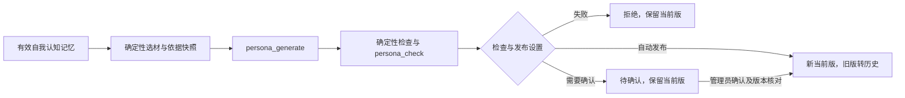

# Iris 架构

当前提供单进程 FastAPI＋Uvicorn 宿主服务、进程内学习调度及离线学习命令。`Store` 持有一个带锁的 SQLite WAL 写连接；每次读取打开只读连接并启动一致快照。所有模型网络调用在事务外完成。启动自动运行顺序编号迁移，已有数据库迁移前复制备份。

## 数据表

| 范围 | 表 |
| --- | --- |
| 入口与批次 | `entries`、`messages`、`batches`、`batch_attempts`、`memory_gaps` |
| 主体 | `subjects`、`subject_aliases`、`platform_identities`、`subject_links`、`subject_alias_blocks` |
| 记忆 | `memories`、`memory_subjects`、`memory_tags`、`sources`、`memory_revisions` |
| 当前状态 | `current_state`、`state_reports` |
| 自我与目标 | `persona_versions`、`persona_attempts`、`goals`、`goal_sources`、`goal_people`、`goal_memories`、`goal_duplicates`、`goal_dedup_jobs`、`goal_reminder_plans`、`notifications`、`runtime_settings` |
| 模型 | `model_calls` |
| 召回 | `memory_fts_jieba`、`memory_fts_trigram`、`vector_dirty`、`recalls`、`recall_items` |

`messages` 保留原文、类型、场景身份、引用作者、发生与接收时间、入口内去重键及学习状态。场景事件使用固定 `scene` 主体；`self_output` 和 `action_result` 使用 `self` 主体。迁移 002 将已有 event 消息改到场景主体，并为目标补上产生入口（M3 起只作信息，不限制可见）。被引用作者按账号匹配；仅有显示名时，只在当前入口唯一匹配参与者，否则新建不绑定账号的提及主体。`batches` 冻结历史、目标、后续三段的消息 ID；每次尝试留原始输出、修正输出及错误。`sources` 直接指原始消息，或指向来源记忆和当时修订号。记忆正文和判断变化写 `memory_revisions` 并增加修订号；确认和使用反馈只原子增加保留强度。

迁移 003 为 `model_calls` 增加 `finish_reason` 和可空的 `batch_id`，原有 `completion_tokens` 包含服务商报告的输出总用量，推理 token 单列。为 `subject_aliases` 增加 `source_message_id`；旧别名没有来源时保留 NULL，不伪造证据。本人声明的 `{name, alias, evidence}` 直接写到该主体的别名，要求目标段有本人消息或本人被引用的证据，拒绝与当前显示名相同的别名；别名文字必须出现于目标段的本人正文或本人被引用的原话，不能借另一个作者的文字。此条件不能代替对“本人声明”的语义判断。不创建别名主体，也不合并已有账号。`same_as` 仍是带相信程度的可能身份联系；`roleplay` 仍连接参与者与虚构角色。

## 人物身份与人工确认（M2）

`people.py` 提供管理投影、身份操作和选取后的标注。迁移 010 为 subjects 增加不可反向改写的 `merged_into`、`merged_at` 与人物修订号；`canonical_subject(conn, id)` 在调用者的快照／写事务内沿显式合并链返回最终 ID，未知 ID 拒绝，不按显示名猜人。别名、联系及身份变更推进人物修订号；记忆的新写入不推进人物修订号，合并在获得写锁后读取全部最新关系。

确认接口核对联系及两个人物的修订号，在单一短写事务中迁移账号、别名、memory_subjects、speaker 和从属人物，再提交占位及 IDs-only 操作记录。整个操作可回滚，不触碰 memories 的正文、修订号、分数、时间或向量。历史 messages 的作者 ID 保留；queue 的账号入口和合并主体的引用作者解析使用最终 ID，prepare 的自动参与者同样解析最终 ID。无合并时的引用作者规则保持原样。

same_as 仍保留原 `(subject_a, subject_b, kind)` 唯一键供学习 UPSERT 使用，同时增加无向主体对唯一索引与规范方向触发器。升级折叠旧的反向重复行，否认优先。denied 行不能被删除或改回 possible，也不能由学习插入同向／反向的新联系；BEFORE INSERT 直接忽略这类再次提出的联系，不使整个学习批次失败。折叠旧联系以 `folded_into` 指向保留项；确认并合并的联系设置 `resolved_at`。这些历史记录不参与待确认列表或召回标注，原证据仍由现有 maintenance 的 subject_links 引用检查保护。

subject_aliases 增加不复用的整数 ID，保持原 subject_id／alias 唯一键；重复别名折叠行也保留证据，并通过 `folded_into` 排除活动读取。手动删除将字面别名放入 `subject_alias_blocks`，后续学习插入被数据库忽略；管理员显式重新添加解除阻止。删除时同时清除该别名的折叠档案。合并迁移删除决定，默认保留管理员的删除；B 的显示名是确认合并所明确授权的例外。

已合并主体不能成为新记忆的说话人／涉及人、新账号、新别名、新活动联系或新从属主体的 parent，迁移触发器对这些写入作最后保护。学习 v7 的 `_snapshot` 排除占位与折叠别名，在同一只读快照内把历史消息作者与引用作者的 ID 和名字映射到最终主体；不改数据库中的历史作者。证据校验沿用该快照，`_resolve_subject`／`_apply` 在提交事务内、去重查询前重新调用 canonical_subject，覆盖 speaker、about、alias owner、联系端点和新从属主体 parent。映射后同端联系丢弃；别名重新检查保留主体显示名，避免在途合并造成同名别名。

`annotate_memories` 仅在 search 选取后和 prepare 判断、逐项复核后调用；不在 `_hydrate`、`_select` 或 learning_context 中添加字段。标注只读取所选记忆涉及者／说话人的活动联系，扮演返回 actor／character／worlds／fictional，可能身份返回两个主体及 belief。只有管理详情读取联系证据正文；宿主标注不包含跨入口原始消息。判断期间发生合并或否认时，返回使用最新关系，但保留原判断、顺序和 reason，沿用原逐条修订复核。

FTS 存的是记忆正文与标签，不存人物显示名。关系合并更新 about／speaker 关系索引与主体别名，不向正文或 tags 追加名字，也不重算向量；点名候选与正文点名校验使用当前有效主体／别名，按 A 或保留的 B 名字均可找到迁移的记忆。

## 学习路径

1. 每个入口独立组成目标段。条数或 4000 token 先到为止；单条模型材料最多 1500 token，数据库原文不截断。批次形成后冻结三段。
2. 读取消息、参与者和 persona，`Retrieval.learning_context` 委托独立的 `LearningRetrieval`，人物要点加融合检索最多 15 条。学习专用设置 `runtime_settings.learning_retrieval` 缺省为 PR #4：jieba 词项覆盖率 0.5、向量下限 0.65、RRF k=60 等权，无相对截断、问题前缀、锚点或参与者排除。先取本批发言人各最多三条要点，不额外加入正文提及者，再融合相关记忆；学习使用旧停用规则。回复设置与 QUERY_STOP 不影响它；读路径仍不持写锁。
3. 标记三段与消息类型，使用学习提示词 v7 调用对话模型，上限 16000 输出 token，首轮、重试和 JSON 修正共享总超时 180 秒。场景事件材料显示为 `[场景事件] 内容`；其他人的消息显示为 `[他人消息] P3 小米：数据：内容`，引用作者同样带编号。参与者列表把平台和账号写成 JSON 定位数据并补充已知别名，避免定位字段被当成人物属性；引用原话用 JSON 字符串包围，分别标明引用作者与正文作者。已有记忆附带 speaker、stance、about、event_time 元数据，检索选择不变。先去掉 `<think>`，宽松解析 JSON；字符串值内未转义的英文引号可确定性修复，仍失败才要求模型修正一次。首轮和修正调用分别记录 finish_reason，任一轮 length 都计入截断批次。
4. 先规整数字 M 引用、people 单字符串数组，剔除无效 derived_from；people 有非空关系名称时省略其他为 null 的关系字段，仍要求恰好一个有效关系并校验证据；计划立场按说话人与 about 的主体关系规整为亲历或转述，其他非法立场仍丢弃。再核对目标段证据、说话人主体 ID、立场及关联主体，保留有效项并记录弃项。通过证据校验的自身亲历／观点在 about 中补齐“我”；推断由输出明确实际涉及的人，不因推断者是我就自动补齐。自身转述也不自动补齐。校验完成后将正文、标签中的批次临时 P 编号换成名字；编号后的已知显示名及其括号写法只展开一次，其他括号说明保留，原始输出不变。v7 先筛长期价值，按说话人和立场分条，要求完整分句证据、准确 about、正文与事件时间一致，以及用姓名避免推断性别；补充亲友转述视角、扮演声明与角色背景分开、关系两端、周一周界与历史回答不可倒改。v8 已冻结、未启用，留作上线后的精度优化起点；学习精确率列为已知问题，M2 不再为它迭代提示词。这些是提示词约束，不是代码已能判定所有语义错误。规整不会绕过自身证据限制；无效 derived_from 的移除不会丢弃整条记忆。原始输出保持不变，`batches.result_json.normalizations` 留下字段、前后值和原因。
5. 主体先匹配参与者编号／唯一参与者，再匹配已知名字和别名；歧义要求编号。编号紧接完整已知姓名或别名、带空格或括号的标签，校验姓名与编号一致后解析回原主体；不重复拼接姓名、不创建假主体。未知编号或编号与已知标签不匹配时弃项，亲属称呼中的编号仍按原规则展开。同批通过校验的别名立即可供后续记忆解析。一个短写事务提交别名、记忆、来源、修订、主体联系、内部目标和批次状态。先执行已有记忆更新，再比较新增项；修正正文时清除旧向量，防止旧向量使另一条事实误合并，事务外按修订号补算。更新已有记忆前核对最新修订号；单项冲突只跳过该项。对修正／反驳，在同一写事务读取最近一条实际改变正文的修订；人工编辑项不再改正文或相信程度，记录 `memory manually edited` 后继续处理其他项。后来的确认或仅改元数据的修订不能解除保护；再次确认仍原子增加保留强度并追加证据。修正／反驳可显式提供字符串或 null 的 `event_time`，沿用证据消息和实例时区进行时间规整，与正文、相信程度一起写入修订；省略则保留旧值，确认不改时间。向量调用仍在事务外。写入去重先按说话人、立场、世界、事件时间及主体关联缩小有效／遗忘候选，再核对完整 about 集合；与 R13 一样不以模型选择的 type 区分同一命题。文本阈值 0.88、向量默认阈值 0.96 不变，数字与否定序列不同则两条路径均不能合并；学习与回复 R13 共用 claim_sequences.py 的 Unicode isnumeric 连续段和否定词序列检查，覆盖中文数字；不改变相似度阈值。确认统一调用生命周期接口，遗忘项达到 H 恢复，已删除项排除。
6. 成功、等待重试、放弃和内容拒绝分别推进队列；拒绝后的下一批历史段为空。仅在学习流程启动时（`iris learn`、评测、服务启动）执行中断批次恢复，运行中的批次回到等待并计一次尝试。普通打开数据库或 `iris ingest` 不触发恢复。

模型网关对网络错误、超时、429、5xx 做调用内重试，并记录用途、模型、耗时、token、finish_reason、结果和安全标志。没有获得服务商输出的调用，其 finish_reason／用量为 NULL。没有减少推理预算。回复检索专用 embedding 请求总等待仅 2 秒，无调用内重试；超时后取消尚未启动的请求并降级。模型暂停与探测恢复、调度循环和 HTTP 学习触发见下文 M1-6；本机界面见下文。

## 入口过滤（M2）

迁移 009 在 entries 保存过滤设置；独立 message_admission 表保存入口内单调接收序号、过滤定案标志与原因，不增加宿主近期消息的返回字段，过滤结果使用 messages.learning_state=filtered。序号在去重后与消息同事务写入，元数据随消息删除级联清理，清理不回退入口计数，避免删除中间消息后把远处的角色提及错误地当成邻接消息。升级按现有消息的入库顺序填入序号；历史批次引用的消息标记为已定案，过滤缺省全部关闭。

queue.py 在接收和组成批次时处理尚未定案的消息。正文长度不足立即定为 filtered；提及窗口等待 K 条原始后续消息或既有空闲条件，匹配角色名和 self 的确认别名，以原始位置计算区间交集。未定案尾部保持 pending，以便原调度器继续按数量、空闲、最长等待、关注信号或手动请求尝试组批；form_batch 只冻结可入选的部分，尾部仍等窗口定案。定案后的排除不复活，不进入任何段；过滤发生在学习材料形成之前，learning.py 和提示词不变。新消息常态只检查未定案尾部与前 K 个位置；变更过滤设置需重新检查尚未被任何批次引用的 pending 消息。

管理设置在单个写事务内校验、更新、重新定案并调用 memory_ops.operation，保存 entry_settings_updated 的前后值。任一冻结段中的消息保留原入选决定，pending 的后续段消息之后仍能作为目标；历史段与当前批次不按新设置重新过滤。batches.entry_settings_json 记录新批的设置，迁移前批次为 NULL。已经定为 filtered 的立即学习位置移到请求范围内仍待学习的最后一条消息，或清空，避免该位置永久保护已过滤消息。

每小时上限只限制新组批：以 batches.created_at 的滚动 60 分钟窗口计数，与插入批次共享写锁；已有批次的重试、重新学习及并发调度保持原行为。满额时 form_batch 返回 None，消息继续等待。admin_data 为入口列表、批次列表和管理状态增加只读 queue_wait，提供原因、最早释放额度时间与过滤计数。没有修改 scheduler.py、宿主 API 或召回；已知的调度器每 0.5 秒扫描待学习正文的积压成本仍存在。

maintenance.py 仅在原消息清理的候选条件和事务内复核条件中纳入 filtered；引用保护、保留期、维护游标及其他生命周期行为沿用 PR #24。近期消息读取不按过滤状态排除，过滤与记忆缺口彼此独立。

## 评测数据

学习评测默认读取 learning_v1—v5 共 116 段，按五份语料以及 v1＋v3＋v4、v1＋v3＋v4＋v5 合计分组。继续复用正式接收、冻结、学习和写入路径，每段独立数据库，四案例并发。评分 v3 的输入携带实际记忆和证据的主体 ID、账号与别名；学习产生的别名在实际 links 中投影为 `kind=alias`，不改变数据库的 subject_links 类型。别名指标从 links 中按类型独立统计。判分输出额度同样为 16000 token，以避免推理占用额度后截断 JSON；评测判分及其 JSON 修正请求的总超时为 240 秒，学习为共享 180 秒预算。报告记录超时设置，JSON 保留紧凑的生成调用字段（案例、用途、批次、结束原因、输出 token、耗时、结果）；不保存请求头、密钥或完整逐次调用体。报告比较同时核对语料 SHA-256 与评分版本。

语义覆盖由执行者模型按冻结评分说明判定，默认对话模型判分只作预览；代码检查必要的主体／账号是否存在，缺少标注必需的说话人或 about 时不能算覆盖。人物联系还必须满足正常字符串名字、正确类型和对应主体。这些检查只否决不可能成立的正向判分，不替模型生成正确结论；原模型的两次判分分歧仍保留在报告中。

## 检索与向量索引

迁移 004 建立两套 FTS5：`unicode61` 的输入在写入和查询两端先用相同的 jieba `cut_for_search(HMM=False)` 分词；trigram 使用 SQLite 原生三字符分词，查询拆成连续三字符窗口。查询片段全部作为引用后的普通词项传入，不执行宿主提供的 MATCH 语法。正文、标签的增删与正文／生命周期变化由 SQLite 触发器在同一事务维护两套索引；迁移为旧记忆回填索引。保留两套索引便于可复现的 dev 对照，第五轮混合检索按 dev 选择 trigram，并保留 jieba 短词补查；PR #10 后纯全文降级按独立 dev 标定选择 jieba。原生 trigram 不匹配不足三个字符的查询，见 [SQLite FTS5 文档](https://www.sqlite.org/fts5.html#the_trigram_tokenizer)。

向量 BLOB 始终以 float32 保存。`Store.vector_index` 在服务／学习引擎首次使用时流式载入可查询记忆的向量，按模型和 dtype 复用 numpy 索引；包含 active 和供显式深度查询使用的 forgotten，普通查询只评分 active。向量归一化后以 1024 行固定块保存；新增复用空槽或追加块，删除清空槽位，不在每次新增时复制整个矩阵。相似度用 float32 累加的 `einsum`，float16 不需要每次查询构造 400MB 的 float32 副本。非法、全零、维度不匹配和模型不符的向量不会入索引。

事务内触发器只写 `vector_dirty` 主键集合。`Store.write` 成功 COMMIT 后，在同一写锁保护下用只读快照读取变更的行，更新索引并清理已消费通知；ROLLBACK 不触发内存更新。正文变化会清空旧向量，更新正文的提交后先能被 FTS 找到，随后独立生成的新向量按修订号写回。服务器只有一个 Store 写连接；离线 CLI 学习应在服务停止时运行。

trigram 下不足三个字符的实词另查现有 jieba 索引，包括长短词混合的查询；两路按名次轮流合并、去重后共用 200 条全文候选上限，每条只获得一次全文排名分。不比较两个索引的 BM25 原始值。已知姓名去除后没有话题词的查询，另从 memory_subjects／speaker 索引和姓名／别名的 jieba 全文短语取得候选，覆盖只在涉及人或正文中的名字。正文仍按最长标签及词边界校验，结构过滤在截断前生效，不扫描整库正文。查询中已有的通用停用词跨分词单元识别，避免“来着”等被拆开后留下假实词；入库词汇和学习分词不变。

回复和查询按 BM25、余弦排序后用 RRF `1/(60+rank)` 融合。通用停用词和已知姓名去除后，全文候选按完整查询词项的覆盖率门槛筛选；用 jieba 的完整分词单元而非重叠子词计算分母。trigram 主路与短词补查共用全部长短词分母，单词查询命中时覆盖率为 1。三字以上片段的整库文档频率不超过 lexical_max_df 时也可入选；频率在人物／结构筛选和候选截断之前，最多读取 lexical_max_df+1 个 rowid，不读取全库正文；一／两字词不能走此通路。BM25 范围候选保留原 200 条上限，再检查覆盖率，避免长查询扫描全部正文。向量使用绝对下限及相对最佳余弦截断。名字／subject_aliases 是范围锚点：about、speaker 或正文提及任一成立才保留，同名主体都算锚点，不合并；正文使用最长标签和拉丁词边界。仅对全文匹配、达到向量绝对下限以及人物要点的候选检查锚点，按候选 ID 分批读取正文，同次请求缓存命中判定。候选按各路原顺序逐批补充，范围筛选仍先于 200 条截断；向量相对下限以被点名范围内的最佳候选为基准，不让其他人的高分抬高下限。FTS 排序只投影 ID／BM25，入选后才读取其分词正文和标签。没有正文全表正则或新迁移，不以高余弦或多个命中豁免。属性词表已删除，不用话题词判断是否包含答案。

自动 prepare 在网络调用前同一读快照中固定查询文本和锚点文本：查询使用 adaptive_6：最多六条、五分钟内连续的他人消息，最新消息完整且无指代时只取最新一条；只有一至两条时全部保留；锚点只来自其中最新一条。角色输出、行动结果和事件仍可在 recent_messages 中返回，但不参与自动查询。显式 text（包括空字符串）保持原来的查询和锚点解释；新的消息可以进入调用后的响应快照，却不能把另一条提问的锚点配给旧 embedding。prepare_query 与实际 prepare 共用同一派生函数，评测预取也用它。该选择不改变全文／向量参数。

参与者只用于 +5% 的涉及主体加权和人物要点，不排除其他主体，不拼进 embedding 输入。重要度最多 +5%、保留强度 +3%、事件时间 +2%，无事件时间用创建时间。prepare 中“你／您”、角色名／本人别名以及 live 入口的“主播”在 embedding 提示中规范为“我”，对 self 使用相同轻度加权，但不单独形成排除别人的锚点；群聊代词仍可能有歧义。每路候选上限 200。学习选取见独立学习路径。

初次打开数据库把 `retrieval_defaults.json` 写入 `runtime_settings.retrieval`，已有设置不覆盖。每个新请求读取最新设置。当前默认 trigram、2048 维 float32、向量权重 1／全文权重 1、余弦绝对下限 0.35、相对比例 0.75，加“为这个问题检索能回答它的个人记忆：”前缀。全文覆盖率 0.75、长片段最大文档频率 2。新设备第一阶段已复现，第五轮按规划者要求在全部公开 dev 上重新标定，选择规则不变。未配置 embedding、未标定或调用失败时使用独立配置 fallback_tokenizer=jieba、fallback_lexical_min=0、fallback_lexical_max_df=0；这是 PR #10 的独立全文标定结果。已有设置缺少降级字段时仍按原共享字段解释；显式 tokenizer 覆盖用于可重复对照。语料与选参方法见 [evals/README.md](evals/README.md)。模型或显式请求维度不符时注明待标定并只用全文。旧设置保留，缺失维度和前缀分别按旧版 2048、空前缀解释；lexical_min 在第五轮恢复为全文词项覆盖率门槛，具体分母与 PR #4 的 cut_for_search 子词覆盖不同。更换维度需要一致地重建记忆向量，不能混用。

## 回复准备、查询与反馈

`iris serve` 使用 FastAPI＋Uvicorn 单进程、单 worker，默认 `127.0.0.1:8080`。命令在打开数据库之前拒绝非回环监听；`localhost` 固定为 `127.0.0.1`。没有宿主鉴权；调度和 HTTP 立即学习随服务启动。

`api.create_app` 以 Starlette `TrustedHostMiddleware` 在就绪检查之前校验所有请求的 Host。白名单精确限定 `127.0.0.1`、`localhost`、`[::1]`，支持可选端口，关闭 www 重定向；不根据 DNS 解析或转发头扩展白名单。非法／缺失 Host 统一返回 400 和固定错误文本，不能读取 API、界面、静态资源或触发写操作。该防线阻断域名重绑定到回环地址的访问，不提供身份认证，不增加 CORS；第二步加入管理员会话后仍保留（2026-10-07「本地服务校验 Host 请求头」）。

接收单条／数组消息时先完成字段和字节数校验，然后在一个事务中去重并提交整批，回执区分已接收标识与 pending／batched 数量。prepare 先在事务外取得查询 embedding，再在一个只读快照中组装所有分区。本地评分、候选水合和去冗余不持 Store 写锁。向量索引在自己的锁内固定数组引用和元数据，随后释放锁评分；修改采用按块写时复制。向量候选携带修订号，与读快照核对；去冗余也要求向量修订号相符。首次加载仍在启动阶段串行完成，稳定请求的索引查找不取得写锁。省略查询文本时使用前述 adaptive_6。召回判断在候选快照之外调用，之后另开短写事务核对并记录最终返回。

回复准备先选相关记忆，剩余名额用当前参与者的有效记忆按重要度补位。人物要点排除 self／scene，参与者按最近 20 条消息的最后发言先后轮流选取；宿主指定时按传入顺序。合计最多三条要点，相关项标记 `reason=relevant`，补位项标记 `reason=person_highlight`，重合时 relevant 优先。两类都受点名范围限制；search 不补人物要点。

递归追溯来源，全部来源已在本次返回的近期消息里、宿主已有 ID 和高度重复的记忆不占名额。去重核对主体、说话人、立场、世界、时间，数字或否定不同不合并。最终最多八条，追加人物关系标注前、含 reason 的序列化内容不超过 1500 估算 token；超预算整条跳过，不截断正文。来源只返回元数据，不读取其他入口消息正文。

prepare 返回当前 persona 版本／正文／生成时间／待更新标记及失效依据数量、本入口近期消息及未学习标记、宿主当前 state、至多十个跨入口共享的未结束目标、本入口缺口和模型失败提示。search 支持正文、主体、类型、立场、事件时间及 include_forgotten；两者均写 `recalls` 和 `recall_items`，记录请求、返回 ID 与当时修订号，返回不增加保留强度。

`recall_judge.py` 固定 PR #25 的提示词（`prompts/recall_judge_v1.md`），仅判断 prepare 选出的至多八条 relevant。支持分 ≥50 保留；原人物要点不判断，被删的相关项不转为要点也不补位。JSON 必须精确包含 scores，ID、顺序、数量及 0—100 整数严格匹配；拒绝重复键、额外字段、代码围栏、不完整输出，不做修正调用。模型调用后，在与召回记录写入相同的事务中检查原候选修订、active 状态和宿主已知上下文；只逐条剔除修订、生命周期、宿主已知记忆或最终近期消息 R11 冗余检查不再有效的项，保留其他候选的原判断，状态仍为 applied，失效 ID 单列 stale_memory_ids。查询与锚点已固定，判断期间新消息或别名变化不废弃整次结果；配置在调用中关闭仍生效。复核与记录之间没有竞态。判断别名表仅查询前 8 个相关候选的说话人／涉及者、参与者、近期消息发送者及查询点名主体的别名；使用既有最长标签／词边界匹配，保留同名主体。响应及 `recalls.request_json.judgment` 保存状态、原因、耗时、过滤／失效 ID；`recall_items` 只写最终返回，沿用反馈资格。

网关新增独立 `recall_judge` 用途，无覆盖配置时从 chat 派生端点、密钥、模型和 high 档位；配置变化检测也覆盖继承用途，但健康状态相互独立。管理接口保存覆盖配置及 `runtime_settings.recall_judge`（enabled、concurrency、queue_limit），无需迁移；默认开启、并发 1、最多排队 8。Gateway 使用独立工作池和先进先出的有界准入，排队与网络共用最长 10 秒；超时后仍在运行的 HTTP 工作保留槽位直至结束，迟到输出不使用。429 不作调用内重试，错误码优先区分账户限额与临时限流。召回判断的前两次临时限流保存 rate_limited／retry_at：有效 Retry-After 指定等待秒数或 HTTP 日期，无有效值则分别等待 2、4 秒；退避先于队列准入检查，新请求直接降级。到期由业务请求继续，不调用健康探测；重启保留截止时间和连续错误数。第三次连续可重试错误进入已有 60／120／240／480／600 秒暂停探测流程，并遵守更长的 Retry-After 或已有截止时间。迟到成功不能提前清除退避，后到限流不能缩短等待；新请求成功或探测成功重置计数。账户限额仍立即暂停。恢复探测也占用该用途槽位并计入每日用量。学习与判断不共享槽位、暂停状态或调用重试预算；服务商账号的 RPM／TPM 仍然共享，未写死账号额度。

feedback 在一个事务中检查召回是否存在、是否超过 24 小时、每条记忆是否确实返回且仍未删除。所有条目有效才写入；`used_at IS NULL` 条件保证同次召回同条只计一次，调用 `memory_ops.adjust_retention(..., _conn=conn)` 原子增加保留强度，并在同一事务应用双阈值。修订变化不影响反馈资格，也不因反馈增加修订号或相信程度。读取不改生命周期；有效反馈可使遗忘记忆达到 H 并恢复。每个有效反馈请求（包括重复请求）保留安全操作摘要，已删除对象仍拒绝。

自动化测试覆盖 R01、R04—R13、接口、事务提交／回滚、同名主体、过滤、2 秒超时与反馈幂等。用户确认 R14 与设计一致留到 M4；R02／R03 同样未实施。性能测量方法见 [evals/README.md](evals/README.md)，换开发设备后须重测。

## 评测明细与重试

学习默认模型预览 `--judge-runs 1|2` 为两次；正式使用 `--judge-mode external` 导出材料，由执行者独立判分，再以 learning-score 离线计分。learning-export 可导出已有完整检查点，metadata.json 保留原运行来源；不因补判重跑学习。单次迭代没有双判分歧分母。外部 `--out` 的 JSON 增加每个案例的输入、全部学习记忆、来源、原判分与合并判分；仓库内只保留汇总和抽查材料。成功案例按源码、语料、模型端点／ID／embedding 维度、判分次数指纹保存检查点（外部模式不绑定后续判分轮数）；异常时保留已完成案例，相同输入重试只执行未完成案例，不按分数挑结果。报告明示复用数量，本次墙钟耗时不包含此前失败执行。

召回评测直接写固定记忆，用真实 embedding 按端点／模型／请求维度／完整输入文本哈希缓存；重复运行的质量比较不再等待网络，仍走正式的检索、准备和召回记录写入。用于排名的事件时间参考固定在语料 `as_of`，缺省为 2026-09-29 UTC，使质量结果可重复。时间指标单列实际网络外的 prepare P95，不能据此声称外部服务的响应 SLA。外部报告还保存全部固定记忆、查询、标签和完整返回。默认新增 default_judged 路径，判断每次真实调用；其余对照关闭判断，定向 search 始终不判断。汇总分列全部公开 dev、对话中准备、逐语料和降级率，含降级的运行不能作为正常路径质量结论。本地 P95 扣除判断网络等待；独立 R10 用即时假判断运行正式四组场景。

学习断点目录使用 `data/lc/<16位指纹>`，外部为 `<out>/.lc/<16位指纹>`；meta.json 校验完整指纹，PR #7 的 metadata.json 保留运行来源；外部导出允许完整目录名，短目录名须同时与 meta.json 的完整签名匹配，缺失或冲突均拒绝。召回默认在各自隔离数据库中运行 v1、v2、conversation_v1、short_terms_v1、conversation_v2、conversation_v3、no_answer_v1，共 228 条公开查询；GLM 阶段全部作为 dev，文件原 split 只作历史分组。第五轮选参按冻结 split 使用 122 条 dev，排除 v2 的 22 条历史 holdout；新增短词集先单独提交冻结。外部集合同样尊重提供的 split。选择从全网格的 `(Recall@8+nDCG@8)/2` 最高值划出差距小于 0.01 的持平区间，再取 relevant 标注精确率高者、无关误返率低者；不逐项链式平分，也不只比较各分词器的局部赢家。报告逐语料、分类列结果，无关误返只计 relevant，Recall/nDCG 计全部返回，另列平均返回数和 relevant 标注精确率。null 查询预取与正式 prepare 共用 `prepare_query` 和 `embedding_text`。

## M1-6 调度、故障与恢复

FastAPI lifespan 持有进程数据库锁、Store、ModelHealth、Gateway 和 Scheduler，按反向顺序关闭。启动先 recover_inflight，再启动 0.5 秒一次的调度循环。入口 pace 可为三种预设或经过范围校验的 count／idle_seconds／max_wait_seconds 对象，复用 entries.pace 文本列保存 JSON；调度和分批读取同一参数。调度基于接收时间；原始发生时间仍供学习和召回使用。轮询为入口调用 should_learn 和 form_batch；等待批次只有到 next_retry_at 才进入执行器。全局学习并发默认 2，可设 1—32，同入口最多一个在途任务；轮转入口避免热入口独占空位。意外的单批次异常也按批次失败处理，不中止其他入口。

迁移 005 仅增加 entries.learn_requested_through、model_calls.model_kind／timed_out 和索引。**本阶段不建立设计 20.5 的通用任务表**：学习任务由 batches 表表达，手动请求保存消息水位，补算向量从 memories 推导。梦境整理加入时再引入通用任务表，避免维护两套学习状态。重启先回收 running 批次，计一次中断尝试；消息、记忆、来源与最终批次状态仍在同一事务提交。

ModelHealth 使用 runtime_settings 分别保存 chat、embedding 和 recall_judge 状态、配置摘要、连续失败数和下次探测时间。数据库不保存 API key，摘要只用于判断配置是否实际变化，包含 embedding 请求维度。Gateway.replace_config 替换内存配置并恢复用途；Gateway.retry_now 仅解除暂时不可用／账户问题，不能绕过密钥或配置错误。服务循环重新读取当前配置来源（显式 TOML 或数据库与 secrets.json）；文件暂时无效时保留上次有效配置。成功的旧在途请求不能解除已经暂停的用途，配置改变后的旧响应也不提交。

每次真实 HTTP 请求失败都算一次连续错误，包含调用内重试；成功或明确内容拒绝中断连续可重试错误。第三次网络／超时／限流／5xx 错误打开暂停状态；recall_judge 的前两次限流先按上述短退避处理，chat／embedding 沿用原调用内重试。触发暂停的失败以及暂停时请求均带 paused 标志，LearningEngine 不增加 attempt_count。格式修正失败仍消耗正常批次尝试，不当作服务整体故障。401／403、404、账户与内容拒绝分别分类；不保存服务商错误正文。暂时不可用和账户问题的固定短探测由独立维护执行器执行，间隔 60、120、240、480、600 秒；成功恢复正常处理顺序。

180 秒学习预算覆盖首次调用、调用内退避和 JSON 修正。其他生成共享 120 秒，embedding 30 秒，查询 embedding 2 秒且单次尝试，判分 240 秒。网络在线程池中等待，超时的迟到响应丢弃；正在运行的底层 HTTP 线程受剩余时间限制。所有模型调用均在数据库事务外。

每日上限保存在 runtime_settings.daily_token_limit，None 为不限；以服务商报告的 prompt_tokens＋completion_tokens 计量，reasoning_tokens 已包含在 completion_tokens，不重复加。达到上限阻止新的学习生成、召回判断及该用途恢复探测；接收、召回、查询 embedding 和在途工作继续。角色 timezone 的午夜切日，调高上限也立即对新工作生效。未知 token 和在途请求可能造成实际超额，状态单列没有用量数据的调用。

向量维护每轮最多读取 16 条缺向量、模型不匹配或已知请求维度不匹配的记忆，在事务外生成，UPDATE 核对 ID、revision、生命周期和当前模型配置；正文修改或删除则不写入旧向量。提交后才更新内存索引。embedding 暂停由网关抛出 ModelError，让原有召回路径降级；API 外层追加用途状态提示，并为每个请求创建 Retrieval，使模型配置变化在下个请求可见。没有修改召回算法或学习材料选择。

状态接口兼容 models／backlog，新增 model_health、entries 的当前／最近批次、memory_gap_count、usage.today／week、budget、scheduler、learning_latency_24h 和紧凑的 learning_calls_24h。日期窗口按角色时区、耗时窗口为最近 24 小时，失败率分母为真实请求，暂停期间没有虚增调用。运行日志只含操作标识和状态，控制台＋UTF-8 滚动日志；每文件 2 MB，保留 3 份备份。沿用 batch_attempts、model_calls、memory_revisions、recalls 等操作记录，没有添加统一操作记录查询界面。

## M1-6 端到端评测

每脚本用临时数据目录和真实 iris serve 子进程，全部业务操作经 HTTP；不预写数据库，不调用离线 learn 或直接调用 LearningEngine。先写手写脚本消息，轮询自然完成，记录记忆新增／更新第一次观察到的时刻，再强制结束并重启服务，写入提问并调用 prepare。Windows 的 venv Python 可能产生解释器子进程，因此保留结束整个自有进程树的实现；当前仅在 macOS 验证，不重新做 Windows 深路径验证。标准／省流按真实 12／30 条触发，实时尾部自然等待 5 秒，不用立即学习接口加速评测。

外部模式保存每个实际完成 prepare 的检查点，input 与模型预览 _judge 完全一致；不构造判分 Gateway。材料沿用 PR #7 的 version 1 清单、文件 SHA-256、round-template.json 和每轮一个目录，evaluation="e2e"，以 script_id／checkpoint_id 映射数字文件名。run.json 保存 HTTP 回执、每检查点的已发送消息、重启状态、来源发送时间和记忆首次观察时间，不保存旧判分。离线 e2e-score 不读取模型配置，验证清单与文件指纹、输入映射和冻结评分原文；一次／两次 --judgments 决定轮数，--judge-model 声明执行者模型。无 HTTP 返回的检查点不伪造材料，服务失败仍作为失败脚本保留。

独立固定 e2e_scoring_v1 只判 memories 分区，双判事实覆盖取 AND、禁止说法取 OR；检查返回 ID，任何脚本全部检查点通过才通过。U04 单列从对应证据消息发出到相关记忆观察到的延迟（轮询造成保守上界），不把模型执行耗时代替用户等待时间。汇总、双判分歧、学习调用耗时分布可进仓库，完整输入／HTTP 返回／重启前后状态只写外部 --out。源码、语料及评分版本、判分方式／模型／轮数和材料指纹记录在报告中，隐藏验收由规划者执行。默认对话模型双判仍仅作预览；正式双判在独立且互不可见的执行会话中完成。

第二轮评测增加 sources 的 entry_id/key 引用以覆盖 11.4，向后兼容同入口 source_keys。每个 checkpoint 按 HTTP 回执验证 recent_messages 的入口与原始负载，离线计分从保存的回执重新检查而不信任判分者的结论；结构隔离检查和语义双判必须同时通过。U04 从证据所在入口的实时节奏计量；跨入口提问不会改变来源批次的时间约束。E011 在真实模型运行前单独冻结。

评测父进程仍读取测试 TOML；生成给 serve 的临时 TOML 把 api_key 替换为 api_key_env，密钥仅在新建的子进程环境字典中传递。即使评测器被强制结束、临时目录残留，也不残留密钥配置文件。服务配置加载支持该环境变量引用，缺失变量时拒绝加载，不退回到无密钥调用。

第二轮保留现有关闭策略和注意信号扫描：正常关闭先等线程任务完成，才释放共享 Store／Gateway；强制结束由 recover_inflight 恢复，避免仅取消等待后线程继续访问已关闭资源。0.5 秒轮询仍扫描入口全部待学习消息正文，保持旧关注信号、批次状态变更与配置修改的现有行为；大积压扫描成本列为已知限制，本轮没有新增缓存失效逻辑。

## M1 界面第一步

`api.create_app` 继续持有唯一 Store、Gateway、ModelHealth 和 Scheduler，在同一 lifespan 中增加 TrialReplies。`admin.py` 挂载独立 `/admin/api` 路由及包内 `web/index.html`、`/assets`；未知宿主或管理 API 不会回落成 HTML。React＋Vite＋TypeScript 源码在 `frontend/`，npm 锁定依赖，构建产物提交到 `src/iris/web/`，Hatch 将其装入 wheel，运行时无需 Node。当前仍只监听回环地址；管理员会话和配置路径见下文第二步。

`trial.py` 使用既有 entries／subjects／platform_identities 表，试用平台固定为 iris-trial，入口默认 realtime；用户发言与角色 self 分离。消息复用 add_message 和入口去重键。TrialReplies 每入口串行，同一触发消息用 `trial-reply:<消息ID>` 持久去重；网络调用和回复格式校验在事务外，校验成功才把 reply 正文保存为 self_output。保存就是发布，响应丢失后可以重新读取，失败不写输出。试用调用用现有 json_chat（用途 trial_reply，16000 输出 token，其他生成的 120 秒预算），不改模型网关；只读取 prepare 结果，不把准备材料重新送入学习，不自动反馈所有召回记忆为已使用。

`admin_data.py` 在只读快照中组装管理数据。列表独立查既有全文索引，分页与结构筛选在 SQL 中进行，不影响召回选材或召回计数。详情不读取 embedding BLOB，按来源消息所在入口取前后各两条；派生关系带来源修订与当前修订差异，保留已删除历史。界面轮询 status 与 trial snapshot，不在轮询中反复 prepare，因此不产生额外查询 embedding 或召回记录。

memory_ops 的人工正文编辑与删除都核对预期修订号，并在同一个写事务保存 memory_revisions。详情的人工操作记录直接投影这张表中的 actor=admin 行（动作、时间、对象、前后修订），迁移 008 另在 admin_operations 保存修订标识，统一查询但不复制正文。删除留下永久 tombstone，更新既有 FTS 和向量索引，不删除共享来源或派生对象。在途学习不能覆盖新修订；后续新批次按最近实际正文修订保护人工编辑（设计 12.5），具体学习写入规则见上文。来源失效的确定性扣减见下文，模型重新整理留到 M3。

页面以 batches 作为学习结果依据，单独显示接收、等待、运行、重试、成功无记忆、成功有变化、放弃／拒绝；详情分列被召回／被使用／相信程度。运行页直接复用 service_status 的健康、用量、学习延迟、超时和错误摘要，未引入另一套统计口径。该阶段的当前状态为空、persona 与目标只读，费用暂无定价不估算；M3 的状态后端见下文。

## M1 界面第二步：设置与管理员边界

服务默认读取数据目录的运行设置与 secrets.json；显式 TOML／IRIS_TEST_MODELS 通过只读加载器覆盖本地模型配置，保持端到端评测子进程协议不变。`RuntimeConfig` 用独立配置文件锁协调页面保存与本机导入；写入时线程锁与文件锁共用最多 3 秒等待预算，仅对占用重试，超时返回固定错误说明且不写配置。读取／后台重载不等待，锁忙由调度器留到下次轮询；服务／离线命令的数据库租约仍默认立即失败。secrets.json 通过 0600 临时文件、fsync、原子替换落盘，模型设置仅保存随机 api_key_ref。先发布包含旧引用和新引用的文件，再提交数据库引用；中断留下的未引用密钥在后续保存时清理，不会错配服务商。配置加载器供 Scheduler 原有轮询使用，设置接口保存后也立即调用 Gateway.replace_config；不改学习选材或提示词。

部署配置仅 data_dir、host、port，来自显式 CLI、环境变量或 iris.toml。默认子命令 serve；未完成设置时延迟自动打开系统浏览器，--no-open 和外部模型模式关闭该行为。数据目录保存 iris.db、logs、secrets.json；媒体目录随后续媒体功能建立。导入仅同步模型和密钥，不创建管理员或自动完成设置。

迁移 007 新增 admin_credentials（scrypt 密码与盐）、admin_sessions（随机 Cookie 摘要、权限和到期时间）、admin_login_limits（持久限流）、admin_operations（操作者、动作、非敏感细节和时间）。首次设置分两次提交：先创建唯一管理员及会话，再在单个事务中调用 setup_role／update_role、写 setup_complete 与操作记录。中断后可登录继续，旧 CLI 初始化的角色也可保留并补齐管理员。

中间件顺序为 Host 校验、管理员边界、就绪检查、路由。未设置页面 303 到 /setup，未登录页面 303 到 /login；管理 JSON 分别返回 409／401 与 redirect 提示。登录／设置壳和静态资源可公开，管理数据全部要求会话；/api/v1 保持宿主协议。初始设置按实际客户端 IP 判断本机，Uvicorn 关闭代理头信任。登录发放新 Cookie、退出删除摘要、12 小时绝对过期；匿名会话仅供登录和首次设置的 CSRF，30 分钟到期。CSRF 用会话值派生 HMAC，通过自定义头提交，并校验 Origin、Fetch Metadata 与 JSON 类型；不启用 CORS。HttpOnly、Strict、禁缓存和禁止 iframe 与 Host 白名单叠加，仍不代替未来宿主令牌。

设置页限于角色／按用途模型／每日上限／学习并发。角色改名不重复生成设定；背景更新撤销旧初始设定并写修订，保留学习记忆与旧 persona 版本。模型草稿测试使用独立 Gateway，已保存配置测试使用在用 Gateway，固定请求一次、10 秒总预算，记录紧凑调用统计；无原始结果或服务商正文回传。真实 401 沿用现有 invalid_key 状态，改配置后恢复；用量与并发沿用现有内部接口，所有设置修改有操作记录。

## M1 界面第三步：入口、批次与缺口

入口与学习页继续使用既有表，没有新增迁移。入口列表包括 iris-trial 和宿主平台，以 pending／batched 消息数表示待学习；当前批次单列，避免重新学习旧批次时被最新批次掩盖。批次和缺口查询在只读事务内分页，日期按角色时区解释；批次按组成时间、缺口按消息时间区间交集筛选。

详情按冻结的 history_ids／target_ids／future_ids 读取消息原文、类型、发送者和引用，不重新组织学习材料。batch_attempts 保存的 raw_output／repair_output 是 Gateway 提取的 message.content，页面作为文本折叠显示；model_calls 仅使用白名单诊断字段，不返回推理正文或推理统计字段。通过同批次、起止时间区间匹配已完成尝试；没有唯一匹配的调用单列（包括在途／崩溃前记录），不虚构关联或使用当前配置补齐历史档位。规整和丢弃项读取 result_json，形成／更新／确认的记忆显示当前版本并链接修订历史。

重新学习复用 reset_batch，新增可传入已有写事务的内部参数，让状态变更与 batch_relearn 操作记录原子提交。只有放弃或内容拒绝可改为 waiting，本轮 attempt_count 清零，原始批次范围和历史尝试不动；Scheduler 既有每入口在途任务控制维持串行，无需改调度器。旧 finished_at 是上一次终止时间，当前 waiting／running 的只读投影不把它当作新一轮结束时间。修复原实现提前删除缺口的行为：重新排队后保留，失败按唯一 batch_id 更新，只有学习成功事务删除，符合设计 7.6、17.7。recover_inflight 在第 4 次尝试中断时同样使用 INSERT OR REPLACE，字段和 attempts_exhausted 原因不变；管理投影不暴露会变化的 memory_gaps.id，页面的键与链接均用 batch_id。页面不能把已接收、批次结束、零记忆成功或放弃／拒绝混为一谈。

试用页的角色回复开关按入口存于浏览器 localStorage，新入口和读取失败时初始关闭，不写入服务端设置。存储不可用或读写失败时不保存选择，当前页面仍可开启，刷新或重新挂载后回到关闭。


## M2 生命周期与确定性维护

迁移 008 添加 maintenance_runs（阶段游标与固定大小的汇总计数）／maintenance_items（仅实际变更与失败）、memory_dependency_losses（每对来源的一次性扣减）、maintenance_batch_retries（每批一次）、batch_message_refs（冻结 JSON 段的引用索引），扩展 admin_operations 的对象字段，并在 memories 保存中等重要度的衰减余数和 purged_at。升级回填批次引用、当前失效依据及人工修订操作标识；在事务内延迟外键检查并原样重建 messages 为 AUTOINCREMENT，防止已清理消息的 ID 被复用。原始记忆与检索排序保持原样。

`adjust_retention(store, id, delta=0, *, value=None, floor=None, expected_revision=None, current=None, settings=None, _conn=None)` 接受原子增量、绝对值或下限；有 _conn 时加入调用者的短事务，否则自行开启 Store.write。缺失／已删除／修订不符返回 None；成功返回最新行。截断、双阈值与 forgotten_at 同事务，不加修订号，不写日常修订。`confirm_retention(..., _conn=conn)` 读取 confirmation_increment 并更新 last_confirmed_at；学习已在 confirm_once 中调用，confirmed_once 保证每批一次，默认 +5；显式确认与写入去重共用同一事务和集合。在途记忆仅转为遗忘且修订号不变时仍可确认，修正／反驳继续要求有效状态。反馈、管理员强度、维护衰减及 M11 已共用此接口。

Scheduler 的独立单工作线程执行 Maintenance，不占学习、模型探测或向量补算线程。模型暂停不阻止维护。按实例时区判断每日时点；错过多个时点只接受最近一次，启动补跑要求超过 24 小时无完成运行且所有入口安静 10 分钟。未完成运行持久续跑。请求时固定设置、时区与对象上界；每次读至多 128 个候选，逐项短事务重读最新状态，校验正文／判断修订号，变更、阶段游标和检查计数原子提交；依赖阶段按持久事件 rowid 前进，覆盖新产生的低 ID 级联对象。只为实际变更和失败写 maintenance_items，衰减计数推进、checked、skipped 不逐项留日志；报告汇总各阶段检查数及跳过原因。失败项目回滚后只记错误类别；修订冲突跳过，下次运行重选。中断保留未完成阶段，停止服务时在项目之间退出。

阶段依次为衰减／状态转换、到期删除、依据失效扣减、无引用消息清理、放弃批次重试。依赖事件由迁移触发器捕获（含其他现有写入路径），事务回滚不会留下事件；恢复不撤销事件，新产生的级联失效继续处理，每对唯一键截断循环；置顶对象保留事件但不扣减，取消置顶后再处理。所有记忆项目在写事务内重查置顶状态；遗忘记忆不衰减，置顶记忆不自动转换、扣减或删除。批次重试先在同一事务检查目标消息完整，再复用 reset_batch，不删缺口、不改冻结范围和历史尝试。消息清理与清除保护来源、目标、主体证据、立即学习位置及 waiting／running 的批次三段；已结束批次和试用回复去重键不保护消息，refused 消息同样可过期清理。详情保留缺失位置，重新学习在目标缺失时返回 409。

彻底清除删除正文／历史／自身关系，留下不含正文与向量的 deleted 占位，purged_at 使管理投影返回不存在，同时继续占用原 ID、承接入站依据引用。清除不擦除 batch_attempts 的原始输出或 model_calls 已有内容。按旧内容新建沿用现存来源和关系，正文／判断取所选历史修订，新 ID 与初始强度独立。选择细节及管理接口见 README 的 M2 小节。

管理员修订触发器只在 admin_operations 记历史标识；每次批次从 running 得到结果的事务自动记录状态和数量（服务、离线、重启恢复共用），不存 result_json 或错误正文。其他人工操作、宿主立即学习和反馈，以及维护完成摘要明确写入。GET /admin/api/operations 以只读快照按时间、动作、操作者和对象筛选；维护报告独立保存每项结果和 ID。设置校验部分更新的合并结果及 H>F，现有会话、CSRF、Host 边界不变。


## M3 梦境整理

`Maintenance` 在原五个确定性阶段后执行 `consolidation → persona → goals`。Scheduler 仍使用独立维护线程，服务传入已有 gateway；无 gateway 时跳过模型阶段。接受请求的短事务同时固定生命周期设置、时区、记忆／消息／批次／目标上界及 `consolidation_runs.settings_json`。续跑不重新读运行设置，设置接口的修改只影响新运行。

`consolidation.py` 保留 broad 候选筛选与判断，合并前检查说话人、立场、涉及人、时间、数字和否定，排除置顶和最近人工正文修订；正文取较完整的现有输入（同长取较早），保留全部来源及修订／操作记录，相信程度至多为输入最大值。被并入行以 `lifecycle=deleted, merged_into=<结果 ID>` 占位并由触发器禁止复活。模型 IO 在事务外；写回重新核对修订及语义快照，同轮矛盾／未决关系阻止涉及它们的合并。

按 DECISIONS 2026-10-10，矛盾与派生依据复核只有报告和标注路径，不写正文／相信程度，不重复 M2 扣减。`consolidation_annotations` 持久记录建议类型、来源、相关记忆／替代目标、写入时修订与报告 ID；同结论唯一键去重，管理员确认／清除是元数据。建议只进入管理详情与报告，即使已确认也不进入宿主 prepare/search；详情按当前修订与标注修订比较显示“标注后已修改”。报告明确标为模型建议并附源消息摘录。

`maintenance_persona`（迁移 019）把 run_id 与 persona_attempts 原子关联。先用 persona_due 判断到期，再在同一短事务预留既有 persona 尝试及关联，复用 PersonaEngine 的带 attempt_id 执行入口，保留 only_if_due、版本 CAS、依据检查和发布策略；不另建发布路径。恢复时终态尝试只补报告，queued 尝试可继续，已 running 但未完整结束的尝试记录 interrupted，不重放生成、不发布部分结果。persona 的监管设置与发布方式沿用该模块在接受尝试时的快照。

迁移 019 保留原 `consolidation_calls` 行，允许 persona 调用的 work_id 为 NULL；`maintenance_persona.attempt_id` 提供尝试关联。每个实际 HTTP 尝试在调用前独立预留一行，共享每次 max_calls（默认／上限 50），记录用量、耗时、结束原因、推理档位，异常中断保留未知用量。persona 外层健康预检不占调用，内层 Gateway 的每次重试才占一次；生成及其修正至少须余两次，给检查留下一个名额。persona 发布仍须完整检查通过，修正／重试耗尽则留待后续整理。所有模型调用仍写原 model_calls，用于共同每日 token 限额与用途健康。

目标阶段每次读取最多 100 个未合并的开放目标及修订；逐目标在自己的短事务调用 `review_goal_basis(conn, current, goal_id=..., expected_revision=...)`，将依据观察、目标历史、报告项和维护游标原子提交。采用目标线的单项事务接口，是为了使报告／游标与目标变化一同回滚；独立的 review_goal_basis_items 仍供其他分页调用者使用。冲突跳过并汇总，下一次从 0 扫描；新目标不越过本次 goal_through 上界。依据恢复／再变化由目标模块结束旧标注，不自动删除或关闭目标，过期标识沿用实时投影。

`PATCH /admin/api/settings/consolidation` 暴露 max_calls 及 merge_enabled、conflict_enabled、dependency_enabled、persona_enabled、goal_review_enabled（全开），时间复用 lifecycle.maintenance_time；更新与审计同事务。模型项目开关进入候选指纹和待办筛选，关闭期间不消耗该类调用，重新打开可发现延期项目；合并和矛盾共用一轮分类，关闭矛盾建议时仍防止矛盾记忆合并。报告通过原维护接口汇总变化、失败、模型建议、persona 结果、目标复核和全部模型用量；无变化／未到期只汇总，记忆建议始终仅管理员可见。

## M3 persona

2026-10-10 的产品默认改为 `all_manual`。M3 persona 的整版有依据门槛未达到，先让管理员查看逐句依据与检查结果后确认；检查通过不再默认自动发布，检查失败仍拒绝。初始模板、管理员直接编辑和回滚仍是明确的发布操作。`DEFAULT_PUBLISH_MODE` 同时用于数据层缺省值和设置请求模型；`PUBLISH_MODES` 继续接受三种方式，不靠枚举顺序定义默认。

迁移 020 先补齐缺失的旧隐式发布方式，再只把 `small_medium_auto` 且从无管理员 `persona_settings_saved` 操作记录的值改为 `all_manual`。记录只要求 `actor=admin` 与动作匹配，任何字段的保存都保护管理员原选择；正文编辑、自动生成和其他设置操作不算 persona 设置修改。迁移不修改版本、已接受尝试或其检查／设置快照。待确认数量复用版本列表的 `status=pending` 过滤计数 `total`，唯一索引限制最多一个；没有新增宿主通知路径。

`persona_evaluation.py` 使用独立的 `EVAL_PUBLISH_MODE=small_medium_auto` 固定冻结语料的默认约定，规范化后写入每条时间线的 `persona_publish_mode` 并验证枚举；JSON 顶层默认可被时间线覆盖。初始化评测库后显式保存实际模式，避免产品迁移改变原有发布与变化统计；该值随输入指纹、材料和候选设置一起保存。

`persona.py` 管理依据选取、检查、发布与版本；`persona_evaluation.py` 提供隔离时间线、可注入时钟及外部判分材料。迁移 013 扩充 `persona_versions`，增加 `persona_attempts`，并只把仍等于旧截短默认值的监管要求升级为设计全文。初始设定通过 `memory_ops.setup_role` 创建原模板正文与设定依据，不调用模型，不改变学习材料中的 persona 文本。

`persona_versions` 保存正文、逐句依据、检查结果、变化程度、状态、来源、生成／发布时间、基准版本、回滚来源、生成材料与自我记忆快照。逐句 `basis` 是 `{memory_id, revision}` 数组，`origin` 区分记忆、管理员和模板来源；`dates/date_count` 是来源追溯结果。材料保留来源摘录及追溯指纹，使检查、确认与历史展示可核对当时依据。管理详情额外投影 `admin_written`、该修订正文与当前记忆，不把当前修订冒充历史证据。版本列表不加载完整材料。



选材要求涉及 self 且说话人 self 或立场为设定，排除遗忘／删除；排序与 6000 token 材料预算确定。每条附日期、入口类型、立场和最早一条／最近三条来源摘录（各最多 300 token），递归来源按消息及日期去重。上一版不充当事实来源。生成先检查句子依据、800 字上限与残留编号，300 字下限只警告；模型检查覆盖每句的支持、虚构、监管违规、单日依据场景限定，并判小／中／大。管理员手写句被删改时确定性覆盖为大。直接编辑只做确定性检查，原样句保留原出处，新增或改写句标为管理员。回滚从已发布版本复制正文与句子到新版本，保留旧检查与材料，并重新记生成时间；旧依据失效仍可见。

`admin.py` 的路由 lifespan 在服务 Store／Gateway 建立后创建 `PersonaJobs`，退出时在线程中等待执行器关闭，然后才关闭底层资源。任务先在短写事务核对当前版本、排除已有 queued／running 任务、记录请求和冻结设置，再提交单线程执行器。HTTP 请求不等待模型。`persona_attempts` 持久保存状态、材料、输出及结果；读取接口只投影安全的任务元数据，生成输出就绪后显示 checking。服务启动把未完成任务记为 interrupted 失败，不自动重试。数据层同步生成也走同一任务准入，避免与管理请求并行生成。

模型使用对话端点，分别记录 `persona_generate`、`persona_check` 的用量、耗时、结束原因和推理档位，沿用 chat 暂停、自动恢复与每日 token 上限；暂停／超限记 skipped。每个用途调用遵守既有生成超时，全部网络调用在数据库事务之外。发布事务重新核对当前版本 ID、记忆修订／生命周期和来源指纹；确认候选同样复核。冲突返回／记录 conflict，不覆盖管理员刚发布的版本。新的候选取代已有待确认候选；管理员编辑／回滚也清理待确认状态。操作记录与版本或任务状态变更在同一事务提交。

`settings_api.py` 只允许管理员通过 `PATCH /admin/api/settings/persona` 修改生成目标、监管要求和发布方式，保存时记录字段名；`GET /admin/api/settings` 返回 persona 设置。任务接受时冻结设置，因此之后的设置修改不影响在途任务、既有当前版和待确认版；确认按该候选保存的检查结果处理。此接口不唤起学习或重新生成。

`persona_context` 在回复准备已有的只读快照中读取当前版正文、生成时间、句子及材料，逐项核对被引用记忆，返回 `version/content/generated_at/needs_update/stale_basis_count`。不读取可能很大的全部自我记忆快照，不调用模型，不改其他分区；失效计数按记忆 ID 去重。管理当前页在同一快照增加失效依据列表。`persona_due` 独立判断至少五条新增／变化，或自生成时刻起经过至少 168 小时且有变化；手动编辑和回滚重新起算，确认不改起点。定期更新调用由梦境整理线接入。

管理接口、分页、状态枚举与请求字段见 README 的 M3 persona 小节。所有读取使用已有管理员会话，写入还需 CSRF 与同源检查；版本 CAS 冲突返回 409。当前实现不提供前端页面，也不让页面轮询触发模型。外部评测冻结输入指纹，保留拒绝候选并单列；双判逐句取不利结论，正式质量指标沿用 persona_v1 与 persona_scoring_v1 约定。

## M3 当前状态（GO 第一步）

`state.py` 独立保存宿主报告，不引用学习、记忆、persona、目标或模型网关。迁移 011 新增只容纳 id=1 的 `current_state` 和追加式 `state_reports`，不改变既有认知表。状态为空时无当前行，协议返回 `{}`。每次报告在 Store 单写锁内取时间、读取旧值、校验合并后的细节上限、更新／删除当前值并追加历史，事务失败全部回滚。报告 ID 定义多宿主的提交顺序；来源只保存为可空标签，不创建入口、不强加外键，后续入口变化不会擦除来源。

活动去首尾空白后精确比较。相同活动保留开始时间；不同活动重建细节，保留情绪与其原更新时间，只有本次 PUT 显式提供 mood 时才更新或清除情绪；DELETE 仍清空全部状态。PUT 显式 started_at 可校正同一活动的开始时间，必须带时区且不晚于报告时刻。省略时新活动使用首次报告时刻，旧活动保持已有依据。PATCH 不能换活动或开始时间，无当前活动时拒绝。细节采用有界 JSON 键值映射，每项独立保存报告时间，null 删除键；情绪 null 清空并保留清空时间。整体更新时间与各字段时间分别计算；历史同时保留明确报告值与实际 before／after 差异，心跳也追加记录，不调用语义合并。

内部时间统一保存为 UTC，投影按 runtime_settings.timezone 转换；持续时长及新鲜度按 UTC 瞬时值计算，避免夏令时回拨扭曲时长。CurrentState 接受可注入 clock；prepare／search 使用 Retrieval 已有的 clock。runtime_settings.state.stale_after_minutes 默认 30，严格超过才标“可能过时”，只读计算不写状态。GET 状态与历史通过只读快照获取；prepare 在召回判断之后已有的最终短事务中投影状态，search 在选取后的快照中按 include_state 投影，不参与查询构造、embedding、排序、预算或学习材料。

宿主四个 state 路由沿用 Host 白名单；其写请求在 JSON 校验前限制为 32KB UTF-8，字段约束及 extra=forbid 返回既有 400 字段错误结构。管理接口仅 GET 当前值和分页历史；settings_api 的状态阈值 PATCH 沿用管理员会话、CSRF 等边界，在同一短事务写 state_settings_saved 操作记录。没有管理员状态写接口，没有自动过时清理、学习反向写入或每日维护步骤。测试以禁止任何状态表写入的触发器运行真实学习写入路径及全部每日维护阶段，覆盖 S09；状态不会因“战斗已结束”的学习记忆而变化。前端及试用轮询面板由后续 UX 接入，本步只接通实际回复准备材料。

## M3 目标、询问与提醒（GO 第二步）

`goals.py` 持有角色共享目标的写入、去重、投影和提醒逻辑。迁移 012 沿用 goals 主键／goal_sources，增加提前量、宿主唯一键、修订、完成或放弃的时间／操作者、规范化期限及调度初始化标记。状态只接受 open／completed／abandoned；done 归 completed，cancelled/canceled 归 abandoned，其他旧值归 open，不猜测历史关闭时间。goal_people 关联主体，goal_memories 保存同证据角色记忆及依据修订，goal_duplicates 保存可能重复、驳回与合并结果。已合并目标保留原始字段和证据，规范查询排除占位；人物身份合并通过 canonical_subject 动态解析。

`decide_dedup(candidates, proposed)` 是无数据库／模型调用的独立决策步骤，输出 created／merged(target)／possible_duplicate(target)／pending。确定性合并要求同 kind、同涉及人集合、兼容期限、相同数字／否定序列，正文只允许连续空白、大小写及句末标点规范化差异。相似度只产生复核标记。管理员新建目标在判断之后将 merged 降为 possible_duplicate，保留新目标及待处理关系；只有显式管理合并才合并这条新记录，宿主／学习创建的自动合并不变。确定性路径在同一事务复核候选修订；第三步的模型路径见下节。宿主键回执先随目标落盘，首个同步判断完成后固定首次响应，重试返回原快照；后台补做不改写它。

学习仅把原写入循环改为 write_learning_goal(conn, ...)，在原事务内关联消息、同证据 self 记忆与当前修订，推断证据作者及正文中已知名字／别名涉及人。内部路径保留既有学习校验边界，宿主字段上限不反向导致学习整批失败；无法解析的模型期限保留但不安排提醒。学习材料、校验、提示词及记忆写入保持原样。合并将证据复制到保留目标并保留原关联供追溯，迁移未取通知；目标合并不写记忆或 persona。

未来提醒保存在 goal_reminder_plans，不带外部游标；只有发布时才 INSERT notifications，AUTOINCREMENT id 定义单调发布顺序。每条通知保存发布时的期限，合并时只有双方同一期限、同一阶段的已取或待取通知能抑制重复提醒。提醒生成加入现有 Scheduler.tick，在学习健康／并发提前返回之前执行；读快照发现没有待发计划时不进入写事务。Goals 的时钟可注入，创建、更新、去重与相应计划修改在单个短事务内完成。到点发布、计划状态推进及下一日过期计划同事务完成，崩溃回滚不会重复发布。错过多个阶段压成一个即时提醒，不追发停机期间每一天；过期按角色日历限每天一次。提前量为零时同刻两阶段合并。

通知取走、修改目标及取消提醒都使用同一 Store 单写连接串行化。拉取按发布序号返回，标记本页为 taken，相同游标仍可重放；cancelled 不再返回。完成／放弃取消 scheduled 计划和 pending 的目标提醒，taken 记录及去重结果通知保留。设置默认提前量只重排未来且使用默认值的目标；过期提醒开关取消／恢复未来的日提醒。管理员只读列表不标取走，所有写入走现有管理鉴权和操作记录，不增加前端、推送或自动执行。

回复目标投影独立于记忆召回：共享 open 且未合并的目标在 SQL 中按临近／过期、入口、参与者、期限、创建时间排序并 LIMIT 10，Python 只读取入选目标的涉及人并投影。期限优先使用已规范化的 deadline_at；旧库尚未初始化的期限才调用只读兼容转换。临近比较采用整数秒加原微秒部分，避免 SQLite 浮点日期的边界舍入；参与者通过递归 CTE 反查主体合并链，沿用已有索引。search 使用相同投影。通知不进入该查询或学习材料。相关实现与验证汇总见 README「M3 目标、询问与提醒」。

### GO 第五步：来源、修订与依据复核

迁移 018 为已有目标保存 `history_missing_through`（迁移时的目标修订），新目标缺省为 NULL；新增按 `(goal_id,id)` 分页的 `goal_revisions`，以及按 `(goal_id,memory_id,basis_revision,event_key)` 去重的 `goal_basis_annotations`。前者只保存变动字段的前后值、目标修订、动作、操作者、原因和时间；关系保存 ID／状态，事件细节留在标注表，不复制原始消息／记忆正文或不可变回执。创建、字段修改、自动／人工合并、可能重复与驳回、依据标注及清除在原事务内记快照，修改操作记录用快照 ID 关联，不重复写正文。无变化或回滚不留孤立历史。合并为两边、改写的占位和受影响的重复关系记快照并推进相应修订；不会只记管理员调用而漏掉宿主、学习或后台合并。

`admin_data.goal` 沿用记忆来源前后文的同入口、入库 ID 前后各两条做法，保留旧消息字段并附 `message/context/missing/notice`；缺失来源仍显示原 ID。`GET /admin/api/goals/{id}/sources` 与 `/revisions` 分页只读，不生成召回。修订接口与详情明确标识迁移前无快照。`DELETE /admin/api/goals/{id}/basis-annotations/{annotation_id}` 使用既有会话、CSRF 和修订冲突处理；目标编辑／合并／驳回／清除可传可选原因，操作和快照同事务提交。记忆标注管理部分不改。

`review_goal_basis(conn, current, *, goal_id=None, expected_revision=None)` 由调用者持有写事务；不传目标时处理全部符合条件项。逐项版本 `review_goal_basis_items(store, current, *, after_id=0, limit=100)` 先只读扫描 ID 与修订（最多 1000），再逐目标独立写事务核对修订，冲突跳过；所有依据记忆的当前修订／生命周期在该短事务内读取。返回检查数、改动目标、新建／重新活动和结束的标注 ID；逐项版本还返回冲突 ID、下一游标和是否还有下一页。每日维护下一轮从 ID 0 重新扫描；本步不接入维护或整理调度。

只复核 open 且未合并的内部目标／询问及吸收内部目标的保留项。与 `goal_memories.memory_revision` 比较，变化、遗忘、删除、彻底清除或缺失只形成“依据可能不成立”，不读取修订历史、不调用模型、不修改记忆、目标意图或提醒。原依据修订不被自动重置。单纯恢复且修订一致则解决旧标注；恢复后修订仍不同则保留修订变化提示。旧观察被替代为 superseded，恢复或移除依据为 resolved，人工清除为 cleared；清除抑制同一依据修订／观察指纹，变化后再检查。合并复制标注和清除回执，目标已有的同事件记录优先，源记录保留。

目标投影仅为已选中目标按索引读取活动标注，添加 `basis_needs_review/basis_annotations`，因此宿主列表、管理详情、prepare／search 的目标分区一致；不修改 `retrieval.py`、选取顺序、学习材料或任何记忆投影。每条标注有依据 ID／修订、观察到的修订／生命周期／清除／合并去向、变化代码、时间及说明。过期继续实时计算，未被写入目标状态。

## M3 目标去重判断（GO 第三步）

`goal_dedup_judge.py` 将候选检索、材料投影、严格响应校验和决策拆为独立函数；冻结候选 B／C 共用确定性边界，分别逐一／整批调用专用用途。未知人物信息兼容但已知不同人物不兼容，数字／否定序列仍复用 M2，不做额外归一化。歧义、超出 8 个候选或管理员创建阻止自动合并。提示词及候选约定冻结提交为 `9cacbd02d38f0200dd757316c7b8c8c101dde113`；公开 dev 双轮按冻结规则选中 C，默认开启；未覆盖的产品预算为 5 秒（探测 P95 加 20% 向上取整），产品预算双轮已有效完成，作废尝试及尾部超时单列报告。显式关闭设置使用原 A 路径，运行时降级保持待复核。

迁移 014 添加用途专属 `goal_dedup_jobs`，与目标、来源、学习批次同事务入队；不追溯入队历史目标。pending／running／done／cancelled 区分等待、持租约执行、复核结束及显式取消。持久保存输入修订、候选修订映射、尝试次数、available_at、lease_until 和随机 lease_token。宿主／管理员创建给同步请求留出一个预算窗口，随后调度器可接管；学习创建立即可在提交后调度。只读到期索引查询支持等待任务和到期租约，进程退出不会丢任务。

`Goals.review` 先在短事务领取租约，再在只读快照取材料；网络期间没有目标写事务。写回在同一短事务验证租约、全部观察到的目标修订与状态、配置开关和人物／来源投影。旧租约或陈旧判断不合并，不在失败时退回确定性自动合并。待复核结果按 2 秒起、上限 300 秒退避，并受用途健康状态、Retry-After 和每日用量限制。管理员明确完成／放弃或合并占位会取消相关在途租约。成功补做的操作记录只含 ID、修订和结果；通知沿用发布时单调序号，kind=goal_dedup_result，目标期限修改不会把它当普通提醒取消或重写。

api.py 仅将服务的 Gateway 传入 Goals。Scheduler 使用独立的最多 8 线程执行器，只提交配置并发数允许的到期任务；该步骤先于学习暂停／并发上限的提前返回。Gateway 为 goal_dedup_judge 使用独立 Admission 和网络执行器，配置继承、健康状态、短退避／暂停与探测的规则沿用 recall_judge；两者不共享用途状态或并发槽。预算包含材料准备、排队及全部候选请求，模型调用无内部重试，迟到响应不采用。产品设置预算上限 10 秒；离线探测显式使用最高 60 秒的测量预算，选型与产品预算验证分开记录，5 秒的作废尝试不纳入有效轮次，详见 evals/goal_dedup_probe/RESULTS.md。

管理详情通过现有 goal_detail 投影读取脱敏的 dedup_review；无需新增路由或前端改动。学习代码、回复目标分区、记忆选取、召回提示词与 persona 均未修改。探测使用固定业务时钟和逐案例隔离数据库，记录真实创建／合并路径；评分独立于模型材料。假模型模式只验证管线和调用数量，不作质量分数或方法选择。


## M4 宿主接入：令牌边界

`tokens.py` 管理宿主凭据、不可变入口范围与每令牌限流；迁移 021 创建 `host_tokens`、`host_recalls` 和 `runtime_settings.host_tokens`。令牌由公开随机 ID 和 256 位随机秘密值组成，独立 128 位盐加 SHA-256，只以摘要保存在数据库；比对使用 `hmac.compare_digest`。创建结果仅返回调用方一次，管理只读投影显式排除盐和摘要。CLI 的三个 tokens 子命令在读取模型配置前返回，全部持有现有 `StoreLease`，不创建第二套锁或日志。

Host 白名单位于最外层。服务就绪后，宿主中间件在正文限制、解析和路由之前处理 `/api/v1` Bearer 认证，入口路由再执行大小写敏感的完整列表／原字符前缀检查。管理员会话边界保持原样；OpenAPI 的宿主路由标注 HTTP Bearer。401、403、429 返回结构化错误；429 给出 Retry-After。每次认证从数据库复核撤销状态，不缓存有效凭据；最近使用时间和桶扣减由 Store 的写锁序列化。桶只在当前进程内存保存，默认 20 次/秒、容量 60，重启补满。

API 在当前状态和目标写入前用令牌名称覆盖兼容 host 字段，立即学习直接传入该名称作为 actor。目标增加 host 来源列及按 host/host_key 的唯一索引；迁移前无宿主的记录保持独立命名空间。召回不改变排序和记忆正文：HTTP 层用 host_recalls 绑定召回与令牌，反馈前检查绑定；数据库触发器使已有反馈事务中的操作记录归属于发起召回的宿主，无需改变 retrieval.py。

目标归属按 goals.entry_id 判定，NULL 为全局可见。goal_list 与 goal_partition 在计数、排序截断前约束范围；API 的 HostRetrieval 仅覆盖已有目标投影钩子，沿用记忆检索、参与者解析及原有快照。possible_duplicate_ids 也按范围投影。宿主注入保存 host_scope_json，确定性候选与后台复核均在这个范围选取，模型仍在事务外调用，写回核对候选修订号和范围；后台操作归属于原令牌的宿主名。update 在写事务中检查目标及合并后目标；旧宿主键回执同样重新检查权限。提醒 pull 在选取和标记 taken 的同一事务中按目标范围筛选，范围外提醒不消耗分页名额、也不改变状态。管理员接口和内部学习调用默认保持全部范围。

范围不改变设计 11.4 的已形成记忆共享；当前状态、persona 和模型健康为角色全局数据。后续记忆可见范围由 VS 工作线实现。本节取代早期实现记录中“宿主 API 无令牌”和“R03 未实施”的状态说明。

端到端 ServeProcess 在首次启动前通过离线 CLI 获取令牌，stdout 只捕获进内存，不拼进异常或服务输出。创建同样经过互斥锁，重启复用令牌而不复制任何密钥配置。公开学习请求与召回对照仍使用冻结输入；鉴权不进入学习材料。

## M4 在线备份与离线恢复

`backup.py` 使用格式版本 1 的 ZIP：规范名 `iris.db`、`media/` 下的普通文件和可选 `secrets.json`，加 UTF-8 `manifest.json`。清单含备份 ID、UTC 创建时间、迁移序列与最新版本、模型密钥及媒体标志、各文件大小和 SHA-256。只允许清单列出的文件；拒绝重复成员／JSON 键、符号链接、路径越界、大小或摘要不符、数据库 integrity_check／foreign_key_check 失败和非当前迁移序列前缀。8 MiB 清单上限防止将过大清单整体读入内存，数据文件逐块处理。SHA-256 用于完整性检查，格式不提供加密或签名。

在线导出在 `Store.read()` 打开的独立连接中用首次 SELECT 固定 WAL 快照，再分批调用 SQLite backup；不持 Store 写锁、不复制运行中的主库文件或 WAL。长快照可能延迟 WAL 回收，但正常写入继续。模型配置锁只覆盖固定快照及读取该快照所引用的本地密钥，随后配置更新可以继续；不读取外部模型配置。默认不读取密钥文件，在导出副本中去掉 api_key_ref；选择包含时只收集该快照实际引用的密钥。媒体树在建立数据库快照前记录文件身份，逐文件复制并校验身份，复制后再次检查完整清单；变化则中止，不发布包。目录沿用媒体线的 `media/<sha256>`；逐条校验快照中的 media_files 与归档文件的哈希和大小，防止缺失文件或清理事务中途的文件状态进入备份。媒体对象、理解文本和消息引用随数据库一起恢复。

导出先在权限 0700 的暂存目录完成打包和同步，再以不覆盖的原子链接发布权限 0600 的文件。成功后在一个短事务写 `admin_operations.backup_export`。管理接口 `/admin/api/backups/export` 沿用现有管理员会话／CSRF，下载完清理临时文件；文件名、响应头和清单标识是否含模型密钥。`/admin/api/backups` 只投影最近记录的标识、版本、时间、大小和包含标志；不返回路径或内容。界面线可直接使用这些字段，不改变宿主 API。

CLI `backup export/import` 在读取任何模型配置之前分派；命令行导出须停服，在线导出走管理接口。导入先在目标目录旁的私有目录完成校验和顺序迁移，再持有既有 StoreLease 数据库锁和配置锁执行覆盖前备份与发布。覆盖前备份使用独立只读连接，不通过 Store 初始化旧库，旧库不会因恢复失败而被提前迁移。该备份在数据目录旁，默认不含模型密钥，可用 `--backup-include-secrets` 明确选择；成功恢复的实例同时记录这次自动导出和 `backup_import`。无数据库的非空目标目录不能自动备份，导入会拒绝。

导入不创建第二套服务协议：macOS `renameatx_np(RENAME_SWAP)`／Linux `renameat2(RENAME_EXCHANGE)` 交换完整数据目录。数据库及 WAL／SHM、媒体、密钥一起替换；无关文件保留，锁文件在新旧目录中保持同一硬链接身份，避免新服务绕过正在导入的锁。发布前同步新文件与目录，发布后同步父目录，最后清理旧目录。平台或文件系统不支持交换时拒绝导入，不退化为逐文件替换。崩溃只可能遗留私有暂存目录；正式路径始终指向完整旧数据或新数据。恢复不调用模型或改写记忆／目标／persona 内容；现有启动逻辑继续负责批次恢复和调度。

## M4 媒体保存与接线契约

迁移 `022_media.sql` 新增 `media_files`（SHA-256 唯一、类型、大小、无引用起点、安全拒绝时间）、`media_objects`（随机 ID、文件外键、逐对象理解状态／文本／尝试租约）及 `message_media`（消息外键、顺序、媒体外键）。文件路径只能由后端生成，为 `<Store.path.parent>/media/<sha256>`。保存流时有大小上限、MIME 白名单和文件头检查，写临时文件并 fsync 后，在数据库写锁内原子改名并登记；同哈希仅保存一份。拒绝符号链接目录／文件，不接受 URL、客户端路径或文件名。

AP 线的 `POST /api/v1/media` 在验证宿主令牌和请求限制后调用：

```python
from iris.media import save_media

media = save_media(store, binary_stream, content_type="image/png",
                   understanding_text=None)  # bytes 或二进制流；宿主说明可选
# media["id"] 用于后续 add_message(..., media_ids=[media["id"], ...])
```

`save_media` 返回 `id`、`sha256`、`content_type`、`size_bytes`、`kind`、`understanding_source`、`understanding_text`、`completed_at`、`last_error`。`get_media(store, media_id)` 读取同一投影。`kind=image/audio/video`；理解来源为 `host/system/refused/unprocessed`，拒绝文本由代码固定。每次保存创建一个媒体对象，因此同字节的不同宿主说明独立存在；同一对象也可被多个消息引用。保存成功表示文件与对象已经落地，尚未绑定消息的文件从上传时间起享有一天宽限。原子改名和数据库提交之间崩溃留下的无记录文件由维护回收。

上传时 AP 还须在接收 HTTP body 时限制总量；保存函数以默认 10 MiB 上限分块读取（最多多读一个字节）。不返回文件系统路径，不公开静态文件目录。`MediaError.code` 为稳定接线分类：`media_too_large`（建议 HTTP 413）、`unsupported_media_type`（415）、`invalid_understanding`／`invalid_media_list`（400）、`invalid_media`（无此对象或文件不可用，接线时按上下文返回 400/404）、`unsafe_media_path`（服务端文件不可用，建议 500）。错误不带宿主正文、模型输出或密钥；具体 v1 错误信封由 AP 统一。

`queue.add_message(..., media_ids=None, _conn=None)` 在原消息事务内验证全部 ID 和文件存在、按顺序插入引用；任一失败回滚整条消息。重复宿主去重键直接返回旧消息，不能借重发改变其媒体引用。新增引用清空文件的无引用起点。冻结时每条含媒体消息按 1500 token 预留，其他消息 cost 逐字沿用；媒体本身不改变正文、过滤判断和学习检索。

`LearningEngine.run_batch` 领取为 `running` 后，在 `_snapshot`／`_material` 之前调用 `prepare_media`；网络在事务之外。先目标，再历史和后续，去重同一媒体 ID。整批总预算 120 秒；领取媒体只用短事务，结果凭随机尝试 token 和来源状态写回，过期租约在重启后可重新领取，旧调用不能覆盖新结果。其他批次已经在理解的对象立即使用当前占位，不另加等待；已完成对象不重做。一般失败终结本次对象尝试，模型暂停／排队失败保留后续重试可能。超过图片预算直接学习占位；不会切换模型或改提示绕过内容拒绝。文件级拒绝标记避免共享字节重复请求，宿主已有说明仍优先保留。

图片使用独立 `image_understanding` config/health/线程池和 admission（2 并发、8 排队）；调用记入 `model_calls`，记录 batch_id、结束原因、用量、超时和推理档位，仅保留推理字段出现标志与长度。`MODEL_KINDS` 自动接通 RuntimeConfig 导入／持久化／热重载和 ModelHealth 持久状态；不继承 chat。连续三次可重试失败仅暂停图片用途，原调度器按 60／120／240／480／600 秒探测，探测用固定图片；更换图片配置解除认证／配置暂停。每日总 token 限额也约束图片用途。未配置／停用图片时不在公开健康快照中制造暂停告警（设置投影仍有 enabled=false）；启用后返回独立状态及 timeout_seconds=120。图片 admission 超时后仍在运行的 HTTP 线程保留槽位到退出，迟到正文不写回。

学习快照只给有媒体的消息加 `media`；`material_content` 将有序 JSON 数据行并入该消息，随后沿用 `truncate_material`。没有媒体返回原字符串，因此系统／用户学习请求内容不变；不修改学习提示词、证据校验、记忆写入或召回选材。

维护最后追加 `media` 阶段，保留原阶段编号及游标。运行创建时冻结 `media_through`；消息删除事务中的引用触发器负责标记失去最后引用，维护使用实际执行时间覆盖该起点。文件清理在写锁下再次检查引用和一天宽限，文件 unlink 与对象删除串行于上传和消息接收；中断时幂等重试，缺失文件不能再被消息绑定。额外扫描一天前的 `.upload-*` 和无数据库记录的哈希文件，重新核对数据库与时间后回收，忽略符号链接和其他文件。操作记录与已结束批次不算媒体引用，记忆等仍按原规则保护来源消息。
