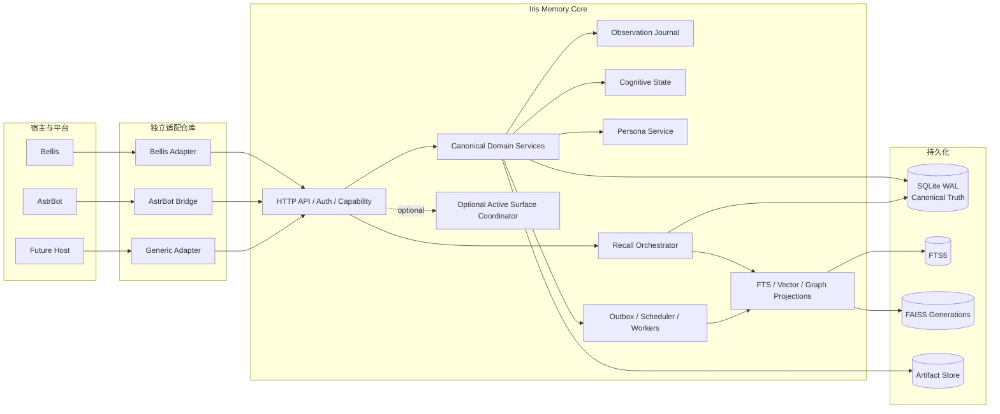
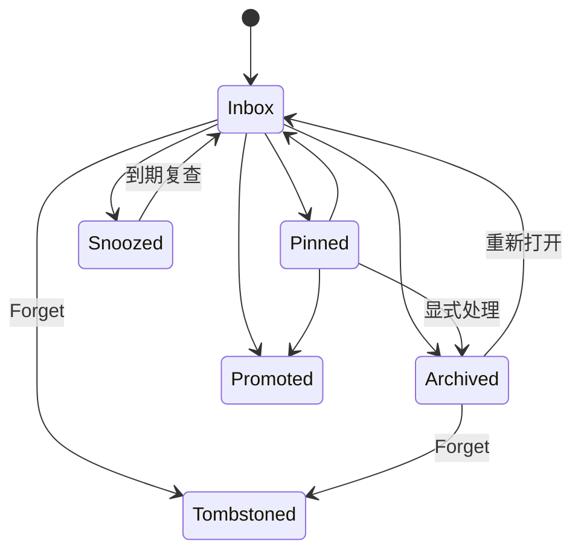

# Iris Memory Core：架构基线

> 文档状态：Architecture Baseline v1.2（2026-09-06 整理）  
> 适用范围：Core、宿主协议与 SDK、宿主适配器、Console 管理平面。  
> 技术基线：Python 3.12+、FastAPI、Pydantic 2、OpenAPI 3.1、SQLite WAL、FTS5、FAISS；AGPL-3.0。

本文件保留领域语义、不变量和发布要求，不作为实现完成清单。执行状态与路线只维护在[阶段索引](development/README.md)，剩余发布工作只维护在[Phase 14](development/phase-14-hardening-release.md)。已完成阶段的实测见各验证报告，历史数字不代表当前工作区重验。

字段、枚举、端点、错误码与版本分别以[宿主契约源](../contracts/source/contracts.json)、[Console 契约源](../contracts/source/console.json)、[生成 Schema](../schemas/)及[版本 Manifest](../schemas/version-manifest.json)为准；本文不再复制伪 Schema 与手工端点表。具体数据结构见领域代码与不可变迁移。

[ADR 索引](adr/README.md)记录冻结决策及后续取代关系。ADR-0017/0019 已闭合 HTTP 传输层，ADR-0020 明确 Bellis 插件接缝，ADR-0022 以 Console 文件导入取代旧库自动迁移；本次同步这些取代关系，不改变领域不变量。Console 的细节只维护在[合并设计](design/console-backend.md)。

## 0. 项目定义

Iris Memory Core 是一个独立、通用、可嵌入多个宿主的认知记忆服务。它负责保存已经发生的事实、维护当前认知状态、组织可追溯的长期记忆、管理受控人格演进，并在严格的身份、空间、隐私、时间与预算约束下向宿主返回结构化上下文。

Core 不依赖 Bellis、AstrBot 或任何单一聊天框架。宿主通过稳定协议接入；平台事件解析、Prompt 编排、回复决策、消息发送和外部动作执行均留在宿主或独立 Adapter 中。

系统的基本闭环是：

```text
已生效的外部事件
  → Observation Journal
  → Recent Context / Focus / Note / Task
  → Episode / Claim / Relation / Profile
  → Persona Evaluation
  → RecallResponse
  → 宿主实际使用回执
  → 可访问度与认知状态更新
```

所有可长期影响行为的内容都必须具备来源、作用域、隐私标签、版本和状态；所有缓存、全文索引、向量索引和画像都是可重建投影，不得成为事实源。

## 1. 设计目标与非目标

### 1.1 设计目标

Iris Memory Core 必须提供以下能力：

1. **Durable Observation**：幂等记录用户消息、助手实际输出、工具结果、平台事件、外部系统确认事实和显式记忆操作。
2. **Cognitive State**：持久化近期上下文、当前关注、实时状态、便签、计划、承诺与待投递认知事件。
3. **Memory Consolidation**：从 Observation 形成 Episode、Claim、Entity、Relation、Profile 和其他长期投影。
4. **Recall**：在 Scope、Privacy、Deadline、Token Budget 和历史版本约束内组合结构化、词法和语义候选。
5. **Identity Resolution**：处理跨平台账号、昵称变化、多账号绑定、临时主体和历史身份视图。
6. **Persona Stability**：由 Core 完整保存 Persona Core、Trait、State、Narrative，执行受策略约束的演进、发布与回滚，使多个宿主获得一致人格基线。
7. **Multi-host Consistency**：Bellis、AstrBot 及未来宿主共享同一 Canonical Domain，同时保留 Surface 私有内容。
8. **Recoverability**：在重启、任务重试、索引损坏、模型故障和部分依赖不可用时保持事实正确，并可明确降级。
9. **Auditability**：关键读取、写入、删除、绑定、人格发布和后台转换均可追踪到稳定 Revision、Evidence 与审计事件。

### 1.2 非目标

Core 不负责：

- 决定宿主应该说什么或是否回复；
- 直接发送 QQ、直播、语音或其他平台消息；
- 执行游戏、OBS、Live2D、支付或任意外部动作；
- 保存或执行任意用户代码、脚本式触发器或未经审核的工具调用；
- 代替宿主的安全策略、System Prompt 或内容审核；
- 保存模型私有 Chain-of-Thought；
- 以昵称、群名片或自然语言相似度自动完成高风险身份绑定；
- 把向量数据库、缓存或画像投影当作 Canonical Truth；
- 依赖全局独占活动入口才能保证记忆正确性。

Task 只描述、跟踪和提醒计划。宿主可以基于 Task 决定执行动作，但 Core 不执行动作，也不会仅因认知事件已经投递就把任务标记为完成。

## 2. 架构原则与不变量

### 2.1 核心原则

1. **Canonical First**：SQLite 中的规范化领域记录和不可变历史是唯一事实源。
2. **Projection Is Disposable**：FTS、FAISS、Profile、Graph、缓存和统计均可从 Canonical 数据重建。
3. **Evidence Before Inference**：长期事实、身份关系、人格变化和任务完成必须有 Evidence。
4. **Server-side Authorization**：租户、Agent、SpaceGroup、Space、Session、主体与隐私权限均由服务端凭据推导和校验。
5. **Revision Everywhere**：可变领域对象以不可变 Revision 保存，当前状态只是指针。
6. **Delete Never Resurrects**：Forget/Tombstone 在所有索引、缓存、后台任务和历史查询路径中优先级最高。
7. **Online Path Is Bounded**：Observe 和 Recall 不在关键路径等待不受控的 LLM、Embedding 或大型重建任务。
8. **Explicit Degradation**：部分失败通过 RecallResponse、健康状态和稳定错误码显式表达，不静默伪装为完整结果。
9. **Host Independence**：公共契约使用通用领域术语，不暴露 AstrBot/Bellis 内部类型，也不暴露 L1/L2/L3 实现层。
10. **Persona Is Trusted Data, Not Memory Text**：人格通过独立版本化协议发布到宿主可信 Persona Slot，不与普通召回文本竞争。

### 2.2 必须始终成立的不变量

- 公共领域 ID 的规范目标是 UUIDv7；向量索引另用服务端生成的 `int64` surrogate ID。既有 Reflection/Candidate 的确定性非 UUID 标识按 [ADR-0023](adr/0023-release-resources-and-console-identifiers.md) 保留；Console 资源 ID 使用 1–128 字符的不透明字符串兼容，不重写 Canonical ID。请求 ID 和幂等键继续使用各自既定规则。
- 所有写接口支持幂等；同一幂等键对应不同规范请求时返回冲突。
- 所有时间字段在 API 中使用 UTC RFC 3339；数据库内部可额外保存整数微秒用于排序。
- 任何 Recall 候选在返回前必须从 Canonical Store 重新读取并执行最终权限、状态、时效和 Tombstone 校验。
- `confidence`、`importance`、`accessibility`、`activation`、`valence/arousal` 分开存储和演化。
- 召回或复述只能提高 Accessibility/Activation，不能提高事实 Confidence。
- Binding 变化不重写历史 Observation；系统同时提供“发生时身份”和“当前解析身份”。
- 助手 Observation 只记录可信确认的实际效果。发送失败或取消后仍保留已确认前缀；生成但未发送、被拦截及其他未确认片段不能成为已说事实。
- 后台调度由持久化 Schedule/Tick Ledger 驱动，进程内 Timer 不能成为唯一时钟。
- Persona Core 不能由模型自动修改；人格回滚也必须生成新 Revision。

## 3. 总体架构



### 3.1 进程与模块边界

API 与一个或多个 Worker 进程共享同一节点的 SQLite 与本地持久卷。`api` 负责认证、校验与编码；`application` 管理用例、事务和 Recall 编排；`domain` 保存领域规则；`storage` 管理持久化、迁移、备份；`jobs` 管理 Outbox/Schedule/Lease；`indexing` 管理投影；`providers` 实现外部能力端口；`coordinator` 提供可选活动入口；`observability` 暴露低敏诊断。

Core、公共 Schema 与 SDK 同处 Monorepo；业务调用方及宿主适配实现只能经既定公共方法和 SDK/HTTP 契约接入，不直接访问 Core SQLite、FAISS、内部队列或私有组件。当前 pip 范围只包含 Core 功能及必要运行资源；SDK/前端单独交付，公共方法白名单和实际进程/文件权限隔离由 [Phase 14](development/phase-14-hardening-release.md#公共方法与内部访问边界) 验收。Bellis 在 `providers/memory-iris` 的已有插件及本仓库 AstrBot 预留目录均暂缓，状态分别见 [Phase 11](development/phase-11-bellis-adapter.md)、[Phase 12](development/phase-12-astrbot-bridge.md)，二者不进入当前 Core 发布物或前置门禁。

Console 是同一 Core 的独立管理平面，默认关闭；`/console/v1` 认证、授权和浏览器会话遵循 [ADR-0022](adr/0022-management-console-plane.md)。读侧可新增有界投影；所有业务写复用应用服务与 UoW。

### 3.2 同步与异步边界

同步在线路径只包含：

- 凭据、Scope、Privacy 和可选活动租约校验；
- Observation、显式领域操作和 Outbox 的事务写入；
- Canonical/Recent Context/Focus/Task/Persona 的有界读取；
- FTS 与已就绪向量索引的有界召回；
- 返回前 Canonical rehydrate 与裁剪。

异步路径包含：

- Episode 封装、Claim 提取与协调；
- Embedding、FTS 补建、Graph/Profile 投影；
- Note 复查、Task Trigger 扫描、Persona Evaluation；
- Retention、Compaction、备份和索引重建。

任何异步任务都必须携带 Source Revision，在提交结果前重新验证来源仍然有效。

## 4. 公共约定

### 4.1 标识符与引用

公共领域对象以 UUIDv7 为规范目标；现有 Reflection/Candidate 非 UUID 确定性标识的发布兼容性由 [Phase 14.0-C](development/phase-14-hardening-release.md)裁决，本次文档整理不更改标识规则。引用使用强类型结构并验证资源身份：

数据结构与校验见 [domain/model.py](../src/iris_memory_core/domain/model.py)；公共请求/响应以生成契约为准。

`source_refs`、`evidence_refs`、`supersedes_ref`、`promotion_target_ref` 和 Recall `candidate_ref` 均使用该结构。

向量层使用独立映射表：

数据结构与校验见 [domain/vector.py](../src/iris_memory_core/domain/vector.py)；公共请求/响应以生成契约为准。

UUID 不直接压缩或哈希成 FAISS ID，以避免碰撞和跨语言不一致。

### 4.2 时间、版本与历史

- API 时间格式：UTC RFC 3339，例如 `2026-08-29T10:30:00.123456Z`。
- 数据库内部另存 `*_us INTEGER`，表示 Unix 微秒，用于稳定比较。
- 每个可变 Aggregate 使用单调递增整数 `revision`。
- 写操作使用 `expected_revision` 实现乐观并发控制。
- `valid_from/valid_until` 描述领域事实何时有效；`recorded_at/superseded_at` 描述系统何时知道该事实，形成双时态语义。
- `as_of` 可以指定 `recorded_at` 或 Agent Watermark；历史读取必须重建当时可见 Revision，而不是查询当前投影。
- 历史不可用时返回 `history_unavailable`，不得退回当前数据冒充历史结果。

### 4.3 独立评分维度

```text
confidence     内容为真的可信度，范围 [0, 1]
importance     对 Agent、关系、任务或安全的长期重要度，范围 [0, 1]
accessibility  长期内容当前易被召回的程度，范围 [0, 1]
activation     Focus Item 当前占据注意力的程度，范围 [0, 1]
valence        情感正负，可选，范围 [-1, 1]
arousal        情感唤醒，可选，范围 [0, 1]
```

所有缺失维度保持 `null`，不能未经声明转换为 `0`。每个打分器输出标准化分量、版本和理由码，融合层使用固定、可测试的缺省值与稳定 tie-breaker。

### 4.4 内容哈希与规范化

- `content_hash` 使用版本化 Canonical JSON 序列化后计算。
- 哈希输入不包含传输时间、Trace ID 等易变字段。
- Idempotency 的请求指纹基于规范化方法、路径、主体、Scope 与业务 Payload。
- 文本规范化只能用于检索和候选聚类，不能改变原始 Observation。

## 5. 租户、Agent 与空间模型

### 5.1 层级

```text
Tenant
└── Agent
    ├── Persona
    ├── SpaceGroup (optional)
    │   ├── Space
    │   │   └── Session
    │   └── Space
    └── Standalone Space
        └── Session
```

- **Tenant**：数据、密钥、配额和管理权限的最高隔离边界。
- **Agent**：一套连续的 AI 身份、人格、关系与自我记忆；由 `agent_id` 标识。
- **SpaceGroup**：可选的跨端社区容器，例如同一直播社区及其关联 QQ 群。
- **Space**：一个具体交互表面，例如直播间、QQ群、私聊或本地会话域。
- **Session**：Space 内的一次有界交互会话。

Space 可以不属于 SpaceGroup。把多个 Space 绑定到同一 SpaceGroup 只允许共享被明确标记为 Group Scope 的内容，不会自动公开各 Space 的原始对话、成员私有事实或 Session 数据。

### 5.2 Scope

数据结构与校验见 [domain/scope.py](../src/iris_memory_core/domain/scope.py)；公共请求/响应以生成契约为准。

Scope 可见性采用逐维匹配：数据记录某维为 `null` 时可在该维向下可见；非 `null` 时必须与请求对应维完全相等。请求某维为 `null` 时，只能读取该维同为 `null` 的数据，不能把“未知”解释为通配符。

正式规则为：对于每个维度 `d`，数据 `D` 对请求 `R` 可见，当且仅当：

```text
D[d] is null OR (R[d] is not null AND D[d] == R[d])
```

此外还必须同时通过资源类型策略、主体权限和 Privacy Policy。Scope 不是授权的替代品。

Scope 构造还必须满足：

- `tenant_id` 始终非空；
- Persona、Focus、Note、Task 和 Agent 自我记忆要求 `agent_id`；
- `session_id` 非空时 `space_id` 必须非空；
- `space_group_id + space_id` 同时存在时，服务端必须验证当前或请求历史时点的绑定关系；
- Tenant 级 Identity 可以不带 `agent_id`，但任何关系、画像和 Recall 仍按 Agent Scope 隔离。

### 5.3 SpaceGroup 共享规则

SpaceGroup 提供社区级能力：

- 维护 Group 名称、描述、主 Space、成员 Space 和绑定历史；
- 保存公共梗、共同项目、群体事件、社区规则和群体关系；
- 允许多个 Space 召回 Group Scope 的 Claim、Task、Episode 和 Profile；
- 明确区分 `space_group_id` 内容与 `space_id` 私有内容；
- Space 解绑后保留发生时 Group 归属，未来请求按当前权限决定能否读取。

Space 绑定只影响社区内容，不隐式合并用户身份。SpaceGroup 的创建、绑定和解绑属于管理平面，需要原因、Expected Revision 与审计记录。

### 5.4 AccessContext 与 Privacy

`AccessContext` 只能由认证凭据、服务端注册信息和经过校验的路由参数构造：

数据结构与校验见 [domain/access.py](../src/iris_memory_core/domain/access.py)；公共请求/响应以生成契约为准。

调用方可以请求缩小权限，但不能通过 Payload 扩大权限。请求中的 `agent_id`、`space_group_id`、`space_id` 和 `session_id` 必须与 AccessContext 及服务器登记关系交叉校验。

标准 Privacy Label 包括：

- `tenant`：Tenant 内授权应用可见；
- `agent`：仅指定 Agent；
- `space_group:<id>`：仅指定 SpaceGroup 的授权 Space；
- `space:<id>`：仅指定 Space；
- `session:<id>`：仅指定 Session；
- `entity:<id>:private`：涉及主体的私有内容；
- `restricted`：仅管理平面或专门授权用途；
- 租户定义的自定义标签。

最终可见性为 Scope、Privacy Label、主体同意状态、数据用途和资源策略的交集。

## 6. 身份与实体模型

### 6.1 Entity 与 ExternalIdentity

`Entity` 表示服务内部稳定主体，可为：

```text
person | agent | organization | community | place | topic | object | system
```

平台身份由 `ExternalIdentity` 表示，其租户内稳定唯一键为：

```text
(tenant_id, provider, realm, external_id)
```

- `provider`：`qq-onebot11`、`qq-official`、`bilibili` 等协议或平台族；
- `realm`：应用、Bot、OpenID 域、平台实例或其他决定 ID 唯一性的命名空间；
- `external_id`：平台提供的稳定 ID。

昵称、群名片、头像、直播显示名和备注均为版本化属性，不参与唯一性判断。

ExternalIdentity 与其 Canonical Entity 在 Tenant 内稳定复用；不同 Agent 对同一人物的关系、私有记忆、画像和可见范围仍分别受各自 Agent Scope 约束。

Entity 状态至少包括：

```text
provisional | canonical | redirected | restricted | tombstoned
```

合并通过 Redirect 完成，不原地改写历史主键。所有读取必须解析 Redirect 链并设最大深度与环检测。

### 6.2 Binding

Binding 将 ExternalIdentity 关联到 Entity，状态为：

```text
proposed | verified | revoked | conflicted
```

Binding 必须保存：

- 绑定方法和证明摘要；
- 置信度和来源权威；
- `valid_from/valid_until`；
- 创建、确认、撤销的操作者与原因；
- 历史 Revision；
- 冲突及人工裁决记录。

v1 至少支持管理员确认，建议支持双端挑战码。昵称相似、同群出现、模型推断和单条聊天声明不能自动建立 Verified Binding。

### 6.3 字段级权威

权威按字段和来源决定，不按“整个资料最后写入者”决定：

| 字段类型 | 首选权威来源 |
| --- | --- |
| 平台稳定 ID、关注、等级、礼物 | 对应平台已验证事件或 API |
| QQ 群角色、群名片 | QQ 平台事件或 API |
| Canonical 显示名与头像 | 租户策略选择的主身份或管理员确认 |
| 用户明确纠正的事实 | 显式 Correct/Remember 操作 |
| 偏好、职业、关系、经历 | 多条 Evidence 支撑的 Claim |
| 推断画像 | 后台投影，权威低于显式事实和平台字段 |

字段合并保存 `field_authority`、`source_ref`、`effective_at` 和 `revision`。低权威刷新不能覆盖高权威显式修正；冲突内容并存并进入协调流程。

### 6.4 发生时身份与当前身份

Observation 同时保存：

- `actor_external_identity_id`：事件实际携带的平台身份；
- `actor_entity_id_at_ingest`：提交时解析结果，可为空；
- 当前解析视图：查询时沿 Binding/Redirect 得出的 Entity。

绑定、解绑或合并后不回写历史 Observation。审计、导出和历史查询可以选择 `identity_view=at_ingest|current`，默认业务 Recall 使用当前解析身份并保留原始引用。

## 7. Canonical 领域模型总览

| 领域对象 | 作用 | 是否事实源 | 主要寿命 |
| --- | --- | --- | --- |
| Observation | 已确认发生的最小事件 | 是 | 长期或按保留策略 |
| RecentContextProjection | 某 Session/Space 的近期上下文窗口 | 否，可重建 | 分钟至小时 |
| StateRecord | 高频、可合并的当前状态 | 是 | 秒至天 |
| FocusItem | Agent 当前关注、目标、问题与线索 | 是 | 分钟至数天 |
| Note | 重要但暂未完整建模的便签 | 是 | 小时至数周 |
| Task / TaskStep | 计划、承诺、依赖和下一行动 | 是 | 直到完成或取消 |
| CognitiveEvent | 到期、提醒和状态触发的投递记录 | 是 | 直到 ACK/过期 |
| Episode | 有边界的经历片段 | 是 | 长期 |
| Claim | 可验证、可修正的语义陈述 | 是 | 长期 |
| Relation | Entity 间有证据的关系 | 是 | 长期 |
| ProfileProjection | Entity/关系/群体的汇总视图 | 否，可重建 | 持续更新 |
| PersonaRevision | Agent Core/Trait/Narrative 的版本 | 是 | 长期 |
| PersonaState | Agent 短期人格状态 | 是 | 分钟至天 |
| Artifact | 大文本、附件或结构化外部内容 | 是/外部引用 | 按策略 |

L1/L2/L3 可以作为内部迁移、检索或认知处理术语，但不出现在公共宿主契约中。

## 8. Observation Journal

### 8.1 数据模型

数据结构与校验见 [domain/observation.py](../src/iris_memory_core/domain/observation.py)；公共请求/响应以生成契约为准。

Observation 是已经确认的事实，不保存 `pending` 或 `failed` 事件作为“发生过的内容”。失败尝试可以进入独立 Audit/Event 记录，但不能成为用户已看到、助手已说出或工具已完成的 Evidence。

### 8.2 提交语义

- 用户消息：平台已接收并交给宿主处理后提交。
- AstrBot 助手输出：必须有发送成功或部分实际效果的可信证明。已核查的 `after_message_sent` 在发送异常时也可能触发，不能单凭 Hook 名或触发时机提交；证据边界由 [Phase 12.0](development/phase-12-astrbot-bridge.md)裁决。
- Bellis 助手输出：Scene Commit 只代表调度意图；必须有独立、幂等的可信 effect/progress 确认，再记录已确认生效的片段（Bellis ADR 0006 §3，接入状态见 [Phase 11](development/phase-11-bellis-adapter.md)）。
- 流式或语音输出：只提交可确认已播放/显示的部分，标记 `effect_state=partial` 并保存范围。
- completed/cancelled/failed 状态本身不证明实际效果。零确认时不记录助手内容；部分输出后取消或失败仍保留已确认前缀，未确认的 ScenePlan 文本不得补成事实。
- 工具结果：只有外部系统确认效果后提交成功结果；请求、失败和超时进入 Audit/Event。

Adapter 可以在本地短暂保存候选事件，但 Core 的 Observation API 只接受已提交语义。

### 8.3 有序源与 Cursor

对能提供稳定顺序的 Connector，可设置 `(source_stream, source_cursor)`：

- 同一 Source Stream 的 Cursor 单调前进；
- Observation 与最新 Cursor 在同一数据库事务中写入；
- 重复 Cursor 返回已有提交结果；
- 跳号按 Connector Policy 接受、拒绝或标记 Gap；
- 旧 Cursor 不能覆盖新 Cursor；
- Cursor 不替代 Idempotency Key，二者分别保证源顺序和请求重试安全。

对无稳定 Cursor 的平台，只使用 `source_event_id + idempotency_key`。

### 8.4 批量 Observe

批量提交要么全部通过请求级校验并事务提交，要么全部失败。每条记录仍保留独立 Idempotency Key。服务返回：

```text
accepted_observation_ids[]
duplicate_observation_ids[]
source_watermark
agent_watermark
outbox_enqueued
```

Observe 在线路径不调用 LLM 或 Embedding。需要异步处理的每条 Observation 与对应 Outbox 事件在同一事务中落库。

## 9. 近期上下文、实时状态与关注项

### 9.1 RecentContextProjection

`RecentContextProjection` 是从已提交 Observation 派生的近期上下文窗口，用于快速恢复某个 Session 或 Space 的最近交互。它不是长期记忆，也不是 Agent 当前“正在想什么”。

数据结构与校验见 [domain/recent.py](../src/iris_memory_core/domain/recent.py)；公共请求/响应以生成契约为准。

规则：

- 只引用已提交 Observation；
- 原始近期消息默认不跨 Space 共享；
- Projection 可按 Token 上限将旧消息压缩为带 Source Refs 的摘要段；
- 摘要不能代替原始 Observation，也不能独立成为 Claim Evidence；
- Builder Version 或 Source Watermark 不匹配时可重建；
- 近期上下文领域统一使用 `RecentContextProjection`，不与认知关注层混用。

### 9.2 StateRecord

StateRecord 适合高频、可覆盖、强时效的当前状态，例如游戏地图、OBS 场景、在线状态、当前话题或设备模式：

数据结构与校验见 [domain/state.py](../src/iris_memory_core/domain/state.py)；公共请求/响应以生成契约为准。

同一 `(scope, namespace, key)` 只保留当前指针和不可变历史。State Stream 写入可以按 Coalesce Key 合并尚未执行的投影任务，但不能跳过 Canonical State Revision。过期状态不参与 Recall；是否保留历史由 Namespace Policy 决定。

### 9.3 FocusItem

FocusItem 表示 Agent 持久化的认知关注：

数据结构与校验见 [domain/focus.py](../src/iris_memory_core/domain/focus.py)；公共请求/响应以生成契约为准。

FocusItem 与 RecentContextProjection 的区别：

| 维度 | RecentContextProjection | FocusItem |
| --- | --- | --- |
| 本质 | 最近 Observation 的可重建窗口 | Agent 当前关注的 Canonical 认知对象 |
| 来源 | 确定性窗口与摘要 | 显式操作、规则或经过验证的候选 |
| 寿命 | 分钟至小时 | 分钟至数天，可休眠或晋升 |
| 跨端 | 原始内容默认不跨 Space | Agent/SpaceGroup Scope 可按策略跨端 |
| 淘汰 | 可直接重建 | 需状态转换并保留历史 |

容量同时受 Item 数、Kind 配额和 Token 预算约束，避免单一热点淹没全部注意力。时间流逝降低 Activation；显式 Pin、任务推进、真实使用和重复出现可以增强 Activation。淘汰使对象 Dormant/Expired，具有长期价值的内容应先晋升为 Note、Task、Episode 或 Claim。

`affect` 只提供 Persona State 的短时证据，不能直接修改 Persona Trait 或 Core。

## 10. Note

Note 是独立领域对象，用于低成本捕获“重要但暂时不值得完整建模”的事项。它可以由宿主工具、管理员、确定性规则或后台候选审核创建。

### 10.1 数据模型

数据结构与校验见 [domain/note.py](../src/iris_memory_core/domain/note.py)；公共请求/响应以生成契约为准。

### 10.2 生命周期



`review_after` 是下次整理时间，不是删除时间。Pinned Note、未兑现承诺、Active Task 的来源 Note 和管理保留项不得自动删除。

### 10.3 复查与晋升

Note Review 按以下顺序执行：

1. 重新校验 Revision、Scope、Privacy、Pin、Snooze 与 Tombstone。
2. 对疑似重复 Note 建立关联，不按文本相似度直接删除。
3. 需要行动、提醒或跟进的内容晋升或关联到 Task/TaskTrigger。
4. 稳定事实形成 Claim 与 Evidence。
5. 主要记录经历的内容关联到 Episode。
6. 不确定但仍重要的 Note 延长复查时间。
7. 已处理 Note 标记 Archived 或 Promoted，并保存原因及目标引用。

自动抽取只能创建低权威候选；未经明确策略允许，不能把普通对话直接变成 Active Task 或高权威 Claim。

## 11. Task、TaskStep 与前瞻记忆

Task 是 Core 中正式、持久化的计划和承诺对象。它既支持简单提醒，也支持多步骤、依赖、触发和可验证结果。

### 11.1 Task

数据结构与校验见 [domain/task.py](../src/iris_memory_core/domain/task.py)；公共请求/响应以生成契约为准。

### 11.2 TaskStep

数据结构与校验见 [domain/task.py](../src/iris_memory_core/domain/task.py)；公共请求/响应以生成契约为准。

Step 使用稳定 ID，排序变化不改变身份。完成 Step 必须经过独立状态转换；涉及外部效果时需要实际成功 Observation 或等价 Evidence。

### 11.3 TaskDependency

数据结构与校验见 [domain/task.py](../src/iris_memory_core/domain/task.py)；公共请求/响应以生成契约为准。

依赖写入必须执行环检测。Ready 状态由依赖满足情况确定，不能只从自然语言推断。跨 Task 依赖首版不提供；确有需要时通过后续 ADR 引入，避免分布式状态网失控。

### 11.4 TaskTrigger

数据结构与校验见 [domain/task.py](../src/iris_memory_core/domain/task.py)；公共请求/响应以生成契约为准。

- 绝对时间使用 RFC 3339。
- 重复计划使用受限、可解析、可验证的日程语法。
- 条件只支持声明式 Allowlist 字段和操作符，不执行任意代码。
- 时区必须使用 IANA TZ 名称；夏令时重复/缺失时刻按显式 Policy 处理。
- 每次触发生成唯一 Occurrence ID，幂等键包含 Trigger Revision 与计划时刻。

### 11.5 状态规则

- 对话抽取的承诺默认创建 `proposed` Task。
- 只有显式工具调用、确定性租户策略或管理员确认能激活 Task。
- Cognitive Clock 只能生成 Due Event，不能自动执行外部动作。
- Event 已投递或 ACK 不表示 Task 完成。
- Task 完成、失败、取消都形成可审计 Revision，并可进一步形成 Episode/Claim。
- 状态转换要求 `expected_revision` 和幂等键。
- Task 的当前状态是 Canonical；Graph 中的依赖边仅为投影，不能反向驱动 Task。

## 12. CognitiveEvent 与宿主投递

### 12.1 数据模型

数据结构与校验见 [domain/event.py](../src/iris_memory_core/domain/event.py)；公共请求/响应以生成契约为准。

### 12.2 投递语义

- 无活动宿主时事件保持 Pending。
- 宿主上线或获得活动租约后，按有效期、Scope、优先级和预算拉取。
- 投递采用 At-least-once；宿主必须以 Event ID 幂等处理。
- Holder 被 Fence 且未 ACK 时，可向新 Holder 重投同一 Event ID。
- ACK 只表示宿主收到并承担处理责任，不表示外部动作成功。
- 外部动作完成必须提交实际效果 Observation，再显式推进 Task/Step。
- 过期事件按 Policy 进入 Expired、合并为摘要事件或继续保留，不能静默消失。

## 13. 长期记忆模型

### 13.1 Episode

Episode 是按 Agent、Space、Session、时间窗和主题形成的有界经历：

数据结构与校验见 [domain/memory.py](../src/iris_memory_core/domain/memory.py)；公共请求/响应以生成契约为准。

Episode 不等于宿主 Session，也不能跨 Space 任意拼接原始聊天。推断出的参与者、主题、转折和情感都要保留 Evidence 与提取器版本。

### 13.2 Claim 与 Evidence

Claim 表示可验证、可修正的语义陈述：

数据结构与校验见 [domain/memory.py](../src/iris_memory_core/domain/memory.py)；公共请求/响应以生成契约为准。

去重键至少包含 Tenant、Agent、主体、谓词、规范值与 Scope。文本或向量相似只能产生候选，不能自动合并不同主体、不同 SpaceGroup 或不同有效时间的事实。

Evidence 表示某个资源对 Claim 的支持、反驳或修正：

数据结构与校验见 [domain/memory.py](../src/iris_memory_core/domain/memory.py)；公共请求/响应以生成契约为准。

每个 Active Claim 至少有一条有效 Evidence。冲突 Claim 可以并存并标记 `disputed`，高风险冲突交由人工或领域策略裁决。

### 13.3 Relation

Relation 是有方向、有类型、有 Evidence 的 Entity 关系：

数据结构与校验见 [domain/memory.py](../src/iris_memory_core/domain/memory.py)；公共请求/响应以生成契约为准。

Graph 只投影 Canonical Relation、Verified Binding 和部分 Claim。多跳召回必须逐边执行 Scope/Privacy 过滤，并限制深度、扇出、总节点数和 Token Budget。昵称相似或模型联想不能直接创建 Relation。

### 13.4 Procedure Claim

程序记忆使用受限 Claim 表达已验证的偏好、步骤或交互习惯。它可以保存声明式步骤和工具偏好，但不得保存可直接执行的代码、Shell、SQL 或未审核参数。宿主仍需按照自身工具权限和安全策略解释。

### 13.5 ProfileProjection

Profile 是 Entity、Relationship 或 SpaceGroup 的当前汇总视图，不是独立事实源。每个字段保存：

数据结构与校验见 [domain/profile.py](../src/iris_memory_core/domain/profile.py)；公共请求/响应以生成契约为准。

Profile 可以按身份、偏好、关系、重要经历、长期目标、近期变化和交互建议分区。Agent 自身人格不得混入外部 Entity Profile。

### 13.6 Artifact

Artifact 用于承载不适合直接内联数据库的大文本、附件、媒体元数据或外部对象引用：

数据结构与校验见 [domain/memory.py](../src/iris_memory_core/domain/memory.py)；公共请求/响应以生成契约为准。

Artifact Store 必须执行路径规范化、大小限制、媒体类型校验、哈希校验和引用计数。外部 URL 不能在 Recall 时自动抓取；抓取必须由受控 Ingest 流程完成。

## 14. Persona 系统

Core 为每个 `(tenant_id, agent_id)` 提供完整 Persona 功能，确保不同宿主、不同 Space 和重启后的 Agent 都从同一版本化人格基线工作。

Agent 创建事务必须同时建立初始 Persona 和 Current Pointer；没有有效 Published Persona 的 Agent 不能进入对外互动 Ready 状态。Recall 中 `persona_revision=0` 仅表示人格不可用，不能当合法修订采用（ADR-0017 §4）。

### 14.1 Persona 分层

| 层级 | 内容 | 存储 | 自动变化规则 |
| --- | --- | --- | --- |
| Persona Core | 名称、身份设定、核心价值、安全边界、不可违背关系约束 | PersonaRevision | 禁止模型自动修改；仅授权管理发布 |
| Persona Trait | 表达风格、稳定兴趣、习惯、长期倾向、允许演进的权重 | PersonaRevision | 仅通过演进提案，小步且有冷却期 |
| Persona State | 心境、精力叙事、近期关注、短时表达倾向 | PersonaState Revision | 可由事件更新，必须有 TTL 与基线回归 |
| Narrative | 对自身经历、关系和阶段目标的版本化总结 | PersonaRevision | 生成候选后事实校验，不得改写 Core |

Persona 不等于外部用户 Profile，也不等于普通 Claim 集合。Core 对人格 Schema、演进策略、发布历史和状态时效拥有完整控制。

### 14.2 PersonaRevision

数据结构与校验见 [domain/persona.py](../src/iris_memory_core/domain/persona.py)；公共请求/响应以生成契约为准。

PersonaRevision 不可变。当前人格由 Current Pointer 指向 Published Revision。发布和回滚均创建新 Revision，不把旧内容重新标为当前。每个宿主请求必须记录实际使用的 Persona Revision 和 Content Hash。

### 14.3 PersonaState

数据结构与校验见 [domain/persona.py](../src/iris_memory_core/domain/persona.py)；公共请求/响应以生成契约为准。

State 只允许 Schema 白名单字段和值域。到期回归依赖 Worker 或启动 Catch-up，当前读取不单独屏蔽未扫描的过期 State，系统时钟回拨会推迟回归（[Phase 9 限制](reports/phase-09-verification.md#5-已知限制)）。单个用户、单次情绪、Prompt Injection 或模型自述不能直接改变 Trait/Core。

### 14.4 PersonaEvolutionPolicy

每个 Agent 选择一种发布策略：

```text
locked       禁止后台发布 Trait/Narrative，只允许管理员发布
manual       后台生成提案，管理员审批后发布
bounded_auto 白名单 Trait 可在阈值、冷却期和证据条件内自动发布
```

Policy 必须定义：

- 可修改字段 Allowlist；
- 单次最大变化幅度和累计窗口上限；
- 最小 Evidence 数、来源多样性和时间跨度；
- 最小 Confidence；
- 冷却期与观察期；
- Narrative 事实校验规则；
- 需要人工审批的敏感字段；
- 自动回滚告警阈值。

Persona Core 始终不在 `bounded_auto` 范围内。

### 14.5 PersonaEvolutionProposal

数据结构与校验见 [domain/persona.py](../src/iris_memory_core/domain/persona.py)；公共请求/响应以生成契约为准。

每个 Field Delta 必须包含旧值、新值、变化幅度、证据和理由码。提案创建后若 Base Revision 已变化，发布前必须重新评估或过期，不允许直接套用到新版本。

### 14.6 演进流水线

1. 在配置的多时间窗口中收集 Episode、稳定 Trait 信号、Task 结果、明确反馈和 Persona State 趋势。
2. 过滤单一来源操纵、低权威内容、无效或已删除 Evidence。
3. 生成结构化 Proposal，不生成自由文本覆盖指令。
4. 确定性策略拒绝 Core 修改、越界值、冷却期内重复变化、证据不足和 Base Revision 过期。
5. 按 `locked|manual|bounded_auto` 进入拒绝、待审核或有限自动发布。
6. 发布新 PersonaRevision，更新 Current Pointer，并提交 Cache Invalidation Outbox。
7. 向在线宿主发布 `persona.revised.v1` 通知；离线宿主下次启动通过版本协商获取当前版本。
8. 在观察期记录宿主采用情况、异常反馈和人工评价；需要回退时创建 Rollback Revision。

### 14.7 多端人格稳定规则

- RecallResponse 携带当前 `persona_revision` 与 `persona_content_hash`。
- Persona 本体通过专门接口读取，普通记忆召回只返回与人格相关的 Evidence 或 Narrative 候选，不返回可覆盖人格的自由文本。
- Adapter 将合法 PersonaRevision 映射到宿主预留的可信 Persona Slot。
- Persona 不能覆盖宿主安全策略、工具权限或平台内容规范。
- 宿主本地缓存以 `(agent_id, persona_revision, content_hash)` 为键；收到失效通知或版本不一致立即丢弃。
- 多宿主并发读取同一 Current Revision；发布使用 Expected Revision 串行化。
- Session/Cycle 记录保存所用 Persona Revision，以便重放和审计。

### 14.8 人格安全

- Persona 文本、Evidence 和 Proposal 均视为不可信内容数据，不作为系统指令执行。
- 模型只输出 Schema 约束的候选，服务端做字段、值域、来源、幅度和策略校验。
- 不请求、不保存、不展示私有 Chain-of-Thought；只保存简洁、结构化理由码。
- Persona 管理接口与普通应用 Token 隔离，审批、发布和回滚要求管理权限及操作原因。
- Core 的完整人格功能不意味着 Core 决定回复内容；最终表达、动作与安全仍由宿主负责。

## 15. 认知数据处理流程

### 15.1 用户事件

```text
平台事件
  → Adapter 规范化 ExternalIdentity / Space / Session
  → 可选 Active Surface Lease 校验
  → Observation Batch
  → SQLite 事务提交 Observation + Cursor + Outbox
  → 返回 Source/Agent Watermark
  → 更新 RecentContextProjection
  → 后台 Attention / Episode / Claim / Profile / Index
```

Observe 成功表示 Canonical Observation 已持久化，不表示所有投影已完成。返回的 Watermark 用于宿主在后续 Recall 中声明最低一致性要求。

### 15.2 助手输出与工具效果

```text
模型候选
  → 宿主安全与输出编排
  → 平台/场景实际生效
  → Adapter 确认可见范围
  → Assistant/Tool Observation
```

只有实际生效的部分能支持“助手说过”“工具做过”“承诺已经表达”等 Claim 或 Task Evidence。宿主应为生成、发送和提交分别使用不同事件 ID，防止把生成完成误当作发送完成。

### 15.3 后台提炼

1. Worker 领取携带 Fencing Generation 的 Outbox Job。
2. 在固定 Source Watermark 上选择 Observation 窗口。
3. 形成或封闭 Episode。
4. 以稳定 Entity ID 和安全显示标签调用可选 LLM Provider。
5. 提取器输出 Claim、Relation、Focus、Note、Task 或 Persona Proposal 候选及 Evidence Span。
6. 服务端拒绝未知主体、越权 Scope、无来源内容、任意代码触发器、自动 Active Task 和直接 Persona Core 变更。
7. 在事务中写入通过验证的 Canonical 记录与后续 Outbox。
8. FTS、Embedding、Profile、Graph 和 Persona Cache 按 Source Revision 更新。

Provider 失败只使对应 Route/Job 降级或重试，不回滚已确认 Observation。

### 15.4 Recall

```text
请求鉴权与 Scope 解析
  → 可选 Lease / Deadline / Watermark 校验
  → Persona、Recent Context、Focus、State、Task 并行结构化读取
  → FTS / Vector / Graph 并行候选读取
  → Canonical Rehydrate + Privacy/Tombstone 终检
  → 分层打分、去重、冲突标记、Token 裁剪
  → RecallResponse
  → 宿主回传 Usage Report
```

### 15.5 显式记忆操作

- `Remember`：创建高权威 Claim 与 Evidence，必要时创建 Entity/Relation。
- `Correct`：创建新 Revision、Supersede 或 Contradict 旧 Claim，并写入修正 Evidence。
- `Forget`：写入 Tombstone，撤回匹配资源并发出索引/缓存失效事件。
- `Note`：创建、更新、Pin、Snooze、Archive 或 Promote。
- `Task`：创建、激活、推进、阻塞、完成或取消 Task/Step。
- `Focus`：激活、休眠、Dismiss 或 Promote FocusItem，不删除其来源事实。
- `Persona`：应用可以读取当前版本和提交反馈/提案；发布、审批、回滚属于 Persona Policy 与管理平面。

所有写操作要求 Idempotency Key；修改已有 Aggregate 还要求 Expected Revision。

### 15.6 反馈与再巩固

Recall 使用生命周期区分四个阶段：

- `retrieved`：服务检索到，由 Core 在 Route 执行时记录；
- `returned`：服务放入 RecallResponse，由 Core 在响应完成时记录；
- `host_selected`：宿主选择进入上下文，由宿主回传；
- `model_visible`：最终确实对模型可见，由宿主回传。

只有 `host_selected/model_visible` 能增强 Accessibility 或 Focus Activation。未选择的 Candidate 不因一次检索而增强。使用次数不改变 Confidence；明确纠正、独立 Evidence 和来源权威才改变事实可信度。

## 16. Transactional Outbox 与 Worker

### 16.1 原子性

任何需要异步后续处理的 Canonical 写入，必须在同一 SQLite 事务中写入 Outbox：

```text
BEGIN IMMEDIATE
  写入 Aggregate Revision
  更新 Current Pointer / Agent Watermark
  写入 Audit Event
  写入 Outbox Event
COMMIT
```

禁止先提交业务数据再通过内存 Queue 投递任务，也禁止 Worker 绕过 Domain Service 直接改写 Canonical 当前状态。

### 16.2 Outbox 数据模型

数据结构与校验见 [domain/jobs.py](../src/iris_memory_core/domain/jobs.py)；公共请求/响应以生成契约为准。

### 16.3 领取与 Fencing

- Worker 使用短事务按优先级和 `available_at` 领取任务。
- 每次领取递增 `lease_generation`。
- 任务提交结果前必须验证 Owner、Generation、Lease 未过期和 Source Revision。
- 过期 Worker 的提交被拒绝，即使任务逻辑本身执行成功。
- 重试采用带抖动的指数退避；不可重试错误进入 Dead Letter。
- 管理员重放 Dead Letter 会生成新的 Outbox ID，并引用原任务。

### 16.4 Coalescing

State 投影、Profile Refresh、Graph Refresh 等任务允许按 `(tenant, agent, job_kind, coalesce_key)` 合并 Pending 项，只保留最高 Source Revision。Observation 提炼、Task Occurrence、Persona Proposal 发布、Forget 和审计任务禁止丢弃式合并。

### 16.5 背压

服务同时限制：

- Pending Job 数量和 Payload 字节；
- Tenant/Agent 级排队配额；
- 各 Provider 并发、速率和成本；
- Worker 批大小与事务时长；
- 磁盘最小剩余空间。

磁盘或队列接近硬阈值时，Ready 状态变为降级或不可写；低优先级派生任务延迟，Canonical Forget、Correct 和安全操作保留优先通道。超过安全阈值时返回 `storage_full`，不得接受后实际丢失。

## 17. 持久化 Schedule、Tick 与认知时钟

### 17.1 Schedule

数据结构与校验见 [domain/schedule.py](../src/iris_memory_core/domain/schedule.py)；公共请求/响应以生成契约为准。

### 17.2 Tick Ledger

数据结构与校验见 [domain/schedule.py](../src/iris_memory_core/domain/schedule.py)；公共请求/响应以生成契约为准。

Tick 的幂等键至少是 `(schedule_id, scheduled_at, policy_version)`。Scheduler 在同一事务中记录 Tick 并创建 Outbox，防止重启时重复或漏执行。

### 17.3 时间异常处理

- 业务时刻统一存 UTC，日历规则同时保存 IANA 时区。
- 夏令时跳过/重复时刻按 Schedule Policy 选择跳过、推迟或只执行一次。
- 系统时钟回拨时，已存在 Occurrence Key 不得重发。
- 大幅向前跳时按 Catch-up Policy 补算，且受单次最大 Tick 数约束。
- 进程休眠或宕机后，Scheduler 从 Tick Ledger 恢复，不依赖内存 Timer。

### 17.4 周期任务

| Job | 作用 | 默认 Catch-up |
| --- | --- | --- |
| Recent Context Maintenance | 摘要、窗口和过期清理 | latest |
| Focus Maintenance | 激活衰减、容量整理和晋升 | coalesce |
| Note Review | 复查到期 Note | all，有批上限 |
| Task Trigger Scan | 生成到期 CognitiveEvent | all |
| Episode Consolidation | 封闭经历并提炼 Claim | latest per window |
| Memory Reconciliation | 重复、冲突、过期协调 | coalesce |
| Reflection | 生成结构化候选 | latest |
| Profile/Graph Refresh | 重建投影 | latest |
| Persona Evaluation | 生成受控演进提案 | latest per evidence window |
| Retention/Compaction | 保留、Tombstone 和数据库维护 | latest |
| Backup | 生成一致性备份与校验 | all or latest by policy |

Reflection 固定读取一个 Source Watermark，只输出带 Source Refs 的简洁结构化候选和 `ReflectionRecord`。它不是外部事实，不写成用户/助手 Observation，也不能用自己的输出循环强化同一结论。

在线 Observe/Recall 的资源优先级高于低优先级巩固。长时间积压必须暴露 Lag、Oldest Pending Age 和 Provider Degradation。

## 18. Recall 协议

### 18.1 RecallRequest

数据结构与校验见 [domain/recall.py](../src/iris_memory_core/domain/recall.py)；公共请求/响应以生成契约为准。

`actors` 至少包含当前说话人的 ExternalIdentity；服务端自行解析 Entity，不信任调用方提供的内部 Entity ID。直播批次可附带有界数量的其他参与者和权重。

### 18.2 RecallCandidate

数据结构与校验见 [domain/recall.py](../src/iris_memory_core/domain/recall.py)；公共请求/响应以生成契约为准。

Persona 通过 Response 顶层的 Persona Revision 协调，不作为普通候选。必要的自我 Narrative Evidence 可以作为 `memory` Candidate，但不能覆盖已发布 Persona。

### 18.3 RecallResponse Envelope

数据结构与校验见 [domain/recall.py](../src/iris_memory_core/domain/recall.py)；公共请求/响应以生成契约为准。

`completed_routes` 明确记录实际成功的 Route。冻结的路由名为 `tasks`、`recent_context`、`state`、`focus`、`claims`、`relations`、`fts`、`vector`、`graph`、`profile`（ADR-0014 §3 裁定以内部名为准，`tasks` 为复数；Persona 不是路由，经响应顶层字段协调，绝不作为候选）。`degraded_routes` 为结构化对象，至少包含 Route、稳定原因码、是否可重试和所用回退；原因码冻结集由 ADR-0014 §10、ADR-0015 §7 与 ADR-0016 §6 共同定义。只要请求允许部分结果且至少一个关键 Route 成功，服务可返回 `partial=true`；否则返回稳定错误。

`cache_until` 是结果可复用的最早失效边界，还必须受 Persona Revision、Source Watermark、Scope、Privacy、Tombstone Watermark 与宿主本地策略共同约束。

### 18.4 Route 与 Deadline

Recall Orchestrator 为每个 Route 分配子 Deadline 和候选上限：

1. Persona 元数据独立读取；Recent Context、Focus、State、Active/Due Task 为结构化高优先级 Route。
2. Profile、Claim 和 Relation 为结构化长期 Route。
3. FTS 和 Vector 并行执行，Graph 受深度与扇出限制。
4. Route 超时后取消等待并写入 `degraded_routes`，不阻塞其他已完成结果。
5. 总 Deadline 到达后立即停止扩展、执行最终 Rehydrate 与预算裁剪。

Deadline 使用单调时钟计算剩余预算；API 中的 `deadline_at` 只在入口转换一次，避免墙钟回拨导致超时失效。

### 18.5 最终 Rehydrate

所有来自缓存、FTS、FAISS、Graph 或 Profile 的候选在返回前按 ID/Revision 回读 Canonical 数据，并再次验证：

- Tenant/Agent/SpaceGroup/Space/Session Scope；
- Privacy、主体同意和调用用途；
- Status、Valid Time、Expiry；
- Tombstone 与 Supersede Revision；
- 历史 `as_of` 可见性；
- Persona Revision 与 Request Watermark；
- Content Hash 和 Builder Version。

终检失败的候选被剔除并记录内部理由码。任何性能优化都不能绕过这一关。

### 18.6 排序与预算

候选融合使用版本化、可配置但确定性的打分器。分量集合为 `relevance`、`authority`、`confidence`、`importance`、`accessibility`、`activation`、`recency`、`task_urgency`，每个分量先归一化到 `[0, 1]`，再按固定权重加权归一，最后减去惩罚项：

```text
final_score =
  Σ(present[c] × weight[c]) / Σ(weight[c] for c in present)
  - conflict_penalty
  - redundancy_penalty
```

关键性质：**缺失分量不等于零分**。`scores` 是 `dict[str, float | None]`，某分量缺失（键不存在或为 `None`）时既不贡献分子也不参与分母，因此不会把候选拉到虚假低分；显式 `0.0` 才是真实零分（§4.3“缺失维度保持 `null`，不能未经声明转换为 `0`”在排序层的落地）。具体权重表、Ranker 版本号与冲突/冗余判定规则由 ADR-0014 §5 冻结，ADR-0015 §6 的 v3 在其上增加跨路由的 `(resource_type, resource_id)` 去重——同一 Canonical 资源被多条路由命中时只占一个预算槽。

稳定排序键为：

```text
(-final_score, category_priority, occurred_at DESC, resource_id ASC)
```

裁剪先保障 Persona 元数据、Due Task、当前 Focus 和说话人必要身份，再按 Layer Budget 分配剩余 Token。其他群成员的私有记忆不能因为同处一个 Space 而进入上下文。

### 18.7 Usage Report

数据结构与校验见 [domain/recall.py](../src/iris_memory_core/domain/recall.py)；公共请求/响应以生成契约为准。

Core 自行保存 `retrieved` 与 `returned` 阶段；`returned_candidate_ids` 是宿主对已收到集合的完整性回显。服务验证所有 Candidate 确属该 Request，且 `model_visible ⊆ host_selected ⊆ returned`。重复 Report 幂等合并，调用方不能伪造其他 Tenant 的访问统计。对隐私敏感资源只保存 Candidate ID 和阶段，不保存宿主完整 Prompt。

## 19. Remember、Correct、Forget 与保留

### 19.1 Remember

Remember 接受结构化 Subject、Predicate、Value、Scope、Privacy 和 Evidence。调用方省略 Subject 时只在契约明确的自我或当前 Actor 场景补全；歧义主体直接拒绝。写入成功后返回 Claim ID、Revision 和 Agent Watermark。

### 19.2 Correct

Correct 在单一事务中：

1. 校验目标 Revision 与权限；
2. 创建修正 Claim Revision 或新 Claim；
3. 将旧 Claim 标记 Superseded/Disputed；
4. 写入 Corrects/Contradicts Evidence；
5. 更新 Agent/Tombstone Watermark；
6. 写入 FTS、Vector、Profile、Graph 和 Cache Invalidation Outbox。

不得原地覆盖 Canonical Text 或 Evidence。

### 19.3 Forget 与 Tombstone

Forget 可以作用于单个 Resource、Subject+Predicate、Session、Space 或经授权的数据请求范围。每个 Tombstone 保存：

数据结构与校验见 [domain/model.py](../src/iris_memory_core/domain/model.py)；公共请求/响应以生成契约为准。

Tombstone 写入后立即影响 Canonical 读取；索引清理可以异步，但最终 Rehydrate 保证旧索引结果不能复活。后台 Worker、备份恢复、重建和导入都必须比较 Tombstone Watermark。

### 19.4 认知衰减与隐私删除

认知衰减只降低 Accessibility/Activation 或使内容归档，不等价于删除。隐私删除使用 Tombstone 并按合规策略清理正文、Artifact 和索引。安全审计可保留最小不可逆摘要，但不能继续用于 Recall。

### 19.5 保留策略

保留策略按资源类型、Privacy、Tenant、Legal Hold 和主体请求配置。以下内容不参加普通自动遗忘：

- Persona Core 与发布历史；
- Pinned Note；
- Active Task 和未兑现承诺；
- 安全相关 Claim；
- Tombstone 和必要审计元数据。

自动归档、压缩和清理都必须记录 Policy Version、原因和处理数量。

## 20. SQLite Canonical Store

### 20.1 数据库职责

SQLite 保存：

- Tenant、Agent、SpaceGroup、Space、Session 与授权元数据；
- Entity、ExternalIdentity、Binding 与字段历史；
- Observation、Source Cursor、Recent Context 元数据；
- State、Focus、Note、Task、TaskStep、Dependency、Trigger、CognitiveEvent；
- Episode、Claim、Evidence、Relation、Persona 与 Artifact 元数据；
- Revision、Tombstone、Idempotency、Audit、Outbox、Schedule、Tick；
- Profile/Graph/FTS/Vector 的投影状态与 Watermark；
- Provider、Migration、Backup 和 Capability 元数据。

数据库不保存未加密 Provider Secret、原始访问 Token 或模型私有思维过程。

### 20.2 运行参数

默认连接设置：

```sql
PRAGMA journal_mode = WAL;
PRAGMA synchronous = FULL;
PRAGMA foreign_keys = ON;
PRAGMA busy_timeout = 5000;
PRAGMA trusted_schema = OFF;
PRAGMA recursive_triggers = OFF;
```

要求：

- 数据库、WAL、SHM、FAISS 和 Artifact 位于本地持久文件系统，不支持 NFS/SMB 直接承载运行库。
- Writer 事务短小，避免在事务内调用网络 Provider、做 Embedding 或执行大文本解析。
- API/Worker 使用进程内单 Writer Gate 加数据库 Busy Retry；多进程仍以 SQLite 锁为最终裁决。
- 默认 `synchronous=FULL`；只有明确接受断电风险的部署可以通过配置降为 `NORMAL`，并在健康信息中暴露。
- 不允许运行时自动降级 Foreign Key、Trusted Schema 或 Tombstone 检查。

### 20.3 SQLite 安全版本

启动时验证 SQLite Runtime，而不是只验证 Python 包版本。允许：

- SQLite `>= 3.51.3`；或
- 官方修复回移版本 `3.50.7`；或
- 官方修复回移版本 `3.44.6`。

版本不在 Allowlist 时 Ready 检查失败并给出明确诊断。升级 Allowlist 必须通过 ADR、迁移/回归测试和发布说明，不能使用“高于某个旧版本即可”的宽松判断。

### 20.4 Schema 组织

实际表名、约束与版本由[不可变迁移](../migrations/)定义，不维护第二份手工表清单。Canonical 对象的 Current Pointer、不可变 Revision、Evidence、Tombstone、Audit 与 Outbox 必须在同一事务下保持联合不变量。投影表与业务事实源分离，复杂状态转换由领域/应用服务执行。

当前 Schema 支持范围以[版本 Manifest](../schemas/version-manifest.json)与运行时检查为准，阶段文档中旧兼容窗口只属于历史证据。

### 20.5 幂等记录

数据结构与校验见 [storage/idempotency.py](../src/iris_memory_core/storage/idempotency.py)；公共请求/响应以生成契约为准。

同一键和同一 Fingerprint 返回首次结果；同一键不同 Fingerprint 返回 `idempotency_key_reused`。进程在 `in_progress` 时崩溃，由恢复逻辑检查关联事务结果，不能盲目重复副作用。

### 20.6 Watermark

Agent Watermark 是 Tenant+Agent 范围内单调递增的提交序列。每个 Canonical 事务推进一次，并记录具体 Aggregate Revisions。Recall `minimum_watermark` 可要求 Read-your-writes：

- Canonical Route 必须至少看到该 Watermark；
- 派生 Route 落后时可在 Deadline 内等待、直接从 Canonical 补足或标为降级；
- 不允许返回比声明 Watermark 更旧却标记完整的结果。

### 20.7 迁移

- Schema Migration 使用顺序版本号和校验和。
- 启动仅自动执行被标记为 Online-safe 的迁移。
- 重写大表、重建索引和不可逆转换由管理命令执行，并先创建一致性备份。
- Migration Run 记录版本、耗时、行数、校验结果和失败位置。
- 应用二进制声明支持的最小/最大 Schema Version，越界时拒绝 Ready。

## 21. 备份、恢复与导出

### 21.1 备份

运行中备份使用 SQLite Online Backup API，不能直接复制活跃数据库。格式、Manifest、HMAC、Artifact 清单和校验由 [storage/backup.py](../src/iris_memory_core/storage/backup.py)定义；Manifest 必须与库内 Schema、Watermark、Tombstone 与删除账本交叉对账，不能只信可重写文件中的声明。

当前备份保存 Canonical 与受控 local blob；FAISS 文件不进备份，恢复后 FTS/Vector/Profile/Graph 清空不可信投影并标记待重建。不得夹带外部 vector 目录或把投影作为恢复事实源（ADR-0013、0015、0016）。

### 21.2 恢复

恢复先在隔离 staging 校验 Manifest/HMAC/哈希、SQLite Integrity/Foreign Key、Schema 兼容与 Canonical 联合不变量。备份后已执行的删除，必须使用独立保存的删除账本按身份差分在 staging 内重放；重放、checkpoint 和复核全部成功后才能原子切换目录。禁止先切库后补删。

切换采用 journal、目录 fsync 与 `recover-switch` 恢复；数据库和 Artifact 同次切换。投影完成验证/重建、Smoke Recall/写入与 Ready 门禁后才开放宿主流量。恢复过程要求原因与审计；缺少备份后删除记录时不能宣称恢复保留了那些删除（[ADR-0013 §10](adr/0013-phase5-long-term-memory.md#10-旧备份删除重放deletion-ledger)）。

### 21.3 备份与导出的区别

- **备份**面向灾难恢复，保留内部 Schema、Revision、Outbox 和必要索引元数据，不保证外部可读。
- **导出**面向数据可携带、主体请求或审计，使用版本化公共格式，只包含授权 Scope，并对内部 Secret、其他主体私有内容和运维元数据做过滤。

两者有独立权限、保留周期、加密密钥和验收测试。不能把数据库备份直接交付为用户数据导出。

### 21.4 保留与演练

- 备份采用每日/每周分层保留，具体周期由部署策略确定。
- 备份静态加密，密钥不与备份同卷保存。
- 定期在临时目录执行自动恢复演练和抽样 Recall 校验。
- 至少记录 RPO、RTO、最近成功备份、最近成功恢复演练和待重建投影。

## 22. FTS5、FAISS 与派生投影

### 22.1 FTS5

FTS 文档绑定具体 `(resource_type, resource_id, resource_revision)`。索引文本可包括 Canonical Text、受控别名和安全摘要，不索引禁止搜索的加密/受限字段。

FTS 写入通过 Outbox 投影。Revision 变化后旧条目先在 Projection State 中失效；即使物理删除尚未完成，最终 Rehydrate 也会拒绝旧 Revision。

Tokenizer、规范化、停用词和语言配置必须版本化。Builder Version 变化触发影子表重建与原子切换。

### 22.2 Embedding

Embedding 输入由资源类型模板生成，保存：

数据结构与校验见 [domain/vector.py](../src/iris_memory_core/domain/vector.py)；公共请求/响应以生成契约为准。

Provider 返回维度不符、NaN/Inf 或空向量时拒绝写入。模型切换创建新 Generation，不在同一索引中混用不同空间。

### 22.3 FAISS Generation

Generation 由不可变索引、ID Map 快照、Manifest 与校验摘要组成，格式及生命周期由 [ADR-0015](adr/0015-phase7-vector-recall.md)和 [indexing/vector.py](../src/iris_memory_core/indexing/vector.py)定义。

构建读取固定来源快照，Provider 调用与文件构建在事务外完成；发布前重新验证 Canonical Revision、模型空间、成员戳、数量、checksum 与 Watermark。完整文件原子重命名后，以 SQLite `vector_current` 的指针 CAS 发布；SQLite 是唯一 Current Pointer，不存在文件系统 Current Manifest Pointer。

API 加载时将文件与 SQLite 权威行交叉验证，成功后 COW 交换只读 Handle；旧引用释放后才清理旧代。失败可继续使用仍可信的前代，否则明确降级。切换事务仍有全租户枚举的写门成本，不宣称大规模重建无写入影响。

### 22.4 并发规则

- 同一个 FAISS Handle 不允许并发 `search` 与 `add/remove/write`。
- 在线查询只读当前不可变 Handle。
- 增量更新写入 Delta Ledger 或构建新 Generation，不原地修改查询 Handle。
- Handle Swap 使用进程内锁；跨进程由 SQLite `vector_current` 指针和 Generation ID 协调。
- 加载失败继续使用上一已验证 Generation，并将 Vector Route 标为 Degraded。

### 22.5 Graph 与 Profile

Graph/Profile 记录 Builder Version 和 Source Watermark。版本未知、落后超过策略阈值或校验失败时，Recall 降级到 Canonical Claim/Relation，不读取不可信投影。

**投影重建不阻塞任何在线读取路径**，且**增量刷新**（`*.apply`）不阻塞在线写入。但全量重建（`fts.rebuild`、`graph.rebuild`、`profile.rebuild`）当前在单个写事务内完成收集、构建、校验与指针切换，因而在事务期间持有 §20.2 的单 Writer Gate，会阻塞并发写入。这是已知实现限制，不是设计意图：

- 运维上，大租户的全量重建应安排在安静窗口；日常收敛依赖增量 `*.apply`。
- 向量重建不受此限：ADR-0015 §5 的六阶段把 Provider 调用与索引构建放在事务外，只有发布复查与指针 CAS 在写事务内。
- 后续若要让全量重建也不阻塞写入，需要把 SQLite 行投影改为同型的"事务外影子构建 + 短发布事务"，属独立 ADR 范围。

在此之前，本节的"不阻塞"承诺对**读取路径与增量刷新**成立，对全量重建不成立。

### 22.6 Cache

Core 当前没有 Recall/投影结果缓存，`cache_until` 返回 null；这是 [ADR-0014 §6](adr/0014-phase6-fts-recall.md)保留的非目标，不能把“键已设计”描述成“缓存已实现”。宿主 Persona Cache 与 Core Recall Cache 是不同能力。

未来启用结果缓存时，键必须覆盖 Tenant/Agent/SpaceGroup/Space/Session、Purpose/Actor/Query、Source/Tombstone Watermark、Persona Revision 与 Schema Version。值只保存 ResourceRef、Revision 及必要渲染数据；命中仍执行 Canonical Rehydrate。Forget、Correct、Binding、SpaceGroup 与 Persona 变化必须使相关条目失效。

## 23. HTTP API 与能力协商

### 23.1 协议约定

- 业务 API 前缀：`/v1`。
- 健康和指标：`/health/live`、`/health/ready`、`/metrics`，不带版本前缀。
- 数据格式：JSON；时间为 UTC RFC 3339。
- Schema：OpenAPI 3.1 + 独立发布的 JSON Schema。
- 写请求：`Idempotency-Key` Header；并发修改在 Body 中提供 `expected_revision`。
- 认证：每个 App Instance 独立 Bearer Credential；管理平面使用独立凭据和 Capability。
- 事件通知：可选 SSE，首版至少支持 Persona Revised、Lease Revoked、Revision Invalidated 和 Cognitive Event Ready；已由 Phase 10 交付，跨进程扇出与连接背压的发布证明见 Phase 14（ADR-0019）。
- Trace：接受标准 Trace Context，不把 Trace ID 当幂等键。

### 23.2 能力协商

```text
GET  /v1/capabilities
POST /v1/negotiation
```

响应至少声明：

- API 与 Schema 版本范围；
- 支持的领域能力和枚举扩展；
- Persona、Vector、Graph、Active Surface Coordinator 是否启用；
- Recall 最大 Token、Candidate、Deadline 和 History Window；
- Observe Batch、Artifact、Source Cursor 限制；
- 当前投影状态与可用降级模式；
- 服务实例和部署兼容标识。

SDK 在启动时协商并缓存结果。不支持必需能力时立即失败；可选能力缺失时显式关闭对应功能，不能静默使用不同语义。

### 23.3 主要端点

[宿主 OpenAPI](../schemas/openapi/openapi.json)是 `/v1` 路径、操作和形状的权威清单；[Console OpenAPI](../schemas/openapi/console.json)独立定义 `/console/v1`，两者分别维护兼容基线。删除了原手工“目标端点”表，避免不存在的 Job/Schedule 管理路径被误认为已经发布。

[Phase 10 验证报告](reports/phase-10-verification.md)记录当时 85 条宿主路径、91 个 operation 的真实 ASGI 成功/失败测试；这是历史范围，不代替当前工作区逐 operation 重验。Persona、Identity/Binding/SpaceGroup、备份/导出/审计、索引重建与可选 SSE 已有真实传输。

`/v1/admin/recent-context:rebuild` 按 ADR-0017 标记弃用，由通用索引重建路径接替；在 ADR-0006 要求的窗口结束前保持兼容。任何新增或删除路径均通过契约生成与兼容检查，不靠修改本文清单发布。

### 23.4 稳定错误 Envelope

```json
{
  "error": {
    "code": "revision_mismatch",
    "message": "The resource revision does not match.",
    "request_id": "019...",
    "retryable": false,
    "details": {
      "resource_type": "task"
    }
  }
}
```

`message` 面向开发者但不包含敏感内容；客户端逻辑只依赖 `code`、HTTP Status 和结构化 Details。

**稳定错误码清单的唯一真源是 [`contracts/source/contracts.json`](../contracts/source/contracts.json) 的 `error_codes`**（ADR-0017 §1）。本章不复制该清单：一份需要手工同步的副本必然与生成物分叉，这正是 ADR-0017 记录的历史缺陷。清单变更由 `make contracts-check` 的兼容检查把关。

清单必须满足以下规则：

- 每个码在整个 `/v1` 内含义唯一，不提供等价别名；
- 授权失败统一为单一码，不区分“未认证”“已认证但无权”“资源不存在但无权可见”——避免为调用方制造存在性探测面（§29.1）；
- 资源缺失使用统一的 `not_found` 加 `details.resource_type`，不为每种资源新增码；
- 只增不改语义：改名等同于删除，按 §23.5 需要新的 API Major Version，或按 ADR 显式记录取代关系；
- 新码只随真实能力与兼容检查发布，不在架构文档中提前登记为可用。

错误响应不得包含 Token、Provider Key、原始敏感文本、数据库路径或内部 Stack Trace。

### 23.5 兼容策略

- 同一 `/v1` 可新增可选字段和可忽略的扩展枚举，但不能改变既有字段默认语义。
- 新枚举在不能安全忽略时通过 Capability 预协商。
- 删除字段、改变 Scope/Privacy 默认值、改变身份唯一键或时间语义需要新的 API Major Version。
- Schema、SDK 和契约夹具同版本发布；Adapter CI 必须对支持范围内最新 Patch 运行 Consumer Contract。

## 24. Provider 边界

### 24.1 Provider Port

所有外部模型能力通过 Port 接入：

```text
EmbeddingProvider
ExtractionProvider
SummarizationProvider
ReconciliationProvider
PersonaEvolutionProvider
ClockProvider
ArtifactProvider
```

领域服务只依赖接口和结构化结果，不直接依赖某个 SDK。

### 24.2 Embedding Provider

- 配置 Model、Dimension、Batch、Timeout、Rate Limit 和 Circuit Breaker。
- 启动 Probe 验证 Dimension、Normalization 和最大输入。
- 请求日志不记录原文；只记录哈希、长度、模型和耗时。
- 模型切换创建新 Vector Generation，并支持回退。

### 24.3 LLM Provider

- 每个任务使用版本化 Prompt Template 与严格 JSON Schema。
- 输入在 Scope、Privacy 和 Purpose 上最小化。
- 输出经过大小、类型、Entity ID、Evidence Span、字段 Allowlist 和策略校验。
- Provider 的自然语言说明始终视为不可信数据。
- Timeout、重试和预算按 Job Kind 独立配置。
- 生产配置启动时验证 Model ID 可用性；无效配置导致相关 Capability Degraded 或 Ready 失败，取决于是否为必需能力。

当前 `runtime.py` 仍装配确定性认知与 Embedding Provider。`HttpEmbeddingProvider` 已有适配代码，但真实配置 → Worker 构建 → API 召回的装配闭环和真实模型质量不能由 Fake 测试证明；当前缺口以 Phase 13/14 为准。

### 24.4 故障与熔断

Provider 故障不能阻止 Observation、Forget、Correct、Task 状态转换或 Persona 当前版本读取。Recall 在允许的 Route 上降级；后台任务进入 Retry/Dead Letter。熔断恢复使用有限 Probe，避免积压任务瞬间击穿外部服务。

## 25. 可选 Active Surface Coordinator

Active Surface Coordinator 用于产品希望同一 Agent 在某一时刻只有一个对外互动入口时，避免 QQ 与直播同时以同一人格主动互动。它是可选控制平面，不是记忆正确性前提。

### 25.1 模式

每个 Agent 配置：

```text
off       不校验活动入口；多个宿主可并发使用 Core
advisory  维护租约并返回冲突信息，但不拒绝业务请求
required  在线互动请求必须携带有效 Lease 与 Epoch
```

无论使用哪种模式，Scope、Privacy、Revision、Idempotency 与事务规则完全相同。`off` 模式也必须保证并发写入和多端人格版本安全。

### 25.2 Lease 模型

Lease 以 `(tenant_id, agent_id)` 为唯一活动域：

数据结构与校验见 [domain/surface.py](../src/iris_memory_core/domain/surface.py)；公共请求/响应以生成契约为准。

Acquire、抢占或重新获取都递增 `lease_epoch`。旧 Epoch 的请求返回 `lease_fenced`。直播等入口可以按 Tenant Policy 具有更高优先级，但抢占过程必须先 Fence 旧 Holder，再通知其停止对外互动。

### 25.3 Required 模式的请求范围

Required 模式下，下列应用平面在线操作要求 Lease：

- 为回复、规划或工具执行发起的 Recall；
- 在线 Observe；
- 应用发起的 Remember/Correct/Forget、Note、Task、Focus 操作；
- CognitiveEvent 拉取与 ACK。

身份绑定、管理纠正/删除、数据导出、备份、内部 Worker、Scheduler、索引和 Persona 管理属于管理/维护平面，不要求活动 Lease，但需要独立权限和审计。管理员凭据不能冒充活动宿主驱动对外回复。

这是完整策略要求；当前 Focus 写与 Recall 应用服务缺少 Surface 注入，Phase 4 报告登记的跨阶段覆盖缺口不能因 HTTP 已交付而视为关闭。发布前须核实入口、服务、契约和双 SDK 的同一 Required 矩阵，证据归 Phase 14。

### 25.4 故障语义

- `required` 模式 Acquire 不可用时 Fail Closed。
- 已持 Lease 的宿主可运行到本地已知 `expires_at` 加极短、固定 Grace；之后停止对外互动。
- 服务恢复后必须重新 Acquire，旧 Epoch 不复用。
- `advisory` 模式只报告 `lease_warning`，不会把记忆服务变成单点可用性门槛。
- Coordinator 关闭或故障不会破坏 Canonical 数据、人格版本或 Recall 权限校验。

## 26. Bellis Adapter

Bellis Adapter 按 [ADR-0020](adr/0020-bellis-adapter-plugin-seam.md)以独立插件包接入，负责把 Bellis 插件契约映射为 Core 公共协议。它不实现第二套记忆、人格或身份事实源。Phase 11 已按项目负责人 2026-09-06 要求暂缓，不进入当前 Core pip 产物或发布门禁；以下约束保留供恢复执行使用，已有实现与历史证据不标为完成。

### 26.1 职责

- 将 Bellis Session、Scene、Audience 和 State 映射到 Tenant/Agent/SpaceGroup/Space/Session。
- 将已提交 Session Record 与实际生效输出转换为 Observation。
- 将 State Stream 转换为可 Coalesce 的 StateRecord。
- 调用 Recall 并把 Candidate 转换为 Bellis `ContextBlock`。
- 获取 PersonaRevision 并注入 Bellis 的可信 Persona Slot。
- 回传 Candidate 的 `host_selected` 与 `model_visible` 使用状态。
- 处理 Deadline、Capability、Cache、降级和可选 Active Surface Lease。

### 26.2 ContextBlock 映射

字段与枚举映射以 [ADR-0020 §3/§12](adr/0020-bellis-adapter-plugin-seam.md)及插件 `mapping.ts` 为唯一真源。`resource_type` 决定宿主闭枚举，未知值拒绝；保留原 provider category，priority 按响应顺序推导，不能把 final_score 伪装为 confidence。宿主 privacyScope 原值与 Core privacy_labels 分开保存。以上是规范映射要求；现有 `categoryMap` 可绕过默认拒绝，Hash 验证与 Audit 尚未闭合，现状差异以 [ADR-0020 §13](adr/0020-bellis-adapter-plugin-seam.md#13-现状核对2026-09-06)为准。

Adapter 只返回结构化记忆/Persona 数据；宿主拥有 Prompt 渲染与可信 Persona Slot。Persona 的 Revision/Hash 与 Recall 二次校验一致后才能采用，不能覆盖宿主安全层。

### 26.3 Observe 边界

- Scene Commit 是播放前的调度意图，Assistant Observation 必须来自独立的 effect/progress 确认事实；确认绑定 Session、连接代际、Scene/Cue 与 segment 范围，并有幂等、乱序、范围合并和重启规则。
- completed/cancelled/failed 均只记录实际确认范围；取消或失败后的已确认前缀保留，零确认才产生零助手内容。
- 宿主须在同一事务写确认事实与 Observe 投影，以稳定 Event ID、Cursor 和幂等键交付。重启对账读取确认账本，不能从 Scene Commit Log 整段文本补造播放事实。
- Observe/Usage 的成功只表示 Core 已持久接收或业务幂等确认，内存入队和后台调度都不算 ACK。远端确认前宿主保留 Outbox 行及重试责任；超时、取消、TTL 或队列满不能静默丢弃。

以上对齐 Bellis 已接受的 ADR 0006 §3/§4，取代旧 Scene Commit/Cancel 简化表述。实际 effect 协议与宿主 Outbox 尚需落地证明，不能因 ADR 已接受而标记接入完成（[Phase 11](development/phase-11-bellis-adapter.md)）。

### 26.4 在线降级

- Core 超时：使用 Bellis Session 内本地短期上下文，不伪造长期记忆。
- Vector Route 降级：保留结构化、Recent Context 和 FTS 结果。
- Persona 当前版本不可取得且无已验证缓存：Bellis 不使用过期或未知人格；按宿主配置进入 Degraded/Not Ready。
- Cache 命中仍验证 Persona Revision、Content Hash、Watermark 与 `cache_until`。
- Usage 由宿主后台 Outbox 调用；失败返回宿主并保留重试责任。容量高水位限制新工作准入、保留活动输出确认空间；磁盘硬限制显式 not-ready。

### 26.5 Bellis 契约测试

Consumer Contract 覆盖映射、Privacy、Deadline/Partial、实际输出/Cancel/Partial、Persona/Cache、State、Usage 与 Lease 模式。真实宿主启动、故障重连、Core 当前 Schema 兼容矩阵和发布分发证明单独由[Phase 11](development/phase-11-bellis-adapter.md)交付，离线 Fixture 通过不表示这些闭环已经完成。

## 27. AstrBot Bridge

AstrBot Bridge 的目标是隔离平台事件、生命周期钩子与 Core 协议。Phase 12 已按项目负责人 2026-09-06 要求暂缓，移出当前发布门禁；以下接入约束保留供恢复执行使用，实际状态只见 [Phase 12](development/phase-12-astrbot-bridge.md)。

### 27.1 职责

- 为 Bot Instance、平台、群/私聊和会话建立稳定 Space/Session 映射。
- 将平台稳定账号映射为 ExternalIdentity，不用昵称作 ID。
- 在请求前调用 Recall，把 Persona 与 Memory 分别放入框架允许的可信槽位。
- 在平台实际发送成功后提交 Assistant Observation。
- 提供 Remember、Correct、Forget、Note、Task 等受权限约束的工具。
- 回传实际进入模型上下文的 Candidate。
- 管理本地有界重试队列、Capability 和可选 Lease。

### 27.2 生命周期

```text
插件加载
  → 读取配置与 Secret 引用
  → GET capabilities / POST negotiate
  → 注册 Tenant/Agent/Space 映射
  → 获取 Persona Current
  → 按策略 Acquire Active Surface
  → Ready
```

卸载时停止接收新请求、Flush 已确认 Observation、尽力提交 Usage Report、释放 Lease，并持久化尚未完成的本地重试元数据。

### 27.3 事件边界

- 用户消息在 AstrBot 已确认接收时提交 Observation。
- 助手消息须有发送成功/部分效果的可信证明。`after_message_sent` 即使发送异常也可能触发，不能单凭该 Hook 生成 Observation；适配证明由 [Phase 12.0](development/phase-12-astrbot-bridge.md)冻结。
- `on_llm_response`、文本生成完成或发送前 Hook 不得作为已说事实。
- 发送失败、撤销或审核拦截时，未确认部分只写本地/审计失败事件；已取得可信效果证明的前缀仍可提交 Observation。
- 平台支持 Source Event ID 时同时使用 Source Cursor 与 Idempotency Key。

### 27.4 非活动入口

Coordinator 为 `required` 且 Bridge 无有效 Lease 时：

- 不请求面向回复的 Recall；
- 不调用回复 LLM；
- 不注入 Persona/Memory；
- 不提交在线聊天 Observation；
- 可以执行明确授权的本地管理命令，但使用管理凭据和独立审计。

`advisory` 模式由产品策略决定是否继续回复；Bridge 必须记录 Lease Warning。`off` 模式正常并发工作。

### 27.5 AstrBot 契约测试

至少覆盖：

- 群聊、私聊、账号命名空间和 Session 映射；
- 发送成功、失败、重试与重复 Hook；
- Context 注入顺序、Token Budget 和 Persona Revision；
- 工具权限、幂等键和 Expected Revision；
- Bridge 重启后的 Cursor 对账；
- Core 超时、不可用和版本不兼容；
- Lease 抢占与 Fencing。

## 28. SDK 与契约发布

### 28.1 SDK 内容

Monorepo 发布：

- Python Async SDK；
- TypeScript SDK；
- OpenAPI 3.1；
- 按领域拆分的 JSON Schema；
- 稳定 Error Code 枚举；
- Capability Negotiation Helper；
- Idempotency、Expected Revision、Retry 与 Deadline Helper；
- 测试 Fixture 与 Mock Server；
- Schema Compatibility Checker。

SDK 不隐藏 Scope、Partial、Degraded Route、Persona Revision 或 Usage Report。便捷方法不能把安全关键字段设为危险默认值。

上述为 Monorepo 的独立产物，不表示全部装入 Core pip 包。当前 Core 发布只包含 Core 功能与必要运行资源，两个宿主适配器随 Phase 11/12 暂缓，Python/TS SDK 与 Console 前端独立交付。对调用方开放的方法、DTO/错误和运维命令须逐项列入公共接口白名单；不得导出或返回 Core SQLite/FAISS/队列/Repository/容器等私有组件，也不得增加原始 SQL、任意内部对象调用或队列读写入口。实际封装、兼容和访问隔离的执行要求见 [Phase 14](development/phase-14-hardening-release.md#公共方法与内部访问边界)。

### 28.2 发布关系

- Core、Schema 与 SDK 采用同一 Release Train。
- Schema 版本独立于服务器二进制版本，但在 Release Manifest 中绑定。
- Adapter 声明支持的 API/Schema 范围，CI 对最小和最大支持版本运行测试。
- Breaking Change 先发布迁移说明和双读/双写窗口，再进入新 Major。
- Fixture 是契约的一部分，不能只依赖生成客户端编译通过。

## 29. 安全与隐私

### 29.1 威胁模型

重点防御：

- 跨 Tenant、Agent、SpaceGroup、Space 和 Entity 的越权读取；
- 调用方伪造内部 Entity/Scope/Persona Revision；
- Prompt Injection 影响 Claim、Task 或 Persona；
- 已删除内容从 Cache/FTS/FAISS/Backup 恢复后复活；
- 重试、旧 Worker、旧 Lease 或旧 Expected Revision 重复提交；
- Artifact 路径穿越、超大文件和恶意媒体类型；
- 日志、指标、Trace 和错误响应泄漏私密文本或 Secret；
- Provider 接收超过任务所需的数据。

### 29.2 认证与授权

宿主 `/v1` 使用独立、可轮换的不透明 Bearer Credential；Tenant、Agent/Space、Capability、Purpose 由服务端派生，请求体只允许收窄。高风险 Binding、Forget、Persona 发布/回滚、Backup/Export 要求原因与 Audit。

Console 使用独立运营密钥及会话表；首把 Owner 只能离线签发。Cookie/CSRF/Origin、近期重认证、不可变 Grant 与最后 Owner 保护遵循 [ADR-0022](adr/0022-management-console-plane.md)，不能复用宿主 Bearer 或通过 `admin=True` 跳过逐资源授权。

Provider Secret 使用最小权限引用或受控加密封装，密钥不会随错误、日志或普通导出返回。

### 29.3 Prompt 与模型安全

- Observation、Claim、Note、Task、Profile 和 Persona Evidence 都作为数据，不作为指令。
- Prompt Template 明确区分可信 Schema、宿主指令和不可信内容。
- 提取器只能引用请求中给出的 Resource/Entity ID。
- 结构化输出做 Schema、枚举、长度、数值、Scope、Privacy 和 Evidence 校验。
- Persona Core、Active Task、Binding 和 Forget 不由自由文本模型输出直接生效。
- 工具/程序记忆不保存任意可执行代码。

### 29.4 数据保护

- 传输使用 TLS；本机 Unix Socket 也需文件权限保护。
- 发布部署须提供备份与 Artifact 静态加密、独立密钥保管和轮换；SQLite 全盘加密由部署环境或受支持扩展承担。当前 HMAC 完整性校验不等同于静态加密，实际交付和演练见 Phase 14。
- Secret 永不进入数据库备份、配置导出、日志或诊断包。
- 导出按 Scope、主体、用途和 Privacy 重新授权。
- 删除策略覆盖 Canonical、Artifact、投影、缓存、备份保留和恢复流程。

### 29.5 审计

Audit Event 至少保存：

```text
audit_event_id
tenant_id / agent_id
actor_type / actor_id
operation
target_refs[]
reason_code
request_id / trace_id
before_revision? / after_revision?
outcome
occurred_at
```

审计正文不复制敏感内容，只保存必要引用、哈希和原因码。审计本身有严格权限、保留和防篡改策略。

## 30. 性能与容量目标

首个完整版本的目标在推荐单机配置、索引已热、无外部 Provider 在线调用的条件下测量：

| 操作 | 目标 |
| --- | --- |
| 单条 Observation p95 | ≤ 30 ms |
| 100 条 Observation Batch p95 | ≤ 150 ms |
| 结构化 Recall p95 | ≤ 50 ms |
| FTS Recall p95 | ≤ 100 ms |
| Hybrid Recall p95 | ≤ 250 ms |
| State Coalesced Write p95 | ≤ 25 ms |
| Persona Current Read p95 | ≤ 20 ms |
| Forget Canonical 生效 p95 | ≤ 100 ms |
| API 优雅关闭 | 默认 ≤ 30 s |

这些是验收基线，不是无条件 SLA。测试报告必须声明硬件、数据规模、Candidate 上限、并发、文本长度和索引状态。

容量保护默认包括：

- Recall 最大 Token、Candidate、Graph 节点和 Route 并发；
- Observe Batch 数量、单条大小和总 Payload；
- Artifact 大小与 Tenant 配额；
- Outbox、Dead Letter、Audit 和历史保留上限；
- 每 Tenant/Agent 的公平调度；
- Provider 成本和每日预算。

## 31. 可观测性

### 31.1 结构化日志

日志字段使用低敏元数据：

```text
timestamp
level
service / version / instance_id
request_id / trace_id
tenant_hash / agent_hash
operation
route / job_kind
duration_ms
outcome / error_code
source_watermark?
persona_revision?
```

默认不记录 Observation 正文、Recall Text、Persona 内容、External ID、Token、Secret 或完整 Scope。诊断采样必须显式开启、短时有效、经过脱敏并写入 Audit。

### 31.2 指标

现有指标名与类型以 [observability/metrics.py](../src/iris_memory_core/observability/metrics.py)及实际发射点为准，不维护第二份手工“建议指标”表。指标只使用低基数标签，禁止 user_id、完整 Scope、任意 URL、内容正文或自由文本错误值。

当前 `/metrics` 是租户级 JSON 快照，`iris_schedule_lag_seconds` 尚未出现在该传输面；格式、采集端点、告警、跨进程聚合和采集权限由 Phase 14 验证。Console 统计另走按授权可见集合计算的有界查询/投影，新鲜度和覆盖区间须诚实披露（ADR-0022）。

### 31.3 Trace

Trace 覆盖 API、Repository、Recall Route、Provider、Outbox 和 Projection。Span 只保存 ID Hash、数量、版本和耗时。Recall Trace 通过管理 Capability 或请求的 `include_trace` 返回安全摘要，不返回隐私过滤前候选文本。

### 31.4 健康检查

`/health/live` 只表示进程事件循环和基本线程可响应。`/health/ready` 验证：

- 配置与 Secret 引用；
- SQLite Runtime Allowlist、连接、Schema、Foreign Key 与可写状态；
- 磁盘安全阈值；
- Persona Current Pointer 完整性；
- 必需 Provider/Capability；
- 当前 Migration 状态；
- Worker/Scheduler 是否在允许 Lag 内；
- 当前索引可用或允许的降级状态。

响应不暴露路径、Secret 或敏感资源 ID。

## 32. 测试策略

### 32.1 测试层次

领域/性质 → Repository/Migration → 真实 API 契约 → Worker/Provider/Index 故障 → Adapter Consumer Contract → 真实宿主 E2E → 性能/Soak/Recovery。每层证明自己的边界，不能用 mock、Fake Provider、TestClient 或小规模恢复替代更外层的验收。具体发布命令、数据集与门禁只维护在 Phase 14。

### 32.2 领域与性质测试

覆盖 Scope/Privacy、Identity/Binding、Revision/双时态、幂等、各对象状态机、Task 依赖环、Persona Policy、评分缺失值与 Tombstone 不复活。固定种子与失败回归应证明不变量，不仅镜像实现。

### 32.3 并发与事务测试

交错 Observe、Correct/Forget/Recall、Worker Lease/Generation、Tick、Persona CAS 与 Active Surface。SQLite Busy、强杀、磁盘满或事务中断后，联合验证 Canonical、Outbox、Audit、Watermark、Evidence 与 Current Pointer，不能只检查单表行数。

### 32.4 Recall 与索引测试

验证 Route 超时/损坏/落后、准确 Partial/Degraded Envelope、最终 Rehydrate、不可变 Generation 发布与回退、模型空间隔离、稳定排序/预算、Usage 子集。未来启用 Cache 时追加完整失效矩阵；没有 Cache 的部署不虚构命中测试。

### 32.5 时间测试

Clock 注入覆盖时区/DST、回拨/前跳/休眠/重启 Catch-up、Occurrence 去重、State/Focus/Note/Persona 到期、Deadline 单调预算与 Event ACK/重投。墙钟 TTL 与 Worker 扫描的已知边界单独给证据。

### 32.6 Persona 测试

覆盖管理权限、locked/manual/bounded_auto、Core 禁止自动修改、证据与冷却期、Stale Base Revision、并发发布、回滚新 Revision、TTL，以及宿主通知丢失/缓存失效/离线重连后的 Revision/Hash 收敛。

### 32.7 安全测试

跨 Tenant/Agent/Group/Space/Entity、Body 提权、管理/宿主/Console 凭据串用、恶意 Ref/Artifact/导入、Prompt Injection/伪造 Evidence、Provider 出站策略及可观察面泄漏均须有拒绝证据。恢复和导入后再次验证 Tombstone/Privacy；依赖与部署安全门禁归 Phase 14。

### 32.8 Adapter E2E

真实宿主闭环必须包含：用户 Observation → Recall/Persona → 最终模型可见集合与 Usage → 实际输出 Observation → Note/Task/Forget → Core/Adapter 重启与 Cursor 对账。发送失败、部分输出、版本不兼容、Provider/Route/Coordinator 故障分别证明明确降级。

宿主专属验证随 Phase 11/12 一同暂缓，当前 Core 发布不要求 Bellis/AstrBot E2E，也不声明两者已受支持。真实 Core 进程上的公共方法、Observation/Cursor/幂等、多客户端 Lease/Fencing、身份隔离与恢复测试继续执行；通用客户端不能证明平台实际发送效果。未来恢复时每个宿主独立验收，覆盖和缺口保留在 Phase 11/12。

### 32.9 性能与 Soak

按 §30 声明硬件、规模、冷/热状态与并发。混合 Observe/Recall/State/Task/Worker 运行至少 24 小时，注入 Provider 慢响应、Worker Crash、索引损坏、磁盘阈值与备份负载；记录尾延迟、WAL、内存、句柄、Queue Lag，并在结束后执行 Integrity、投影重建和 Recall 抽样。任务计划不是已经取得的 Soak 证据。

## 33. 仓库与代码组织

### 33.1 Core Monorepo

| 路径 | 职责 |
| --- | --- |
| `src/iris_memory_core/` | API、应用/领域、存储、任务、索引、Provider、协调与可观测性 |
| `contracts/source/`、`schemas/`、`sdk/` | 两个契约源、生成物、兼容基线与宿主 SDK |
| `migrations/`、`tests/`、`tools/` | 不可变迁移、验证与工程门禁 |
| `docs/` | 基线、ADR、阶段状态、Console 设计与历史证据 |
| `hosts/` | Bellis/AstrBot 接入说明；不证明适配代码已交付 |
| `web/console/` | Console 前端 |

`domain/` 与 `application/` 的聚合模块使用平铺结构，Console 增设专用子包。容器、Compose、运维手册的新增路径由 Phase 14 落实，尚未存在的目录不列作已交付代码。

### 33.2 Adapter 仓库

适配代码必须保持独立包/插件边界，仅依赖宿主框架与发布 SDK、Schema、Fixture、HTTP/Event 契约；不得复制 Core 领域模型或直接访问 SQLite/FAISS。

Bellis 当前实现路径与插件接缝由 [Phase 11](development/phase-11-bellis-adapter.md)、[ADR-0020](adr/0020-bellis-adapter-plugin-seam.md)维护；AstrBot 的承载方式与真实生命周期证据由 [Phase 12](development/phase-12-astrbot-bridge.md)闭合，不预设一个尚不存在的独立仓库。

### 33.3 依赖方向

```text
api → application → domain
storage/indexing/jobs/providers/coordinator → application ports + domain
domain → standard library + domain-safe primitives
sdk → generated contracts
adapter → sdk + host framework
```

Domain 不导入 FastAPI、SQLite、FAISS、Provider SDK、Bellis 或 AstrBot 类型。

## 34. 配置与运行模式

配置分为：

- 静态配置：监听地址、数据目录、SQLite 策略、Provider、队列与预算；
- Tenant Policy：Scope、Retention、Persona、Active Surface、模型和成本；
- 动态状态：Schedule、Capability、Projection Watermark 和当前 Persona；
- Secret：Token、Provider Key、备份加密密钥。

优先级固定为：命令行显式参数 > 环境变量 > 配置文件 > 安全默认值。动态领域状态不通过环境变量修改。

启动时验证：

- 路径是明确的专用目录，不允许根目录或 Workspace 根作为数据清理目标；
- Secret 引用存在且权限正确；
- SQLite Runtime、Schema、Provider Model/Dimension；
- Tenant/Agent Persona Current Pointer；
- 端口、磁盘、索引 Manifest 和必需 Capability。

开发阶段支持本机 Python 进程直接运行。容器镜像和 Compose 是硬化阶段的交付物，不作为早期领域实现与测试的前置条件。

## 35. 部署与运维

### 35.1 目标拓扑

硬化后的单机默认拓扑：

```text
reverse proxy / local client
        |
   iris-api
        |
   local persistent volume
        |
   iris-worker (1..N, controlled)
```

API 与 Worker 可以是同一镜像的不同命令。SQLite 单节点持久卷限制了写主节点为一台机器；横向扩展 API/Worker 不能跨主机共享 SQLite 文件。需要多主部署时应另行设计存储后端，不在 v1 范围内。

### 35.2 数据卷布局

```text
/data/
├── db/
│   └── iris.sqlite3
├── vector/
│   ├── generations/
│   └── tmp/
├── artifacts/
├── backups/
├── exports/
├── tmp/
└── diagnostics/
```

目录由进程启动时创建并检查所有权。临时构建先写 `/data/tmp/<uuid>`，成功校验后原子移动。Backup 与 Export 不应默认和主数据共享唯一磁盘；生产部署将备份复制到独立加密介质。

`vector/` 的位置由部署通过 `vector_root` 注入，本布局是推荐值（ADR-0017 §5）。该目录内**没有** Current Pointer 文件：SQLite 的 `vector_current` 表是唯一权威指针（ADR-0015 §5），文件系统只保存不可变 Generation 目录与暂存区。

### 35.3 容器要求

- 使用锁定 Digest 的最小基础镜像和非 Root 用户。
- 镜像内固定 Python 与 SQLite Runtime，并在 CI 验证 Allowlist。
- 根文件系统只读，只有专用数据卷和受限临时目录可写。
- Secret 通过运行时 Secret/File 注入，不烘焙进镜像。
- 提供 SBOM、依赖与镜像漏洞扫描结果。
- Compose 配置包含 Healthcheck、Stop Grace Period、资源限制和日志轮转。

### 35.4 启停与优雅关闭

启动顺序：

1. 加载并验证配置；
2. 检查数据目录和 SQLite Runtime；
3. 打开数据库并验证/执行允许的迁移；
4. 加载 Persona Current Pointer 与索引 Manifest；
5. 启动 Worker/Scheduler；
6. Ready。

关闭顺序：

1. Ready 变为 false，停止接收新在线请求；
2. 等待在途 API 到 Grace Deadline；
3. 停止领取新 Job/Tick；
4. 让短任务提交或安全释放 Lease；
5. Flush Audit/Metric，Checkpoint 按 Policy 执行；
6. 关闭 FAISS Handle 与 SQLite 连接。

强制终止后依靠事务、Outbox Lease、Tick Ledger 和 Idempotency 恢复。

### 35.5 运维手册

正式发布前必须具备：

- Backup/Restore/Export 手册；
- 数据库 Integrity 与 WAL 异常处理；
- FAISS/FTS/Profile/Graph 重建；
- Provider 轮换和模型迁移；
- Dead Letter 排查与安全重放；
- 磁盘满、队列积压、Persona Pointer 异常；
- Credential/Secret 轮换；
- 数据删除请求与备份保留；
- Adapter 版本不兼容和回滚。

## 36. 实施阶段

阶段状态、依赖与验收顺序只维护在[阶段索引](development/README.md)。下列历史标题仅保留链接锚点，避免旧深链失效；不再复制工作包、交付清单或完成状态。

### 阶段 0：架构冻结与工程骨架

见 [Phase 0](development/phase-00-architecture-scaffold.md)。

### 阶段 1：持久化内核、身份与空间

见 [Phase 1](development/phase-01-persistence-identity-scope.md)。

### 阶段 2：Observation、Outbox 与持久调度

见 [Phase 2](development/phase-02-observation-outbox-scheduler.md)。

### 阶段 3：近期上下文、State 与 Focus

见 [Phase 3](development/phase-03-recent-state-focus.md)。

### 阶段 4：Note、Task 与 CognitiveEvent

见 [Phase 4](development/phase-04-notes-tasks-events.md)。

### 阶段 5：显式长期记忆与 Episode

见 [Phase 5](development/phase-05-long-term-memory.md)。

### 阶段 6：FTS Recall

见 [Phase 6](development/phase-06-fts-recall.md)。

### 阶段 7：Vector Recall

见 [Phase 7](development/phase-07-vector-recall.md)。

### 阶段 8：Profile 与 Graph

见 [Phase 8](development/phase-08-profile-graph.md)。

### 阶段 9：完整 Persona

见 [Phase 9](development/phase-09-persona.md)。

### 阶段 10：巩固、Reflection 与传输层

见 [Phase 10](development/phase-10-consolidation-reflection.md)。

### 阶段 11：Bellis Adapter

见 [Phase 11](development/phase-11-bellis-adapter.md)。

### 阶段 12：AstrBot Bridge

见 [Phase 12](development/phase-12-astrbot-bridge.md)。

### 阶段 13：旧 Iris 数据迁移

旧标题保留作兼容锚点；原自动迁移路线已被 ADR-0022 取代，实际阶段为 Web 管理控制台。见 [Phase 13](development/phase-13-web-console.md)。

### 阶段 14：硬化、容器与发布

见 [Phase 14](development/phase-14-hardening-release.md)。

## 37. 旧 Iris 数据迁移

### 37.1 原则

本节标题保留旧引用；原“连接源库、扫描、双写、追平、切换”方案已由 [ADR-0022](adr/0022-management-console-plane.md)取代，不再作为交付要求。当前仅支持规划中的运营者上传纯数据文件导入，实施状态见 [Phase 13](development/phase-13-web-console.md)。

导入与灾难恢复不同：源端由运营者自行导出，Core 不接受源库连接串、服务器路径、远程 URL、SQL/pickle 或备份目录。导入必须保留来源与转换版本，服务端生成目标 ID，逐条通过应用服务授权、Evidence、Revision、Tombstone 与审计门禁。无法证明主体、Scope、时间或来源的材料隔离审核；上传本身不证明历史外部效果。

### 37.2 映射

目标资源格式以 Console 的导入契约和服务端校验器为准，不在旧库结构未经核查时冻结 L1/L2/L3 映射表。Persona 与外部用户 Profile 严格分开；历史 Persona 只形成待审 Proposal，Task 为草稿且 Trigger 禁用，历史 Assistant/Tool/System 材料默认隔离。凭据、权限、审计、Tombstone、调度/投递/Usage 与全部投影都不作为外部数据导入；目标投影从 Canonical 重建。

### 37.3 迁移步骤

`upload → validate → review → commit` 使用服务端保存的校验报告和 report hash；校验阶段只写 staging。提交默认要求已校验的本地备份，逐条复核权限与删除水位，业务写入与进度 checkpoint 同事务提交。来源键为 `(tenant, source_namespace, resource_type, source_id)`，支持幂等重跑与断点续传。

导入后检查数量、引用、时间、Evidence、Tombstone 与抽样 Recall，并重建投影。批量导入没有“恢复备份式回滚”承诺：安全恢复仍走离线 restore/recover-switch 及删除账本重放。详细执行和验收只维护在[Console 设计](design/console-backend.md)。

### 37.4 冲突处理

现有 Canonical 冲突只允许 skip/quarantine，不覆盖；同名昵称不合并 Entity，未知 Scope/时间不伪造，Persona 不直接发布。长期来源账本记录删除标记，换目标 UUID 或 dataset_id 不得复活已删除资源；身份与内容均改写且缺失 lineage 的外部材料无法可靠归同，必须作为新的不可信材料审核。

原方案中的“导入旧 Tombstone/删除账本”已取消。外部数据导入拒绝此类记录，但 §21 的灾难恢复仍必须保留并重放 Core 自己的删除账本；两者不是同一授权入口。

## 38. 顶层验收标准

项目进入首个稳定发布必须满足以下标准中当前 Core 范围的要求。2026-09-06 范围决定：Phase 11 Bellis Adapter 与 Phase 12 AstrBot Bridge 均暂缓，不纳入当前 pip 发布物及宿主 E2E 门禁；通用协议约束继续有效，当前发布不声明两个适配器支持。pip 仅交付 Core 功能，调用方只能使用既定公共方法，不得直接访问 Core SQLite、FAISS、内部队列或私有组件。范围、白名单、隔离验收与恢复条件见 [Phase 14](development/phase-14-hardening-release.md)。

### 38.1 正确性

- Canonical Store、Revision、Watermark、Idempotency 和 Outbox 原子性通过故障测试。
- Scope Null、SpaceGroup、Privacy、Entity Binding 和发生时身份语义明确且有性质测试。
- Correct 保留历史；Forget 在 Cache/FTS/FAISS/Graph/Backup Restore 路径不可复活。
- Observation 只记录可信确认的实际外部效果；失败/取消后的已确认前缀保留，零确认时不产生助手内容，Scene Commit 或单个发送 Hook 不构成效果证明。
- Task Event ACK 不会误标完成。

### 38.2 Persona

- Core 完整保存 Persona Core/Trait/State/Narrative。
- 多端读取相同 Persona Revision 与 Content Hash。
- Core 不能被模型自动修改；Trait 演进遵守 Policy、证据窗口、幅度和冷却期。
- Persona 发布、失效、离线重连和回滚均可审计。
- Persona 不能覆盖宿主安全策略。

### 38.3 召回

- RecallResponse 正确报告 Completed/Degraded Routes、Partial、Watermark 和 Cache Until。
- 所有派生候选经过 Final Canonical Rehydrate。
- Token/Layer Budget、Deadline 和稳定排序可复现。
- Usage Report 区分 Retrieved、Returned、Host Selected 和 Model Visible。
- Vector/Graph/Provider 失败时能按契约降级。

### 38.4 可靠性与运维

- SQLite Runtime 命中安全 Allowlist，WAL 位于本地文件系统。
- Worker Fencing、Persistent Tick、Clock Rollback 和 Disk Backpressure 测试通过。
- Online Backup、Restore、Export 和索引重建有自动校验与演练记录。
- Health、Metric、Log、Trace 不泄漏敏感内容且无高基数标签。
- 优雅关闭和崩溃恢复不会丢失已确认 Canonical 事务。

### 38.5 接入与发布

- Core/Schema/SDK Monorepo 契约一致。
- Core wheel/sdist、extras、依赖闭包及入口点只含 Core，不含 Phase 11/12 适配器或宿主运行时；两个宿主的版本矩阵、插件分发与 E2E 记录为暂缓，恢复后单独验收。
- 公共方法、DTO/异常及 CLI/HTTP 入口与冻结白名单一致；安装物不得通过公开对象或通用调用入口暴露 SQLite、FAISS、内部队列或私有组件。普通客户端与 Core 服务身份/文件权限隔离，直接读写 Core 运行资源的负例通过；不能以 Python 命名约定代替 OS 权限。
- Active Surface Coordinator 在 Off/Advisory/Required 三种模式行为符合定义。
- Console 文件导入经过 validate/review/commit、幂等续传、Tombstone 不复活与审计验证；灾难恢复独立通过删除账本和隔离恢复门禁。
- Docker、Compose、SBOM、Soak、恢复手册在硬化阶段完整交付。

## 39. 决策基线

冻结边界与取代关系统一维护在 [ADR 索引](adr/README.md)，本文不再重复一份决策清单。Canonical/Projection、Scope Null、Identity、Revision/Tombstone、Persona 权限、Observation 实际效果与 API 兼容性变更必须先有 ADR，并提供必要的协议/数据版本、迁移与回退证据。

阈值、默认权重、Provider、日程子集和部署资源可以在这些边界内演进；不得以“实现方便”绕开 §2 的不变量。

## 40. 完成定义

只有真实外部效果、可追溯身份/Scope/Evidence、受控人格、预算内召回、实际 Usage，以及故障后的调度/投影/恢复持续构成闭环，才满足完成定义。实际是否达到该标准以[Phase 14 的发布证据](development/phase-14-hardening-release.md)判定，不能从本架构目标或历史 Completed 标签推断。
