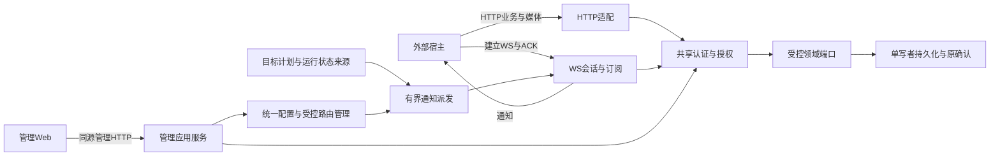

# Core外部通信重构与补全实施路径

**批准状态：完整方案及范围内工程实施已获用户批准。** 已采纳HTTP／WS分工、有限通知保障、三项审查修订、Web与配置、受控TLS代理、当前托管格式必要升级及连续完整交付。本文“推荐”表示已采纳选择；备选仅在明确条件满足时可用，范围外能力仍未批准。实际授权、阶段与停点只在[CURRENT_TASK](../work/CURRENT_TASK.md)维护；批准不代表已实现或验收。

本文维护跨模块通信协议、重构依赖、实施路径及验收设计；领域规则只在§3.1列出的所属正文维护。执行授权、实际基线和停点见[CURRENT_TASK](../work/CURRENT_TASK.md)，已验收能力见[STATUS](../work/STATUS.md)。遵守[协作分工](../../AGENTS.md)及[代码规范](../CODING_STANDARDS.md)，不使用子代理或自动转交其他会话。

快速定位：[已批准决定](#decisions) · [HTTP与媒体](#http) · [WS协议](#ws) · [通知路由](#notifications) · [Web页面](#web) · [参数与生效](#configuration) · [部署升级](#deployment) · [实施路径](#implementation) · [验收](#acceptance)。

<a id="scope"></a>

## 1. 交付目标与边界

完成一个外部宿主可以独立接入的闭环：管理员在Web注册宿主与入口、签发最小权限令牌、配置通知路由；宿主通过HTTP上传媒体、提交事件、查询和反馈，通过WS长连接接收Core主动提醒并确认；断线、撤销、专注、重启和升级时仍保持原业务事实与权限边界。交付同时包含接口说明、可运行客户端示例、配置页面和实际容器验证。

推荐分工：**HTTP承载业务请求、媒体及管理；WS承载宿主通知、订阅控制和接收确认。** 第一版不实现WS业务RPC，不把媒体大文件塞进通知连接。HTTP与WS调用同一应用服务、身份与领域端口；未来增加WS命令时复用它们，不建立第二套业务语义。

本方案交付范围：

- 修复宿主API、管理员目标操作及提醒调度中的可信路由装配。
- 补全HTTP媒体上传／确认及授权能力发现，保留现有业务接口兼容性。
- 采用受维护的HTTP／WS协议实现替换生产入口的手写协议解析，重构连接与业务资源生命周期。
- 新增宿主WS接入、目标提醒、联调探针及运行模式变化提示，不代替外部执行目标。
- 完成Web“外部连接”配置、宿主注册与权限、通知路由、连接观察、联调与目标页面联动。
- 交付默认回环部署和可选受控HTTPS／WSS反向代理部署包、明确版本升级路径及容量验证。
- 按[实施依赖顺序](#implementation)连续完成全部工作包、自查及范围内修复，最终统一交付监督技术验收；不设置中途阶段验收等待。

范围外：任意URL Webhook、Core主动拨号到任意宿主、邮件／聊天平台发送、Provider故障／恢复主动告警（后续候选，见[§7.2](#notifications)）、WS业务RPC、永久通知重放／死信队列、离线必达、集群／多应用worker、跨宿主状态自动仲裁、任意试验库迁移、音视频质量解禁、模型质量优化。WS连接由宿主发起，Core主动通信指沿已认证连接推送；不能向尚未连接的宿主推送。部署包验收不等于正式公网切换授权。

<a id="baseline"></a>

## 2. 静态基线与具体缺口

规划依据为`main@71e9a122f67e06c4f8ce478862d5315f840ebd34`。以下是源码／现行正文的静态核对，未运行复现；实施时应先转为定点失败用例，再核对是否仍存在。不把既往工程验收外推为这些新增能力已具备。

| 现状及证据 | 实施影响 |
| --- | --- |
| [ManagedHostHTTP](../../companion_memory/management/managed_host_http.py)已有受令牌限制的接收、召回、反馈、状态／目标及原键确认；外层全部为POST，封套为`entry_id`与`input` | 保留现有真实协议；[request-paths](request-paths.md)及旧本地HTTP的GET示例不能充当托管接口规范 |
| 同文件构造`HostIdentity`时`route_ids=()`；[ManagedOperations.identity](../../companion_memory/management/managed_operations.py)亦为空；[GoalsService._terms](../../companion_memory/goals/service.py)要求非空deadline配有授权route | 带截止时间的目标创建／期限修改不能通过这些路径完整工作；需要同时修复宿主与Web管理 |
| [InformationScheduler](../../companion_memory/information/scheduling.py)初始路由为空，仅有测试路由绑定；[提醒派发](../../companion_memory/information/reminders.py)仅连接[TestReminderRoute](../../companion_memory/goals/loopback.py) | 不能只修HTTP入参；调度、计划、权限和实际连接必须贯通 |
| [ReminderDispatcher](../../companion_memory/information/reminders.py)每轮只取到期页首条，其路由未绑定时直接拒绝，计划保持待发，下一轮仍取同一条；[提醒参数](../../companion_memory/configuration/information_schema.py)为单worker、单次1000ms／总计2500ms，按本机回环测试设定 | 一个离线路由会阻塞全部路由的到期提醒；WS模式需按路由选取、有界并发，并另定远端ACK时序（见[§3](#decisions)、[§7.3](#delivery)） |
| [目标精确合并](../../companion_memory/goals/semantic_merge.py)把route_id计入结构签名 | 改路由会改变合并关系，路由变更规则须说明（见[§7.1](#notifications)） |
| [MediaUploadPort](../../companion_memory/media/service.py)已有begin／append／finish／resolve，公开宿主路由未暴露 | 补HTTP适配及授权，不重写文件发布、引用和GC；append返回易失进度，不得包装成原件已持久化 |
| [ManagedHTTP](../../companion_memory/management/managed_http.py)手写HTTP/1.1、请求后关闭连接，只接受有限JSON协议，未装配WS／TLS | 替换网络解析层并保留安全及提交语义；不能在现有解析器上仅补Upgrade字符串 |
| [ManagedApplication.dispatch](../../companion_memory/management/managed_application.py)使普通宿主与管理操作在整个请求期间串行持有控制锁及身份交付锁；[宿主端口表](../../companion_memory/management/managed_host_http.py)和管理员端口的空闲轮换依赖这一串行 | 锁拆分是WS与提醒并发的前置条件：发送末端检查若沿用整请求持有的锁，会排在任意HTTP请求之后并耗尽提醒时限。须先列出锁与不变量（[§4](#architecture)），把端口缓存改为并发安全；单SQLite写者及有界领域准入保持，不能把删锁当并发优化 |
| [部署解析](../../companion_memory/configuration/deployment.py)要求origin显式带端口且等于内部监听端口；[ManagedHTTP](../../companion_memory/management/managed_http.py)要求Host头与origin的netloc逐字相等；[Compose](../../compose.yaml)默认仅发布回环HTTP | 反向代理外部443与内部8080需要拆分；浏览器对默认端口省略`:443`，逐字比较必然失败，须规定规范化；现有`https`字符串不代表监听器已提供TLS |
| [IdentityAuthority.create_token](../../companion_memory/management/identity.py)只校验标识格式，host／entry是否已登记要到请求时才核验；托管管理面没有追加宿主／入口的接口，初始化向导只登记一组绑定 | 多宿主注册是新增管理能力；签发时即核验绑定，不能签发出实际无绑定的令牌 |
| [Web宿主接入页](../../web/src/app.ts)只支持单个操作选项及手填身份，没有路由、WS连接、通知观察与联调 | 改为完整接入工作流，权限多选；已登记身份由受控列表选择 |
| 仓库未提供正式OpenAPI、WS消息Schema及面向外部调用的完整示例 | 作为交付产物验收，不能要求接入者阅读内部测试才能集成 |

<a id="decisions"></a>

## 3. 集中已批准决定

以下完整推荐已获采纳，包括后续审查修订。普通工程选型、首档内类型／数值、必要依赖与锁文件可由执行者连续处理；执行事实与当前可进入的交付段以CURRENT_TASK为准。

| 已批准决定 | 采纳选择及唯一正文 | 主要取舍 |
| --- | --- | --- |
| 通信分工 | 保留HTTP业务入口，新增宿主WS通知通道 | 第一版不提供WS业务RPC，减少恢复语义重复 |
| 首批通知 | 目标临近／到期与显式联调探针，有投递记录和ACK；运行模式变化只作无记录、无ACK的“请重新查询”提示 | Provider故障／恢复告警移到后续候选；不推送记忆正文、完整目标、模型内容或审计；不先扩成通用事件总线 |
| 离线与未知结果 | 不承诺离线必达，UNKNOWN不重发；到期计划按[宽限计时与恢复](#grace)持久保存有限等待窗口，结束仍未登记尝试才终结为未发送 | 宽限只作用于从未登记尝试的计划；专注／维护保留剩余时间，意外重启不重置；已登记尝试沿用原规则，不补发已终结计划或历史通知 |
| WS提醒时序与并发 | 采用[已批准通信参数](configuration.md#external-communication-configuration)及[WS发送契约](local-information-feedback.md#ws-delivery)，按路由轮转且有限并发 | 替换按本机回环设定的1秒／2.5秒和单worker；超时仍记UNKNOWN，迟到ACK不结案；关闭排空与代理空闲时限覆盖总时限 |
| 路由归属 | 管理员注册稳定宿主／入口与逻辑通知路由；每路由最多一个有效消费者；同一宿主身份可显式按路由接管，其他身份的第二连接拒绝，见[订阅规则](#ws) | 不广播目标提醒；仅处置被接管路由的订阅与尝试，不连带关闭其他路由；原尝试不转给新连接；接管频率有界 |
| Web管理 | 新增“外部连接”，整合现有宿主接入与令牌，增加宿主注册、路由、连接、联调和生效状态 | 管理会话不自动成为宿主订阅身份；测试能力单独限制；外部地址与代理来源只读 |
| 网络与服务器 | 受维护协议实现＋薄适配层，单应用进程；首选h11／wsproto接现有asyncio监听器，ASGI组合（如Starlette＋Uvicorn）为备选；默认回环，增加受控TLS代理交付 | 首选方案保留同步首写控制并直接执行限额；备选须在第0步证明首写保证、限额及信号生命周期后才可采用。不开放无认证公网入口，不增加多worker或集群；具体依赖版本执行时核实锁定 |
| 外部地址与代理信任 | 外部origin、可信代理来源、内部bind／port均为部署参数，受控重启生效；Origin按协议／主机／有效端口完整比较，Host单独校验，见[地址规则](#configuration) | Web会话不能改变Origin／Host边界，避免管理会话扩权和改错地址后失联；改地址需部署方操作 |
| 存量兼容 | 保留HTTP旧协议；第0步先确认新记录能否作为现有托管存储的兼容扩展；必须新格式时，只支持从当前已提交托管格式显式升级，保留全部业务数据 | 必要新格式路径已授权继续实现，仅从当前托管格式出发；不迁移历次试验库 |
| 交付节奏 | 按步骤0–7的技术依赖连续实施，阶段自查作为过程证据，全部完成后统一交付 | 用户已取消停点A及后续阶段验收等待；继续完成剩余能力并处理范围内问题，不减少测试、证据或最终验收要求 |
| 验收范围 | Docker Linux arm64、真实HTTP／WS／代理／浏览器、合成业务与模拟模型、限定负载档 | 不需要为通信验证恢复旧真实模型停止包；实际生产切换单独授权；遗留的并行ADMISSION_BUSY须在并发验证中定位或如实保留为限制 |

宽限、按路由选取、远端ACK时序及接管已作为新WS模式的明确行为批准，并落入[提醒契约](local-information-feedback.md#ws-reminders)；DISABLED与TEST_HTTP原语义和旧格式闭集保持。

### 3.1 已批准规则的唯一维护位置

各正文按下表分工维护；本文件保留原章节锚点作导航，不复制已经迁移的细则。执行者按当前主题读取相关正文，不能以代码现状或旧格式限制覆盖新通信装配的明确增量。

| 所属正文 | 维护内容 |
| --- | --- |
| [通信配置](configuration.md#external-communication-configuration) | WS生产模式、完整小档向量、Schema、容量和配置来源；旧Information格式闭集不变 |
| [目标路由与WS发送](local-information-feedback.md#ws-reminders)、[宽限](local-information-feedback.md#ws-grace) | 三条目标写路径、计划与发送事实、计时和持久恢复；[运行模块](../modules/runtime.md#communication-gate-clock)维护门控交接所有权 |
| [管理身份](managed-runtime-and-deployment.md#communication-identity)、[Web页面](managed-runtime-and-deployment.md#external-connections) | 宿主注册、路由／权限、页面和用户路径；产品范围见[管理行为](../product/operations-and-management.md#external-connections) |
| [宿主媒体上传](formal-memory-source-media.md#host-media-upload)、[接入模块](../modules/ingress.md#external-communication) | 上传／inspect、权限与原确认，保留原件发布、引用和GC保障 |
| [配置激活](managed-runtime-and-deployment.md#configuration)、[通信事务](persistence-and-transactions.md#communication-transactions) | 实际消费者、排空、原键确认、门控计时与切换事实 |
| [地址校验](managed-runtime-and-deployment.md#external-origin)、[部署升级](managed-runtime-and-deployment.md#communication-deployment) | Origin／Host、TLS代理、生命周期及当前托管格式升级／回退 |
| [所有权](ownership.md#external-communication-ownership)、[接口导航](request-paths.md#source-line-980) | 管理／运行／goals／media／通信适配的职责；正式HTTP与WS协议仍由本文§5–6维护 |

<a id="architecture"></a>

## 4. 结构与重构边界



责任划分唯一见[外部通信所有权](ownership.md#external-communication-ownership)；以下只规定传输与应用的组合关系。

重构时先抽出传输无关的鉴权、操作映射及结果投影，再替换生产监听器。首选在现有asyncio监听器上使用受维护的无I/O协议库：h11处理HTTP/1.1，wsproto处理WS。连接读写仍由本项目持有，首次写出可以在原子边界内同步开始，消息、分片及队列上限直接由本项目执行。备选为Starlette＋Uvicorn等ASGI组合。协议层只负责传输，不让框架自动JSON转换放宽现有精确类型、封闭字段、重复键拒绝或整数范围。依赖需在Linux arm64镜像中锁定验证，不采用开发服务器模式或自动reload。

第0步用定点验证比较三项：末端检查通过后能否同步开始写出、每项限额能否以实际拒绝证明、信号与生命周期能否接入原关闭流程。备选任一项不成立即采用首选。现有查询投递在[原子边界内的同步回调](../../companion_memory/management/managed_http.py)中直接写出，而ASGI发送接口是异步的，数据会先进入框架队列，这是备选的主要风险。

服务器参数必须由统一配置映射到实际执行限额的那一层。采用ASGI备选时，不同WS后端支持的消息大小、接收队列、心跳和压缩选项可能不同（见[Uvicorn设置说明](https://www.uvicorn.org/settings/)），不能仅写入一个未生效参数就宣称有界。无论采用哪种方案，都须以超限／慢接收的实际拒绝验证配置有效。

每个请求的时限从服务接收可处理请求开始贯穿排队、领域调用、投影及发送准入。客户端断线只终止交付，已经进入持久写或外部I/O的工作仍由原owner管理。服务器关闭／超时不得把原有`UNCONFIRMED`改成`NOT_COMMITTED`，也不得提前释放实际仍占用的槽位。

控制锁拆分是WS与提醒并发的前置条件，按被保护的事实进行。第1步交付实际锁清单，至少覆盖下表：

| 被保护事实 | 拆分后边界 |
| --- | --- |
| 身份撤销／过期与首次交付 | 权限revision加短原子末端检查，不在整个业务请求期间持有；WS发送等待该边界的时间计入提醒总时限，等不到按未开始发送处理 |
| 管理维护、配置切换、备份静止点 | 准入闸门：先停止新的HTTP／WS准入与新派发，再有界等待在途工作；普通请求之间不再互相串行 |
| 宿主端口表、管理员端口及其空闲轮换 | 改为并发安全的有界结构；轮换只回收确无在途后代的端口 |
| 领域准入、SQLite单写者 | 保持现有有界准入与唯一写者，不因拆锁放宽 |
| 连接、订阅与发送队列 | 每连接独立有界；网络发送和ACK等待不持有全局业务锁、权限锁或数据库事务 |
| 独立审计 | 保留现有独立路径 |

监听器的连接并发不等于SQLite或领域操作的吞吐资格。拆锁前后用同一并行组合复查上一阶段遗留的ADMISSION_BUSY，给出定位或明确保留为限制，不以复跑通过关闭。

迁移服务器前必须证明末端交付检查与首次写出之间没有可被撤销或专注插入的排队、await；不能把“调用发送接口之前鉴权过”当成首次交付时的权限保证。采用备选时尤其须证明这一点，不成立即改用首选方案，不在重构中自行降低保证。

<a id="http"></a>

## 5. HTTP能力补全与兼容

### 5.1 外部协议交付

保留既有`/api/host/*`实际POST协议和响应封套，不将旧测试监听器的GET接口无声替换为生产协议。为新增能力声明独立版本；旧调用方新增权限默认为空。先制作“路由—输入Schema—权限—模式—结果—原确认”闭合表，并生成／校验OpenAPI，与运行时共享可维护的Schema来源。

| 能力组 | 完成条件 |
| --- | --- |
| 事件接收／确认 | 文本与已READY媒体均可通过真实HTTP提交；超时保留原键；同内容不同外部事件仍是不同发生 |
| 回复准备／查询／深召回 | 完整分区、降级／修订／时限信息与原召回确认保持，专注期不绕过 |
| 使用反馈、状态、目标 | 原键及expected_revision保持；目标路由校验由可信注册派生，管理员路径同样修复 |
| 媒体上传／观察／确认 | 见下节；禁止自由文件路径、任意URL导入及原件静态目录暴露 |
| 能力发现 | 鉴权后返回该身份当前可用协议、入口、操作、通知类型、媒体限制及模式；不泄漏其他宿主或敏感配置 |
| 通知当前状态查询 | 宿主可读自己路由的当前可用性和最小投递结果；分页有界，不提供全库审计或历史正文 |

交付至少一份可运行Python宿主示例：读取外部注入的令牌→能力检查→媒体／事件接收→查询→使用反馈→创建有deadline的目标→WS接收／ACK→断线后原键确认／当前状态同步→进程重启后显式接管原路由。模型调用使用模拟参与者，示例不得在超时后自动生成新操作键重试写入。Web提供HTTP规范、WS消息Schema及脱敏接入示例的入口；不将管理文档维护交给执行者。

### 5.2 媒体原件上传

公开begin／chunk／finish／resolve／inspect的协议、授权、易失偏移及持久READY规则，唯一见[媒体宿主上传契约](formal-memory-source-media.md#host-media-upload)。按该契约交付HTTP适配、Schema与客户端示例。

<a id="ws"></a>

## 6. WS协议与连接生命周期

### 6.1 鉴权及订阅

推荐固定业务端点`/api/host/ws`和版本化子协议（名称为实施时冻结的协议常量）。非浏览器宿主在握手中携带Bearer令牌；服务器通过现有身份所有者认证，限制入口、路由及通知种类。路由号只是选择条件，不是凭据。禁止令牌放URL、日志或普通配置导出。

Web联调使用管理员通过受CSRF保护的HTTP申请的短时一次性测试票据；绑定指定路由与仅探针权限，WS首条认证消息消费票据。未认证连接不订阅、不发送业务内容，有独立数量／时间上限。普通管理员cookie不能直接打开宿主业务订阅；第一版不支持任意跨域浏览器宿主。浏览器握手严格检查Origin；无Origin的非浏览器客户端仍须Bearer鉴权，不将Origin作为身份证明。

连接握手成功与订阅成功分别表达。订阅取令牌权限、路由当前绑定、入口权限及事件类型交集；未知／越权条件整份拒绝，禁止静默订阅另一入口。

每路由最多一个当前消费者，禁止向多连接广播。路由已被占用时，只有同一宿主身份（host一致，且当前令牌持有该路由权限，含轮换后的新令牌）在订阅请求中显式声明接管，才可替换该路由的消费者。接管以路由为单位：先使旧连接对该路由的订阅及发送资格失效，原子撤回该路由尚未开始发送的队列项，再按原事实收尾尝试并确认新订阅；消费者代次检查与发送末端检查共用短原子边界。旧连接收到带route标识的“订阅已被接管”控制消息；半开连接无法收到说明不阻塞接管，也不能保留旧发送权。

只对被接管路由的尝试裁决：可证明未发送的记为NOT_SENT，可能已发送的记为UNKNOWN，均不转给新连接；未确认的持久裁决按原键续办，不能伪称已经收尾。旧连接上的其他路由订阅、队列项和ACK处理继续有效；仅当旧连接已无剩余订阅时才可按有界关闭流程关闭，实际I/O责任仍保留。持有A路由权限不授予断开B路由或改写其投递事实的权限。其他身份、测试票据或未声明接管的请求一律拒绝，并说明本路由占用状态；多路由请求逐项核验，任一越权整份拒绝且不产生部分接管。接管频率按路由有界，超限拒绝并提示实例争用。管理员显式断开整条连接仍是独立管理操作。

### 6.2 消息闭集与确认

| 方向／类型 | 内容与语义 |
| --- | --- |
| 服务端会话就绪 | 协议版本、连接标识、当前允许能力及心跳建议；不含凭据或内部资源路径 |
| 客户端订阅／取消订阅 | 请求标识、有限route集合及事件种类；返回明确成功或安全错误 |
| 服务端订阅变更 | route标识、原订阅标识及固定原因（如已被接管）；只撤销指定订阅，不表示整条连接关闭，不暴露其他连接的越权路由 |
| 服务端通知 | 协议版本、event类型、稳定delivery标识、route／对象revision、观察时间与各类受控最小负载 |
| 客户端接收ACK | delivery标识及固定接收状态，必须对应本连接／路由真实发出的尝试；不接受目标完成命令 |
| 服务端ACK确认 | ACK持久结果或待确认状态；不得将已读网络帧当作已持久确认 |
| 服务端错误／关闭说明 | 有限错误码、是否应重连、能力变更信息；不携带内部异常、正文或秘密 |

完整消息先按精确Schema及UTF-8编码长度检查，含外层封套、转义和元信息；拒绝重复JSON键、未知字段、未知版本、无效数字、超深嵌套及非预期二进制帧。首次默认关闭压缩，并限制分片重组后的总长度，不能仅限制单帧。

ACK只证明宿主声称收到，目标执行与完成仍走HTTP目标管理。ACK等待采用[§3](#decisions)的WS提醒时序：发送开始后的单次等待与整次尝试总时限都有界，超时按可能已发送保留UNKNOWN。Ping/Pong只证明连接活性；与ACK、持久接收和业务完成分开。ACK本地持久化结果不确定时保留原键续办；迟到／重复ACK不得启动重发或无依据改写终态。已持久UNKNOWN后是否允许后续证据结案属于额外契约，首版不开放人工或任意迟到ACK强制结案。

### 6.3 心跳、背压与恢复

心跳检测半开连接；客户端重连采用指数退避与随机扰动。宿主重启时不必等待旧半开连接超时，可按[§6.1](#ws)显式接管。连接重建只恢复认证／订阅和当前状态查询，不重放业务写或历史通知。令牌撤销／过期后关闭相关连接，发送前仍检查当前权限；续期通过新令牌重连，不把旧连接权限永久缓存。

连接、订阅、接收帧、发送队列及未完成投递均有界。慢客户端队列满后拒绝新派发并关闭／标记该连接，不丢弃队列项后伪称已发送；已可能发送的项目分别保留UNKNOWN。队列容量不是持久重放能力。传输完成前保留实际I/O占用，不能通过取消Python任务宣布底层已经结束。

专注期允许心跳、关闭及对先前已发送通知的受限原确认；停止新的业务提醒、探针和模式提示推送。宿主重连成功不表示召回可用。WS不得复制管理观察／独立审计权限，也不得利用“状态事件”推送被门控的业务正文。

<a id="notifications"></a>

## 7. 路由、通知与发送事实

### 7.1 注册和所有权

宿主／入口注册、逻辑路由、签发时绑定校验和默认候选归[管理身份契约](managed-runtime-and-deployment.md#communication-identity)；目标变更、合并关系及宿主／管理员／内部调度三条路径归[目标路由契约](local-information-feedback.md#ws-reminders)。不得由通信层维护第二份路由或目标真相。

### 7.2 首批事件与敏感边界

| 事件族（候选名称） | 触发与最小内容 | 接收资格 |
| --- | --- | --- |
| `goal.upcoming`／`goal.due` | 沿用目标计划时间、去重、被覆盖临近计划及专注跨期规则；负载为原目标意图及必要传输标识，不带正文 | 对应route、入口和目标读取资格；详情再经原查询端口获取 |
| `core.mode_changed`（提示） | 已确认的运行模式转换及观察时间，只表达“请重新查询当前可用性”；不建投递记录、不要求ACK，丢失后由宿主查询纠正 | 独立运行观察权限；专注期间不推送，恢复后给一次当前快照提示，不补发过程 |
| `connection.probe` | 管理员明确触发，随机探针标识、时间、固定合成文本；没有真实目标或模型调用 | 仅指定测试票据或明确获准接收探针的真实宿主 |

Provider故障／恢复主动告警不在首批。它需要持久故障阶段、计数checkpoint、阈值及独立告警权限，应另行批准后作为后续交付。首批期间运行故障仍通过现有受控观察和Web查看；WS连接的存在不改变Provider既有UNKNOWN隔离。

通知许可与模型新请求许可独立：建立WS／发送探针／启用提醒不自动开启模型，暂停模型也不自动关闭仍获授权的连接和目标提醒。通知本身不调用模型，仍受专注、维护与当前身份门控；不能为了发送通知而恢复已停止的Provider请求。

<a id="delivery"></a>

### 7.3 有限发送与断线裁决

发送登记、按路由公平选取、ACK／NOT_SENT／UNKNOWN、断线及禁用裁决唯一见[WS有限发送契约](local-information-feedback.md#ws-delivery)。本方案的消息协议与接管必须复用该账本和终态，不另建投递真相。

<a id="grace"></a>

### 7.4 宽限计时、专注与持久恢复

起算、专注／维护暂停、冻结时长、持久截止、过期优先及重启恢复唯一见[宽限计时契约](local-information-feedback.md#ws-grace)；模式事实的交接所有权见[运行模块](../modules/runtime.md#communication-gate-clock)。

<a id="web"></a>

## 8. Web配置与操作页面

页面分区、首次接入／修改设置／断线诊断三条路径、目标路由联动、联调票据、秘密与可访问性要求，唯一见[管理Web外部连接页面](managed-runtime-and-deployment.md#external-connections)。产品权限范围见[管理产品行为](../product/operations-and-management.md#external-connections)。按这些规则交付真实后端与浏览器闭环。

<a id="configuration"></a>

## 9. 参数、持久配置与生效机制

通信配置分层、完整小档向量、Schema、容量及版本绑定唯一见[通信配置正文](configuration.md#external-communication-configuration)；激活／排空／回退见[管理配置协议](managed-runtime-and-deployment.md#configuration)。

外部origin与内部绑定分离、Origin三字段比较、Host独立校验和可信代理来源唯一见[部署身份](managed-runtime-and-deployment.md#external-origin)。Web只读展示部署参数。

<a id="deployment"></a>

## 10. 部署、启动与版本兼容

本机／私网与TLS代理两档、单进程生命周期、健康与关闭、备份恢复及当前托管格式显式升级唯一见[通信部署与升级契约](managed-runtime-and-deployment.md#communication-deployment)。

本次完整实施授权包括必要的新格式路径：先核对兼容扩展，确需新格式则继续实现从当前已提交托管格式出发的显式升级；超出该源格式、数据范围或资源预算时只停止受影响部分。正式生产切换、推送与提交不在此次授权内。

<a id="implementation"></a>

## 11. 连续实施路径与完成门槛

以下是已批准的完整实施依赖顺序。用户已明确取消中途阶段验收等待：阶段自查完成后连续推进剩余工作，不因步骤0–2完成或历史停点A记录而等待监督结论、更新文档或再次转交。已完成工作及证据核对后复用，发现范围内问题连续修复；真实契约冲突只暂停受影响部分。全部能力、自查及必要验证完成后统一交付监督技术验收。执行者运行期间监督只读，文档更新在执行者停止后进行。

| 顺序 | 工作及主要改动范围 | 本步完成门槛 |
| --- | --- | --- |
| 0．契约与资源冻结 | 执行者按已更新的§3及所属正文静态核对基线，冻结实际路由／Schema／身份／存储变更（含宽限计时及门控交接／恢复），并按[§4](#architecture)三项检查冻结协议实现 | 无把DISABLED／TEST_HTTP旧闭集直接放宽的暗改；首选／备选协议实现的比较结论有定点证据；明确新记录能否兼容扩展，必须新格式时按已批准的当前托管格式路径继续实现；计时及交接记录的全份编码／装配容量可容纳，列出新安装和升级支持范围 |
| 1．传输与应用解耦 | `management/managed_http.py`、`managed_application.py`、`managed_host_http.py`、`managed_operations.py`、`runtime/managed_main.py`；抽出认证／操作／结果适配，替换网络监听器，按§4锁清单拆分控制锁及端口缓存 | 既有HTTP业务、管理、审计、引导、原确认、备份下载及关闭行为在新监听器上成立；首写保证有定点证据；管理长操作期间宿主查询不再被整请求串行阻塞；遗留ADMISSION_BUSY已定位或列为限制；先保持行为再增加WS |
| 2．身份、路由及目标修复 | ingress注册端口，management受控路由／权限及签发时绑定核验，`managed_operations.py`、`information/scheduling.py`、`information/reminders.py`按路由选取，goals改路由适配 | 宿主和管理员均可创建有deadline目标，离线路由合法但不可伪称送达；离线路由不阻塞其他路由的计划推进；改路由后的计划与合并关系正确；目标主体／来源及内部可信候选不降级 |
| 3．HTTP媒体与正式接口 | media上传端口适配、只读inspect端口、能力发现、OpenAPI及客户端示例 | 原件上传→READY→事件引用→查询形成外部闭环；同块重试／重启重传／越权／GC竞争语义明确 |
| 4．WS与通知 | 会话准入、认证／票据、按路由订阅与接管、背压、goals发送端口、WS提醒时序与宽限、门控计时交接及恢复、ACK、模式提示与探针 | 真实独立宿主收到通知并确认；接管不影响其他路由；宽限起算／暂停／恢复、UNKNOWN、撤销、取消和专注跨期符合规则；不接通任意回调地址 |
| 5．Web与配置激活 | 拆分现有单文件前端的相关视图／API适配，新增外部连接各页（含宿主登记）、目标路由选择、统一Schema／激活消费者；外部地址只读 | [Web正文](managed-runtime-and-deployment.md#external-connections)的三条用户路径在真实浏览器完成；所有开关和状态来自真实后端，权限不能只靠隐藏按钮 |
| 6．部署、兼容与负载 | Docker／Compose／代理（含Origin完整比较和Host独立校验）、锁文件、显式格式升级、运行资源、健康与关闭；必要关联回归 | 新安装、当前实例升级／失败恢复、真实WSS代理及并发资源档验证；旧未决事实不重发，不声称任意旧版可回退 |
| 7．集中交付 | 全量锁定Pyright、前端类型／构建、协议一致性、最终工程指纹与原始证据 | 矩阵有逐项证据、模拟／真实分列、失败保留、资源清理完成；交监督技术验收并停止 |

阶段估算以工作包为单位，不给未经环境核验的日历承诺。关键依赖为路由／身份先于通知，协议与容量先于Web完成，服务器生命周期先于并发验收。完成必要前置核对后直接实施WS和Web；页面原型可以提前，但静态表单不构成后端完成；不能交付单独WS回显服务就宣称Core通信已补全。

<a id="acceptance"></a>

## 12. 集中验收与证据

| 验收主题 | 必须覆盖的正常与失败场景 | 通过依据 |
| --- | --- | --- |
| HTTP旧调用兼容 | 旧POST封套、时间偏移、分页、降级、幂等冲突、原键确认、管理／审计入口、备份下载；首写与撤销／专注竞争；锁清单逐项及端口缓存并发 | 真实HTTP回归，与既有验收版本的同组断言对照；完整语义与既有回执不因监听器变化而改变，差异逐项说明 |
| 协议与权限 | 未认证／失效／撤销令牌、伪造host／entry／route、签发时未登记的绑定、重复字段、越界消息、未知版本、同主机跨HTTP／HTTPS协议、Origin默认／非默认端口、null／多Origin／重复Origin头、重复Host头、伪造代理头 | 默认端口等价形式通过，协议不同即拒绝；Host匹配不豁免Origin；无越权数据、业务写或通知，错误脱敏且资源有界 |
| 目标路由 | 宿主／管理员／可信内部候选，非空deadline、离线／禁用合法路由、越权路由、多候选默认、改路由后的计划与合并、修改／取消／合并竞争 | 目标与计划同事务保存；实际接收者唯一；不得仅证明“无deadline可创建” |
| 媒体接入 | 真文件上传、重复块／不同块、缺块、finish确认丢失、进程结束后重传、READY前引用、撤销与GC／备份竞争 | 字节／hash／引用及回执核对；易失偏移不冒充持久确认 |
| WS会话 | 非浏览器Bearer、Web一次性票据、未认证超时、订阅拒绝、异身份抢占、同宿主接管（含轮换令牌）、旧连接订阅A／B而新令牌仅有A权限、多路由接管部分越权、接管频率超限、旧连接半开、分片／大消息、慢接收 | 真实WS客户端与受控时序；接管A后B的订阅和连接存活，整份越权请求无部分接管；旧连接只有无剩余订阅时才按接管规则关闭；不只单元mock发送函数 |
| 发送与ACK | 未发送时断线、已可能发送无ACK、正确／伪造／重复／迟到ACK、ACK临近单次时限、ACK持久失败、队列满、接管时本路由及其他路由同时有在途尝试 | 仅被接管路由按事实记NOT_SENT／UNKNOWN；其他路由继续正常ACK；分别保留终态及实际清理，未知没有重发 |
| 调度公平与宽限 | 离线路由与其他路由并存、至少4路由同时到期、创建已过期目标、去重延迟、宽限内上线、恰在截止上线、尝试名额满、重复扫描／重连／接管／配置激活、UPCOMING被DUE覆盖、DISABLED原语义 | 起算点及冻结时长可核对；离线路由不阻塞其他路由，时延分布有记录；过期先裁决且上线不补发；已登记尝试不回到宽限 |
| 宽限持久恢复 | 初始化确认丢失、未暂停窗口内／到期后意外重启、暂停中重启、门控转换与计时交接各切点中断、重复原键确认 | 原起算点、绝对截止或暂停剩余时间保持；未暂停的停机时间计入窗口；交接未知零新派发，确认后只推进原计划，不重置为300秒 |
| 专注及撤销 | 起算前专注跨过到期且超过300秒、已消耗100秒后专注超过300秒、维护与专注重叠、暂停前已过期、UPCOMING暂停跨deadline；专注前后发送竞争、原接收／媒体、召回拒绝、ACK原确认、令牌过期／吊销、路由禁用 | 未起算DUE恢复后才启动窗口，已起算者只恢复剩余200秒；重叠门控不重复补时，过期不复活；UPCOMING覆盖且deadline不延期；末端检查控制交付，ACK无新业务动作 |
| 模式提示与探针 | 模式转换提示、专注抑制与恢复后快照、提示丢失后由查询纠正、探针全局限额、专注期拒绝新探针、票据越权 | 提示无投递记录、不触发重发；探针有独立记录，无模型调用或敏感正文 |
| Web配置闭环 | 宿主登记、权限多选、一次显示秘密、路由启停、真实联调、按路由接管记录与整连接断开预览、宽限待起算／计时／暂停／过期、目标关联、配置冲突／待确认／待重启、外部地址只读 | 真实浏览器结果与对应后端事实；刷新不重置计时、接管不误报其他路由断开；窄屏、键盘、重复提交覆盖 |
| 备份升级与恢复 | 旧托管数据＋目标／媒体＋UNKNOWN，升级各切点中断、不兼容拒绝、新数据写后代码回退限制、备份恢复 | 新进程核对原身份及业务对象；无恢复socket、票据或重放发送 |
| TLS代理和生命周期 | 外部443／内部8080，默认端口省略／显式两种形式、非默认外部端口、同主机HTTP来源被HTTPS配置拒绝、代理改写Host被拒、真实握手、可信转发、代理重启、空闲超时、SIGTERM／强制结束、健康只读 | 实际镜像／证书／代理版本及命令；Host与Origin分别校验，不从内部端口推断外部来源；回环成功不代表WSS成功；旧部署值实例仍可重启 |
| 有界负载与公平性 | 连接满载、过量连接、慢客户端、HTTP查询／接收／上传竞争、管理长操作期间的宿主查询与提醒时延、独立审计；拆锁前后同组合的ADMISSION_BUSY复查 | 延迟／错误／准入拒绝分布、峰值资源、队列／槽位归还；不能只报平均值或重跑成功 |

推荐负载资格：在明确CPU／内存／存储环境中，按[通信小档](configuration.md#external-communication-configuration)的16条WS连接、至少一个慢消费者、至少4个路由同时到期及现有HTTP／媒体上限进行30分钟混合运行，另做连接数与队列上限之外的拒绝试验。收集基础查询p50／p95／p99、1秒完整响应成功比例、降级／拒绝／超时比例、提醒ACK时延、进程RSS／文件描述符／任务数及清理占用。现行响应时限与领域准入规则不放宽；实际吞吐只按记录的请求率声明，30分钟测试不称长期生产稳定性。

执行环境和通用验证规则只引用[代码规范](../CODING_STANDARDS.md#validation-environment)。最后锁定全量Pyright覆盖源码、测试及所有新增受维护目录；前端执行实际类型／构建检查。协议Schema、示例和实际路由做一致性检查，必要客户端资源纳入维护范围。模拟模型和真实网络分别表述，真实供应商调用默认0；通信测试不需要复活旧停止包。

交付以最终消息、自有临时目录原始日志及JSON索引提供：基线／最终文件SHA、变更清单、逐项断言—命令—退出码—版本映射、镜像及依赖、实际请求／发送／ACK计数、故障注入点、浏览器记录、资源清理和限制。监督只做静态及证据核对，未运行不写通过；STATUS仅在技术验收节点更新。

<a id="execution"></a>

## 13. 连续完成执行prompt

以下用于在已有工程与证据上连续完成全部补全。当前工程位置、文档来源和原交付记录见CURRENT_TASK；旧停点记录只保留历史含义，不作为继续实施的前置。

```text
继续在现有工程worktree中完整实现Core外部通信计划，不重建工作区、不重复从空基线开发。用户已取消停点A及后续所有阶段验收等待；不再以阶段自查完成、旧manifest的STOP_A、等待监督结论或再次转交为停止理由。全部实现、自查、必要验证和范围内修复完成后，一次交付最终监督技术验收。

先核对CURRENT_TASK所列工程worktree、最新文档根目录和交付证据。最新规范从主仓库读取，工程改动继续留在原worktree；其旧文档快照里的阶段停点要求不再适用，执行者不要修改或同步docs。保留全部现有工程和文档差异，不暂存、提交、推送或合并。

读取最新AGENTS、INDEX、CURRENT_TASK、STATUS、完整CODING_STANDARDS及本通信方案，再按§3.1读取所属正文。已有步骤0–2的实现和自查作为续做基础，核对文件版本后复用有效证据；这不表示监督已验收，后续发现的范围内问题仍需修复。

连续完成步骤3–7及前置关联修复：HTTP媒体begin／chunk／finish／resolve／inspect、能力发现、OpenAPI／WS Schema及可运行客户端；正式WS认证／订阅／按路由接管／心跳／背压／ACK；goals宽限、门控交接、持久恢复和有限发送；模式提示及受控探针；Web全部页面、三条用户路径和配置激活；受控TLS代理、当前托管格式显式升级／失败恢复／备份兼容、生命周期与限定负载验证。

必要源码、测试／夹具、运行资源、前端、协议资源／示例、容器／代理、依赖和锁文件均在原授权内。普通工程选型、Schema及首个资源档内选择连续处理。新格式目前仅验证新装配，必须补齐旧托管实例的显式升级；不得用新建空库替代，也不能用旧备份覆盖新数据冒充无损回退。

保留Origin三字段比较及Host独立校验、按路由接管不影响其他订阅、持久宽限起算／暂停／恢复、UNKNOWN不重发、末端权限与首次写出原子边界、真实I/O占用、原键确认和配置冻结引用。模型／日志／配置沿唯一所有者；不增加WS业务RPC、任意Webhook、主动拨号、永久重放、离线必达、多worker或Provider主动告警。

验证统一使用一个Docker Linux arm64环境，按最新方案完整矩阵完成实际HTTP／WS客户端、WSS代理、真实浏览器、恢复切点、旧HTTP与审计回归、升级／回退及30分钟限定混合负载。最终执行锁定全量Pyright、前端类型检查和构建；受变化影响的旧验证重新执行，复用证据必须绑定对应版本。真实供应商请求保持0。

ADMISSION_BUSY和后台争用仍是未排除限制。协议隔离用例停用后台定时器的结果不能替代真实调度运行时的并发／负载验证；最终须保留正常后台调度，报告实际请求率、资源限制、延迟、拒绝与清理。发现影响批准能力的范围内缺陷连续修复，不能以复跑通过消除历史失败或宣称根因已修复。

执行者不改AGENTS或docs，不写项目计划／报告，不用子代理、其他会话或自动消息；监督在执行期间只读。仅真实契约冲突、合法容量不成立或范围外迁移／外发目的地阻塞受影响部分，给出证据及最小建议并继续独立工作，不降低保证。

完成全部计划后，以最终消息、自有临时目录原始日志和JSON清单交付最终文件指纹、全部变更、断言与命令／退出码／版本映射、镜像依赖、HTTP／WS发送和ACK核账、浏览器证据、安装／升级／回退限制、资源清理、失败及未验证项。此时停止于最终监督验收，不自行提交、推送、合并、生产部署或开展下一项计划。
```

<a id="references"></a>

## 14. 官方技术依据

技术资料仅用于方案选择，不授予产品或资源权限。实现时核实选定版本及兼容，不以“最新”替代锁文件。

- [RFC 6455](https://www.rfc-editor.org/rfc/rfc6455.html)定义WS握手、双向帧、控制帧和异常关闭；业务ACK、幂等与离线投递属于本项目应用协议，不能从WS传输推导。
- [ASGI HTTP／WebSocket规范](https://asgi.readthedocs.io/en/latest/specs/www.html)仅在采用备选时用于审查发送、断开、连接scope及生命周期适配；需用实际服务器验证与原owner的资源责任衔接。
- [h11](https://h11.readthedocs.io/)与[wsproto](https://python-hyper.org/projects/wsproto/)是首选的无I/O协议实现资料；[Starlette WebSocket端口](https://www.starlette.io/websockets/)与[Uvicorn设置](https://www.uvicorn.org/settings/)是备选ASGI资料。具体版本、限额和信号行为均在锁定版本上验证。
- [NGINX WS代理](https://nginx.org/en/docs/http/websocket.html)说明代理Upgrade和超时配置；部署包须验证实际WSS，而非仅验证应用内WS。
- [OpenAPI 3.1.1规范](https://spec.openapis.org/oas/v3.1.1.html)作为可选HTTP说明格式；它不代替独立WS消息Schema、发送确认及重连语义。协议版本由交付冻结，不要求追随规范最新版本。
