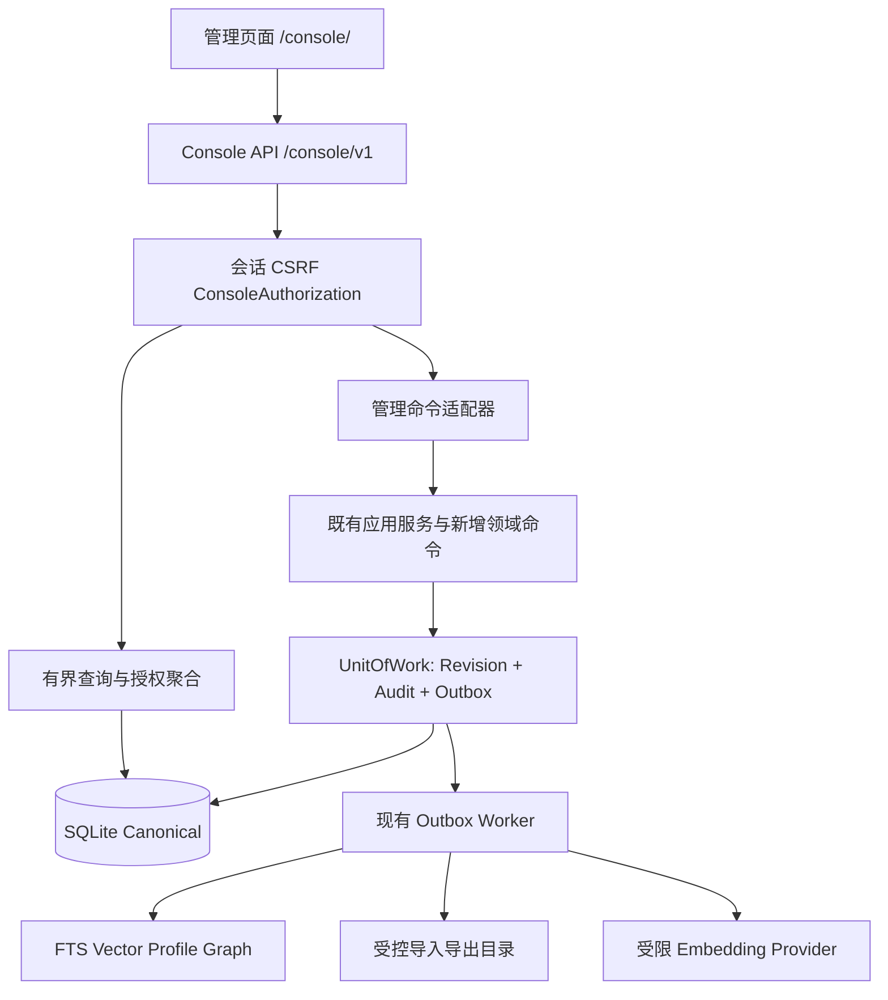
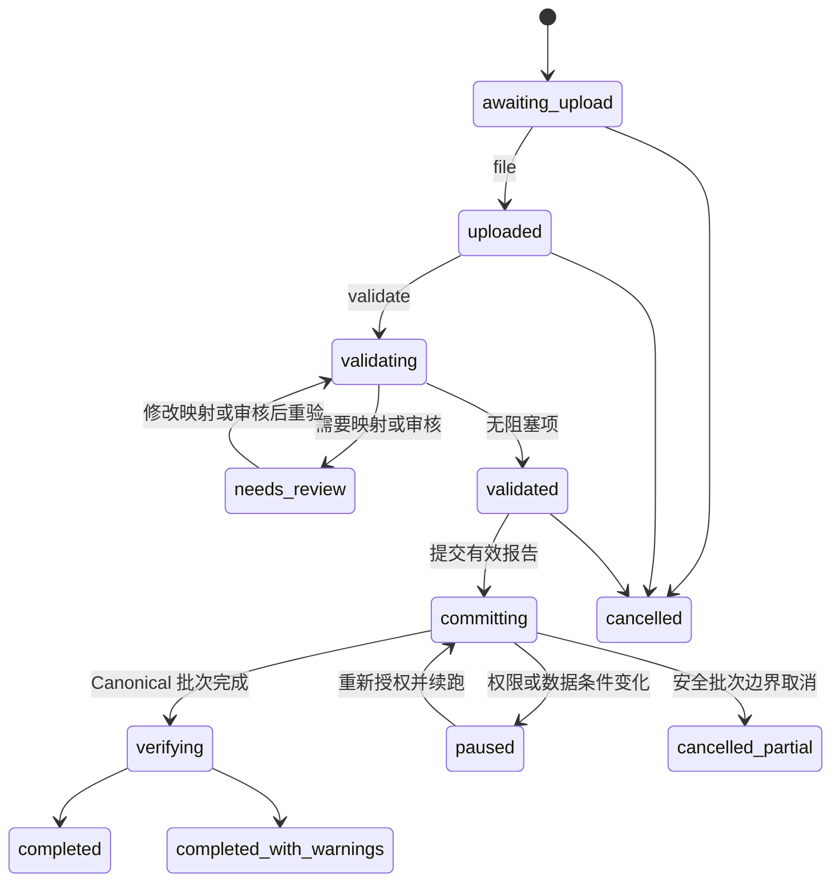
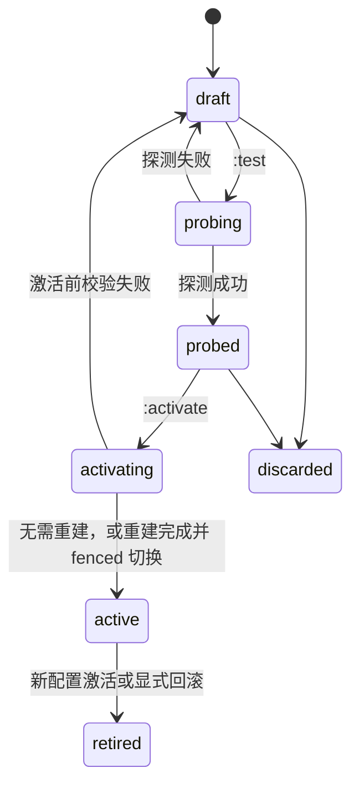

# Console 设计与前后端接入边界

> 核查日期：2026-09-06；Phase 13 仍为 In progress。本文合并原后端设计与前端对接说明；接口的当前真源是 [Console OpenAPI](../../schemas/openapi/console.json)。  
> 阶段和验收：[Phase 13](../development/phase-13-web-console.md) · [合并验证记录](../reports/phase-13-verification.md)；决策：[ADR-0022](../adr/0022-management-console-plane.md)。  
> 前端启动：[工程 README](../../web/console/README.md)；逐功能差距：[对接矩阵](../../web/console/INTEGRATION_MATRIX.md)。

## 1. 范围与现状

Console 在 `/console/v1` 提供独立管理平面，最终范围包括密钥、记忆管理、统计、手动数据导入导出、Embedding Provider 与运行参数。手动导入取代自动源库迁移的决策和保留的数据安全要求见 ADR-0022；导入功能本身尚未实现。

| 范围 | 当前工作区事实 | 尚未完成 |
| --- | --- | --- |
| 契约、启用、静态托管、认证与两类密钥 | Console 默认关闭；最新回归见 [Phase 14 报告](../reports/phase-14-verification.md) | 生产 TLS/代理验收 |
| 授权与读面 | 资源、lookup、Task 子资源和 Persona 读面；路径以生成契约为准；ADR-0023 已修复非 UUID 冲突，专项回归通过 | 生产规模与完整权限/容量门禁 |
| React 前端 | 生成类型与正式 descriptor 已对齐；真实 Note 列表/详情/历史、认证及密钥流程通过浏览器验证 | 其余业务页仍仅有模拟验证 |
| 管理写入 | ADR-0025 执行器、State 创建/更正/过期、Note 与 Focus 创建/编辑/状态转换、Focus 激活及 Task 主资源/步骤/依赖/触发器管理已接通，复用领域事务与严格契约 | 其他资源写入和 Forget 尚待实施 |
| 固定筛选与批量 Forget Operation | ADR-0042、Schema 20 已整合：1–500 固定根、每批 50、实际授权/fence、进度/问题分页/取消及恢复阻塞；当前组合验收中 | 完整 CI 与安装证据待补；其他 Operation 类型未实现 |
| 统计、导入导出、Provider、Settings、其他运维 | 本文保留目标语义，前端只有设计适配与模拟验证 | 真实领域接线与发布门禁 |
| 版本与迁移 | Schema 20 / Python 0.13.0 / `/v1` Contract 1.10.0 / Console Contract 1.1.0 | 已有库须按 ADR-0026 离线备份升级；完整发布门禁不能引用旧 Schema 的结果替代 |

§2–4 说明公共边界及已实现认证；§5 的 memory/lookup、Task 子资源与 Persona GET 已接线并通过读面专项验证，保留/Hold 及写动作仍为目标；§6–10 与 §11 的其他运维动作仍是目标规格；批量 Forget Operation 的当前实现以 ADR-0042 为准。文中的未来接口、表和设计上限不能作为部署现状。实施次序与退出门禁只在阶段文档维护。

bootstrap 当前根据权限发布 `keys`、`service_credentials`，并在 `memory.read` 与 `console.manage` Purpose 同时满足时发布 `memory`。其中 `pending_restart=false`、`import_in_progress=false` 是当前固定返回值，不能据此认为 Settings/导入已经接线。

## 2. 分层、部署与契约



### 2.1 路由与启动

- 新 API 前缀 `/console/v1`；静态入口 `/console/`；SPA fallback 只匹配静态页面，不能吞掉 `/console/v1/*` 的 404。
- Console 默认关闭。已增加 `serve --enable-console --console-assets DIR`；可选 `--console-bind 127.0.0.1:8766` 单独监听。独立监听仍在服务进程生命周期内托管，两侧共享 Store 与配置快照。
- 非回环部署必须经 HTTPS；可信反向代理地址、外部 Origin、允许的 Host、上传限额由部署配置显式给出。仅信任声明过的代理转发头。
- 开发时推荐前端开发服务器代理 `/console/v1` 到本机后端，保持浏览器同源。第一版不开放跨源 Cookie/CORS。
- 本机明文开发须显式 `console_dev_http=true`，仅允许回环监听与回环 Host；使用不同名称的开发 Cookie。反向代理和生产不得启用该选项。
- API、鉴权响应和下载均 `Cache-Control: no-store`；静态带内容哈希文件可长期缓存。响应含 `nosniff`、`Referrer-Policy: no-referrer`、禁止 iframe 嵌入的 CSP。CSP 允许同源脚本与连接，禁止内联脚本、对象和任意外部资源；HTTPS 部署提供 HSTS。

### 2.2 唯一写路径

Console 的业务写入必须进入同一组应用服务及 UnitOfWork，事务包含授权复核、CAS、Revision、Current Pointer、Watermark、Audit、Outbox 和导入账本。不得在路由中执行领域表 INSERT/UPDATE，也不得为批量任务复制一套领域校验。

已实施的管理执行器与 Note 写面使用内部 `CommandActor`，携带 `origin=console|manual_import`、运营密钥 ID、租户、授权快照版本及经过校验的操作范围；只能由服务端构造。Note 写服务通过内部共享事务执行器接收它；`manual_import` 来源保留给后续导入执行器，当前不能使用。`/v1` 继续使用原来的宿主入口，客户端不能在 Payload 中指定该来源。

管理编辑不冒充在线宿主、不借用活动 Lease。新增明确的管理命令分支只跳过“宿主正在产生外部效果”所需的 Surface Lease 校验；Scope、Privacy、Evidence、Revision、保护策略全部保留。管理端不提供发送消息、报告 Usage 或伪造 CognitiveEvent ACK 的动作。不能通过 `surface=None` 临时装配绕过所有校验。

### 2.3 独立生成契约

已新增以下生成链。真源随纵向切片扩展；当前包含 `/bootstrap`、认证、运营密钥、宿主服务凭据及第 3 步读路由。路径存在不等于该切片通过验收，其余接口表仍是后续规格：

```text
contracts/source/console.json
  → schemas/openapi/console.json
  → schemas/jsonschema/console/*.schema.json
  → schemas/fixtures/console/{valid,invalid,forward}/*
  → schemas/compatibility/console-baseline-v1.json
```

Console 契约起始 `1.0.0`，其版本由 `GET /console/v1/bootstrap` 返回。复用已发布领域 Schema 时通过生成阶段内联或显式映射，不要求浏览器解析跨文件引用。Console 的新增权限与 `details.kind` 在独立契约内定义，不往宿主 Capability 清单塞浏览器概念。

冻结的 `/v1` 路由、错误语义和默认 Payload 不因 Console 改变；底层修复仍须通过它原有的回归与兼容门禁。本文接口表中尚未进入 Console 真源的路径仍是待实施规格；每个切片先生成契约和 Fixture，再开始路由实现。

## 3. 密钥、会话与授权

### 3.1 两类密钥隔离

| 类别 | 存储与入口 | 用途 |
| --- | --- | --- |
| 运营密钥 | 新 `console_operator_keys`，仅 `/console/v1/auth/login` 接受 | 人类登录与 Console 授权 |
| 宿主服务凭据 | 现有 `service_credentials`，仅原 `/v1` Bearer 入口接受 | Bellis/AstrBot 等应用接入 |

两类明文均由服务端 CSPRNG 生成至少 32 随机字节，以不同前缀编码；前缀和公开 key ID 只用于识别，不增加熵。不允许用户自行设置密钥，不使用可猜测默认值。随机密钥存 SHA-256 摘要并常量时间比较；明文只在签发响应显示一次，不能查询或导出。

不把运营密钥写进 `service_credentials`，也不接受既有 management Bearer 登录 Console，从结构上防止有限权限的 Console 密钥绕到 `/v1/admin` 获得旧式租户特权。浏览器会话 token 同样不是 `/v1` Bearer。

第一把 Owner 密钥只由本机离线命令签发，`iris-memory-core console key issue --database DB --tenant TENANT --role owner --label OWNER --can-delegate`。命令读取已存在的租户，未存在时先走独立的离线 Provisioning；Web 不提供匿名 bootstrap、默认 root 密钥或创建租户入口。恢复使用相同离线管理通道，写审计并可吊销全部会话，不能编辑数据库跳过授权。

### 3.2 授权模型

运营密钥保存不可变 Grant：`permissions`、`agent_selector`、`space_group_selector`、`space_selector`、`session_selector`、`subject_entity_ids`、`custom_privacy_labels`、`allow_restricted`、`data_purposes`。各 selector 为显式 `{mode:"all"}` 或 `{mode:"ids",ids:[...]}`；空列表表示无授权，绝不表示全部。它们属于 Console 授权域，不改变现有 Scope null 语义。

权限使用动作命名，例如 `memory.read`、`memory.write`、`memory.forget`、`persona.publish`、`keys.manage`、`service_keys.manage`、`stats.read`、`system.read`、`imports.write`、`exports.write`、`providers.manage`、`settings.write`、`indexes.rebuild`、`audit.read`、`retention.manage`。实现时由 Console 真源完整列举，服务端返回当前可用权限；前端不能自行据角色名放行。

| 签发模板 | 初始授权用途 | 默认不给予 |
| --- | --- | --- |
| owner | 租户管理、签发、全部 Console 功能；首把离线签发 | 跨租户、绕过 Legal Hold、伪造事实来源 |
| maintainer | 记忆编辑、统计、导入导出、重建 | 签发密钥、Provider Secret、发布 Persona、全局部署设置 |
| viewer | 指定范围内的读取与统计 | 写入、导出、私密主体同意权 |

模板只在创建时展开成权限集合，不是会动态扩权的角色绑定。Owner 身份也不能隐含获得 `entity:*:private` 的同意；主体同意与自定义标签由离线授权或现有可证明授权流程授予。对 restricted 数据需显式 Grant。

每次请求依次执行：有效会话 → 密钥有效性 → 动作权限 → 租户 → 显式维度选择器 → Purpose/Privacy/主体同意 → 资源与引用状态。所有子对象、来源 Evidence、导入候选、统计、历史、下载都执行同样范围限制。

按过滤器跨 Scope 列表是管理读语义：先按授权集合与过滤器求交，再为候选行构造其完整上下文并评估隐私；不把省略的 `space_id` 传进业务 Recall 当通配符。分页与总数必须在可见集合上计算。按 ID 请求不可见对象统一 404；缺少某项页面操作权限返回 403，不能因“已登录管理端”就披露别的 Agent 的 ID 或数量。

密钥签发不能超出签发者权限、范围、有效期与可委托的同意权。授予 Owner 要求调用者自身为 Owner 且有委托权。Grant 变更必须签新密钥；PATCH 只改名称、说明、缩短过期时间。最后一把未过期 Owner 不能被 Web 吊销、缩短至失效或轮换丢失，必须事务内验证可恢复的继任者（有效且具有委托权、`keys.manage`，其 Grant 覆盖被替代密钥）；全锁定恢复走离线命令。

### 3.3 会话生命周期

1. `POST /auth/login` 只接受 JSON 密钥和正确的同源 `Origin`、`Content-Type`、`X-IMC-Console: 1`；不接受查询串、表单登录和 URL token。已有会话重新登录时使旧会话失效。
2. 成功后签发随机不透明会话，设置生产 Cookie `__Secure-imc_console`：`HttpOnly; Secure; SameSite=Strict; Path=/console`，无 Domain。服务器只存 token 摘要。Console 独立认证主密钥保存在数据库同目录的 `console-auth.key`（32 字节、0600、原子首次创建），以不同派生用途分别服务 CSRF、地址摘要、cursor 与刷新缓存；多监听器/实例共享同一文件。存在会话记录而文件丢失时拒绝启动，需从受保护备份恢复该文件；不得自动重置。该文件与 Provider sealed 主密钥相互独立。
3. 响应返回会话视图、权限、授权范围及 `csrf_token`。CSRF 采用**服务端会话绑定的同步令牌**，不称为 double-submit。令牌可由独立服务端 CSRF 密钥与 session ID/epoch 通过 HMAC 派生，页面重载后由 `GET /auth/session` 重新取得；不需要把原值存入浏览器持久存储。
4. 所有非安全方法检查 Origin、会话与 `X-IMC-CSRF`；GET/HEAD 无副作用。登录是无会话的特例，使用严格 Origin 与自定义头防登录 CSRF。
5. 默认空闲 30 分钟、绝对 12 小时，且不能超过底层运营密钥到期。页面后台轮询不延长空闲期；明确用户读写动作或活动续期才延长它。`POST /auth/refresh` 轮换会话与 CSRF epoch，绝对截止不变。
6. 刷新按前端 single-flight 调用。为处理响应丢失，旧 token 的 10 秒别名只可重试同一刷新请求，服务器短暂加密保存该刷新响应（依赖约定见 §9.3）；旧 token 不可调用业务写接口。吊销/过期立即废除所有别名。别名失效后重新登录。
7. `POST /auth/logout` 使当前会话服务端失效并清 Cookie。密钥吊销/过期在下次请求及任务写入事务中立即生效；权限不能仅从创建会话时的缓存读取。
8. 每把密钥默认最多 5 个会话，登录超过上限时拒绝并提供受认证的会话管理入口；不得默默踢掉别的运营者。

Cookie、服务端到期和 token 更新规则参考 [OWASP Session Management](https://cheatsheetseries.owasp.org/cheatsheets/Session_Management_Cheat_Sheet.html)；同步令牌与 Origin 检查参考 [OWASP CSRF Prevention](https://cheatsheetseries.owasp.org/cheatsheets/Cross-Site_Request_Forgery_Prevention_Cheat_Sheet.html)。上述具体期限与刷新协议是本项目设计值。

### 3.4 敏感动作与防滥用

- 签发/轮换密钥、导出正文、提交导入、Forget 擦除、发布 Persona、启用外部 Provider、修改安全保留策略要求 5 分钟内重新输入当前密钥。`POST /auth/reauth` 更新服务器的 `reauth_until`，不延长绝对会话寿命，也不持久保存输入。
- 未知、错误、过期、吊销密钥对匿名登录返回相同的 401 `access_denied`；审计内部可区分，但响应耗时和描述不提供有效 key ID 的探测信号。
- 登录按可信客户端地址、已知 key ID、租户全局分别限流；不能只按攻击者可随意更换的 token 前缀限流。初始值为每地址每分钟 10 次、每已知 key 每分钟 5 次，冷却上限 15 分钟；全局有并发上限。不做永久自动锁死 Owner。
- 登录全局并发上限包含请求体读取；JSON 请求体读取限时 5 秒，取消请求也释放槽位。错误描述不回显非法 Unicode/NUL 等输入。
- 认证桶与最近登录记录持久化，IP 只存部署私钥 HMAC 摘要，错误日志不含 Cookie、密钥、请求正文。应用 JSON Body 不得被通用访问日志记录。
- 原始记忆文字作为文本返回；不执行内嵌 HTML、Markdown 脚本或“导入说明”里的指令。`metadata` 无权改变 scope、source authority、命令来源或角色。

### 3.5 密钥接口

下列路径省略 `/console/v1`。签发/轮换请求仍要求幂等键，但幂等重放只返回 key 元数据和 `secret_available=false`，不把明文写入通用幂等缓存；前端提示该密钥不可再次显示。响应丢失后可吊销该 ID 再创建，不能以同一幂等键生成另一把明文。

| 方法与路径 | 请求要点 | 结果 |
| --- | --- | --- |
| `POST /auth/login` | `{key}`；同源自定义头 | 200 SessionView + Cookie |
| `GET /auth/session` | Cookie | 200 SessionView + csrf_token |
| `POST /auth/refresh` | CSRF、刷新幂等键 | 200 新 Cookie/SessionView |
| `POST /auth/reauth` | `{key}`，必须匹配当前 key ID | 200 `{reauth_until}` |
| `POST /auth/logout` | CSRF | 204 |
| `GET /auth/sessions` | 当前密钥会话；Owner 管理需单独授权 | 分页 SessionSummary |
| `POST /auth/sessions/{id}:revoke` | reason_code | 204；本人退出清 Cookie |
| `GET /keys` | 状态、前缀、名称筛选 | 分页 KeyView，无摘要和明文 |
| `POST /keys` | label、expires_at、不可变 grants | 201 `{key,secret,secret_available:true}` |
| `PATCH /keys/{id}` | expected_revision、元数据/缩短有效期、reason_code | 200 KeyView |
| `POST /keys/{id}:rotate` | expected_revision、reason_code | 201 待确认继任密钥，仅一次显示 |
| `POST /keys/{id}:revoke` | expected_revision、reason_code | 200 KeyView；派生会话和任务失权 |
| `GET/POST /service-credentials` | 宿主凭据列表/签发 | 仅 `plane=application`；保存旧凭据语义 |
| `PATCH /service-credentials/{id}` | 元数据/缩短有效期 | 不可原地扩大授权 |
| `POST /service-credentials/{id}:rotate`、`:revoke` | CAS、reason_code | 轮换/吊销宿主凭据 |

运营密钥轮换采用交接：继任密钥 `pending_confirmation` 最多 10 分钟，其唯一权限是登录确认；确认登录与旧 key 吊销在同一事务完成，此时新会话才拥有完整 Grant。未确认则继任密钥过期、旧密钥保持原状态。它避免最后一把 Owner 因一次丢失的 HTTP 响应而自锁。

宿主服务凭据轮换可配置至多 60 分钟交叠期，默认立即吊销；新旧均记录可定位的 lineage。Console 数据管理使用 `console.manage` Purpose；离线模板显式将其写入 Grant，宿主 Purpose 通过 `--data-purpose` 或完整 Grant 文件另行授予。宿主 Recall 的旧式空 Purpose 集合表示不限制，与 Console 空集合语义不同：Web 签发必须给出非空宿主 Purpose（`reply|planning|reflection|tool`），并为签发者 Purpose 子集；旧式空集合凭据按全部既有宿主 Purpose 判断可见性，轮换时将其展开为显式集合，不修改 `/v1` 的旧语义。

宿主应用凭据不表达 Session selector，且普通宿主业务写入不以 capability 名称限制为只读；因此 Web 签发/轮换还要求签发者具有 `memory.read`、`memory.write`、全部 Session 的选择器及委托权，不能把较窄的 Console Grant 转为更宽的宿主凭据。`CredentialService.issue(rotated_from_id)` 保持立即吊销旧值；Console 交叠轮换通过其共享 `issue_in_transaction` 命令与同事务的到期元数据提交，宿主认证读取并执行交叠截止时间。Console 不签发或修改旧式 management 服务凭据；该运维权限保留给离线管理。

## 4. HTTP 公共协议

### 4.1 请求与返回

- JSON UTF-8，未知写字段拒绝，长度/层数/枚举严格校验；读响应允许未来可选字段。
- 所有资源 ID 用字符串；业务时间使用 UTC RFC 3339，精确到微秒。Console 的 `*_at` 与既有服务的 `*_us` 由适配器转换，不能改变原 `/v1` 字段类型。
- Watermark、文件字节数和潜在 int64 计数用十进制字符串；普通 Revision 和有上限的页大小用安全整数。禁止浏览器用 JS Number 解析任意 int64。
- 业务成功统一 `{data, meta}`，列表 `data` 是数组；`meta` 含 `request_id`、`contract_version`、`as_of`，按需含 `page`、`watermarks`、`warnings`。
- 创建 201，普通更新 200，异步接受 202，确实无响应内容的动作 204。202 仅表示持久接受，不能显示“已完成”。
- JSON 普通请求默认 1 MiB；文件上传单独流式限额。禁止任意 SQL、排序表达式、模板、脚本和用户选择的服务端路径。

```json
{
  "data": [],
  "meta": {
    "request_id": "req_example",
    "contract_version": "1.1.0",
    "as_of": "2026-09-05T08:00:00.000000Z",
    "page": {"next_cursor": null, "has_more": false, "limit": 50},
    "watermarks": {"canonical": "1802", "tombstone": "44"}
  }
}
```

示例 ID 为说明性占位。按 [ADR-0023](../adr/0023-release-resources-and-console-identifiers.md)，资源 ID 使用 1–128 字符的不透明字符串，兼容既有 `reflection:<fingerprint>` / `candidate:<hash>`；非 UUID、空值和超长 Fixture 已纳入契约验证。请求 ID 与幂等键分别保持现有 UUIDv7/UUIDv4 规则。

### 4.2 幂等与并发

除登录、reauth、logout、会话吊销等天然收敛的会话动作外，所有写请求必须携带 `Idempotency-Key`。刷新也需该头，采用 §3.3 的专门短期机制。业务幂等命名空间为 `(tenant, actor_key_id, operation, key)`，指纹覆盖规范化 Payload、目标 ID、expected_revision、预览 hash。相同请求返回原结果；同 key 异请求返回 409；执行中返回 409 + Retry-After。

任何返回缓存结果之前仍检查当前认证、对象可见性与 Tombstone；缓存不得包含被擦除的正文。通用幂等结果保留 24 小时并只存资源引用与操作结果，导入去重另有持久账本，不能依赖该 24 小时窗口。

更新、状态转换、删除携带 `expected_revision`；服务端在写事务执行 CAS。没有 revision 的 append-only 资源使用详情返回的 `version_token` 做等价并发控制，值包含资源摘要与 Tombstone 版本。创建不需要 expected_revision；State 自然键创建用 `expected_revision=0` 表示必须不存在。冲突不做最后写入覆盖。

### 4.3 有界列表与搜索

资源列表支持 `agent_id`、`space_group_id`、`space_id`、`session_id`、`status`、`created_from/to`、`updated_from/to`、可选类型特有筛选。`q` 最多 256 字符，由后端执行字段白名单搜索或已有 FTS 候选后重新读取；不接受原始 FTS 表达式。默认页 50、最大 200。

默认排序 `(created_at DESC,id DESC)`；支持的排序由资源描述接口发布。Cursor 由服务端签名，绑定租户、授权指纹、资源类型、过滤器、排序、快照上限、末尾排序键与 15 分钟到期时间；不可跨用户或更换筛选复用。权限改变、过期返回 400 `invalid_request/details.kind=cursor_invalid`。

页面列表不是长事务快照：创建时间排序可防新增行挤入当前遍历，删除、可见性变化和编辑会导致结果减少或变化；按 updated_at 排序可能移动位置，前端按 ID 去重并提供刷新。严格的一致快照只由导出任务提供。总数默认省略，显式请求时异步/有界计算，返回计算时间与是否精确。

第 3 步读面先发布 `created_at_desc` 排序。`include_total=true` 显式请求计数时，`meta.total` 返回 `{value: 十进制字符串或 null, exact: boolean, duration_us: 十进制字符串}`；超过有界计算预算返回 null、`exact=false` 与 `warnings`，不把部分计数作为总数。资源描述中的 ColumnSpec/FilterSpec 使用 `key,label,type`，SortSpec 使用 `key,label,direction`。详情的 append-only 对象另带不透明 `version_token`。列表正文最多 240 字符；完整正文只经逐资源授权后的详情或历史返回。

认证迁移 0012 保持不可变。读面所需的 `(tenant_id, created_us DESC, id DESC)` 与引用检索索引通过新的附加式迁移 0013 安装；不改变 Canonical 行或历史表内容。

### 4.4 错误协议

错误结构沿用当前真实 HTTP 形状，`request_id` 在顶层：

```json
{
  "error": {
    "code": "revision_mismatch",
    "message": "资源已被修改",
    "retryable": false,
    "details": {"kind": "revision_conflict", "expected_revision": 3, "current_revision": 4}
  },
  "request_id": "req_example"
}
```

共享领域 `code` 沿用既有定义；浏览器特有分支由 Console 契约中的 `details.kind` 表达。详情使用显式字段白名单，不靠过滤字符串中是否含 secret 来判断安全。

| HTTP | code / details.kind 示例 | 前端处理 |
| --- | --- | --- |
| 400 | `invalid_request` / validation_failed、cursor_invalid、format_unsupported | 字段提示；field_errors 只给字段定位与原因，不回显值 |
| 401 | `access_denied` / authentication_required | 清理内存数据，回登录 |
| 403 | `access_denied` / permission_denied、csrf_failed、reauth_required | 禁用动作、恢复 CSRF 或要求重新认证 |
| 404 | `not_found` | 不存在或不可见统一表现 |
| 409 | `revision_mismatch`、`idempotency_key_reused`、`legal_hold_active`、`protected_resource` | 重新读取或人工处理；不能自动覆盖 |
| 409 | `conflict` / preview_stale、config_changed、secret_unavailable | 重新预览/加载；不能重复显示密钥 |
| 413 / 415 | `invalid_request` / upload_too_large、media_type_unsupported | 说明文件限制 |
| 429 | `access_denied` / rate_limited | 遵循 Retry-After，无自动无限重试 |
| 503 / 507 | `not_ready`、`provider_unavailable`、`storage_full` | 保留草稿，显示可恢复状态 |

## 5. 各类记忆的管理语义

本节资源矩阵保留完整目标。Observation 当前人工提交和关联便签注释、State 创建、更正和过期、Note 创建、编辑和状态转换及 Focus 创建、编辑、激活、状态转换已实现；有写权限的描述接口发布 create/update Schema，详情按当前 Grant 与状态发现动作。其他资源写 Schema 仍为 null，Forget 尚未实现。GET 路由的当前状态见 §1。

“增删改查”按领域对象定义，不把所有表强行包装成可任意 PATCH/DELETE 的行。对不可变原始事实，修改意味着补充更正记录；对投影，修改必须回到来源。所有不可用动作都由后端描述接口返回原因。

### 5.1 资源矩阵

路径中的资源集合用下表的英文复数，单个业务引用仍使用既有 `resource_type`。

| 资源集合 | 新增 | 修改与状态动作 | 删除语义 / 限制 |
| --- | --- | --- | --- |
| `observations` | 只记录当前真实的人工提交事件；历史消息走导入审核 | 原文、发生时身份、外部效果不可编辑；`:annotate` 创建关联 Note/Evidence，保留原事件 | Forget；正文和派生 Evidence 一同处理 |
| `states` | StateService.put，验证 namespace、作用域、source_authority、TTL | 新 Revision；只准写允许 `user` 来源的 namespace；过期使用 `:expire` | 固定集合 soft/erase 已实现（ADR-0040）；历史与 Current 服从 Tombstone；自然键复用须显式新建不同 ID |
| `focus-items` | FocusService.create | 新增受控 `update` 命令；`:activate`、`:transition` 保留既有状态机和衰减语义 | `:transition` dismissed 用于取消关注；固定集合 Forget soft/erase 已实现（ADR-0039），保留提升目标 |
| `notes` | NoteService.create | update/transition；置顶、归档、snooze/promotion 均走领域规则 | Forget；置顶、承诺等保护资源需先按业务规则解除保护 |
| `tasks` | TaskService.create | 更新；步骤、依赖、触发器子资源；完成必须有 Evidence | 固定 soft/erase 已实现并通过组合验收（ADR-0041）；仅可删除的终态，级联 Step/Dependency/Trigger，取消 pending/delivered 事件并保留 ACK；未履行承诺与独立子计划保持保护 |
| `claims` | ClaimService.remember，必须有有效 Evidence | `:correct` 新 Revision；更正事实与撤回证据不可用通用字段修改代替 | Forget，并处理 Relation/Profile/Graph/Recall 依赖 |
| `episodes` | EpisodeService.create | transition 已有；补齐修改摘要/边界/来源的 revision 命令 | Forget，失效依赖证据 |
| `relations` | RelationService.create，端点必须可见 | 补齐 `correct`、`transition`，验证两端、方向、证据与双时态 | Forget；不能直接编辑 graph_edges |
| `artifacts` | 仅 inline 文本或受限上传的原始附件；服务端分配存储 ID | 内容寻址对象不可原地修改；替换创建新 Artifact，再更正引用者 | Forget；本地 blob 清理异步，外部 URL 不自动访问 |
| `entities`、`identities`、`bindings` | IdentityService / ProvisioningService | 属性写入、显式确认/撤销 Binding、受控 redirect；不按昵称合并 | Entity 使用 tombstone_entity；Identity/Binding 撤销关系，不抹掉发生时身份历史 |
| Persona | 使用独立 `/personas/{agent_id}` 命名空间创建 Revision/Proposal/State | 发布、approve/reject、rollback 均走 PersonaService，回滚产生新 Revision | 可删除未发布草稿、拒绝 Proposal、清除过期 State；Published/Core/Current 整体删除拒绝，必须保留有效人格指针 |
| `cognitive-events` | 由 Task/调度领域自动产生 | 读取投递状态和次数；`:dismiss` 已按 [ADR-0043](../adr/0043-console-event-dismiss.md) 实现 pending/delivered → cancelled，当前完整组合验收通过 | 无正文编辑、手工伪造 ACK 或直接删除投递账本 |
| `reflections`、`candidates` | 后台流水线产出；Console 可请求 dry-run/replay | 查看输入版本、拒绝原因、人工 review；不得直接把输出 JSON 改成已采纳 | 原 Reflection 只读；候选可 reject/过期，清理按保留策略 |
| RecentContext、FTS、Vector、Profile、Graph | 后台构建 | 只读检查、来源跳转与 rebuild | 不接受 CRUD/导入；Forget 来源后由失效链处理 |

State/Focus、Task 子对象移除/禁用与 Episode/Relation 更正已按各自 ADR 接通。事件 dismiss 已整合：复用当前 CommandActor、事件 CAS、审计和失效作业；取消后的待投递 Recall ID 在重放/发布/批量重验时失效，已包含取消的备份保留业务状态，不产生 Tombstone 或永久删除账本。Operation 与 Event 切片的当前完整组合和独立安装门禁已通过；这不代表其余 Console 模块或稳定发布门禁已完成。

### 5.2 查询与编辑接口

| 方法与路径 | 行为 |
| --- | --- |
| `GET /bootstrap` | 版本、当前会话权限、可用模块、只读/维护状态、上传上限、默认展示时区 |
| `GET /memory/resource-types` | 资源集合、可读列、筛选/排序、create/update Schema、支持的动作及错误原因 |
| `GET /memory/{collection}` | 有界列表；正文仅短摘要，完整内容走详情 |
| `GET /memory/{collection}/{id}` | 当前业务 View + 管理元数据、available_actions |
| `GET /memory/{collection}/{id}/history` | 可保留的不可变历史；无历史或已擦除返回相应状态 |
| `GET /memory/{collection}/{id}/references` | 入向/出向引用分页，逐项再授权，不返回不可见引用的 ID |
| `POST /memory/{collection}` | 仅该类型支持新增时开放，严格类型专属请求 |
| `PATCH /memory/{collection}/{id}` | 仅专属 update Schema 允许的字段；revision/reason 在外层 |
| `POST /memory/{collection}/{id}:transition` | 仅支持状态机的集合；target_status + expected_revision + reason_code |
| `POST /memory/claims/{id}:correct` | Claim Correct 完整证据输入 |
| `POST /memory/relations/{id}:correct` | Relation 更正，保留旧 Revision |
| `POST /memory/observations/{id}:annotate` | 新建更正 Note；响应同时给原事件与 annotation 引用 |
| `POST /memory/states/{id}:expire`、`/memory/focus-items/{id}:activate` | 专属动作，不能用 PATCH status 绕过 |
| `GET/POST /memory/tasks/{id}/steps`、`/dependencies`、`/triggers` | 子对象列表/创建，主体授权与依赖环校验 |
| `POST /memory/tasks/{id}/steps/{step_id}:transition` | 完成证据与父任务 Revision 原子校验 |
| `POST /memory/tasks/{id}/dependencies/{dependency_id}:remove` | 解除依赖；更新父任务 Revision 并审计 |
| `PATCH /memory/tasks/{id}/triggers/{trigger_id}` | 调度字段专属 Schema；更新父任务 Revision |
| `POST /memory/tasks/{id}/triggers/{trigger_id}:disable` | 失效未来 Tick，不改变已投递效果 |
| `POST /memory/cognitive-events/{id}:dismiss` | 仅未终结事件，可与投递并发 CAS；不写 ACK |
| `GET /lookups/{agents,space-groups,spaces,sessions,entities}` | 可见选项分页，用于筛选与来源选择；名称同样受权限约束 |

`{collection}` 是注册表白名单，不拼接任意表名。上述“多路径”表示独立、静态注册的端点，不接受客户端提供方法名、服务名或执行函数。

通用资源视图示例：

```json
{
  "id": "note_example",
  "resource_type": "note",
  "revision": 4,
  "scope": {"agent_id": "agent_example", "space_group_id": null, "space_id": null, "session_id": null},
  "status": "inbox",
  "fields": {"title": "待整理事项", "body": "用户手动记录", "kind": "follow_up", "importance": 0.8},
  "privacy_labels": [],
  "source_refs": [],
  "created_at": "2026-09-05T07:00:00.000000Z",
  "updated_at": "2026-09-05T08:00:00.000000Z",
  "available_actions": ["update", "transition", "forget"],
  "blocked_actions": []
}
```

新增的正文位于 `fields`，Scope 单独提交。返回的 tenant 由会话表达，写入不接受 tenant_id。SourceRef 和 Evidence 采用既有领域含义，时间字段在 Console 适配器统一转换。描述 Schema 的 `$id` 绑定 Console 契约版本。

### 5.3 Persona、身份和保留策略

当前发布与回滚切片按 [ADR-0044](../adr/0044-console-persona-publication.md) 实现：实际 CommandActor、Persona/Policy 双 CAS、当前 Evidence 与近期认证；另有只读 `/personas/{agent_id}/commands` 返回授权后的表单元数据。独立页面已接通 Current/历史/提案读取，发布与回滚已通过主目录完整 CI、真实浏览器和独立安装验收。State 更新与到期清理已按 [ADR-0045](../adr/0045-console-persona-state.md) 通过完整组合验收。Proposal 创建/批准/拒绝已按 [ADR-0046](../adr/0046-console-persona-proposals.md) 通过完整组合验收；Policy 编辑已按 [ADR-0047](../adr/0047-console-persona-policy.md) 通过完整组合验收；Draft 清理和保留管理仍为目标规格。 Persona 各类表单的并发差异提示已补齐并整合，专项验证通过、完整组合待运行，见 Phase14 验证报告。

Persona 路由：`GET /personas/{agent_id}`、`GET /personas/{agent_id}/history`、`POST /personas/{agent_id}/revisions`、`PATCH /personas/{agent_id}/state`、`GET/POST /personas/{agent_id}/proposals`、`POST .../proposals/{id}:approve|:reject`、`POST /personas/{agent_id}:rollback`。补充 `POST .../state:clear` 与 `POST .../drafts/{id}:discard` 仅作用于允许清理的状态/未发布草稿。

修改 Core、发布或回滚必须独立 `persona.publish` 权限、recent reauth、基准 Revision、reason、现有 Policy/Evidence 门禁。模型产出及导入文件无权直接发布。Proposal reject 不能用于删除已发布历史。

身份写操作使用 `POST /memory/bindings/{id}:confirm|:revoke`、`POST /memory/entities/{id}:redirect|:tombstone` 和 `POST /memory/entities/{id}/attributes`；每条规则复用 IdentityService，不增加自动合并。Space/Agent 创建继续通过独立 Provisioning 管理流程，第一版 Console lookup 只读即可，避免导入文件自动创建身份拓扑。

保留策略使用 `GET/PUT /retention/policies/{policy_id}`、`GET/POST /retention/legal-holds`、`POST /retention/legal-holds/{id}:release`。适用范围、最短保留和释放原因由现有 RetentionService 校验。缩短保留期只预览影响并计划安全扫描，不能同步删除全库。Legal Hold 内容保留和“允许读取/允许导出”分别判定。

### 5.4 删除、预览与并发

删除统一通过管理 `:forget` 动作，避免需要 DELETE Body。单条也先预览：

1. `POST /memory:forget-preview` 提交显式 ResourceRef 数组、期望 Revision 或 version_token、`mode=soft|erase`、reason_code。上限 500 个目标；整页筛选由服务器解析成固定 ID 集合，再存预览，不能在提交时重新执行可变过滤器。
2. 返回 preview_id/hash、逐项 allowed/protected/held/not_visible 结果、关联影响、数量与 10 分钟有效期。不可见项只引用调用者原始输入序号，不确认对象存在。
3. `POST /memory:forget` 只接收 preview_id/hash 和 reason；再次授权，验证提交者、集合、Revision、保护状态与删除水位。任何变化返回 preview_stale，必须重新预览。
4. 至多 50 个目标可单事务；更大集合接受为 Operation，分批且逐项报告。每批重新检查权限、Hold 和状态；变化后暂停，不把后续新增匹配资源纳入操作。

`soft` 是 Tombstone + 禁止所有普通内容读取 + 投影摘除，保留内容仅用于受控保留/法定处理；Console 不提供撤销 Tombstone 或“查看已删除正文”。`erase` 追加内容擦除、引用失效和本地 blob 清理。Audit/Tombstone 保留最小元数据。已保护或处于 Legal Hold 的对象不可擦除，HTTP 与 Worker 都不能绕过。

Forget Canonical 提交即不可再召回；异步投影/文件清理状态单独显示。任务取消、Note 归档、Focus dismissed 属于可保留内容的业务状态，不等同删除。

## 6. 手动原始数据导入

### 6.1 接受与拒绝

第一版计划内置 `imc-data/v1`（UTF-8 JSONL）与 `manual-records/v1`（UTF-8 JSON/JSONL/固定列 CSV）解析器。旧 Iris 专属格式只有在取得脱敏样本、确定 schema/version、写出显式映射 Fixture 后才可加入 `GET /imports/formats`；当前未核查旧插件真实数据结构，不能承诺已兼容任意 `.db` 或任何版本的 L1/L2/L3。

| 上传内容 | 处理 |
| --- | --- |
| 用户主动选择的原始消息、便签、任务、显式记忆内容 | 解析为 staging 记录，再按来源和目标领域审核 |
| 本系统 `imc-data/v1` 导出 | 同样完整校验，按目标 ID 映射与当前权限导入；格式可读不代表原权限有效 |
| 旧摘要、画像段落、关系推断、Persona 演进文本 | 仅生成隔离候选/来源 Artifact，不能直接变成 Active Claim、Profile 或 Persona Current |
| 服务密钥、会话、权限、Provider 配置/Secret、Settings、Audit、Tombstone、幂等/Outbox/调度/投递/Usage 行 | 拒绝记录类型，不能恢复或执行 |
| FTS/FAISS/向量、Profile/Graph/Recent 投影、缓存 | 拒绝；必要的目标投影由 Canonical 重建 |
| SQLite `.db/.sqlite`、SQL dump、pickle、YAML 对象、可执行代码、任意压缩包、备份目录/磁盘镜像 | 拒绝；用户应先在其受控环境导出允许的数据文件 |
| 远程 URL、服务器路径、旧库连接串、云盘/目录扫描、自动拉取 | 无接口；上传接口只接受字节流 |

这替换旧 Phase 13 的源库扫描、删除账本导入、双写、增量 Cursor 追平和 Adapter 切换。灾难恢复仍属于 Phase 14 的可信离线 Restore，不能伪装成普通 Web 导入。

### 6.2 文件边界

- 用户先创建 Import，再 `PUT /imports/{id}/file` 发送原始文件字节；`Content-Type` 仅允许声明格式。一次操作一个文件，不支持压缩包或分片合并，失败可重新上传整个文件。
- 默认每文件 50 MiB、100,000 条、每条 256 KiB、JSON 嵌套 20 层；租户暂存总量 500 MiB、每租户同时 2 个解析/写入任务。这些是设计上限，可在部署硬上限内下调；不能靠前端校验。
- Content-Length 缺省也逐字节计数，超过上限立即中止；文件扩展名/MIME/UTF-8/Schema 都检查，不只信浏览器 MIME。拒绝 JSON 重复键、NaN/Infinity、NUL、未知结构、超限数组和内嵌 base64 二进制。
- JSON 使用流式解析或有界顶层数组，CSV 只按声明列处理，不执行公式。禁止动态表达式映射、eval、自动加载 Python 类和自动网络请求。
- 文件保存到专用非静态目录，服务器分配随机名字，0600；禁止符号链接、路径穿越、用户指定真实路径。解析 Worker 无 Provider/源库网络访问，使用 CPU/时间/内存预算。
- 未提交文件与解析产物默认 24 小时过期；commit 后所需来源按领域保留策略存储。取消/超时/失败有清理任务；审计只保留 hash、大小和摘要，不保留未经授权的原文。

文件类型白名单、独立存储和大小限制参考 [OWASP File Upload](https://cheatsheetseries.owasp.org/cheatsheets/File_Upload_Cheat_Sheet.html)；本设计进一步缩小到纯数据格式。

### 6.3 规范数据格式

`imc-data/v1` 是一个自包含 JSONL 文件：首行 header、中间 record、末行 trailer。trailer 保存 record 行的总数与**原始 UTF-8 行字节（含 LF）** SHA-256，不包含 header/trailer；整文件另由上传器计算 file_sha256。客户端 hash 只是完整性提示，不是授权或可信签名。

```json
{"kind":"header","format":"imc-data","format_version":1,"dataset_id":"dataset_example","exported_at":"2026-09-05T08:00:00.000000Z","mode":"data","resources":["note"]}
{"kind":"record","source_id":"legacy-note-12","resource_type":"note","source_scope":{"agent_ref":"old-agent","space_ref":null},"source_occurred_at":null,"payload":{"title":"原始便签","body":"用户记录","kind":"follow_up"},"source_refs":[]}
{"kind":"trailer","record_count":"1","records_sha256":"<64 hex characters>"}
```

示例 hash 为占位；不是可上传的 Fixture。字段规则：source_id 必须在同一 dataset/resource 内唯一；时间带时区，缺失为 null，不填当前时间冒充历史；source_refs 只引用同文件或明确选择且有权读取的目标数据。对象中未知安全字段拒绝，扩展说明只允许 namespaced metadata，不能进入执行配置。

`manual-records/v1` 至少包含 `source_id, resource_type, body`；可选 `title, source_agent, source_space, source_time, role`。CSV 不承载复杂引用图、密钥或任务触发器。字段映射仅允许“源列 → 允许的目标字段”、固定类型转换和显式目标选择；不支持脚本、模板求值或自动猜测身份。

### 6.4 映射、信任和领域落点

- 目标 tenant 永远来自会话；文件 source_scope 仅作来源说明。运营者必须把 source Agent/Space/Session 映射到**已存在、已授权**的目标，不自动创建租户/Agent、不按同名自动合并 Entity。
- 非空来源 Scope 不能因映射缺失而变成 tenant/agent 级空值。需要加宽可见性时本次导入直接拒绝，导入后走单独受控领域流程；不能通过勾选“忽略 Scope”获得扩大。
- 目标 resource ID 全部由服务器生成；source_id 只是导入账本键。现有资源冲突只支持 skip 或 quarantine，第一版不覆盖已有 Canonical，也不自动“最后写入获胜”。
- 人工导入的历史 Assistant/Tool/System 文本不能自行证明外部效果；默认进入隔离候选或原始文本 Artifact。接受原文时可记录当前 `role=external, kind=manual_submission` 的上传事实，时间为实际提交时刻，历史 role/time 只保留在来源描述。只有经过明确审核且具备可验证效果证据的历史消息才调用 ObservationService 按历史事件入库；不得伪造未知时间或 committed 状态。
- Claim/Relation 必须引用可见、有效、未删除的 Evidence，且不能自行声明 host/system 高权威。用户上传只能证明“用户提交了该陈述”；不自动证明陈述为真。不足的内容进隔离候选，审核后经 remember/correct 服务成为长期记忆。
- 历史 State 不覆盖当前运行状态，默认作为历史候选；用户确认激活时重新验证 namespace 是否允许 user、TTL 和目标 Revision。不能把旧 last_seen/expiry 自动重置为现在使过期状态复活。
- Task 导入默认安全草稿/可编辑计划、触发器 disabled；不恢复调度 tick、投递或完成结果。启用提醒另需人工动作，完成另需有效 Evidence。Persona 一律导入待审 Proposal/未发布草稿，不改 Core 或 Current。
- validate/review 阶段不调用 LLM、Embedding，不把原始文件自动发往 Provider。Canonical 接受后仅符合现有投影条件的内容进入索引，且遵守该租户显式批准的 Provider 出站范围。

### 6.5 状态机与接口



任意解析/验证阶段可进入 failed 或 expired。所有终态保留安全元数据；不能直接从 failed 跳到 completed。验证发现不支持的文件结构时整文件失败，不悄悄抽取部分字段。

| 方法与路径 | 必需输入/输出 |
| --- | --- |
| `GET /imports/formats` | 真实启用的格式、版本、字段说明、限制与样例 Schema |
| `POST /imports` | format_id、原文件显示名、目标映射初稿；201 ImportView |
| `PUT /imports/{id}/file` | 字节流，上传幂等键；返回大小、服务器 hash、上传完成状态 |
| `PATCH /imports/{id}/mapping` | mapping、expected_revision、reason_code；旧报告失效 |
| `POST /imports/{id}:validate` | expected_revision；202 验证 Operation |
| `GET /imports/{id}`、`GET /imports/{id}/report` | 状态、统计、report_id/hash、expires_at、can_commit |
| `GET /imports/{id}/problems` | 错误分页；序号、字段、代码和脱敏原因，不回显未授权数据 |
| `GET /imports/{id}/records`、`GET /imports/{id}/records/{record_id}` | 需 imports.write 与目标 memory.read；受限预览原文/目标转换结果 |
| `POST /imports/{id}/records/{record_id}:review` | accept_as_candidate / reject / resolve_mapping、expected_revision、reason_code；不能在此发布人格或执行任务 |
| `POST /imports/{id}:commit` | report_id、report_hash、expected_revision、reason_code；202 Operation |
| `POST /imports/{id}:cancel` | expected_revision、reason_code；安全边界停止 |
| `POST /imports/{id}:resume` | 重新授权后的 report_hash、checkpoint_version、reason_code |
| `POST /imports/{id}:compensate-preview`、`:compensate` | 已创建目标的逆操作预览与确认，复用 Forget 门禁 |

验证只写 staging、报告与 Audit，不写任何业务 Canonical、Persona、任务或投影。Commit 前默认自动创建并校验可信本地备份；备份不可用时该操作停在 blocked 状态，不能由文件声明“已备份”绕过。备份覆盖租户外的数据时只由系统内部服务执行和保管，运营者不能因此下载全实例备份。

report_hash 由服务端规范化序列计算，绑定文件 hash、解析/映射版本、租户/提交者、权限指纹、逐条决定、ID/依赖映射、冲突版本、Tombstone 水位与目标业务 Schema。服务端存储报告，不信任客户端上传的报告 JSON。默认有效 30 分钟，修改任一相关条件即失效；无关资源写入不必使报告过期。

提交时重新检查相关目标、范围、Tombstone 和 Hold；权限变化必须重验。新 Tombstone 水位触发针对计划资源/来源的复核，不能仅比较一个全局数后继续。整个 commit 有唯一执行 Lease 与 fence，不能双击启动两名写 Worker。

### 6.6 事务、去重、删除优先与补偿

导入按依赖拓扑顺序执行，默认每批最多 100 条且事务目标不超过 100 ms；过长则缩批。单条领域原子性不可拆开。事务内同时提交业务写入、Revision/Outbox、导入记录结果、来源映射和 checkpoint；若先独立提交业务再记进度，崩溃会重复创建，属于禁止实现。

来源去重键为 `(tenant, operator-approved source_namespace, resource_type, source_id)`；相同 key/相同 payload hash 返回先前结果，相同 key/不同 hash 进入冲突。source_namespace 第一次由运营者登记、绑定目标映射，以后不能仅靠文件换一个 dataset_id 躲过去重。无稳定 source_id 的格式用规范来源字段和正文生成服务器 HMAC 指纹，并报告其可靠性限制。

长期 `import_source_refs` 记录 source key、目标 ID、最小 payload 指纹和删除标记。Forget 同事务使来源别名进入 deleted 状态；后续换目标 UUID 仍拒绝复活。若导出保留可验证的本系统 lineage，也与删除账本比对；上传文件不能清除或伪造本地 Tombstone。不存在已知 lineage、内容和身份均被改写的外部材料无法凭空证明与旧删除对象相同，这类记录按新不可信材料审核，不能宣称可检测所有重新表述的数据。

冲突、缺失引用、未知身份/时间、未知隐私值分别报告；无证据事实、无法解释的 Persona 和原始系统表不会自动降级成“成功导入”。报告总量满足 `total = created + duplicate + quarantined + skipped + failed + remaining`，依赖未接受的记录进入 quarantine，不留活动悬垂引用。

Cancellation 只停止未提交批次。已完成批次不假装整文件回滚；补偿操作只对这次新建、尚未被后续修改且无外部依赖的目标提交 Forget，发生 Revision/Legal Hold/新引用冲突则报告并停止该目标。恢复旧备份会覆盖期间其他业务写入，不能作为 Web 一键撤销；它留在离线恢复流程。

暂停后续跑必须重新校验凭据与剩余计划。运营密钥被吊销时 Worker 不继续用旧授权快照；新的有权运营者可通过显式接管并重验继续，审计记录新旧 actor，不能修改来源去重身份。

## 7. 导出与下载

### 7.1 两种业务输出

| format / mode | 用途 | 能否手动再导入 |
| --- | --- | --- |
| `imc-data/v1` / `data` | 当前、未删除、已授权 Canonical 业务记录及允许的最小来源闭包 | 可以，仍完整验证、重映射；不恢复内部 ID/执行状态 |
| `csv` / `report` | 人工查看的平面表格 | 不作为无损备份；需显式 manual-records 映射 |

历史 Revision、隐私审计可分别下载为标明 `mode=report` 的专门报表（需要 history/audit 权限），不能混进可导入的数据包。数据导出默认不含二进制附件；Artifact 仅允许原始 inline 文本及经授权的元数据，不包含文件系统 locator、任意下载 URL、Provider 输出向量。

纯业务数据包不含凭据、配置 Secret、Settings、运行队列、Audit、删除账本、Projection、统计。过滤依赖闭包时仍执行逐条授权；不足证据的 Claim 不可伪装成自包含数据，导出报告标为 `requires_review` 或省略并解释。租户标签与旧内部 ID 如需保留只能是 lineage 元数据，不能用于导入授权。

### 7.2 接口与一致性

- `POST /exports`：resource_types、scope filters、时间范围、format、`include_sources`、reason_code；需 exports.write、对应 memory.read、recent reauth；返回 202 Operation。
- `GET /exports`、`GET /exports/{id}`：进度、过滤摘要、精确记录数、文件大小/hash、创建时刻、有效期及可下载状态。
- `GET /exports/{id}/download`：当前会话、当前权限和创建时可见范围重新校验后返回 attachment 字节流。默认仅创建者可下载；他人必须有相同数据授权及明确的 `exports.read_all` 权限。
- `POST /exports/{id}:cancel`、`:delete`：取消未完成任务或删除暂存产物，不删除业务数据。

任务先使用 SQLite 一致快照读取，以固定 Canonical/Tombstone 水位生成 JSONL，避免逐表独立读出的时间撕裂。可用受控短期 snapshot 副本或有时间上限的只读事务；快照必须在专用目录且不可下载，不能让大导出无限阻塞 WAL checkpoint。任务记录 Schema/映射版本、数据时间范围、rows/sha256 与投影不包含声明。

导出完成前重新检查 Tombstone；下载前和分块发送边界重新检查密钥、授权与删除水位。发现相关资源被删除、同意收回或范围变窄，则产物失效、停止继续传输并要求重建。可以保守地在该租户 Tombstone 水位变化时使全部未下载产物失效，第一版采用此策略，避免缓存泄漏。已经发到客户端的字节无法追回，不能承诺远端下载副本随 Forget 消失。

默认产物保留 24 小时；最大导出文件 1 GiB、快照生成 15 分钟超时，超过时要求缩小过滤范围。后台限流与数据面共享背压指标，安全删除队列优先。文件由 opaque ID 定位；没有匿名永久链接、查询串 Bearer token、跨租户路径参数或 Web 恢复备份入口。

CSV 输出对以 `=,+,-,@,TAB,CR` 开头的单元格做公式防护，并在 manifest 标明 `formula_escaped=true`；字符串用标准 CSV 引号转义。这种人类报表不追求字节往返，JSONL 才是数据交换格式。


## 8. 统计与运行观测

### 8.1 口径与新鲜度

统计不是"绕过权限的全库聚合"。每个指标都在**当前会话可见集合**上计算：先按运营密钥的租户、维度选择器、Purpose/Privacy 求交，再聚合。看不到某个 Agent 的运营者也不能看到它的条数——数量本身就是信息泄漏。因此同一指标对不同密钥可以返回不同数值，响应必须显式带出可见范围指纹，前端不得跨会话缓存或比较。

统计一律不返回正文。不提供高频词、原文片段、Embedding 向量、Provider 响应或 Prompt 展开文本；按 `privacy_label`、`source_authority`、`decision` 分组只返回计数。

每个统计响应的 `meta` 必须包含：

```json
{
  "meta": {
    "request_id": "req_example",
    "as_of": "2026-09-05T08:00:00.000000Z",
    "source": "rollup",
    "computed_at": "2026-09-05T07:55:00.000000Z",
    "stale": false,
    "coverage_from": "2026-08-01T00:00:00.000000Z",
    "scope_fingerprint": "sf_example",
    "warnings": []
  }
}
```

- `source` ∈ `rollup | live | mixed`，指明该数字来自预聚合还是即时查询；
- `computed_at` 是数据产生时刻，`as_of` 是响应时刻，两者差值就是新鲜度，前端据此显示"数据截至"；
- `coverage_from` 用于**历史数据不完整**的指标（见 §8.4 的 Recall 延迟），早于该时刻的区间没有观测值，不能显示为 0；
- 超时或降级把原因写进 `warnings`（`stats_timeout`、`rollup_lagging`、`projection_unavailable`），并保留已算出的部分，不返回 500。

### 8.2 三条数据来源与成本约束

| 来源 | 适用 | 约束 |
| --- | --- | --- |
| 预聚合 rollup | 概览计数、时间序列、存储画像、审计与安全分布 | 由调度任务写入 `console_stat_rollups`；在线端点只做点查和小范围求和 |
| 即时有界查询 | 队列深度、投影水位、熔断状态、当前 Operation | 只读 `query_only` 连接，索引命中，行数硬上限 |
| 进程内计数器 | 在途请求数、进程启动时间、已应用的 settings 修订 | 单进程语义，多进程部署按实例分别上报，不求和成"全局真值" |

在线路径不允许全表 `COUNT(*)`。即时查询统一在一个带**语句级超时**的只读连接上执行（SQLite 进度回调实现，默认 250 ms），超时即放弃该子指标并写 `warnings`，不阻塞整页。这与§30"在线路径不等待不受控依赖"是同一条原则的应用。

预聚合任务 `console.stats.rollup` 复用现有 Outbox/Scheduler/Lease，不引入新调度器。它按小时桶写入 `console_stat_rollups(bucket_start_us, granularity, metric, labels_json, value_json)`，日/周桶由小时桶再聚合。任务本身有租户级 Lease 与预算，失败进入既有重试/DLQ 路径，落后超过阈值时统计响应把 `stale=true` 并给出 `rollup_lagging` 警告——**宁可显示"数据落后 40 分钟"，也不显示一个安静的错误数字**。

历史回填是显式动作：`POST /stats/rollups:backfill`（需 `system.read` + `stats.read` 与 reauth）按时间范围重算，带进度，且只在 Canonical 上重算，不接受人工写入统计值。统计表可以随时被删除重建，它是投影不是事实。

### 8.3 指标注册表

与 `GET /memory/resource-types` 同样的思路：**指标清单的真源在服务端**，前端不硬编码。

`GET /stats/metrics` 返回每个指标的 `metric_id`、显示名、单位（`count | bytes | microseconds | ratio | microunits`）、值类型、可用 `granularity`、可用 `group_by` 维度、可用筛选、数据来源、`coverage_from`、所需权限和一句话口径说明。前端据此渲染图表选择器与轴标签；新增指标不需要改前端。

维度值同样受授权约束：`group_by=agent_id` 只返回可见 Agent，且不返回"其他"桶的真实数量（超出可见范围的部分整体省略，并在 `warnings` 中标注 `scope_truncated`）。

### 8.4 端点与内容

路径省略 `/console/v1`。全部为 `GET`，需要 `stats.read`；涉及队列、投影、Provider 的系统面额外需要 `system.read`。

| 方法与路径 | 内容 |
| --- | --- |
| `GET /stats/metrics` | 指标注册表（见 §8.3） |
| `GET /stats/overview` | 各记忆类型的现存数、24h/7d 增量、Tombstone 数、活跃 Agent/Space/Session 数、存储占用、待办计数（未确认候选、待审 Proposal、失败任务、即将过期密钥） |
| `GET /stats/timeseries` | `metric_id` + `granularity=hour\|day\|week` + `from/to` + 可选 `group_by`；返回等间隔桶，缺失桶显式为 `null` 而不是 0 |
| `GET /stats/pipeline` | Outbox 按 `job_kind × status` 计数、最老待处理任务年龄、DLQ 条数与样本、调度 tick 落后量、Worker 心跳与 Lease 状态 |
| `GET /stats/projections` | FTS/Vector/Profile/Graph/RecentContext 各自的 generation、`source_watermark`、`tombstone_watermark`、相对 Canonical 的落后量、文档数、上次重建时刻、当前降级原因 |
| `GET /stats/recall` | 请求量、按路由的候选贡献占比、降级原因直方图、预算截断率、Usage 两阶段漏斗（`host_selected` → `model_visible`）、延迟分位数 |
| `GET /stats/providers` | 按 `provider_kind × outcome` 的调用数与成本、熔断状态与最近状态变更、预算已用/上限、限流触发次数 |
| `GET /stats/storage` | 数据库文件大小、WAL 大小、空闲页、按表的行数与估算字节、导入/导出暂存目录占用、向量索引文件大小 |
| `GET /stats/security` | 密钥按状态/模板分布、30 天内到期清单、活动会话数、登录失败与锁定次数、审计动作直方图、Legal Hold 与保留策略生效范围 |

**Recall 延迟需要新数据。** 现有 `recall_requests` 没有耗时列，历史行无法追溯补算。设计为增补可空列 `duration_us`（此后写入），`GET /stats/recall` 的延迟部分返回 `coverage_from=<迁移生效时刻>`，之前的区间返回 `null` 并标注 `no_historical_coverage`。不允许用"返回条数"之类的替代量假装成延迟。

分位数由 rollup 任务按小时维护定宽直方图桶（对数刻度）后合并求近似值，响应显式标注 `approximate: true` 与桶边界。不做在线全量排序。

### 8.5 明确不做

- 不提供自由 SQL、自定义聚合表达式、任意维度 OLAP 下钻或用户定义指标。
- 不替换或改变现有 `/metrics` 端点的形状；它继续服务宿主与运维采集，Console 统计是另一套面向人的口径。
- 不做跨租户汇总视图。
- 不在统计里做"预测""异常检测""智能建议"；阈值告警属于部署侧监控，不属于本阶段。

## 9. Embedding Provider 配置

### 9.1 现状与必须一起改的地方

核查结果：`providers/embedding.py` 已有完整的 `HttpEmbeddingProvider`（OpenAI 兼容 `/v1/embeddings`、批量、超时、令牌桶限流、熔断、输出 fail-closed 校验），但**没有任何装配路径**——`runtime.py` 的 `worker()` 固定构造 `DeterministicEmbeddingProvider` 与 `VectorSpaceConfig(model="deterministic-local", dimension=32)`，`serve()` 侧的 Recall 组装同样没有接入可配置的向量路由。

因此本节的工作不是"加一张配置表"，而是三处一起接线：配置存储 → Worker 的投影构建 → API 的召回读路径。只改配置表而不接线，会产生"页面显示已启用、实际仍是 deterministic"的假象，这是本阶段明确禁止的交付形态。

### 9.2 配置是不可变修订，不是可编辑的行

`provider_configs` 保存不可变配置修订，每 `(tenant_id, provider_kind)` 至多一个 `active`（部分唯一索引强制）。生命周期固定：



- **激活前必须有成功探测**。未探测的草稿不能激活；探测结果超过 30 分钟视为过期，需重探。
- **向量空间身份变化必须重建**。`model`、`dimension`、`metric`、`normalization`、`template_version`、`builder_version` 任一变化即构成新的 `VectorSpaceConfig`（ADR-0015 §5）：激活创建新 Vector Generation、入队 `vector.rebuild`，旧 Generation 在 fenced COW swap 完成前继续服务读请求。只改 `batch_size`/`timeout_us`/`max_qps`/熔断参数/`max_input_chars` 属于热生效，不重建。
- 重建期间向量路由**继续用旧 Generation 服务**；只有当目标空间尚无任何可用 Generation 时（首次启用），向量路由按既有降级协议退回 FTS/结构化，并在 `GET /stats/projections` 与能力响应中显式标注降级原因。
- 回滚是"重新激活上一份 `retired` 配置"：其 Generation 仍在则瞬时切回，已被清理则重新重建。回滚不是删除新配置，历史链完整保留。
- `provider_kind` 字段为 `embedding` 与 `cognitive` 预留同一结构，但**第一版只交付 `embedding`**；认知 Provider 继续由现有 `ProviderGovernance` 管理，Console 只读展示。

### 9.3 密钥承载：两种模式，都不让密钥可读

| 模式 | 存储 | 适用 |
| --- | --- | --- |
| `secret_ref` | 配置只存引用 `env:NAME` 或 `file:/abs/path`，密钥由部署注入 | 生产默认；Console 永远接触不到密钥本体 |
| `sealed` | Console 提交一次，服务端用主密钥 AES-256-GCM 封装入库 | 单机/自托管便利路径 |

- `secret_ref` 模式下，Console 只能**校验引用是否可解析**（存在、可读、长度合理、文件权限不宽于 0600），返回 `resolved: true/false` 与失败原因码，绝不返回内容。
- `sealed` 模式要求部署已配置主密钥（`IRIS_MEMORY_SECRET_KEY_FILE`，32 字节原始随机，权限 0600）。未配置时 `sealed` 请求直接 409 `conflict / details.kind=secret_unavailable`，不静默降级为明文存储。AAD 绑定 `tenant_id|config_id|revision`，密文不能被搬到别的行复用。加密实现按 faiss 的先例**惰性导入** `cryptography`。启用 Console 时，该库为必需的可选安装依赖，启动时检查可用性，用于 §3.3 的短期刷新响应加密及本节的 sealed 封装；未启用 Console 的现有部署无需安装这一可选依赖。安装该库不代表启用 sealed：sealed 仍独立要求 Provider 主密钥。此依赖保证于 2026-09-06 经任务负责人确认调整。
- 任何模式下读接口只返回 `secret_mode`、`secret_hint`（末 4 位）、`secret_digest_prefix`（摘要前 8 位）与 `resolved` 状态。密钥不进入响应、日志、审计详情、导出、统计和错误消息。
- 主密钥轮换是离线命令（重新封装全部 `sealed` 行），不是 Web 动作。主密钥缺失而库中存在 `sealed` 行时，启动即失败并给出明确诊断，不能带着不可解密的配置假装就绪。

### 9.4 探测是一次真实的、受约束的出站调用

`:test` 会让服务器主动访问运营者填写的地址——这是本阶段引入的**主要 SSRF 面**，必须按出站策略约束，而不是"能连通就行"：

- 仅 `https`，或显式允许的回环地址（沿用 `HttpEmbeddingProvider` 现有的按解析主机判断的规则，不是前缀匹配）。
- 解析后的目标 IP 必须通过出站允许策略：默认拒绝私有网段、链路本地（含 `169.254.169.254` 云元数据地址）、回环（除非显式开发开关）、组播与保留网段。允许清单由部署配置给出，不由 Web 表单自行放宽。
- 解析与连接对同一地址生效（避免 DNS rebinding：解析一次、连接该 IP、以 SNI/Host 保持 TLS 校验）。
- **不跟随重定向**；响应体有大小上限；连接、读取分别有超时；整次探测有总预算。
- 探测使用固定的、无业务内容的探针文本（不使用租户数据），最多 2 条；结果只返回 `ok`、`dimension_observed`、`normalized`、`latency_ms`、`outcome`（复用既有 `timeout|rate_limited|circuit_open|invalid_output|transport_error` 码）与规范化的错误说明。**不返回向量本身，不返回 Provider 原始响应体**。
- 探测按租户限流并计入 Provider 成本预算；连续失败沿用既有熔断器语义。

维度不匹配是**激活前的硬失败**：探测返回的维度与配置 `dimension` 不一致时，配置停在 `draft` 并报告实际维度，不允许"先激活再看看"。

### 9.5 接口

路径省略 `/console/v1`，全部需要 `providers.manage`（读取部分可用 `system.read`）；`:test`、`:activate`、`:rollback` 额外要求 recent reauth。

| 方法与路径 | 行为 |
| --- | --- |
| `GET /providers` | 各 `provider_kind` 的当前 active 摘要、可用适配器目录、能力与限制边界 |
| `GET /providers/embedding` | active 配置视图、草稿列表、历史修订（分页）、当前 Vector Generation 与重建状态 |
| `GET /providers/embedding/adapters` | 可选适配器（`deterministic`、`openai-compatible`）及其必填字段、字段级校验规则与默认限制 |
| `POST /providers/embedding/configs` | 创建草稿；校验端点、模型、维度、限制区间、密钥模式；201 ConfigView（`status=draft`） |
| `PATCH /providers/embedding/configs/{id}` | 仅草稿可改，`expected_revision`；已探测的草稿被修改后探测结果作废 |
| `POST /providers/embedding/configs/{id}:test` | 202/200 探测结果（见 §9.4） |
| `POST /providers/embedding/configs/{id}:activate` | `{expected_revision, rebuild_ack, reason_code}`；空间身份变化时 `rebuild_ack` 必填且必须等于服务端返回的 `rebuild_plan_hash`；202 Operation |
| `POST /providers/embedding/configs/{id}:discard` | 丢弃未激活草稿 |
| `POST /providers/embedding:rollback` | `{target_config_id, expected_revision, reason_code}`；202 Operation |
| `GET /providers/embedding/rebuilds` · `GET /providers/embedding/rebuilds/{id}` | 重建进度、已处理/总数、当前 Generation、预计剩余、可取消状态 |
| `POST /providers/embedding/rebuilds/{id}:cancel` | 在安全边界停止；保留旧 Generation 继续服务 |

激活响应必须显式返回 `side_effects`：是否触发重建、影响的资源估算数、是否需要 Worker 在线、预计耗时区间。前端把它渲染成确认对话框的内容，而不是自己拼文案。

### 9.6 明确不做

- 不在 Console 内置任何 Provider 的账单查询、模型列表拉取或自动选型。
- 不允许在配置中填写任意 HTTP 头、请求模板、脚本或响应 JSONPath；适配器是有限的、代码内实现的枚举。
- 不支持同租户多个并行 active 向量空间（A/B 双写）；一次一个，切换靠重建与回滚。
- 不通过 Console 修改认知 Provider 的治理参数（预算、熔断阈值属于 §10 的 settings 面，且只读展示当前状态）。

## 10. 运行参数调整

### 10.1 类型化注册表是唯一真源

参数不是"一张随便写 key/value 的表"。代码内维护唯一注册表，每项声明：

| 字段 | 含义 |
| --- | --- |
| `key` | 点分命名，如 `recall.max_candidates` |
| `type` | `integer \| number \| boolean \| duration_us \| bytes \| enum \| string` |
| `constraints` | 最小/最大、枚举值、步长、正则；服务端校验，前端只做提示 |
| `default` | 代码默认值，与当前 dataclass 默认一致 |
| `scopes` | 该键允许的层级子集，取自 `global \| tenant \| agent` |
| `apply` | `online`（下次请求生效）、`worker`（下一轮任务生效）、`restart`（需重启进程） |
| `side_effects` | `none \| rebuild:{fts,vector,profile,graph} \| reschedule \| reindex_recent` |
| `permission` | 修改所需权限，敏感项额外要求 reauth |
| `risk` | `low \| medium \| high`，前端据此决定确认强度 |
| `doc` | 一句话口径与影响说明 |

`GET /settings/registry` 直接发布这张表；**文档不复制清单**（与错误码、能力清单同一条规则：需要手工同步的副本必然分叉）。前端完全由注册表驱动渲染表单、校验和确认强度。

### 10.2 分层解析与生效传播

取值按 `agent → tenant → global → 代码默认` 逐级回落，响应对每个键返回 `value`、`source`（取自哪一层）、`inherited_from`、`is_overridden`。写入必须指定明确的 `scope_kind`/`scope_id`，不存在"隐式写到某一层"。

生效通过单调递增的 `settings_watermark` 传播：在线进程每请求校验一次水位（单行读取，命中缓存时无额外成本），Worker 每轮循环校验一次。`restart` 类参数在被修改后进入 `pending_restart`，在 `GET /bootstrap`、就绪探针与 `GET /settings` 中显式可见，直到进程重启并上报新的已应用修订。**页面显示"已保存"与"已生效"必须是两个状态**，不能混为一谈。

多进程部署下，各进程通过心跳上报自己已应用的 `settings_revision`；控制台显示"3 个实例中 2 个已应用"，而不是假设集群一致。

### 10.3 本阶段必须真正接线的位置

参数可调的前提是被读取。以下位置目前是代码内常量或构造参数，必须一并改为经解析器读取，否则该参数组不得在注册表中标为可用：

| 参数组 | 当前位置 | 接线工作 |
| --- | --- | --- |
| Recall 预算与融合 | `RecallService` / `StructuredRecallOrchestrator` 构造与内部常量 | 每次请求从解析器取有效值，并把生效值写入 `recall_requests` 的版本字段以便复算 |
| Focus 衰减与阈值 | `FocusService` / `domain/focus.py` | 衰减是历史可复算量，改值只影响此后计算，且必须记录生效修订 |
| RecentContext 窗口 | `RecentContextService` | 改值触发 `reindex_recent` 副作用 |
| 巩固与 Reflection | `ReflectionPipeline` / 窗口与证据阈值 | Worker 侧读取；改值不重写历史 Episode（ADR-0019 §1） |
| 保留策略默认值 | `RetentionService` | 与既有 `retention_policies` 领域对象区分：settings 只给默认值，具体策略仍是领域资源 |
| Outbox 与 Worker | `OutboxWorker` / `runtime.worker()` | `apply=worker`；租约 TTL 变更需在下一轮生效边界处理 |
| 背压门限 | `BackpressureConfig` | 影响就绪探针，改值即时反映在 `/health/ready` |
| Provider 预算与限流 | `EmbeddingProviderLimits` / `ProviderGovernance` | 与 §9 的配置区分：限制值属 settings，端点与密钥属 provider config |
| Console 自身 | 会话时长、登录限流、上传上限、导出保留期、统计缓存 | 部分为部署硬上限内的可调项，不能超过部署上限 |

**注册表里根本不存在**关闭安全门禁的键：认证、CSRF、Tombstone 优先、Legal Hold、Evidence 要求、Scope 校验、密钥有效期上限、出站允许策略都不是可调参数。"没有这个开关"比"有开关但默认关闭"更可靠。

### 10.4 接口

| 方法与路径 | 行为 |
| --- | --- |
| `GET /settings/registry` | 注册表全文（含当前生效值、来源层、pending_restart 标记） |
| `GET /settings` | 按 `scope_kind`/`scope_id`/`group` 过滤的有效值与覆盖情况 |
| `POST /settings:validate` | 干跑：逐键校验、返回将产生的 `side_effects` 与差异，不写入 |
| `PATCH /settings` | 多键原子提交：`{scope, changes, expected_revision, reason_code}` |
| `GET /settings/history` | 按键或按 scope 的修订历史（谁、何时、原值→新值、原因） |
| `POST /settings:rollback` | `{target_revision, expected_revision, reason_code}`，产生新修订而不是抹掉历史 |
| `POST /settings:reset` | 按键或按组恢复默认（同样产生新修订） |

`PATCH` 是**多键原子**的：一组相互依赖的参数（如召回的候选上限与 token 预算）必须一次提交、一次校验、一次生效，不能出现中间的不一致组合。响应返回新的 `settings_revision`、逐键生效值与 `side_effects`（入队了哪些重建、是否 `pending_restart`）。

高风险项（`risk=high`）额外要求 recent reauth 与"输入参数名确认"，例如清空保留默认值或大幅放宽预算。所有修改写审计，`reason_code` 必填。

### 10.5 明确不做

- 不提供表达式、脚本、模板或按请求覆盖参数的能力。
- 不允许通过 settings 修改 Schema、迁移、路由、权限模型或错误码。
- 不做 A/B 实验分流、按用户灰度或自动调参。
- 不把 `provider config`、`retention policy`、`persona policy` 这类领域资源塞进 settings；它们各有专属接口与门禁。

## 11. 系统运维面：Operation、任务、重建与审计

### 11.1 统一的异步 Operation 模型

当前仅 memory_forget 已整合，按 [ADR-0042](../adr/0042-console-forget-operations.md) 提供实际创建者授权、分批 fence、元数据/问题分页、取消与恢复阻塞。列表支持 kind/status/created_from/created_before，全部在当前密钥 Revision 与 Grant 指纹范围内；不暴露底层 job ID。下述其他 Operation 类型仍为目标。

导入、导出、重建、批量 Forget、统计回填、Provider 激活全部返回 202 + Operation，共用一套资源，前端只需要实现一个进度组件：

```json
{
  "id": "op_example",
  "kind": "vector_rebuild",
  "status": "running",
  "phase": "embedding",
  "progress": {"processed": "1200", "total": "8400", "unit": "records"},
  "created_at": "2026-09-05T08:00:00.000000Z",
  "started_at": "2026-09-05T08:00:01.000000Z",
  "finished_at": null,
  "created_by": "key_example",
  "cancellable": true,
  "result_ref": null,
  "problems_count": 0
}
```

`status` ∈ `queued | running | paused | completed | completed_with_warnings | failed | cancelled | cancelled_partial | blocked`。`blocked` 用于"等待前置条件"（如 commit 等待备份完成），必须给出 `blocked_reason`。进度计数用十进制字符串（§4.1）。

接口：`GET /operations`（按 kind/status/时间筛选）、`GET /operations/{id}`、`GET /operations/{id}/problems`（分页、脱敏）、`POST /operations/{id}:cancel`。Operation 承载在既有 Outbox/Worker/Lease 之上，不引入新队列；`GET /stats/pipeline` 展示的是底层任务视角，`/operations` 展示的是运营者动作视角，两者通过 job 引用互相跳转。

### 11.2 任务、DLQ 与调度

| 方法与路径 | 行为 |
| --- | --- |
| `GET /system/jobs` | Outbox 任务分页（kind、status、attempts、next_run_at、last_error_code） |
| `GET /system/jobs/{id}` | 单任务详情；错误只给稳定错误码与摘要，不含正文与堆栈 |
| `POST /system/jobs/{id}:retry` | 复用既有 `replayDeadLetter` 语义，需 `system.write` 与 reason_code |
| `GET /system/schedules` · `POST /system/schedules/{id}:run` | 调度查看与立即执行；不提供在 Web 上新建任意 cron |
| `GET /system/workers` | Worker 心跳、Lease、已应用 settings 修订、当前处理任务 |

### 11.3 投影重建

`POST /system/indexes/{kind}:rebuild`（`kind ∈ fts | vector | profile | graph | recent_context`）复用既有 `rebuildIndex` 应用路径，需 `indexes.rebuild` 权限与 reason_code，返回 Operation。重建期间旧 Generation 继续服务（既有 fenced COW 语义），完成后原子切换。同一 `(tenant, kind)` 同时只允许一个重建 Operation，重复请求返回既有 Operation 而不是排队第二个。

重建**不是数据修复手段**：Canonical 有问题时重建只会忠实地重建出同样的问题。页面必须把它描述为"重建派生索引"，不能叫"修复数据"。

### 11.4 备份与恢复的边界

- Console 可以触发并查看**备份**（复用 `createBackup` 与既有校验），并展示备份目录清单、大小、校验状态。
- Console **不提供恢复入口**。恢复会覆盖期间的全部业务写入，属于 Phase 14 的离线可信流程（`iris-memory-core restore` / `recover-switch`），不能伪装成一个网页按钮。页面在相关位置直接说明这一点并指向运行手册。
- 备份产物不通过 Console 下载。它包含全租户数据与内部结构，下载面与 §7 的业务数据导出是不同的授权问题。

### 11.5 审计与 Console 自身的可观测性

- Console 的每一次写入都通过既有 `tx.audit(...)` 落审计，`actor` 记名到运营密钥 ID，`reason_code` 必填，详情记录 `session_id` 摘要、`Idempotency-Key`、目标引用与 `preview_hash`/`report_hash`（若有），不记录正文。
- `GET /audit` 支持按动作前缀、actor、资源类型/ID、时间范围、reason_code 分页查询，需 `audit.read`。审计**只读**，Console 不提供删除或编辑审计的任何路径。
- `GET /audit:export` 产出 `mode=report` 的审计报表（§7.1），与可导入的数据包分离。
- Console 自身的服务端日志遵守既有规则：不记录 Cookie、密钥、请求 JSON Body、上传原文；IP 只存部署私钥 HMAC 摘要。
- 就绪探针增补 Console 相关维度：`console_enabled`、`settings_revision`、`pending_restart`、`import_in_progress`、`rollup_lag_us`。其中 `import_in_progress` 与 `rollup_lagging` 是 `degraded` 而不是 `not_ready`——它们不影响宿主读写正确性。

## 12. 持久化、迁移与版本

### 12.1 新增与增补

当前代码已新增迁移 0012（3 张认证表、宿主凭据 7 个可空元数据列）与 0013（读面索引）。下表是完整目标持久化范围；除认证表和宿主凭据增补外，其余对象尚未落地。后续分配下一空闲编号，不修改已应用 SQL。

| 对象 | 类型 | 用途 |
| --- | --- | --- |
| `console_operator_keys` | 新表 | 运营密钥：摘要、前缀、key ID、label、模板、不可变 Grant JSON、有效期、`pending_confirmation`、轮换 lineage、吊销原因 |
| `console_sessions` | 新表 | 会话：token 摘要、密钥 ID、CSRF epoch、绝对/空闲截止、`reauth_until`、客户端指纹摘要、吊销状态 |
| `console_auth_attempts` | 新表 | 登录限流桶与最近失败记录（仅摘要） |
| `console_stat_rollups` | 新表 | 预聚合统计（桶起点、粒度、metric、labels、值），可随时重建 |
| `provider_configs` | 新表 | Provider 配置修订（见 §9.2）；`(tenant_id, provider_kind)` 上 `status='active'` 的部分唯一索引 |
| `runtime_settings` | 新表 | 当前生效参数：`(scope_kind, scope_id, key)` 唯一，含 revision |
| `runtime_setting_revisions` | 新表 | 参数修订历史：原值、新值、actor、reason、watermark |
| `import_operations` | 新表 | 导入操作：状态机、文件元数据、映射、报告 ID/hash、checkpoint、Lease |
| `import_records` | 新表 | 逐条 staging 记录与处理结果 |
| `import_problems` | 新表 | 逐条问题（序号、字段、代码、脱敏原因） |
| `import_source_refs` | 新表 | 长期来源去重账本（§6.6）：source key、目标 ID、payload 指纹、删除标记 |
| `export_operations` | 新表 | 导出任务：过滤摘要、水位、行数、文件 hash、有效期、下载授权 |
| `console_operations` | 新表 | 统一 Operation 视图所需的元数据（kind、状态、进度、blocked 原因、结果引用） |
| `service_credentials` | 增补列 | `label`、`description`、`token_prefix`、`created_by`、`revoke_reason`、`revoke_after_us`（支持交叠轮换）、`console_revision`（旧凭据缺省为 1，用于 CAS） |
| `recall_requests` | 增补列 | `duration_us`（可空，此后写入；见 §8.4） |

约束沿用既有风格：`STRICT` 表、`json_valid()` 检查、显式 `CHECK`、必要的复合索引。所有 `*_us` 为整数微秒，与既有列一致；Console 的 RFC 3339 表示由适配层转换（§4.1）。

### 12.2 迁移安全性

- 当前 0012/0013 声明 `online_safe=true`，但目标数据量下的真实锁时仍须在 Phase 14 测量；未来迁移逐个审查，不能预先保证无停机。
- 关闭 Console 开关、恢复兼容旧应用、恢复数据库是不同操作。当前没有 Console 专用降级命令；不得把直接删表/列写成已验证回退方案。回退须遵循 Migration Manifest 与离线恢复演练，并保护独立的 `console-auth.key`。
- 升级后 Console 仍默认关闭，既有部署行为不变。启用前必须先用离线命令签发第一把 Owner 密钥（§3.1）。
- `schema_version` 与 `package_version` 按既有规则递增；本阶段运行时版本真源为 Console 源的 `runtime_versions`，生成器据此生成共享 version manifest，宿主源文件及 OpenAPI 字节保持冻结；`contracts/source/contracts.json` 的 `/v1` 能力与错误码清单**不因本阶段变更**，Console 的能力与 `details.kind` 定义在独立的 `contracts/source/console.json` 中。
- 已发布的 `schemas/compatibility/baseline-v1.json` 保持不变；新增 `schemas/compatibility/console-baseline-v1.json` 作为 Console 契约的兼容基线。

### 12.3 代码组织

| 位置 | 当前责任 |
| --- | --- |
| `api/console/` | HTTP 路由、Cookie/CSRF/Origin、序列化、静态托管、监听、离线命令装配 |
| `application/console/` | 密钥/宿主凭据命令、领域授权与有界读面 |
| `domain/console.py` | Grant、运营密钥、会话领域类型 |
| `storage/console.py`、`storage/console_reads.py` | 认证仓储与固定资源映射的有界只读查询 |
| `web/console/` | React 前端、OpenAPI 生成类型、未发布设计适配器及显式 mock |

其余命令、导入、Provider、Settings、Operation 模块随切片新增，不预列不存在的文件。导入边界由 `tools/check_import_boundaries.py` 检查；浏览器概念只属于 `api/console/`，领域授权位于应用层。

## 13. 前端接入约定

### 13.1 契约与发现

生成类型来自 Console OpenAPI，命令见工程 README。Memory 页面已适配正式 `list_columns`、结构化 `sorts` 和 `create_schema/update_schema`；State/Note/Focus 与 Task 主资源及步骤写面使用后端发布的动作字段和授权 lookup。未发布模块的 `src/api/design.ts` 与 mock 仍仅代表设计模型，不能作为后端已实现的证据。

导航使用 bootstrap 的模块与权限；资源动作使用 `available_actions`，`blocked_actions` 优先。KeyView 尚无动作描述，密钥按钮暂按已发布权限控制，Owner/委托/CAS 由服务器最终判断。未来统计和参数表单分别从 metric/settings 注册表发现，不手写第二份枚举。子资源及管理集合的 descriptor 位置、导出格式/原因发现、Provider 异步探测读取、Settings reset/rollback 的 validate intent 仍待正式契约定义。

### 13.2 会话、重试与草稿

- 请求使用相对 `/console/v1` 路径和同源凭据。登录严格 JSON、`X-IMC-Console: 1` 和浏览器 Origin，不要求预先 CSRF；安全方法无副作用。会话写动作的幂等例外按 §4.2，不能笼统要求所有 POST 都带业务幂等键。
- 登录/reauth 输入立即清除；签发的明文只展示一次，提供复制与“我已保存”确认，关闭后清除。`secret_available=false` 不尝试重试取回明文。CSRF 只存内存，页面重载用 `/auth/session` 恢复；密钥和 token 不进入 Web Storage、URL 或日志。
- 刷新采用 single-flight；只有明确用户活动接近空闲截止时触发，后台轮询不续期。刷新响应丢失只在 10 秒别名窗口内复用同一刷新幂等键；绝对到期重新登录。
- 403 `csrf_failed` 先恢复 session/CSRF 后重试一次；`reauth_required` 完成重新认证再重放原动作。两者均保留原业务幂等键。401 清除会话和业务缓存；会话或 Grant 变化后，旧异步响应不得重新填入页面。
- 错误按 `code` + `details.kind` 分支，不匹配 message。仅 retryable 错误考虑有界退避，遵循 Retry-After；登录会话数超限不自动重试。CAS 冲突保留草稿、展示最新差异，不自动合并提交。

### 13.3 呈现与异步边界

- 正文按纯文本展示，不执行 HTML、脚本或导入说明；字段错误不回显敏感原值。`warnings` 在页面可见。
- watermark、字节和计数保留十进制字符串；单位换算使用 BigInt，普通 revision 为安全整数。微秒时间保留原文，Date 只用于过期判断。
- cursor 不解析；过滤、排序或权限变化后重置，列表按 ID 去重；不遍历所有分页求总数，列表不是一致快照。
- Operation 轮询按 1s → 2s → 5s、最高 10s 退避；页面不可见暂停、离开停止。202 仅是接受；`blocked` 展示原因，`problems_count` 提供问题分页，`cancelled_partial` 说明已有提交批次，不能显示为已回滚。
- Forget 确认说明 soft/erase 都不可撤销；预览失效重做，不可见项只回显输入序号。导入只回传服务端 report_id/hash；映射或审核变更使报告失效，取消仅停止后续批次，补偿另行预览。
- 统计缺失桶为 null，不能补零；展示 coverage_from、computed_at、stale、source、warnings 与 approximate。超时指标不可用，其余可显示；省略的不可见组不补“其他”桶。
- Provider 页面区分配置、重建进度与当前真正服务的 Generation；探测失效/维度不符不允许激活，rebuild_ack 使用服务端 plan hash。Settings 页面先 validate，再多键原子提交；高风险项 reauth 并输入参数名，保存与各实例实际生效分别展示。
- 下载带会话凭据，文件 ID 不透明，无 URL token。浏览器可用时流式写文件；Blob 回退内存与文件大小相关，生产浏览器须按最大文件限额验证。

模拟器仅显式开发/测试启用，请求失败不得切入模拟模式。真实认证 E2E 与拦截业务 API 的 Fixture 测试分别记账；模拟验证不能证明服务端授权、事务、备份、出站安全或数据往返。具体证据集中在合并报告。
