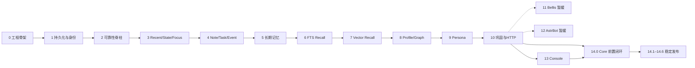

# Iris Memory Core 分阶段开发路线图

> 状态：In progress；按 2026-09-06 工作区、代码与验证记录核对。  
> 架构：[架构基线](../IRIS_MEMORY_CORE_IMPLEMENTATION_PLAN.md)；决策：[ADR 索引](../adr/README.md)。

本页是阶段状态与依赖的统一入口。项目编号为 Phase 0–14；本次核查覆盖 Phase 0–13，不能把“已经推进到 Phase 13”理解为所有前序门禁均已通过。Phase 0–10 有完整历史切片报告，Phase 13 仍在实施；Phase 11/12 均按项目负责人 2026-09-06 要求暂缓。Phase 14 的 pip 范围仅为 Core 功能与既定公共接口，不包含两个适配器，也不以其验收或分发为前置条件。

## 阶段状态与证据

| 阶段 | 状态 | 已交付范围与证据 |
| --- | --- | --- |
| [00 架构与工程骨架](./phase-00-architecture-scaffold.md) | Completed | 工程、契约、CI；[报告](../reports/phase-00-verification.md) |
| [01 持久化、身份与空间](./phase-01-persistence-identity-scope.md) | Completed | Canonical Store、权限与 Persona Bootstrap；[报告](../reports/phase-01-verification.md) |
| [02 Observation、Outbox 与调度](./phase-02-observation-outbox-scheduler.md) | Completed | 持久可靠性与 Active Surface Lease；[报告](../reports/phase-02-verification.md) |
| [03 Recent、State 与 Focus](./phase-03-recent-state-focus.md) | Completed | 短期上下文、修订和恢复；[报告](../reports/phase-03-verification.md) |
| [04 Note、Task 与 Event](./phase-04-notes-tasks-events.md) | Completed | 捕获、计划、提醒与 ACK；[报告](../reports/phase-04-verification.md) |
| [05 长期记忆与 Episode](./phase-05-long-term-memory.md) | Completed | Remember/Correct/Forget、Artifact 与删除账本；[报告](../reports/phase-05-verification.md) |
| [06 FTS Recall](./phase-06-fts-recall.md) | Completed | 完整 Recall 契约、FTS 与 Usage；[报告](../reports/phase-06-verification.md) |
| [07 Vector Recall](./phase-07-vector-recall.md) | Completed | Provider Port、FAISS 生命周期与混合召回；[报告](../reports/phase-07-verification.md) |
| [08 Profile 与 Graph](./phase-08-profile-graph.md) | Completed | 有来源画像与受限图召回；[报告](../reports/phase-08-verification.md) |
| [09 Persona](./phase-09-persona.md) | Completed | State/Policy/Proposal、发布与回滚；[报告](../reports/phase-09-verification.md) |
| [10 巩固、Reflection 与 HTTP](./phase-10-consolidation-reflection.md) | Completed | 后台提炼、真实 ASGI、serve/worker；[报告](../reports/phase-10-verification.md) |
| [11 Bellis Adapter](./phase-11-bellis-adapter.md) | Deferred | 暂时不再执行，移出当前发布门禁；已有插件、历史验证及未完成项保留；[报告](../reports/phase-11-verification.md) |
| [12 AstrBot Bridge](./phase-12-astrbot-bridge.md) | Deferred | 暂时不再执行，移出当前发布门禁；保留裁决、SDK、Bridge 与验证待办，恢复时重新确认依赖 |
| [13 Web 管理控制台](./phase-13-web-console.md) | In progress | 认证已有历史验证；读面与 State/Note/Focus/Task 主资源及步骤管理写入已接通真实浏览器，其他业务切片未完成；[合并报告](../reports/phase-13-verification.md) |
| [14 前置闭环、生产硬化与稳定发布](./phase-14-hardening-release.md) | In progress | 读面/Required Lease、Core 包资源与独立 SDK 安装门禁已实施；[实施报告](../reports/phase-14-verification.md)，尚未通过稳定发布验收 |

`Completed` 表示该阶段当时的退出证据齐全，不表示当前工作区全量回归或生产发布通过。测试日期、环境、失败与未验证范围以报告为准。

## 阶段依赖

Phase 11 保留 Bellis 仓库现有插件（ADR-0020），Phase 12 保留本仓库 `application/` 预留位置，二者均暂缓。Phase 13 继续维护 Core 独立 `/console/v1` 管理平面及配套前端，不因适配器暂缓而取消。14.1 打包/CI 与 14.2 部署准备可提前开展；当前稳定发布验收 Core 与 Phase 13，调用方只经既定公共方法访问 Core。pip 内容、独立 SDK/前端产物及验收边界见 [Phase 14 发布路径](./phase-14-hardening-release.md#pip-包发布路径)。

## 仍有效的规划决定

- Phase 1 的最小 Published Persona/Current Pointer 与 Phase 9 完整 Persona 是分次交付；Phase 2 的持久 Lease/Epoch/Fencing 仍须通过真实 Core 服务上的多客户端竞争验证，Bellis/AstrBot 专属宿主验证随 Phase 11/12 暂缓。
- Phase 6 冻结 Recall 协议，Phase 10 才交付真实 HTTP 与进程入口；历史 mock 不代表真实宿主验证。后续适配器消费契约，不为宿主改写 Canonical Domain。
- [ADR-0022](../adr/0022-management-console-plane.md) 已接受：原 Phase 13 的自动旧库迁移改为控制台手动文件导入导出。旧库扫描、增量追平、双写切换已取消；来源、幂等、断点、Tombstone 优先、隔离候选和可审计性继续由导入门禁承担。数据库 Schema Migration 始终保留。
- Phase 14 复用前期实现，重点补兼容闭环、可安装产物、生产部署、安全/凭据、24h Soak 和恢复证据。欠缺项与顺序只维护在 [Phase 14 工作包](./phase-14-hardening-release.md#工作包)。

## 统一阶段规则

进入实施前确认依赖证据、冻结边界和契约 Fixture；变更持久化时同时定义迁移、兼容与回退。阶段状态使用 `Planned`、`In progress`、`Blocked`、`Deferred`、`Completed`；`Deferred` 表示经明确范围决定暂缓，须记录恢复条件与发布依赖影响；阻塞原因必须具体，不能用阶段编号推断完成度。

完成时检查领域行为、接口、迁移、安全、可观测性和对应测试；交付证据包含变更/版本、ADR、环境、可复现命令、结果与限制。没有证据的门禁保持未完成；遗留项须有明确承接工作包。状态更新同时修改本页与原阶段，ADR 冲突说明随决定更新。

所有阶段持续遵守：先 Scope/Privacy 后排序；写入幂等与 Expected Revision；Canonical/Outbox 原子提交；Tombstone 优先；Provider 有界与显式降级；日志/指标/错误不泄漏 Secret 或敏感正文。

## 文档模板

新阶段使用 [阶段模板](./phase-template.md)。已完成阶段保留短交付摘要、关键边界、量化门禁和证据链接；详细规范在架构/ADR，实际测试与复审结果在报告，避免复制三套正文。维护与验证命令见 [贡献指南](../../CONTRIBUTING.md)。
