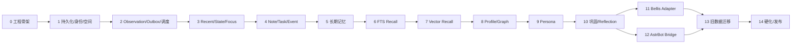

# Iris Memory Core 分阶段开发路线图

> 状态：In progress  
> 架构来源：[Architecture & Implementation Baseline v1.0](../IRIS_MEMORY_CORE_IMPLEMENTATION_PLAN.md)  
> 更新日期：2026-09-05

本路线图将架构基线第 36 章的 15 个阶段转换为可执行文档。每个阶段结束时都应形成一个可运行、可测试、可迁移的纵向切片；后续阶段不得绕过已经建立的安全、权限、Revision、Tombstone 或 Canonical/Projection 不变量。

## 阶段依赖

阶段 11 和 12 在 Core/Schema/SDK 契约冻结后可以并行，但分别在独立仓库交付。阶段 13 的扫描器和映射研究可以提前开展；正式导入、切换和回退演练必须等待目标 Schema 与宿主接入契约稳定。

## 规划结论

- **Persona 分两次落地**：Phase 1 在 Agent 创建事务中提供最小、锁定、不可变的 Published Persona 和 Current Pointer，以满足 Ready 与早期 Recall 的 Revision/Hash 不变量；Phase 9 再交付 State、Policy、Proposal、发布和回滚全能力。
- **Active Surface Coordinator 归入可靠性脊柱**：原架构阶段清单没有单列它，但两个 Adapter 和顶层验收依赖 `off|advisory|required`。因此 Core 的持久 Lease/Epoch/Fencing 在 Phase 2 与 Worker Lease 基础设施一并完成，宿主行为在 Phase 11/12 验证。
- **Phase 6 冻结首个完整 Recall 契约形状**：此时不依赖向量或外部 Provider，已经具备结构化 + FTS、最终 Rehydrate、预算、降级和 Usage 契约。但**真实宿主接入自 Phase 10 交付 HTTP 传输层后才开始**——Phase 2–8 交付的是应用层服务 + 生成契约 + mock server，不含传输层（ADR-0017 §3）；传输层已于 Phase 10 交付，85 条已发布路径全部有真实 ASGI 实现。
- **Phase 10 是完整 Core 功能冻结点，并交付 HTTP 传输层与进程入口**：ASGI 应用、认证与 AccessContext 构造、错误映射、能力协商、可选 SSE、`serve`/`worker` 命令，以及仅缺传输面的 Entity/Identity/Binding/SpaceGroup 与管理端点。Phase 11/12 之后只做协议消费和宿主生命周期映射，不应再为单一宿主修改 Canonical Domain。
- **迁移研究前置、数据切换后置**：Phase 13 的源库盘点和只读扫描器可以早于 Adapter 开发，但写入目标库、增量追平和切换必须基于稳定 Schema/SDK/Adapter 版本。
- **容器不是早期领域前置条件**：开发期保持本机 Python 可运行；生产镜像、只读根、SBOM、Soak 和恢复门禁集中在 Phase 14。

## 里程碑与阶段文档

| 里程碑 | 阶段 | 可验证结果 | 状态 |
| --- | --- | --- | --- |
| M0 工程与可靠性脊柱 | [00 架构冻结与工程骨架](./phase-00-architecture-scaffold.md) | 契约、工程和 CI 可持续演进 | Completed |
| M0 工程与可靠性脊柱 | [01 持久化内核、身份与空间](./phase-01-persistence-identity-scope.md) | Canonical Store 与权限边界成立 | Completed |
| M0 工程与可靠性脊柱 | [02 Observation、Outbox 与持久调度](./phase-02-observation-outbox-scheduler.md) | 已确认事件可可靠落库并异步推进 | Completed |
| M1 认知领域闭环 | [03 近期上下文、State 与 Focus](./phase-03-recent-state-focus.md) | 有界短期上下文和认知关注可恢复 | Completed |
| M1 认知领域闭环 | [04 Note、Task 与 CognitiveEvent](./phase-04-notes-tasks-events.md) | 捕获、计划、提醒和 ACK 语义闭环 | Completed |
| M1 认知领域闭环 | [05 显式长期记忆与 Episode](./phase-05-long-term-memory.md) | Remember/Correct/Forget 与历史可审计 | Completed |
| M2 可解释召回 | [06 FTS Recall](./phase-06-fts-recall.md) | 无向量依赖的首个完整召回协议 | Completed |
| M2 可解释召回 | [07 Vector Recall](./phase-07-vector-recall.md) | 可回退的混合语义召回 | Completed |
| M2 可解释召回 | [08 Profile 与 Graph](./phase-08-profile-graph.md) | 画像与受限关系召回可重建 | Completed |
| M3 人格与后台认知 | [09 完整 Persona](./phase-09-persona.md) | 多宿主共享受控、可回滚人格 | Completed |
| M3 人格与后台认知 | [10 巩固、Reflection 与传输层](./phase-10-consolidation-reflection.md) | Evidence 驱动的后台提炼可重放；HTTP 传输层与进程入口就绪 | Completed |
| M4 接入与迁移 | [11 Bellis Adapter](./phase-11-bellis-adapter.md) | Bellis 端到端闭环 | Planned |
| M4 接入与迁移 | [12 AstrBot Bridge](./phase-12-astrbot-bridge.md) | AstrBot 端到端闭环 | Planned |
| M4 接入与迁移 | [13 旧 Iris 数据迁移](./phase-13-legacy-migration.md) | 可审计、可重跑、可回退迁移 | Planned |
| M5 稳定发布 | [14 硬化、容器与发布](./phase-14-hardening-release.md) | 干净环境可重复部署与恢复 | Planned |

## 统一阶段规则

### 进入条件

- 前置阶段的退出门禁已通过，相关证据可在 CI、测试报告或运维演练记录中定位。
- 本阶段使用的架构定义没有未决冲突；需要改变冻结边界时已有被接受 ADR。
- 本阶段公共契约先于实现冻结 Fixture，调用方和实现方对成功、错误与降级语义达成一致。
- 数据变更具备迁移、回退或兼容策略，不能只描述最终 Schema。

### 完成条件

- 阶段文档列出的领域行为、接口、迁移、可观测性和安全工作均完成。
- 单元、性质、集成、契约、故障或 E2E 测试按阶段要求通过。
- 交付证据至少包含：变更引用、Schema/Migration 版本、测试报告、已接受 ADR、已知限制。
- 文档中的非目标没有被临时实现绕过；任何延期项都进入后续阶段或显式 Backlog。
- `Completed` 代表可被下一阶段安全依赖，不代表“主要代码已经写完”。

### 横切门禁

每个阶段都需要检查以下不变量，即使阶段文档没有重复列出全部测试：

- Scope 与 Privacy 必须先于相关性排序，客户端 Payload 不能扩大权限。
- 修改操作具备 Idempotency Key；可变 Aggregate 具备 Expected Revision。
- Canonical 数据和异步 Outbox 原子提交，派生投影始终可重建。
- Tombstone 优先于缓存、索引、后台任务和历史/恢复路径。
- 在线路径不等待不受控 Provider；失败和降级通过稳定契约暴露。
- 日志、指标、Trace、错误和 Fixture 不泄漏 Secret 或敏感正文。

## 状态与证据记录

阶段状态使用 `Planned → In progress → Blocked → Completed`。进入实施后，在对应阶段文档顶部补充负责人、目标版本、开始日期和状态；在“交付证据”中记录可点击的 PR/Commit、测试报告、迁移编号和 ADR。时间估算应基于团队容量和完成的 Phase 0 技术探针另行制定，本路线图不以未经验证的日历承诺替代退出门禁。

## 文档模板

新增或拆分阶段时使用 [阶段文档模板](./phase-template.md)。模板中的“明确不做”用于阻止范围漂移，“交接条件”用于保证下一阶段不依赖隐含行为。
