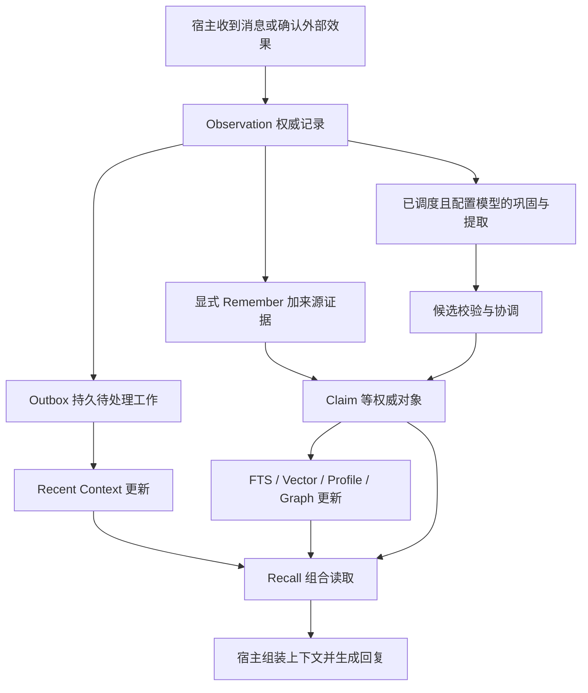
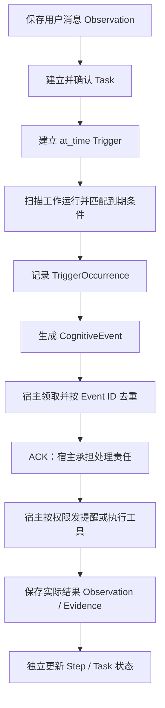

# Iris Memory Core：新开发者功能与运行指南

2026-09-08 新实施项：[Observation 全量上下文与批量总结](observation-context.md)。统一使用 Observation 保存背景/交互原始事件，复用 Episode 保存分组摘要；自动总结显式开启，背景默认保留 30 天可配置。已接通实现，使用方式与本轮验证进度见链接说明；下文历史验收记录仅代表当时版本。

本文面向第一次接触项目的开发者，解释当前代码能做什么、各类数据为什么分开、后台如何工作，以及宿主插件需要负责什么。

核查日期为 **2026-09-08**，依据当前工作目录（包含尚未提交的内嵌接入代码），不是只读取 Git HEAD。当前源码标记 Core 0.16.0、数据库 Schema 25、业务契约 1.13.0、Python/TypeScript SDK 0.12.0。它仍是开发候选；本文说明实现行为，不宣布稳定发布或生产验收通过。接口精确字段以[业务契约](../../schemas/openapi/openapi.json)和[公开方法说明](public-api.md)为准，后续完成状态以[工作包队列](work-packages.md)为准。

## 1. 这个 Core 解决什么问题

Iris Memory Core 为 AI 应用提供可以持久保存、追溯、更正和遗忘的记忆，同时管理关注事项、任务计划、待处理事件和人格版本。

例如，一个聊天机器人需要记住：

- 用户曾说过什么，以及这句话来自哪个会话。
- 用户明确表达的偏好，后来是否发生变化。
- 当前话题、环境状态、还没有解决的问题。
- 答应用户的事情、步骤依赖和下次提醒时间。
- 机器人使用哪一版人格，哪些人格变化可以接受。

Core 把这些信息拆成不同对象，各自维护来源、状态、版本和可见范围。宿主在回复前调用 Recall，获得一份带来源和排序信息的记忆候选，再决定如何加入模型上下文。

这里的“插件”需要分清两层：Core 是独立的记忆内核；AstrBot、Bellis 等宿主插件负责平台消息、模型接口适配、界面和实际执行。当前 Core 已有本地内嵌和远程 HTTP 接口；仓库中的 Bellis/AstrBot 专属适配阶段仍暂缓，不能据此认为完整宿主插件已经交付。

## 2. 先认识三个存储层次

| 层次 | 通俗解释 | 当前实现 | 是否可以通过重建替代 |
| --- | --- | --- | --- |
| Canonical，权威记录 | 系统正式保存的事件、事实、计划和人格 | SQLite 中的 Observation、Claim、Note、Task、Persona 等及其历史 | 不能把索引当成它的替代品 |
| Projection，派生视图 | 为查询和检索整理出的目录、窗口与摘要视图 | Recent Context、FTS、Vector、Profile、Graph、统计汇总 | 可以从受支持的权威来源重建 |
| 运行与治理记录 | 让处理过程可靠、可恢复、可审计 | Outbox、Schedule/Tick、Lease、幂等记录、删除账本、Provider 治理和审计 | 其中有关键持久状态，不能作为普通缓存清空 |

SQLite 是当前的权威数据库，连接配置使用 WAL、外键检查和事务等机制。向量检索使用可选的 FAISS 索引文件，元数据、当前代指针和映射仍保存在 SQLite。附件可以使用数据库内联内容、本地文件或外部引用。

当前实现不要求另起 Redis、独立向量数据库或图数据库。Graph 是从权威资源生成的图投影，不能直接把一条推测出的图边当成新事实。

**索引落后和记忆丢失是不同问题。** 写入成功后，权威记录已经存在，但 FTS 或向量索引可能还没处理到这一版。读取会校验索引新鲜度、来源版本和删除状态；无法信任的检索路线会显式降级。

## 3. 数据属于谁，又能在哪里使用

### 3.1 身份与空间

| 概念 | 含义 | 示例 |
| --- | --- | --- |
| Tenant | 最外层的数据与授权边界 | 一套独立部署或一个租户 |
| Agent | 一个人格/智能体的持久身份 | Iris、另一个独立人格 |
| SpaceGroup | 显式组织的一组空间 | 经配置允许共享的工作空间组 |
| Space | 一处交互空间 | 一个群聊、私聊或应用频道 |
| Session | Space 内的一次会话范围 | 某次对话会话 |
| Entity | 记忆所描述的主体 | 用户、组织或其他实体 |
| ExternalIdentity | 平台账号身份 | provider、realm、external_id 组成的账号标识 |
| Binding | 外部账号与 Entity 的受控绑定 | 某个平台用户 ID 对应哪位用户 |

Entity 和平台账号分开，才能表达“同一个人在多个平台上出现”。绑定有历史和审核/撤销语义，不能只靠昵称相似自动认定为同一个人。

### 3.2 Scope 与 Privacy

Scope 指定一条数据的 Tenant、Agent、SpaceGroup、Space、Session 范围；Privacy 再追加隐私条件。两者共同限制读取，并且发生在排序之前。更高的相似度或重要性不会扩大权限。

需要特别注意 `null`：数据上的某个范围字段为空，表示该维度没有进一步收窄；请求上的字段为空，不代表可以搜索所有值。例如，请求不带 `space_id`，不会自动得到每个群聊中的私有记忆。

隐私标签包括 `tenant`、`agent:<id>`、`space:<id>`、`session:<id>`、`entity:<id>:private`、`restricted` 和 `custom:<name>` 等。多个标签取交集，主体私有内容还需要相应授权。

因此，跨空间记忆共享需要明确的数据范围和权限；把所有聊天记录混在一起再检索，并不符合当前模型。

实现入口：[Scope](../../src/iris_memory_core/domain/scope.py)、[Privacy](../../src/iris_memory_core/domain/privacy.py)、[身份模型](../../src/iris_memory_core/domain/identity.py)。

## 4. 各种“记忆类型”怎么区分

### 4.1 Observation：确实发生过什么

Observation 是原始事件记录。收到的用户消息、确认已发送的机器人回复、确认成功的工具结果，都可以形成 Observation。

它区分 user、assistant、tool、system、external 角色，并保存发生时间、确认时间、来源账号、空间和去重标识。

这里的“事实”是“这件事确实发生了”：记录“用户说自己喜欢茶”，证明用户说过这句话，并不自动证明这是一条永久正确的偏好。

尚未发送的回复草稿、发送失败和取消输出不能记成成功 Observation。当前效果状态是 `committed` 或带实际生效范围证明的 `partial`。失败尝试应进入适当的运行/审计记录。

批量接入支持幂等键、来源事件标识和游标处理，以避免断线重试重复记录同一事件。

背景消息现在也直接保存到 Observation，使用 `context_kind="background"`；直接交互默认 `interaction`。入库不调用模型。来源线程和回复 ID 可以串联同一讨论。背景原文默认保留 30 天，摘要明确引用的消息会继续保留，其他同批消息仍按期清理；主动遗忘继续有效。

### 4.2 Recent Context：最近在聊什么

Recent Context 从已经提交的 Observation 中构建有界窗口，用于保持近期对话连续性。它是可重建投影。

当前默认窗口策略最多 200 条 Observation、估算 4000 tokens，投影 TTL 为 1 小时。这些是实现默认值，不是永久聊天记录保留期限，也不是对任意模型 tokenizer 的精确计数。

不接摘要模型时，窗口压缩保存来源引用，不凭空生成一份自由文本摘要。原始近期内容默认不跨 Space 拼接。Recent 的有限容量优先给直接交互，剩余容量才用于背景消息。

需要获取尚未整理的实时信息时，使用 `observation_context`：它返回原文、处理状态、已有 Episode 摘要与分页标记。它与 Recent 投影用途不同，能分页读取范围内的授权原始消息。不要把 `processed` 当成已经生成长期记忆；模型也可以认定整批都是闲聊而不生成摘要。详见[接口与配置示例](observation-context.md#接入示例与运行参数)。

### 4.3 State：现在是什么状态

State 是带命名空间和键的结构化当前值，例如当前话题、设备模式、在线状态、环境信息。它有来源权威、修订、观察时间和 TTL。

内置策略示例：`runtime` 默认有效 5 分钟，`environment` 默认 1 小时，`topic` 默认 30 分钟。命名空间策略还约束可写来源、值大小和历史保留。

“当前忙碌”适合 State；“用户长期偏好文字交流”适合 Claim。TTL 到期后，旧 State 不应继续作为当前状态使用。

### 4.4 Focus：现在值得持续关注什么

Focus 是正式保存的关注项，例如尚未解决的问题、当前目标、重要线索、担忧或等待输入。

类型包括 `goal`、`question`、`entity`、`clue`、`concern`、`affect`、`pending_input`。状态包括 active、dormant、promoted、dismissed、expired。

它有容量管理和激活度衰减，可以休眠后再激活，也可以晋升成 Note、Task、Episode 或 Claim。当前应用层已有这些晋升的目标创建与来源校验，不能把早期注释中的“预留接缝”当成当前限制。

Focus 的“关注度提高”不等于相关事实更可信。其摘要也不能凭自身成为独立事实证据。

### 4.5 Note：先记下来，之后再整理

Note 是低成本捕获信息的便签，可表示重要信息、想法、跟进、承诺、问题和观察。

例如“下次问一下用户项目进展”，现在还没有正式执行计划，可以先保存为 `follow_up` Note。

它支持收件箱、置顶、延后、归档、晋升和遗忘。`review_after` 是“之后重新检查”，不是“到点删除”；`snooze_until` 是延后到何时。置顶项、未履行承诺、活动 Task 的来源和受保护内容有保留约束。

当前 Note 可以实际晋升为 Task、Claim、Episode。自动复查可唤醒延后便签、关联重复内容，并在符合规则时生成 proposed Task；不会因为重复就随意删除承诺。

### 4.6 Claim：有来源的长期陈述

Claim 表示关于主体的一条结构化陈述，核心信息包含 subject、predicate、value、canonical_text、category 和 Evidence。

例如：“用户甲 / 偏好 / 茶”，其文字表述是“用户甲喜欢喝茶”，证据是用户明确表达这项偏好的消息。

当前类别如下：

| 类别 | 含义 | 示例 |
| --- | --- | --- |
| `identity` | 身份特征 | 如何称呼某位用户 |
| `preference` | 偏好 | 喜欢茶、偏好简洁回答 |
| `relationship` | 关系方面的陈述 | 两个主体的关系描述 |
| `fact` | 一般事实陈述 | 某个项目使用 Python |
| `community` | 社群信息 | 某个群的讨论约定 |
| `procedure` | 程序性知识 | 描述一项流程应怎样进行 |
| `self_narrative` | 自我经历相关陈述 | 某段经历形成的自我认识 |

Procedure 保存描述性知识，不能充当可执行脚本。

Claim 可处于 active、disputed、superseded、retracted、expired、archived、tombstoned 等状态。存在争议时可以保留冲突信息，而非悄悄选择一个版本覆盖掉另一个。

### 4.7 Evidence：为什么相信这条陈述

Evidence 将 Claim 等对象连接到来源，说明来源是支持、反驳还是更正它。当前 Claim 证据来源可引用 Observation、Artifact、Episode、Claim、Note；接纳时还要验证来源实际存在、范围合法、未失效且未被删除。

来源权威区分模型推断、提取结果、用户陈述、平台验证、管理员确认和明确更正。高置信模型输出不能绕过来源权威规则覆盖用户明确更正。

Active Claim 至少需要有效证据。Remember 不只是把一个字符串塞进向量库。

### 4.8 Episode：一段有意义的经历

Episode 把一段相关事件组织为一个有标题、摘要、时间范围和来源引用的经历单元，例如“一起排查数据库连接故障”。它支持修订、封存和归档等生命周期。

Episode 不等于 Session：Session 是会话边界，Episode 是对相关经历的组织。生成 Episode 仍受来源空间约束，不能擅自拼接不同空间的原始聊天内容。

### 4.9 Relation：主体之间的结构化联系

Relation 表达两个实体之间的关系及其证据和有效期。例如“用户甲参与项目乙”。

Relation 是权威对象；Graph 中的边是便于搜索关系路径的派生表示。关系路径可以帮助找到相关记忆，但不会自动证明路径两端存在新的事实关系。

### 4.10 Artifact：正文之外的资料

Artifact 表示附件、文档或其他资料，保存媒体类型、大小、hash、定位信息和状态等。

| 存储类型 | 定义 | 当前含义 |
| --- | --- | --- |
| `inline` | 小内容直接保存在记录中 | 领域上限为 256 KiB |
| `local_blob` | 文件保存在受管理的本地位置 | 领域单件上限为 64 MiB，接口还可能施加更小限制 |
| `external_ref` | 保存外部资源引用 | 保存引用不等于已经抓取、解析和理解内容 |

存在图片附件支持，不等于 Core 已经内置 OCR、图像理解或通用多模态提取流水线。

以上数据类型的主要实现入口：[Observation](../../src/iris_memory_core/domain/observation.py)、[Recent](../../src/iris_memory_core/domain/recent.py)、[State](../../src/iris_memory_core/domain/state.py)、[Focus](../../src/iris_memory_core/application/focus.py)、[Note](../../src/iris_memory_core/application/notes.py)、[长期记忆模型](../../src/iris_memory_core/domain/memory.py)。

## 5. 记忆怎么写入、更正和遗忘

### 5.1 从一次对话到长期记忆

以下是接入流程，箭头表示可能的处理路径，不表示每收到一条消息都会自动执行所有步骤：



显式 Remember 可以不依赖模型自动提取：宿主已知道需要记住什么，就提交结构化内容和实际来源。自动提取则依赖认知 Provider、工作入队以及 Worker 处理。

### 5.2 Revision、Current、Watermark

Revision 是某个对象的修订号；Current 指向当前有效版本；Watermark 是数据变化进度，用于判断投影和缓存读到了哪里。

多数有版本的对象更正时追加修订，再更新 Current，不原地改写旧正文。客户端写入 `expected_revision`，表示“我是在看到这一版的基础上修改”。别人已抢先修改时会发生版本冲突，调用方需要回读后处理。

Claim 等长期对象还区分事实适用时间和系统记录时间：可以分别回答“这条偏好在当时是否有效”和“系统当时知道什么”。历史查询继续受当前权限和遗忘规则约束。

### 5.3 Remember / Correct / Forget

- **Remember**：保存明确陈述与证据，并维护相应版本和变化任务。
- **Correct**：依据权限、来源权威和预期修订创建更正；可表达替代、争议等语义，保留历史链。
- **Forget**：通过删除账本让目标及相应受影响资源失效，随后清理派生数据。

Forget 会先影响权威读取，不等待向量文件清理完成才“忘记”。读取和后台提交都会检查 Tombstone，避免旧索引、延迟模型结果或恢复的旧数据使内容重新出现。完整物理清理可能异步完成。

归档、过期、认知衰减、隐私遗忘不是同一动作。Legal Hold 是受权设置的保留约束，可能阻止部分删除或清理。备份恢复也需要处理删除账本，单独复制旧数据库不足以证明恢复正确。

相关实现：[Claim 服务](../../src/iris_memory_core/application/memory.py)、[Forget](../../src/iris_memory_core/application/forget.py)、[Retention](../../src/iris_memory_core/application/retention.py)。

## 6. Recall 怎样选择供本次回复使用的记忆

Recall 接收当前 Agent/Space、参与者、话题、用途、token 预算和 deadline，组合多条检索路线：

| 路线 | 主要回答的问题 |
| --- | --- |
| Recent Context | 刚刚发生了什么、正在说什么 |
| State | 当前环境或话题状态是什么 |
| Focus | 还有哪些值得关注的事项 |
| Tasks | 有哪些与当前上下文有关的待办 |
| Claims | 有哪些可直接读取的有效陈述 |
| Relations | 有哪些主体间关系 |
| FTS | 哪些长期内容匹配关键词 |
| Vector | 哪些长期内容在语义上相似 |
| Graph | 经有界关系路径可以找到哪些相关资源 |
| Profile | 某个主体有哪些可见的汇总信息 |

FTS 和 Vector 当前主要索引 Claim、Episode、Note，不是直接把所有 Observation、Task、附件都向量化。Profile 是从权威数据生成的主体概况，不是另一份可独立随意修改的事实库。

候选会经过权限与状态过滤、当前来源重新读取、冲突和重复处理、排序、总预算与分层预算裁剪。排序分开考虑相关度、置信度、重要性、可访问度、激活度等因素。Task/Focus 有预算保护，但不会绕过权限或总预算。

返回的不只是文本，还包括资源 ID、revision、content_hash、分值、冲突状态、过期信息；整体响应提供 persona_revision、source_watermark、pending_event_ids、completed_routes、degraded_routes、partial、缓存期限和可选 trace。

Trace 用于解释检索路线及耗时，不是模型内部思维过程。宿主仍负责选择和组织上下文；这些来源内容不应被提升为可以改写系统权限的指令。

向量能力未配置时不声明支持；已配置但模型故障、索引不可用或过旧时，Recall 可以按请求策略返回其他路线并报告降级。`partial=true` 或 `degraded_routes` 需要调用方处理，不能等同于“没有相关记忆”。

宿主还可以报告哪些候选确实被使用，并通过公开重验接口检查旧 Recall 的有效性。使用反馈可影响适当的激活/可访问性统计，不会因为“多用几次”自动提高事实可信度。

实现入口：[Recall 编排](../../src/iris_memory_core/application/recall.py)、[运行装配](../../src/iris_memory_core/recall_runtime.py)、[公开响应构造](../../src/iris_memory_core/business_views.py)。

## 7. 后台任务：让记忆系统持续整理和维护

### 7.1 Outbox Job 是系统内部工作

Job 解决的是“系统还欠哪些处理工作”。例如，记忆已经写入，但全文索引尚未更新。

权威数据和对应 Outbox Job 在同一事务提交，可以避免记忆写入后漏掉后台更新。Worker 按已注册的处理器领取有界批次，成功后提交结果；可重试失败进入重试流程，超过限制进入死信状态，管理员可按公开操作重放。

Worker 用租约和 generation 防止已经失去执行权的旧工作者提交。涉及模型的耗时操作在写事务外进行，提交前重新核验来源和执行权。遇到不认识的任务/载荷版本或未装配的处理器，会保留待处理工作，不伪造成功。

系统还支持优先级、安全通道、背压和部分投影任务的合并。合并的是重复刷新工作，不是跳过权威修订，也不是随意丢弃提醒发生记录。

### 7.2 当前后台工作分类

此表是按功能归类的说明；精确注册信息维护在[任务注册表](../../src/iris_memory_core/domain/jobs.py)，实际是否可运行还取决于[Worker 装配](../../src/iris_memory_core/jobs/worker.py)和 Provider 配置。

| 工作组 | 典型任务 | 做什么 | 需要模型吗 |
| --- | --- | --- | --- |
| 全量上下文批量总结 | `observation.summarize` | 归组、忽略闲聊，生成有原文引用的 Episode | 是，须显式开启或显式请求 |
| 输入与近期窗口 | `observation.recorded`、`recent_context.maintenance` | 验证输入记录并更新近期窗口 | 否 |
| 状态与关注项 | `state.projection`、`focus.maintenance` | 检查当前指针、衰减和整理关注项 | 否 |
| 便签复查 | `note.review` | 唤醒延后项、关联重复项、按规则晋升 | 否 |
| 业务触发扫描 | `task.trigger_scan` | 计算满足条件的发生次数，创建待投递事件 | 否 |
| 变化与失效传播 | `*.changed`、`memory.invalidated` | 核验对象状态，为有关投影排队更新或清理 | 否 |
| 全文检索 | `fts.apply/rebuild/cleanup` | 更新、重建与清理 FTS | 否 |
| 向量检索 | `vector.apply/rebuild/cleanup` | 管理映射和增量，建立并切换索引代 | 构建/查询向量需要 Embedding |
| 概况与图 | `profile.*`、`graph.*` 的 apply/rebuild/cleanup | 更新主体概况和关系图投影 | 否 |
| 认知流水线 | `episode.consolidation`、`reflection.generate`、`memory.reconciliation` | 组织窗口、摘要、候选提取与确定性落地 | 当前运行装配需要认知 Provider；协调提交本身是规则处理 |
| 人格 | `persona.evaluation`、人格修订通知、`persona.state_expire` | 评估演进提案、传递变更通知、状态回到基线 | 提案评估沿认知装配；通知和状态到期不需要模型 |
| 保留 | `retention.compaction` | 按策略衰减、归档或经 Forget 清理，跳过保护对象 | 否 |
| 管理操作 | `console.memory_forget`、`console.trusted_backup`、`console.stats.rollup`、Provider 探测/激活 | 分批遗忘、可信备份、统计回填、模型配置生命周期 | Provider 探测和建索引可能调用模型 |
| 控制与自检 | `surface.lease_revoked`、`maintenance.selfcheck` | 验证执行权变动与运行记录一致性 | 否 |

有些旧名称只有注册，没有启用处理器，如 `profile.refresh`、`graph.refresh`、`backup.execute`、`forget.execute`、`correct.apply`。这不表示对应整体功能不存在：例如可信备份通过 `console.trusted_backup` 实现，显式更正和遗忘有各自应用服务。不能仅按名称推断可运行能力。

### 7.3 Schedule / Tick 是什么时候排队

Schedule 保存周期规则；Tick 保存某次周期实际如何处理。Scheduler 根据持久记录补算到期工作，并把 Tick 与 Outbox Job 一起提交。

当前通用周期语法是 interval 和 daily；不是完整 Cron/RRULE 解析器。它处理 IANA 时区、夏令时跳过/重复时刻、迟到容忍和单批上限，并支持：

- `all`：在限制内补处理每次到期。
- `latest`：处理最新一次。
- `coalesce`：合并错过的周期工作。
- `skip`：跳过错过的周期。

### 7.4 当前自动运行的实际边界

**处理已有 Job、生成未来 Job、向宿主发送消息，是三个独立环节。**

核查当前源代码得到：

1. 独立 `worker` 循环调用 `OutboxWorker.run_once()`，消费已有任务。
2. 内嵌模式默认 `background=False`；可调用 `run_pending()` 处理一批，或设置 `background=True` 周期消费已有任务，默认间隔 0.25 秒。
3. `SchedulerService.advance()` 已实现到期推进，但当前 `serve` 生命周期、独立 `worker` 和内嵌后台循环中未发现它的自动调用。
4. 公开业务已有创建 Schedule 和立即执行 Schedule 的入口；创建周期记录不等于启动了自动推进器。面向 Agent 的扫描 Job 还必须指定目标 Agent。
5. 内嵌 Worker 装配了业务维护、索引和可选认知处理器，没有装配独立服务的整组 Console 管理 Job。

因此，当前可确认“任务引擎和触发算法已有实现”，不能承诺“启动后所有定时维护、反思和提醒都会无人值守运转”。完整接入仍需核实调度推进、各 Job 所需载荷和宿主事件处理闭环。业务调用方不要绕过公共接口直接拿 Scheduler、Store 或 Worker 来补接。

核查依据：[独立运行入口](../../src/iris_memory_core/runtime.py)、[内嵌运行入口](../../src/iris_memory_core/embedded.py)、[HTTP 生命周期](../../src/iris_memory_core/api/app.py)、[持久调度器](../../src/iris_memory_core/application/scheduler.py)、[Job 处理器](../../src/iris_memory_core/jobs/handlers.py)。此处记录当前接线边界，没有在本说明任务中修改运行代码。

## 8. 主动任务：Task、Trigger、Event 各负责什么

### 8.1 Task 是计划，不是后台线程

Task 表示一件需要持续推进的事，包括目标、所有者、状态、来源、进展和后续动作。状态包括 proposed、active、waiting、blocked、completed、cancelled、archived。

从对话或后台提取出的计划只能是 `proposed`。只有显式工具调用、确定性策略或受权管理员才能激活。这避免把“有空我想去旅行”误当成已确认需要开始执行的任务。

TaskStep 是任务步骤；TaskDependency 表达同一 Task 内步骤的先后关系，写入时检查环。依赖满足才进入 ready；新增依赖也可能使尚未开始的步骤退回 pending。当前不支持跨 Task 依赖。

### 8.2 TaskTrigger 是发生条件

| 类型 | 说明 | 示例 |
| --- | --- | --- |
| `at_time` | 指定时刻 | 明天 9 点提醒 |
| `recurrence` | 受限周期 | 每天 9 点检查 |
| `observation_kind` | 匹配 Observation 类型，可限制角色 | 收到指定类型工具结果后跟进 |
| `state_condition` | 状态值匹配声明式条件 | 某个状态存在，或数值超过阈值 |
| `task_transition` | 匹配 Task/Step 状态变化 | 指定步骤完成后提醒 |

状态比较只允许 eq、ne、lt、le、gt、ge、exists、absent、contains 等受限运算。Observation 触发也不是任意自然语言语义匹配；需要声明支持的类型/角色条件。

Trigger 不执行 Python、Shell、脚本或工具。扫描命中后，系统记录唯一 TriggerOccurrence，并据此创建 CognitiveEvent，避免重启或重扫重复计算同一次发生。

### 8.3 CognitiveEvent 是交给宿主的待处理事件

CognitiveEvent 表示“该处理这件事了”，例如 `task.due`。它有待投递、已投递、已确认、过期和取消状态，以及投递目标、有效期、重投记录。

系统采用至少一次投递，宿主必须按 Event ID 去重。ACK 的含义是“宿主已收到并承担处理责任”，不等于实际动作完成。

**Job 完成、Event 已 ACK、TaskStep 完成，必须分开记录。**

对于声明了外部效果的步骤，完成需要实际成功的 Observation 或允许的有效 Artifact 证据。提醒已投递、ACK 或事件过期都不能成为成功执行证据。

### 8.4 一个完整例子

用户说：“明天上午 9 点提醒我检查备份。”

在调度和宿主消费均已接通的前提下，流程为：



“提醒用户检查”与“替用户完成检查”是不同的任务目标。前者可能以提醒实际发送成功为证据，后者需要真正检查的结果；由宿主按任务定义提交证据，Core 校验并保存。

如果宿主没有领取事件或发送消息，Core 中有一条到期事件不会让聊天平台自动出现提醒。即使提供变更通知/SSE，通知传输也不能代替任务执行与确认协议；具体 SDK 的支持差异见公开方法说明。

实现入口：[Task 规则](../../src/iris_memory_core/domain/task.py)、[Task 服务](../../src/iris_memory_core/application/tasks.py)、[事件规则](../../src/iris_memory_core/domain/event.py)、[事件服务](../../src/iris_memory_core/application/events.py)。

## 9. 多个宿主同时在线时：Active Surface

同一个 Agent 可能同时接入聊天、语音等多个交互端。Active Surface Lease 用来协调当前谁持有该 Agent 的交互执行权。

当前支持 off、advisory、required 三种模式。租约包含持有者、有效期、优先级和递增 epoch，提供获取、续约、释放和抢占处理。旧 epoch 的持有者在需要有效 Proof 的操作上会被拒绝，防止失去执行权后继续提交。

Required 模式下相关在线写入和 Recall 要提供有效 Lease Proof。Lease 不替代 Scope、Privacy 或业务授权，拿到租约也不会获得其他用户数据。它与 Worker 的内部 Job 租约用途不同。

宿主还必须处理已经发生的外部效果：数据库可以拒绝旧执行者提交，却不能撤回一个已经发出的网络请求。事件去重和平台侧效果确认仍然需要宿主完成。

实现入口：[Surface 规则](../../src/iris_memory_core/domain/surface.py)。

## 10. 自动巩固与 Reflection 到底做什么

自动认知流水线可以把一段已提交的 Observation 整理为 Episode，再提取候选 Claim、Relation、Note、Task 或 PersonaProposal。

开启 `auto_summary_enabled` 后，默认满 50 条或等待 120 秒触发，每批最多 100 条；默认关闭。总结可以把交错消息归为不同话题，结果放入 Episode 的摘要与原始引用中。未引用消息按 30 天清理。单个非空分组还会进入后续提炼，模型费用包含这些阶段。宿主也可使用 `summarize_observations` 显式安排一次总结。

“Reflection”在这里是可记录和复查的提取过程：固定输入窗口、数据进度、提示/模型/规则版本，记录候选、证据范围和接受/拒绝结果。

模型结果必须通过 Schema、证据范围、主体存在性、权限、隐私、来源有效性和当前版本检查。提交前再次核验，避免模型运行期间用户已经删除来源，模型结束后又把它重新写入。

协调阶段按确定性规则物化合格候选。后台 Task 保持 proposed，推断事实保留相应来源权威，人格变更进入提案与策略流程。不是把模型输出 JSON 直接写进所有权威表。

目前默认不配置认知 Provider，因而 Worker 不领取对应认知任务。可以接入已实现的 HTTP 认知适配器，内嵌模式也可注入宿主异步能力。模型调用有 timeout、并发、QPS、重试、熔断和持久日预算等治理。

Embedding 与认知 Provider 是不同能力：前者把文本转换为向量以便搜索，后者做摘要和候选提取。配置其中一种不会自动启用另一种。

当前已有 dry-run/replay 等业务接缝，但 Console 的 Reflection/Candidate 全套管理仍在继续开发。真实模型提取质量、成本和生产适配尚不能由测试模型结果替代。

详细配置与边界：[认知 Provider](cognitive-provider.md)、[Embedding 部署](embedding-deployment.md)、[Reflection 流水线](../../src/iris_memory_core/application/reflection.py)。

## 11. Persona：人格、状态、草稿和演进

Persona 为 Agent 保存版本化人格，分成三层内容及独立短期状态：

| 部分 | 含义 | 示例 |
| --- | --- | --- |
| Core | 稳定身份与原则 | 名称、身份、价值观、边界 |
| Traits | 相对稳定的倾向 | 表达风格、兴趣、习惯 |
| Narrative | 自我经历与叙事 | 经历、关系、目标和总结 |
| PersonaState | 短期表现状态 | mood、energy、engagement、focus |

PersonaState 有 TTL 和基线，不应把一次短期情绪写成永久人格变化。到期读取遵守基线语义，后台到期任务还会处理相应版本状态。

发布会生成新 revision 和内容 hash；回滚也是创建一个新版本。Recall 返回人格版本与 hash，便于宿主判断上下文是否仍对应当前人格。

PersonaPolicy 提供 locked、manual、bounded_auto 模式，约束允许字段、单次及累计变化幅度、证据数量和来源、冷却与观察窗口等。默认是 locked，不能把“支持人格演进”理解为会自动改写身份和原则。

PersonaProposal 是待评估的演进建议；PersonaDraft 是操作者编辑、尚未发布的草稿。当前草稿的生命周期、HTTP 和实际 UI 已整合，有独立版本、发布冲突和删除/保留约束；完整工作包验收仍未关闭。

宿主插件若自己管理人格主记录，Core 可以保存已发布镜像。插件应分别记录插件 revision、Core revision、Core hash，通过受权的发布与回滚接口同步；两边 revision 不是同一个计数器。

详细边界：[Persona 规则](../../src/iris_memory_core/domain/persona.py)、[人格服务](../../src/iris_memory_core/application/persona.py)、[草稿交付记录](../reports/w08-persona-draft.md)、[人格镜像接入](plugin-integration.md)。

## 12. 管理控制台目前可以怎样使用

Core 有业务 API `/v1` 和独立管理平面 `/console/v1`。业务 Bearer 与 Console 登录凭据用途不同，普通插件凭据不会自动获得所有管理权限。Console 默认关闭，需要显式安装/启用和初始化凭据。

当前已有实际后端或整合实现的主要功能包括：

- 登录、会话、运营密钥和宿主凭据管理。
- 身份与记忆资源的列表、详情、历史和来源读取，以及已发布的创建/修订命令。
- Note、Focus、State、Task/步骤/依赖/触发器等管理。
- Claim、Episode、Relation、Artifact 管理和受限附件接入。
- 显式或筛选批量遗忘、异步 Operation 进度/问题/取消、事件 dismiss。
- 人格发布/回滚、状态、策略、提案与已整合草稿功能。
- 可信备份 Operation；它不等于已经提供任意备份下载或 Web 恢复。
- Embedding 配置、探测、激活、回滚和索引代处理的当前候选实现。
- 已整合的授权统计、时间桶、新鲜度、缺失值和后台回填。

不能只凭页面或类型存在就认定闭环完成。当前 Reflection/Candidate 管理、Retention/Hold 管理页、业务导出/下载、完整手动导入、Settings 实际生效和部分运维功能仍有未完工作；独立开发副本中的代码不等于当前主目录已整合。

后端已有的 Retention/Legal Hold、备份/导出服务，也不意味着对应 Console 全流程已交付。统计中缺失、不可用和落后会明确表达，部分 Provider 统计目前仍为空并报告不可用，不应解释为零调用。

阅读依据：[Console 使用说明](../../web/console/README.md)、[管理契约](../../schemas/openapi/console.json)、[统计报告](../reports/w07-statistics-observability.md)、[当前队列](work-packages.md)。较早的[对接矩阵](../../web/console/INTEGRATION_MATRIX.md)有历史状态，遇到冲突应再检查最新报告和实际代码。

## 13. 新开发者如何接入

### 13.1 本地内嵌

使用公共 `iris_memory_core.embedded.EmbeddedMemory`。它在宿主进程中运行，不监听 HTTP 端口；构造/import 不会自动迁移或开始后台工作，显式 start/close 管理生命周期。

本地基础安装只依赖轻量基线；向量、HTTP 服务和 Console 分别是可选 extras。当前内嵌用 Unix 文件锁保护数据目录；不能同时让独立 serve/worker 操作同一个内嵌目录。

下面的例子演示“用户陈述 → Observation → 有证据的 Claim → Recall”。它从仓库环境运行，不需要模型，使用临时目录；`allow_local_sqlite=True` 仅用于本机开发演示。

```python
import asyncio
import tempfile
import time
from datetime import UTC, datetime, timedelta
from pathlib import Path
from uuid import uuid4

from iris_memory_core.embedded import EmbeddedConfig, EmbeddedMemory, LocalBootstrap


async def main():
    with tempfile.TemporaryDirectory(prefix="iris-first-use-") as directory:
        config = EmbeddedConfig(
            data_directory=Path(directory),
            allow_local_sqlite=True,
            bootstrap=LocalBootstrap(manage_identities=True),
            background=False,
        )
        async with EmbeddedMemory(config) as memory:
            scope = await memory.start()
            actor = await memory.register_actor(
                "demo", "user-1", display_name="小林", idempotency_key="actor-1"
            )
            now_us = time.time_ns() // 1000
            observed = await memory.observe_batch([
                {
                    "agent_id": scope["agent_id"],
                    "space_id": scope["space_id"],
                    "role": "user",
                    "kind": "message.text",
                    "effect_state": "committed",
                    "occurred_us": now_us,
                    "committed_us": now_us,
                    "idempotency_key": "message-1",
                    "content": "我更喜欢喝茶。",
                }
            ])
            claim = await memory.remember_claim(
                {
                    "agent_id": scope["agent_id"],
                    "space_id": scope["space_id"],
                    "subject_entity_id": actor["entity_id"],
                    "predicate": "prefers",
                    "category": "preference",
                    "canonical_text": "小林更喜欢喝茶。",
                    "value": {"text": "茶"},
                    "evidence": [{
                        "source_type": "observation",
                        "source_id": observed["accepted_observation_ids"][0],
                        "relation": "supports",
                        "source_authority": "user_statement",
                    }],
                },
                idempotency_key="remember-1",
            )
            result = await memory.recall({
                "schema_version": 1,
                "request_id": str(uuid4()),
                "scope": {key: value for key, value in scope.items() if key != "tenant_id"},
                "actors": [{"provider": "demo", "external_id": "user-1"}],
                "topic": "茶",
                "purpose": "reply",
                "token_budget": 2000,
                "deadline_at": (datetime.now(UTC) + timedelta(seconds=10)).isoformat(),
            })
            assert any(
                item["resource_ref"]["resource_id"] == claim["claim_id"]
                for item in result["candidates"]
            )
            print([item["text"] for item in result["candidates"]])


asyncio.run(main())
```

该例故意不运行后台，验证明确记忆可以经权威路线被召回。它没有证明 FTS/Vector 已构建完成；实际业务要保留并处理响应里的降级信息。正式插件使用稳定的私有数据目录和稳定业务幂等键，不使用每次启动都删除的临时目录。

`run_pending()` 只处理一批，后续可能还会产生新 Job；没有配置相应 Provider 的工作也可能一直 pending，不能用一个无限等待“队列完全清空”的循环来判断启动完成。

更多业务可通过 `execute(operation_id, ...)` 调用已实现、已授权的公共操作；它不会因为知道某个 operationId 就绕过权限，也不开放私有 Store/Worker。

### 13.2 远程独立服务

独立服务运行 HTTP 进程和 Worker，宿主使用单独分发的 Python/TypeScript SDK。初始化、凭据和启动细节见[安装指南](../operations/core-installation.md)。

API 与 Worker 需要共享数据库、向量目录和相应 Provider 配置。只启动 HTTP 能接请求，不等于后台积压会被处理；只启动 Worker 也不会代替宿主回复或发送提醒。

SDK 支持能力协商，应检查 required_capabilities；不能按包版本猜测某个部署是否真的启用了向量或认知模型。Python SDK 提供有界异步请求和显式关闭，当前不自动重试。

### 13.3 宿主必须承担的事情

| 宿主工作 | 为什么需要 |
| --- | --- |
| 映射 Agent/Space/Session 和平台账号 | 决定数据归属与可见范围 |
| 确认实际效果后提交 Observation | 防止把失败回复或工具尝试记成成功 |
| 显式保存记忆，或配置认知能力并接通调度 | 单纯记录聊天不会自动成为全部长期事实 |
| 回复前调用 Recall，并处理降级、版本和来源 | 确保使用的是当前可用记忆 |
| 维护必要的 Surface Lease | 多交互端协调执行权 |
| 领取/去重/确认事件，执行平台动作，回写证据 | 完成主动任务闭环 |
| 保存人格版本映射并处理冲突 | 避免覆盖其他编辑或使用错版人格 |
| 在宿主事件循环关闭前关闭 Core/SDK | 正确收尾请求、后台工作和目录锁 |

网络超时、调用取消或内嵌关闭超时，不足以证明一次写入没提交。要用原幂等键重试受支持操作或对账，不能随意换新键重做。关闭超时仍持有目录锁时，也不能启动第二个内嵌实例。

更完整的生命周期、Provider 适配及人格镜像说明见[插件接入指南](plugin-integration.md)。

## 14. 想改代码，从哪里读起

| 位置 | 主要职责 |
| --- | --- |
| [domain](../../src/iris_memory_core/domain/) | 数据类型、状态机、范围、隐私、分值和其他领域规则 |
| [application](../../src/iris_memory_core/application/) | 用例与事务编排，例如 Remember、Recall、Task、Persona |
| [application/ports](../../src/iris_memory_core/application/ports/) | 存储、模型、时钟等依赖的接口 |
| [storage](../../src/iris_memory_core/storage/) | SQLite 仓储、事务、删除/恢复和治理数据持久化 |
| [indexing](../../src/iris_memory_core/indexing/) | Recent 之外的检索投影、索引代构建与切换 |
| [jobs](../../src/iris_memory_core/jobs/) | Job 处理器和 Worker |
| [providers](../../src/iris_memory_core/providers/) | 模型适配、部署配置、秘密和调用治理 |
| [business.py](../../src/iris_memory_core/business.py) | 本地和 HTTP 共用的业务操作分发 |
| [embedded.py](../../src/iris_memory_core/embedded.py) | 公共内嵌入口与生命周期 |
| [api](../../src/iris_memory_core/api/) | HTTP 业务/管理接口与认证边界 |
| [migrations](../../migrations/) | 按顺序演进的数据库结构 |
| [contracts](../../contracts/) 与 [schemas](../../schemas/) | 契约真源、生成协议和兼容基线 |
| [sdk](../../sdk/) | 独立客户端 |
| [web/console](../../web/console/) | 管理前端 |
| [tests](../../tests/README.md) | 按领域划分的测试导航 |

建议先运行上面的内嵌例子，再沿 Observation → Claim → Recall 的调用链阅读，随后读 Task/Event 和 Scheduler/Outbox。涉及人格或管理页面时，再进入对应模块和 ADR。

修改持久模型要新增 Migration；已应用的 Migration 不可原地修改。修改公开接口要同时维护契约、生成物、兼容测试和公共接口清单。插件调用方通过公共方法消费，不直接访问内部索引、队列或表。

## 15. 当前能力与边界速查

| 判断 | 当前结论 |
| --- | --- |
| 能否不接模型保存并召回明确记忆 | 能，显式 Observation/Evidence/Claim 和权威召回已有实现 |
| 是否有全文与语义搜索 | 有；Vector 需要显式 Embedding 配置与可用索引代 |
| 是否支持近期记忆、状态、关注项和便签 | 支持，各自有独立语义和生命周期 |
| 是否支持任务、步骤、依赖和提醒事件 | 支持；需要运行扫描及宿主消费/执行 |
| 是否一启动就会自动执行所有定时任务 | 当前不能这样承诺，周期 Scheduler 推进接线需要补核实/完成 |
| 是否会自行调用聊天平台或执行任务里的命令 | 当前 Core 不负责这些宿主外部动作 |
| 是否支持自动提取和人格演进 | 有受控流水线/策略实现，模型和触发配置是前提；默认无认知模型且人格演进锁定 |
| 是否支持本地嵌入和远程 SDK | 支持当前开发候选接缝；宿主实际集成仍有独立责任 |
| Console 是否全功能完成 | 尚未，已交付功能与候选/未完页面需要区分 |
| 是否已稳定发布且生产验证完成 | 尚未；真实模型质量、生产环境、长稳/恢复和发布门禁另有未完成项 |

本文用于理解当前功能；不会把本次源码阅读等同于一次全量测试，也不会把历史测试数字当作当前工作目录全部通过的证据。
