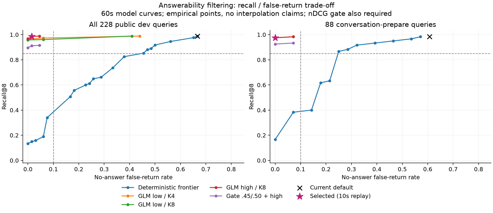

# M2 无答案 dev 集与拒绝方法探测（2026-10-09）

实验在 2026-10-08 手写并冻结语料，2026-10-09 完成复核。产品默认、学习代码、数据库设置默认值、设计、DECISIONS、AGENTS 和 evals/README 均未修改。

预定规则在 550 个候选中找到 98 个公开 dev 可行候选，选择 **`high-k8-s50-t10`**：GLM 5.3 Flash high、前 8 条 relevant 候选、support≥50、独立总超时 10 秒。首次完整对照 Recall@8=0.9856、nDCG@8=0.9814、误返 1/66 (0.0152)、精确率 0.9881。各语料 Recall 降幅均未超过 0.05。

**运行限制须一起看**：紧接着的并发 2、真实 10 秒复核遭遇 86 次 HTTP 429，按原召回降级后误返变成 18/66（0.2727）。这次故障结果完整保留，没有只补跑失败项。串行低速全量复核见下文。正常服务下的语义效果与出现 HTTP 429 时的可用性分别报告，不能宣称当前默认或 M2 已通过。隐藏门槛由规划者另行运行。

## 冻结、输入与实验边界

- 基线：`fcf7d57`（docs: M2 计划），新 worktree `iris-core-m2-no-answer`，分支 `eval/m2-no-answer-probe`。语料单独冻结提交：`7d696a7d1145b701edbe7431e3e5ab4539c6e415`。
- `recall_no_answer_v1.json` SHA-256：`74b20e93a267c43626797417e6a66ab2b8623ad1e57fd27af2a50422220a8895`。
- `recall_no_answer_v1_notes.md` SHA-256：`bdcf860f7adbaea26f926e2f753117d58cc6f52e0f421b875ad7663fa34e64c3`。
- 新集手写 48 条记忆／40 条 dev 查询：22 无答案、18 有答案；显式 20（10/10）、对话准备 20（8/12）；私聊 15、群聊 14、直播 11。逐条标注复核理由在冻结 notes。冻结后两文件未改。
- 合并七份语料：243 条固定记忆、228 条查询、162 有答案、66 无答案；对话准备 88 条、60 有答案、28 无答案。各语料独立建库；v2 原 22 条 holdout 仅是历史标记，全部公开数据参与 dev 选择。未寻找或读取隐藏集。
- 真实 embedding：doubao-embedding-vision，显式 2048 维 float32；383 个输入按端点／模型／维度／全文哈希复用已知公开缓存，新增 88 次。七集查询组成、锚点、排序和预算保持现默认；诊断子类逐查询断言 ID／顺序／reason 与普通 Retrieval 完全一致。原六集复现 26/44 误返。
- 产品源码 SHA-256（相对文件路径→SHA 的规范 JSON）：`2098c69ee63cc88ba5281d8ec2a7002515eb62a2629926f2965700392e812861`；执行驱动 SHA-256：`140f68da0103a3211b37dd973fb1ad3c0e5b76501ad186eae94308e47389f51d`；判断提示词 SHA-256：`0260a07b58977c42435a3379dbdb23455a653a53060c82df2e773abdbf1f2ed3`。完整协议在外部 `run-v1/protocol.json`。

所有方法只过滤现默认已经选出的 relevant，保留顺序和已有 person_highlight，不补位、不将拒绝项改标成人物要点。K 是 relevant 数，不扩候选池；本轮 141 条查询有 1 项、30 条有 2 项、20 条有 3 项、6 条有 4 项、3 条有 5 项，28 条没有 relevant。因而 K4/K8 的输入只在 3 条查询上不同，其余差异也包含模型重复调用的波动。

Recall/nDCG 按有答案查询宏平均，计所有返回；误返只看无答案查询是否有 relevant；relevant 精确率按返回项微平均。空分母为空，不视为完美。人物要点可留在平均返回数中。评分完全由冻结 relevant 标签和正式 recall_metrics 计算，GLM 是被测的过滤器，不给评测判分。

## 方舟可用能力调查

| 探测 | 当前配置实测 | 结论边界 |
| --- | --- | --- |
| GLM 5.3 Flash / chat/completions | low、high 均 HTTP 200，正文完整；low/K4、low/K8、high/K8 三组各 200 次成功 | 当前已配置凭据可用，未关闭推理 |
| doubao-embedding-vision / embeddings | 88 次新增成功，2048 维 | 继续使用既有向量模型 |
| 当前 /api/plan/v3/models | HTTP 404 | 该端点不能枚举账号可见模型，不能据此推断整账号的所有权限 |
| 当前 /api/plan/v3/rerank：doubao-seed-rerank、base-multilingual-rerank、m3-v2-rerank | 三次均 HTTP 404 | 未找到当前配置可调用的专用 rerank；404 是路由层证据，不是分别证明三个模型未授权 |

公开 [VikingDB Rerank 文档](https://docs.volcengine.com/docs/vector_database_vikingdb/Rerank?lang=zh) 列出 `/api/knowledge/service/rerank` 和专用重排模型，描述为文档回答 query 的概率，并有独立服务／签名鉴权约定；这不是本机已配置的 Plan 数据面。没有读取其他凭据、创建云资源或跨服务复用密钥，所以本轮无专用 rerank 质量／延迟数值，不把未测写成效果差。当前可用的方舟内判断方案是 GLM；若以后试 VikingDB，须另行配置其服务与授权。

当前端点是 Agent Plan。官方 [Plan 用量规则](https://docs.volcengine.com/docs/ark/agent-plan-personal-afp-credits-billing-rules?lang=zh) 列出 GLM 5.3 Flash 与 embedding 的输入／输出抵扣系数均为 0.5；下面按已报告 token 估算 AFP。公开模型目录不等于账号权限清单，本报告只对实际调用成功的两种模型作可用结论。

## 方法、参数和选择

99 个确定性网格覆盖余弦、非姓名词项覆盖、两路一致、最高余弦与差距、相对余弦、余弦或覆盖及加权分数。没有领域／话题词表，姓名沿用锚点，不新增姓名分。模型实际预算 60 秒、4096 输出 token、temperature=0、并发 2，每条一次，无重试／JSON 修正。GLM low/K4、low/K8、high/K8 为冻结的候选组顺序；实际按查询交错发送三组请求；每组 200 次实际调用、28 条空候选跳过。分数门槛 `{1,25,50,75,90,100}`，回放预算 `{2,5,10,20,60}` 秒。

组合先按“最高 relevant 候选余弦≥c 或覆盖≥l”整条开／关，c∈{.45,.55,.65}，l∈{.5,.75}，再用 low/K8 或 high/K8。通过时模型请求完全相同，所以可精确复用同一次真实调用；这里的组合质量和节省调用数是回放，没有伪称新做独立调用。失败、拒绝、截断、非法 JSON／分数／ID、超时全部退回完整原召回。

候选顺序、每个网格和公式见 [实验说明](../no_answer_probe/README.md) 及外部 protocol；协议在看成绩前冻结。首次协议往返把 Python tuple 与 JSON list 误判为不同，在任何质量调用前修复并补回归测试；原协议仍留在外部父目录，正式材料统一在 run-v1，没有拼接两个实验。

选择严格按 M2：先 R≥.85、N≥.75、F≤.10；全体可行候选最高 Q=0.984378，距最高 Q 严格小于 .01 才进入持平组，再精确率、低误返、冻结顺序。选中 Q=0.983475。10/20/60 秒对选中阈值返回完全相同，固定顺序选择 10 秒；5 秒有 9 次回退，精确率更低。

下面每个方法族按相同规则选代表。没有可行者用 R/N 合格范围内最低误返；两路一致没有任何 R/N 合格项，表中是最高 Q 诊断项，不能当成可行。完整 550 个候选及全部分组数值（含曲线数据）见 CSV，不仅保留族内赢家。

| 方法／范围 | Recall@8 | nDCG@8 | 无答案误返 | relevant 精确率 | 平均返回 |
| --- | ---: | ---: | ---: | ---: | ---: |
| 现默认 · baseline | 0.9887 | 0.9707 | 44/66 (0.6667) | 0.5567 | 1.9386 |
| 候选余弦阈值 · d002 | 0.8961 | 0.8859 | 37/66 (0.5606) | 0.6089 | 1.7105 |
| 全文覆盖率 · d013 | 0.9887 | 0.9707 | 44/66 (0.6667) | 0.5567 | 1.9386 |
| 两路一致 · d022 | 0.4146 | 0.4078 | 21/66 (0.3182) | 0.7222 | 1.0175 |
| 最高余弦＋前两名差距 · d033 | 0.8529 | 0.8372 | 30/66 (0.4545) | 0.5851 | 1.6798 |
| 按查询归一化余弦 · d052 | 0.9146 | 0.9023 | 42/66 (0.6364) | 0.6220 | 1.7018 |
| 余弦或覆盖率 · d078 | 0.8807 | 0.8730 | 31/66 (0.4697) | 0.6872 | 1.5482 |
| 信号加权 · d092 | 0.9455 | 0.9353 | 37/66 (0.5606) | 0.6386 | 1.7149 |
| GLM low/K4 · low-k4-s50-t5 | 0.9640 | 0.9623 | 0/66 (0.0000) | 0.9939 | 1.3377 |
| GLM low/K8 · low-k8-s75-t5 | 0.9516 | 0.9500 | 0/66 (0.0000) | 1.0000 | 1.3246 |
| GLM high/K8 · high-k8-s50-t10 | 0.9856 | 0.9814 | 1/66 (0.0152) | 0.9881 | 1.3596 |
| 确定性预筛＋模型 · gate-0.45-0.5-high-k8-s50-t10 | 0.9115 | 0.9073 | 1/66 (0.0152) | 0.9870 | 1.2982 |

### 对话中准备（88 条）

| 方法／范围 | Recall@8 | nDCG@8 | 无答案误返 | relevant 精确率 | 平均返回 |
| --- | ---: | ---: | ---: | ---: | ---: |
| 现默认 · baseline | 0.9833 | 0.9723 | 17/28 (0.6071) | 0.6186 | 2.3750 |
| 候选余弦阈值 · d002 | 0.9667 | 0.9618 | 15/28 (0.5357) | 0.6782 | 2.2614 |
| 全文覆盖率 · d013 | 0.9833 | 0.9723 | 17/28 (0.6071) | 0.6186 | 2.3750 |
| 两路一致 · d022 | 0.6500 | 0.6500 | 12/28 (0.4286) | 0.7222 | 1.8864 |
| 最高余弦＋前两名差距 · d033 | 0.9333 | 0.9285 | 13/28 (0.4643) | 0.6552 | 2.2614 |
| 按查询归一化余弦 · d052 | 0.9583 | 0.9460 | 16/28 (0.5714) | 0.7073 | 2.2045 |
| 余弦或覆盖率 · d078 | 0.9083 | 0.9022 | 13/28 (0.4643) | 0.7143 | 2.1477 |
| 信号加权 · d092 | 0.9667 | 0.9618 | 15/28 (0.5357) | 0.6705 | 2.2727 |
| GLM low/K4 · low-k4-s50-t5 | 0.9750 | 0.9820 | 0/28 (0.0000) | 1.0000 | 1.9432 |
| GLM low/K8 · low-k8-s75-t5 | 0.9750 | 0.9820 | 0/28 (0.0000) | 1.0000 | 1.9432 |
| GLM high/K8 · high-k8-s50-t10 | 0.9750 | 0.9820 | 0/28 (0.0000) | 1.0000 | 1.9432 |
| 确定性预筛＋模型 · gate-0.45-0.5-high-k8-s50-t10 | 0.9250 | 0.9320 | 0/28 (0.0000) | 1.0000 | 1.9091 |

### 显式查询（140 条）

| 方法／范围 | Recall@8 | nDCG@8 | 无答案误返 | relevant 精确率 | 平均返回 |
| --- | ---: | ---: | ---: | ---: | ---: |
| 现默认 · baseline | 0.9918 | 0.9697 | 27/38 (0.7105) | 0.5271 | 1.6643 |
| 候选余弦阈值 · d002 | 0.8546 | 0.8413 | 22/38 (0.5789) | 0.5714 | 1.3643 |
| 全文覆盖率 · d013 | 0.9918 | 0.9697 | 27/38 (0.7105) | 0.5271 | 1.6643 |
| 两路一致 · d022 | 0.2761 | 0.2653 | 9/38 (0.2368) | 0.7222 | 0.4714 |
| 最高余弦＋前两名差距 · d033 | 0.8056 | 0.7834 | 17/38 (0.4474) | 0.5455 | 1.3143 |
| 按查询归一化余弦 · d052 | 0.8889 | 0.8766 | 26/38 (0.6842) | 0.5793 | 1.3857 |
| 余弦或覆盖率 · d078 | 0.8644 | 0.8558 | 18/38 (0.4737) | 0.6716 | 1.1714 |
| 信号加权 · d092 | 0.9330 | 0.9197 | 22/38 (0.5789) | 0.6211 | 1.3643 |
| GLM low/K4 · low-k4-s50-t5 | 0.9575 | 0.9508 | 0/38 (0.0000) | 0.9904 | 0.9571 |
| GLM low/K8 · low-k8-s75-t5 | 0.9379 | 0.9312 | 0/38 (0.0000) | 1.0000 | 0.9357 |
| GLM high/K8 · high-k8-s50-t10 | 0.9918 | 0.9810 | 1/38 (0.0263) | 0.9817 | 0.9929 |
| 确定性预筛＋模型 · gate-0.45-0.5-high-k8-s50-t10 | 0.9036 | 0.8928 | 1/38 (0.0263) | 0.9796 | 0.9143 |

确定性方法在 R/N 达标约束下最低误返为 30/66（0.4545），距离 ≤0.10 仍差 0.3545；至少还要消除 24 条误返才到不超过 6/66。该代表还严重损伤短词集，不能仅用合并 Recall 刚过线就接受。模型组合节省了一些请求，但预筛又丢掉低余弦的正确短词／省略查询，规则没有选它。

## 各语料结果与退化

| 方法／范围 | Recall@8 | nDCG@8 | 无答案误返 | relevant 精确率 | 平均返回 |
| --- | ---: | ---: | ---: | ---: | ---: |
| recall_v1 · 现默认 | 0.9833 | 0.9759 | 6/8 (0.7500) | 0.6545 | 1.4474 |
| recall_v1 · 候选余弦阈值 | 0.9333 | 0.9297 | 5/8 (0.6250) | 0.6800 | 1.3158 |
| recall_v1 · 全文覆盖率 | 0.9833 | 0.9759 | 6/8 (0.7500) | 0.6545 | 1.4474 |
| recall_v1 · 两路一致 | 0.4833 | 0.4871 | 1/8 (0.1250) | 0.8889 | 0.4737 |
| recall_v1 · 最高余弦＋前两名差距 | 0.8833 | 0.8759 | 4/8 (0.5000) | 0.7209 | 1.1316 |
| recall_v1 · 按查询归一化余弦 | 0.9667 | 0.9703 | 5/8 (0.6250) | 0.7292 | 1.2632 |
| recall_v1 · 余弦或覆盖率 | 0.8833 | 0.8871 | 4/8 (0.5000) | 0.7381 | 1.1053 |
| recall_v1 · 信号加权 | 0.9333 | 0.9297 | 5/8 (0.6250) | 0.6800 | 1.3158 |
| recall_v1 · GLM low/K4 | 0.9667 | 0.9843 | 0/8 (0.0000) | 0.9722 | 0.9474 |
| recall_v1 · GLM low/K8 | 0.9667 | 0.9843 | 0/8 (0.0000) | 1.0000 | 0.9211 |
| recall_v1 · GLM high/K8 | 0.9833 | 0.9871 | 1/8 (0.1250) | 0.9474 | 1.0000 |
| recall_v1 · 确定性预筛＋模型 | 0.9167 | 0.9204 | 1/8 (0.1250) | 0.9429 | 0.9211 |
| recall_v2 · 现默认 | 0.9933 | 0.9600 | 13/16 (0.8125) | 0.4804 | 2.0000 |
| recall_v2 · 候选余弦阈值 | 0.9433 | 0.9183 | 11/16 (0.6875) | 0.5542 | 1.7121 |
| recall_v2 · 全文覆盖率 | 0.9933 | 0.9600 | 13/16 (0.8125) | 0.4804 | 2.0000 |
| recall_v2 · 两路一致 | 0.1533 | 0.1290 | 5/16 (0.3125) | 0.4444 | 0.5909 |
| recall_v2 · 最高余弦＋前两名差距 | 0.8933 | 0.8600 | 8/16 (0.5000) | 0.5000 | 1.7273 |
| recall_v2 · 按查询归一化余弦 | 0.9533 | 0.9261 | 13/16 (0.8125) | 0.5476 | 1.7273 |
| recall_v2 · 余弦或覆盖率 | 0.8533 | 0.8335 | 8/16 (0.5000) | 0.6897 | 1.3333 |
| recall_v2 · 信号加权 | 0.9433 | 0.9257 | 10/16 (0.6250) | 0.6301 | 1.5606 |
| recall_v2 · GLM low/K4 | 0.9933 | 0.9690 | 0/16 (0.0000) | 1.0000 | 1.1970 |
| recall_v2 · GLM low/K8 | 0.9933 | 0.9690 | 0/16 (0.0000) | 1.0000 | 1.1970 |
| recall_v2 · GLM high/K8 | 0.9933 | 0.9690 | 0/16 (0.0000) | 1.0000 | 1.1970 |
| recall_v2 · 确定性预筛＋模型 | 0.9133 | 0.8890 | 0/16 (0.0000) | 1.0000 | 1.1212 |
| recall_conversation_v1 · 现默认 | 0.9444 | 0.9078 | 2/6 (0.3333) | 0.7826 | 2.5417 |
| recall_conversation_v1 · 候选余弦阈值 | 0.8889 | 0.8728 | 2/6 (0.3333) | 0.8500 | 2.4167 |
| recall_conversation_v1 · 全文覆盖率 | 0.9444 | 0.9078 | 2/6 (0.3333) | 0.7826 | 2.5417 |
| recall_conversation_v1 · 两路一致 | 0.2778 | 0.2778 | 1/6 (0.1667) | 0.8333 | 1.8333 |
| recall_conversation_v1 · 最高余弦＋前两名差距 | 0.8333 | 0.8172 | 1/6 (0.1667) | 0.8421 | 2.3750 |
| recall_conversation_v1 · 按查询归一化余弦 | 0.8611 | 0.8201 | 2/6 (0.3333) | 0.8421 | 2.3750 |
| recall_conversation_v1 · 余弦或覆盖率 | 0.7500 | 0.7295 | 1/6 (0.1667) | 0.9333 | 2.2083 |
| recall_conversation_v1 · 信号加权 | 0.8889 | 0.8728 | 1/6 (0.1667) | 0.9444 | 2.3333 |
| recall_conversation_v1 · GLM low/K4 | 0.9167 | 0.9399 | 0/6 (0.0000) | 1.0000 | 2.2917 |
| recall_conversation_v1 · GLM low/K8 | 0.9167 | 0.9399 | 0/6 (0.0000) | 1.0000 | 2.2917 |
| recall_conversation_v1 · GLM high/K8 | 0.9167 | 0.9399 | 0/6 (0.0000) | 1.0000 | 2.2917 |
| recall_conversation_v1 · 确定性预筛＋模型 | 0.7500 | 0.7732 | 0/6 (0.0000) | 1.0000 | 2.1667 |
| recall_short_terms_v1 · 现默认 | 1.0000 | 1.0000 | 0/4 (0.0000) | 1.0000 | 0.7500 |
| recall_short_terms_v1 · 候选余弦阈值 | 0.1667 | 0.1667 | 0/4 (0.0000) | 1.0000 | 0.1250 |
| recall_short_terms_v1 · 全文覆盖率 | 1.0000 | 1.0000 | 0/4 (0.0000) | 1.0000 | 0.7500 |
| recall_short_terms_v1 · 两路一致 | 0.3333 | 0.3333 | 0/4 (0.0000) | 1.0000 | 0.2500 |
| recall_short_terms_v1 · 最高余弦＋前两名差距 | 0.0833 | 0.0833 | 0/4 (0.0000) | 1.0000 | 0.0625 |
| recall_short_terms_v1 · 按查询归一化余弦 | 0.3333 | 0.3333 | 0/4 (0.0000) | 1.0000 | 0.2500 |
| recall_short_terms_v1 · 余弦或覆盖率 | 0.7500 | 0.7500 | 0/4 (0.0000) | 1.0000 | 0.5625 |
| recall_short_terms_v1 · 信号加权 | 0.8333 | 0.8333 | 0/4 (0.0000) | 1.0000 | 0.6250 |
| recall_short_terms_v1 · GLM low/K4 | 0.7500 | 0.7500 | 0/4 (0.0000) | 1.0000 | 0.5625 |
| recall_short_terms_v1 · GLM low/K8 | 0.5833 | 0.5833 | 0/4 (0.0000) | 1.0000 | 0.4375 |
| recall_short_terms_v1 · GLM high/K8 | 1.0000 | 1.0000 | 0/4 (0.0000) | 1.0000 | 0.7500 |
| recall_short_terms_v1 · 确定性预筛＋模型 | 0.7500 | 0.7500 | 0/4 (0.0000) | 1.0000 | 0.5625 |
| recall_conversation_v2 · 现默认 | 1.0000 | 1.0000 | 2/6 (0.3333) | 0.7500 | 1.0833 |
| recall_conversation_v2 · 候选余弦阈值 | 1.0000 | 1.0000 | 2/6 (0.3333) | 0.7500 | 1.0833 |
| recall_conversation_v2 · 全文覆盖率 | 1.0000 | 1.0000 | 2/6 (0.3333) | 0.7500 | 1.0833 |
| recall_conversation_v2 · 两路一致 | 0.7222 | 0.7222 | 2/6 (0.3333) | 0.8125 | 0.7500 |
| recall_conversation_v2 · 最高余弦＋前两名差距 | 0.9444 | 0.9444 | 2/6 (0.3333) | 0.8095 | 0.9583 |
| recall_conversation_v2 · 按查询归一化余弦 | 1.0000 | 1.0000 | 2/6 (0.3333) | 0.8182 | 1.0000 |
| recall_conversation_v2 · 余弦或覆盖率 | 0.9444 | 0.9444 | 2/6 (0.3333) | 0.7727 | 1.0000 |
| recall_conversation_v2 · 信号加权 | 1.0000 | 1.0000 | 2/6 (0.3333) | 0.7826 | 1.0417 |
| recall_conversation_v2 · GLM low/K4 | 1.0000 | 1.0000 | 0/6 (0.0000) | 1.0000 | 0.8333 |
| recall_conversation_v2 · GLM low/K8 | 1.0000 | 1.0000 | 0/6 (0.0000) | 1.0000 | 0.8333 |
| recall_conversation_v2 · GLM high/K8 | 1.0000 | 1.0000 | 0/6 (0.0000) | 1.0000 | 0.8333 |
| recall_conversation_v2 · 确定性预筛＋模型 | 1.0000 | 1.0000 | 0/6 (0.0000) | 1.0000 | 0.8333 |
| recall_conversation_v3 · 现默认 | 1.0000 | 1.0000 | 3/4 (0.7500) | 0.7619 | 2.8500 |
| recall_conversation_v3 · 候选余弦阈值 | 1.0000 | 1.0000 | 2/4 (0.5000) | 0.8889 | 2.7000 |
| recall_conversation_v3 · 全文覆盖率 | 1.0000 | 1.0000 | 3/4 (0.7500) | 0.7619 | 2.8500 |
| recall_conversation_v3 · 两路一致 | 1.0000 | 1.0000 | 1/4 (0.2500) | 0.9412 | 2.6500 |
| recall_conversation_v3 · 最高余弦＋前两名差距 | 1.0000 | 1.0000 | 1/4 (0.2500) | 0.8421 | 2.7500 |
| recall_conversation_v3 · 按查询归一化余弦 | 1.0000 | 1.0000 | 2/4 (0.5000) | 0.8889 | 2.7000 |
| recall_conversation_v3 · 余弦或覆盖率 | 1.0000 | 1.0000 | 1/4 (0.2500) | 0.9412 | 2.6500 |
| recall_conversation_v3 · 信号加权 | 1.0000 | 1.0000 | 2/4 (0.5000) | 0.8421 | 2.7500 |
| recall_conversation_v3 · GLM low/K4 | 1.0000 | 1.0000 | 0/4 (0.0000) | 1.0000 | 2.6000 |
| recall_conversation_v3 · GLM low/K8 | 1.0000 | 1.0000 | 0/4 (0.0000) | 1.0000 | 2.6000 |
| recall_conversation_v3 · GLM high/K8 | 1.0000 | 1.0000 | 0/4 (0.0000) | 1.0000 | 2.6000 |
| recall_conversation_v3 · 确定性预筛＋模型 | 1.0000 | 1.0000 | 0/4 (0.0000) | 1.0000 | 2.6000 |
| recall_no_answer_v1 · 现默认 | 1.0000 | 0.9795 | 18/22 (0.8182) | 0.2857 | 2.4750 |
| recall_no_answer_v1 · 候选余弦阈值 | 1.0000 | 1.0000 | 15/22 (0.6818) | 0.3529 | 2.1750 |
| recall_no_answer_v1 · 全文覆盖率 | 1.0000 | 0.9795 | 18/22 (0.8182) | 0.2857 | 2.4750 |
| recall_no_answer_v1 · 两路一致 | 0.3889 | 0.3889 | 11/22 (0.5000) | 0.3500 | 1.4000 |
| recall_no_answer_v1 · 最高余弦＋前两名差距 | 1.0000 | 0.9795 | 14/22 (0.6364) | 0.3333 | 2.2500 |
| recall_no_answer_v1 · 按查询归一化余弦 | 1.0000 | 1.0000 | 18/22 (0.8182) | 0.3529 | 2.1750 |
| recall_no_answer_v1 · 余弦或覆盖率 | 1.0000 | 1.0000 | 15/22 (0.6818) | 0.3750 | 2.1000 |
| recall_no_answer_v1 · 信号加权 | 1.0000 | 0.9795 | 17/22 (0.7727) | 0.3214 | 2.3000 |
| recall_no_answer_v1 · GLM low/K4 | 1.0000 | 1.0000 | 0/22 (0.0000) | 1.0000 | 1.3500 |
| recall_no_answer_v1 · GLM low/K8 | 1.0000 | 1.0000 | 0/22 (0.0000) | 1.0000 | 1.3500 |
| recall_no_answer_v1 · GLM high/K8 | 1.0000 | 1.0000 | 0/22 (0.0000) | 1.0000 | 1.3500 |
| recall_no_answer_v1 · 确定性预筛＋模型 | 1.0000 | 1.0000 | 0/22 (0.0000) | 1.0000 | 1.3500 |

选中方案没有任何语料 Recall 降幅超过 0.05。仍有一条局部损失：conversation_v1/T11 的 C09（grade=1）被拒绝，C10（grade=3）保留，单题 Recall 1→0.5；该组 Recall 0.9444→0.9167。C09 是白榆照料植物的背景经验，C10 直接回答白果托管菜园的结果。保留冻结弱相关标签和实际损失，不将其改成无关追分。唯一无答案误返是 recall_v1/Q36：输入陈述观星安排，模型仍认为 M05 的携带望远镜承诺可补充；没有为它加陈述句或词表特判。recall_v1 单组误返为 1/8，M2 门槛按七集合并。

所有候选中，各语料 Recall 降幅超过 0.05 时的全部损失查询 ID，按候选／语料聚合列于回归 CSV。逐题前后 Recall、丢失记忆 ID 与完整返回留在外部 summary.json 和 results/。没有达到该降幅的语料不列；这份表涵盖全部网格。

| 代表 | Recall 降幅 >0.05 的语料与损失查询 |
| --- | --- |
| 现默认 / baseline | 无 |
| 候选余弦阈值 / d002 | recall_conversation_v1 (−0.0556): T09；recall_short_terms_v1 (−0.8333): ST01, ST02, ST03, ST04, ST05, ST06, ST07, ST08, ST09, ST11 |
| 全文覆盖率 / d013 | 无 |
| 两路一致 / d022 | recall_v1 (−0.5000): Q01, Q02, Q03, Q04, Q05, Q07, Q08, Q11, Q13, Q15, Q16, Q17, Q21, Q22, Q25, Q37；recall_v2 (−0.8400): D01, D02, D03, D04, D05, D06, D07, D08, D09, D10, D11, D12, D13, D14, D15, D16, D17, D18, D19, D20, D21, D22, D23, D27, D29, D31, D32, D33, D34, H01, H02, H03, H04, H05, H06, H07, H09, H11, H12, H13, H14, H15；recall_conversation_v1 (−0.6667): T01, T02, T04, T05, T06, T09, T10, T11, T12, T16, T17, T18；recall_short_terms_v1 (−0.6667): ST01, ST02, ST04, ST06, ST07, ST08, ST09, ST11；recall_conversation_v2 (−0.2778): U05, U10, U13, U14, U15；recall_no_answer_v1 (−0.6111): NA01, NA02, NA03, NA04, NA05, NA06, NA09, NA10, NA24, NA26, NA27 |
| 最高余弦＋前两名差距 / d033 | recall_v1 (−0.1000): Q05, Q37, Q38；recall_v2 (−0.1000): D03, D19, D30, H03, H07；recall_conversation_v1 (−0.1111): T09, T17；recall_short_terms_v1 (−0.9167): ST01, ST02, ST03, ST04, ST05, ST06, ST07, ST08, ST09, ST11, ST12；recall_conversation_v2 (−0.0556): U07 |
| 按查询归一化余弦 / d052 | recall_conversation_v1 (−0.0833): T11, T12；recall_short_terms_v1 (−0.6667): ST01, ST02, ST04, ST06, ST07, ST08, ST09, ST11 |
| 余弦或覆盖率 / d078 | recall_v1 (−0.1000): Q08, Q37, Q38；recall_v2 (−0.1400): D03, D18, D19, D32, H01, H03, H07, H11；recall_conversation_v1 (−0.1944): T09, T11, T12, T17；recall_short_terms_v1 (−0.2500): ST09, ST11, ST12；recall_conversation_v2 (−0.0556): U07 |
| 信号加权 / d092 | recall_conversation_v1 (−0.0556): T09；recall_short_terms_v1 (−0.1667): ST09, ST11 |
| GLM low/K4 / low-k4-s50-t5 | recall_short_terms_v1 (−0.2500): ST03, ST06, ST07 |
| GLM low/K8 / low-k8-s75-t5 | recall_short_terms_v1 (−0.4167): ST01, ST02, ST03, ST06, ST07 |
| GLM high/K8 / high-k8-s50-t10 | 无 |
| 确定性预筛＋模型 / gate-0.45-0.5-high-k8-s50-t10 | recall_v1 (−0.0667): Q37, Q38；recall_v2 (−0.0800): D03, D19, D32, H03；recall_conversation_v1 (−0.1944): T09, T11, T12, T17；recall_short_terms_v1 (−0.2500): ST09, ST11, ST12 |

## 方法族代表的判断资源

| 方法 | 实际请求子集数 | 预算回退 | 观测 P50 ms | 观测 P95 ms | 输入 token | 输出 token | 推理 token | 输入缓存 token |
| --- | ---: | ---: | ---: | ---: | ---: | ---: | ---: | ---: |
| 现默认 / baseline | 0 | 0 | — | — | 0 | 0 | 0 | 0 |
| 候选余弦阈值 / d002 | 0 | 0 | — | — | 0 | 0 | 0 | 0 |
| 全文覆盖率 / d013 | 0 | 0 | — | — | 0 | 0 | 0 | 0 |
| 两路一致 / d022 | 0 | 0 | — | — | 0 | 0 | 0 | 0 |
| 最高余弦＋前两名差距 / d033 | 0 | 0 | — | — | 0 | 0 | 0 | 0 |
| 按查询归一化余弦 / d052 | 0 | 0 | — | — | 0 | 0 | 0 | 0 |
| 余弦或覆盖率 / d078 | 0 | 0 | — | — | 0 | 0 | 0 | 0 |
| 信号加权 / d092 | 0 | 0 | — | — | 0 | 0 | 0 | 0 |
| GLM low/K4 / low-k4-s50-t5 | 200 | 0 | 1340.1207 | 2790.2896 | 161417 | 5706 | 1287 | 0 |
| GLM low/K8 / low-k8-s75-t5 | 200 | 0 | 1329.4872 | 2480.2604 | 161587 | 5579 | 1154 | 23680 |
| GLM high/K8 / high-k8-s50-t10 | 200 | 0 | 2139.0376 | 4496.8567 | 161587 | 14142 | 9512 | 0 |
| 确定性预筛＋模型 / gate-0.45-0.5-high-k8-s50-t10 | 176 | 0 | 2139.0376 | 5084.5695 | 143195 | 12520 | 8473 | 0 |

确定性过滤不新增模型调用。组合保留 176/200 次判断请求，节省 24 次（12%），输入／输出用量来自对应实际调用子集；它不是另一次真实消费，不计入总账。这里的分位数是 60 秒实际请求观测值；预算回退为候选预算的回放结果。

## 取舍曲线与完整汇总数据

图上模型曲线使用 60 秒实际调用、不同支持分阈值；确定性为二维 Pareto 前沿，组合为选中预筛配置的曲线。星号是规则选中的 10 秒回放。连线仅连接离散候选，不代表中间阈值经过实测；nDCG 仍单独参与门槛。

- [全部候选、七语料及全部／对话／显式分组的指标与曲线数据](m2-no-answer-probe-20261009-metrics.csv)
- [全部候选的 >0.05 语料退化及查询 ID 汇总](m2-no-answer-probe-20261009-regressions.csv)
- [可缩放曲线 SVG](m2-no-answer-probe-20261009-curves.svg)

指标 CSV 的质量列按 scope 分组；调用次数、回退、延迟和用量只填 all 行，其他行留空，避免把全组消耗误认为某一语料的消耗。每个阈值／预算是同一实际调用的回放，不可将 550 个候选的 token 相加当成本次账单。

## 耗时、用量、费用与超时降级

| 实际调用组 | 请求数 | P50 ms | P95 ms | 最长 ms | 输入 token | 输出 token | 其中推理 token | 其中输入缓存 token | 估算 AFP |
| --- | ---: | ---: | ---: | ---: | ---: | ---: | ---: | ---: | ---: |
| low-k4 | 200 | 1340.1 | 2790.3 | 4839.8 | 161417 | 5706 | 1287 | 0 | 8.3561 |
| low-k8 | 200 | 1329.5 | 2480.3 | 3435.1 | 161587 | 5579 | 1154 | 23680 | 8.3583 |
| high-k8 | 200 | 2139.0 | 4496.9 | 6845.6 | 161587 | 14142 | 9512 | 0 | 8.7865 |
| 真实 10 秒复核（并发 2） | 200 | 1824.3 | 4118.4 | — | 88350 | 8157 | 5581 | 0 | 4.8254 |
| 真实 10 秒复核（串行低速） | 200 | 2147.6 | 4394.0 | — | 161587 | 13809 | 9216 | 0 | 8.7698 |

新增 embedding：88 次，已报告输入 4041 token；本次未对复用的 383 个向量再收费。上表真实主实验／复核已报告 chat 输入 734528、输出 47393 token；AFP 估算 `(输入+输出)×0.5/10000`，加新 embedding 合计 39.2981 AFP。接口能力两次短 chat 探测共 124 token、429 后一次恢复诊断 42 token，另约 0.0083 AFP。

这是按公开 Plan 系数估算的额度消耗，不是实际账单，也没有读取账户套餐档位／余额。HTTP 失败或提前取消时服务商未报告的 token 无法计算；原始 usage 均在外部。若只作按量单价比较，官方 [模型价格](https://docs.volcengine.com/docs/ark/model-pricing?lang=zh&redirect=1) 为 GLM 未缓存输入 0.80／缓存输入 0.23／输出 2.80 元每百万 token，embedding 文本 0.70；扣除已报告输入缓存差价后，本次已报告用量的按量等值约 0.7097 元，不能据此声称 Plan 实际扣款。

推理 token 已包含在输出 token 内，缓存 token 已包含在输入 token 内，均不重复累加。AFP 按当前公开抵扣公式计，未自行假设缓存折扣；按量等值仅作另一计价方式的参考，不含没有发生的显式缓存存储费用。

每种模型阈值／超时组合的完整指标、请求数和回退数在指标 CSV。模型 P50/P95 为实际请求开始至响应校验结束，不含实验 semaphore 排队与主动节流；不把快速 HTTP 429 拉低的延迟理解为服务更快。组合的耗时分位数按实际需要调用的同一批请求子集计算。离线超时回放并未真取消请求，不能把其 usage 当成提前取消后的费用。

### high/K8、support≥50 的预算回放

| 预算秒 | 回退次数/200 | Recall@8 | nDCG@8 | 误返 | 精确率 |
| ---: | ---: | ---: | ---: | ---: | ---: |
| 2 | 124 | 0.9887 | 0.9730 | 33/66 (0.5000) | 0.6601 |
| 5 | 9 | 0.9887 | 0.9801 | 1/66 (0.0152) | 0.9766 |
| 10 | 0 | 0.9856 | 0.9814 | 1/66 (0.0152) | 0.9881 |
| 20 | 0 | 0.9856 | 0.9814 | 1/66 (0.0152) | 0.9881 |
| 60 | 0 | 0.9856 | 0.9814 | 1/66 (0.0152) | 0.9881 |

### 真实 10 秒截止时间复核

第一轮原样重跑全部七集，仍并发 2、不重试；114 次成功、86 次 HTTP 429、无真正超时，28 条空候选跳过。运行约 186.7 秒。原实验只记 HTTP 状态，未保存这些错误的细分 code，所以不猜测具体 RPM／TPM／套餐限额。一次最短恢复诊断为 HTTP 200；后续复核增加安全的 error.code／Retry-After 记录。

| 方法／范围 | Recall@8 | nDCG@8 | 无答案误返 | relevant 精确率 | 平均返回 |
| --- | ---: | ---: | ---: | ---: | ---: |
| 首次选择（60 秒调用按 10 秒回放） | 0.9856 | 0.9814 | 1/66 (0.0152) | 0.9881 | 1.3596 |
| 并发 2 实际 10 秒／全部 | 0.9825 | 0.9758 | 18/66 (0.2727) | 0.7333 | 1.6096 |
| 并发 2 实际 10 秒／对话 | 0.9750 | 0.9820 | 6/28 (0.2143) | 0.8310 | 2.0795 |

第一轮错误没有丢弃。完成离线检查、让限流窗口恢复后，预先记录串行、每次结束至少间隔 1 秒、同一提示词／候选／support≥50／10 秒总预算，重新调用所有公开查询（不是只补失败项），不把第二轮加入 550 个候选池重新挑选。

第二轮实际请求 200 次，状态 {"success": 200}，回退 0 次；约 686.9 秒。与原回放返回有 1 条差异，全部保存在外部，不用更高分的一轮覆盖另一轮。

| 方法／范围 | Recall@8 | nDCG@8 | 无答案误返 | relevant 精确率 | 平均返回 |
| --- | ---: | ---: | ---: | ---: | ---: |
| 串行实际 10 秒／全部 | 0.9856 | 0.9814 | 1/66 (0.0152) | 0.9822 | 1.3640 |
| 串行实际 10 秒／对话 | 0.9750 | 0.9820 | 0/28 (0.0000) | 1.0000 | 1.9432 |
| 串行实际 10 秒／显式 | 0.9918 | 0.9810 | 1/38 (0.0263) | 0.9727 | 1.0000 |

串行复核只有 recall_no_answer_v1/NA03 与首次回放不同：除 N09 外额外留下运输防碰撞的 N41。按冻结标签它是不正确 relevant，因此精确率降为 0.9822；不改标注。两轮 Recall、nDCG、无答案误返完全一致，且均无单语料 Recall 下降超过 0.05。串行加 1 秒间隔只是本轮可用节奏，不能据此保证账号长期限额或宣称消除了所有 429。

### 纯全文降级（单列，不作门槛）

| 方法／范围 | Recall@8 | nDCG@8 | 无答案误返 | relevant 精确率 | 平均返回 |
| --- | ---: | ---: | ---: | ---: | ---: |
| all | 0.8652 | 0.8180 | 44/66 (0.6667) | 0.2143 | 3.4430 |
| conversation | 0.9333 | 0.8670 | 23/28 (0.8214) | 0.1360 | 5.5682 |
| explicit | 0.8252 | 0.7892 | 21/38 (0.5526) | 0.3371 | 2.1071 |
| recall_v1 | 0.9833 | 0.9162 | 3/8 (0.3750) | 0.4861 | 1.9211 |
| recall_v2 | 0.6733 | 0.6402 | 8/16 (0.5000) | 0.3119 | 2.0606 |
| recall_conversation_v1 | 0.7778 | 0.7206 | 4/6 (0.6667) | 0.1546 | 5.2083 |
| recall_short_terms_v1 | 1.0000 | 1.0000 | 0/4 (0.0000) | 1.0000 | 0.7500 |
| recall_conversation_v2 | 1.0000 | 1.0000 | 4/6 (0.6667) | 0.1731 | 4.3750 |
| recall_conversation_v3 | 1.0000 | 0.8847 | 4/4 (1.0000) | 0.1600 | 6.4000 |
| recall_no_answer_v1 | 0.9444 | 0.8829 | 21/22 (0.9545) | 0.0885 | 5.1500 |

模型判断未配置、不可用、错误或超时，实验模拟完整退回原召回；运行提示需在后续产品实现中加入；若 embedding 也失败，则使用本表已有纯全文路径。本次没有把判断模型的失败处理改成“返回空”，也没有把纯全文成绩当混合门槛。

## 需要的产品改动和规划者决定

1. 正常服务条件下推荐独立可选的“召回判断／重排模型”用途，首个适配器复用 GLM Chat API；显式保存 model、reasoning_effort=high、support=50、K=8、独立 10 秒总预算。该模型只判断结构化候选，不生成角色回复。学习／试用 chat 用途不共用暂停开关；需要单独健康状态、用量、延迟、错误码和降级提示。未配置仍回原召回。
2. 先按实验边界实现末段过滤，拒绝项不变为人物要点，不扩池、不改变排序、不自动补位。调用在数据库事务之外；网络等待后应重新核对记忆修订、生命周期和已知上下文，过期结果不能直接入召回记录。JSON 数量、ID、顺序、整数范围严格校验，任何失败返回原始结果并标记降级。
3. 429 实测说明单纯“有超时”不够。实现需沿用服务商 error.code 优先分类，加入用途独立的并发／暂停和恢复探测，以及同账号共享的调用限额控制；排队时间也要有边界；达到限制时及时降级，不能继续密集发送。失败降级后不承诺无答案误返≤0.10；报告必须同时列正常路径与降级占比。当前没有证据可以写死账号 RPM／TPM 数值。
4. 10 秒由预定候选规则选择，网络 P95 约 4.5 秒。是否接受这段回复准备等待，及是否给宿主更短的自选预算，由规划者／用户决定；2 秒回放误返 0.50，5 秒有 9 次回退，不能直接沿用 embedding 的 2 秒预算宣称同等质量。
5. 设计 11.2 现写“回复准备不调用生成模型”，若允许 GLM 做结构化判断，应由规划者与 2026-10-08 的决定对齐其措辞；本 PR 不改设计。设置页和外部模型配置后续增加新用途。专用 VikingDB 或第二供应商均不在本次实现范围；方舟内 GLM 已有可行语义候选，暂没有必须换供应商的证据。
6. 本轮低档位的主要损失在短词 search：提示词没有显式携带 mode/filters（结构筛选已由检索执行），low 有时将短关键词判为没有完整问题。若实现传入模式或调整提示词，须重新跑 dev；不要添加领域词表。高档位本轮保留全部短词答案。候选最大只有 5 条，生产 8 条复杂候选的延迟／输出上限也需再测。

## 本地性能、学习隔离与验证

本实验没有修改 src、迁移或学习提示词，真实模型评测期间未修改运行源码或重建虚拟环境。尽管无需共享模块对照，仍按 M2 规则运行 compare_learning_requests.py，用固定 main 提交的 archive 与本 worktree 逐批比较全部 86 段公开学习语料。完整请求在外部 learning-requests，结果见验证记录。

R10 的外部模型网络耗时按 2026-10-08 决定不计入 500ms，但要单列。基线使用官方 benchmark_retrieval.py --default-config 测 5 千／5 万条、点名／不点名四组；这里不能将小语料的约 4ms 或额外追踪子类的耗时当成生产规模性能。产品集成尚未实现，最终含新快照／修订校验／状态逻辑的 R10 仍需在实现 PR 复测。

| 数据规模／查询 | prepare P50 ms | prepare P95 ms | 本地 HTTP P50 ms | 本地 HTTP P95 ms |
| --- | ---: | ---: | ---: | ---: |
| 5000／不点名 | 15.68 | 17.07 | 17.75 | 18.90 |
| 5000／点名 | 13.06 | 13.63 | 15.10 | 16.18 |
| 50000／不点名 | 107.68 | 115.33 | 110.08 | 118.23 |
| 50000／点名 | 100.41 | 105.90 | 102.76 | 110.90 |

macOS 26.6.2 arm64、Python 3.13.15、SQLite 3.53.1、numpy 2.5.3、16 GiB 内存；每组预热 5 次、测量 60 次，2048 维 float32。合成性能数据只用于性能，不用于质量标注。HTTP 使用进程内 ASGI TestClient；排除外部 embedding 网络。四组 prepare P95 均低于 500ms。

- `uv run pytest`（3.13）：730 passed，4 条既有警告。
- `uv run --locked --isolated --python 3.12 pytest`：730 passed，4 条既有警告。两版本依次运行；项目 .venv 保持 3.13。
- `uv run pytest evals/no_answer_probe/test_probe.py -q`：20 passed，覆盖选择规则、边界值、标签不泄漏、保留人物要点、完整降级、真实超时取消、协议隔离和安全错误元数据。
- `uv build --out-dir <外部目录>/build`：sdist 和 wheel 成功。
- 学习请求对照：86 段公开语料、两侧各 203 批，117 个非空材料批次、1322 条假模型记忆，差异 0；两侧请求 SHA-256 都是 `468b66658948b88afe3c0f270423c94fec3280a995979ff3e87427d0fa583437`。
- 产品源码、默认 JSON、共享学习模块、迁移和前端相对固定基线没有变更；没有运行隐藏评测。

## 完整材料与复现索引

外部根目录：`/Users/cassia/Local/Code/iris-eval-artifacts/m2-no-answer-probe`。

- account-probe.json、rate-diagnostic.json：安全接口状态与恢复诊断；没有密钥或原始错误正文。
- run-v1/protocol.json、capture.json、recall-embeddings.db、databases/：冻结协议、完整七集输入／特征／基线、隔离数据库和严格键向量缓存。
- run-v1/calls/：三组各 228 条记录（200 真实＋28 空候选），原始响应正文、usage、延迟、输入指纹；不保存推理全文。
- run-v1/results/、summary.json：550 个候选完整逐查询返回、reason、各分组和退化。
- run-v1/live-check/、live-check-summary.json、live-check-v1.py：并发复核所有成功和 429 失败、降级结果及当时脚本。
- run-v1/rate-check/、rate-check-protocol.json、rate-check-summary.json：低速全量复核，不覆盖前一轮。
- baseline/、learning-requests/、performance/、pytest-313.log、pytest-312.log：固定基线与离线验证材料。

仓库只提交手写冻结语料、实验工具、汇总报告、聚合 CSV 和图；完整正文／逐查询返回／原始模型输出不提交。
